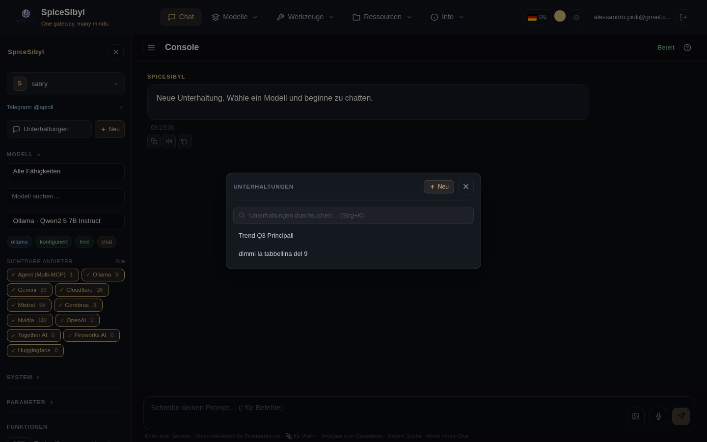

# SpiceSibyl — Funktionsdokumentation

Ein Funktion-für-Funktion-Leitfaden zu SpiceSibyl: was jede Funktion macht, wie man sie nutzt und wie man sie konfiguriert. Die Screenshots liegen in [`docs/de/screenshots/`](screenshots/).

> Versionen: [English](../en/README.md) · [Italiano](../it/README.md)

## Index

| Bereich | Dokument | Inhalt |
|---------|----------|--------|
| 🔐 Zugriff | [Authentifizierung und Profile](authentication-and-profiles.md) | Login, Rollen, JWT, lokale Profile, Audit-Log, Rate-Limiting |
| 💬 Chat | [Web-Chat](chat.md) | Streaming, Nachrichtenaktionen, Verzweigung, Sprache, TTS, Bilder, Vorlagen, Tags, Suche, Export, Teilen |
| 🔌 Anbieter | [Anbieter und Modelle](providers-and-models.md) | Anbieter-Verwaltung, API-Schlüssel-Tresor, Modell-Discovery, automatischer Fallback |
| 🛠 Werkzeuge | [Tool-Calling](tool-calling.md) | Integrierte Tools, eigene HTTP-Tools, sandboxter Code-Interpreter |
| 🤖 Agenten | [MCP und Agenten](mcp-and-agents.md) | MCP-Server-Verwaltung, Multi-MCP-Orchestrator, persistente Workflows |
| 📚 RAG | [Wissensdatenbank und RAG](knowledge-rag.md) | Dokument-/URL-Ingestion, hybride Suche, Reranking, Zitate |
| ⚖️ Vergleich | [Modellvergleich](model-comparison.md) | Derselbe Prompt über 2–4 Modelle parallel |
| 📊 Statistiken | [Nutzungsstatistiken](statistics.md) | Tokens, Latenz, Kosten; Tagesdiagramme |
| ✈️ Telegram | [Telegram-Bot](telegram.md) | Befehle, Sprache, Fotos, Dokumente, Wissensdatenbank (RAG), Gedächtnis, Erinnerungen, Web-Profil-Verknüpfung |
| 🧠 Gedächtnis | [Gedächtnis und Personalisierung](memory-and-personalization.md) | Persistentes Gedächtnis, automatische Titel, Antwort-Cache (exakt + semantisch), 👍/👎-Feedback, Info-Seite |
| 👥 Zusammenarbeit | [Arbeitsbereiche und Zusammenarbeit](workspaces-and-collaboration.md) | Geteilte Arbeitsbereiche, rollenbasierter Zugriff, geteilte Unterhaltungen/Dokumente, Kommentar-Threads |
| 🖥 UI | [Oberfläche und UX](interface.md) | Designs, PWA, Mobil, Onboarding, Tastenkürzel |
| ⚙️ Ops | [Observability und Betrieb](operations.md) | Health/Readiness, Prometheus-Metriken, strukturiertes Logging, Backups |
| 🌐 i18n | [Internationalisierung](internationalization.md) | Web- + Telegram-UI in 5 Sprachen, Runtime-Umschalter, lokalisierte Formatierung |

## Überblick

SpiceSibyl ist ein OpenAI-API-kompatibles Multi-Anbieter-KI-Gateway mit integrierter Angular-Web-Konsole. Ein einzelner Endpoint (`/api/v1/chat/completions`) routet Anfragen zum richtigen Anbieter anhand des Modell-Präfixes (z. B. `ollama/...`, `groq/...`, `agent/...`), ohne clientseitige Änderungen.

Unterstützte Anbieter: Ollama (lokal), Groq, OpenRouter, Cloudflare Workers AI, Google Gemini, Mistral, Cerebras, Together AI, Fireworks AI, HuggingFace, NVIDIA, plus der Multi-MCP-Orchestrator (`agent/*`).



## Schnellstart

```bash
# Entwicklung
docker compose up -d --build
# Web-Konsole: http://localhost:8888  ·  API: http://localhost:8800/api/v1
```

Beim ersten Start wird ein Admin-Benutzer aus den Variablen `ADMIN_EMAIL` / `ADMIN_PASSWORD` in `backend/.env` erstellt. Für das Produktions-Deployment (nginx, TLS, PUBLIC_URL) siehe [deploy.md](../deploy.md).
