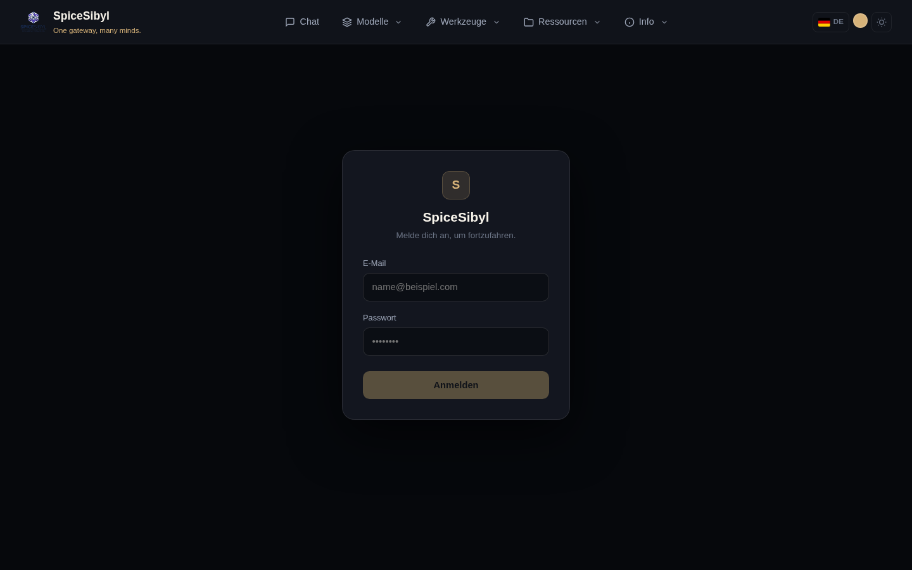
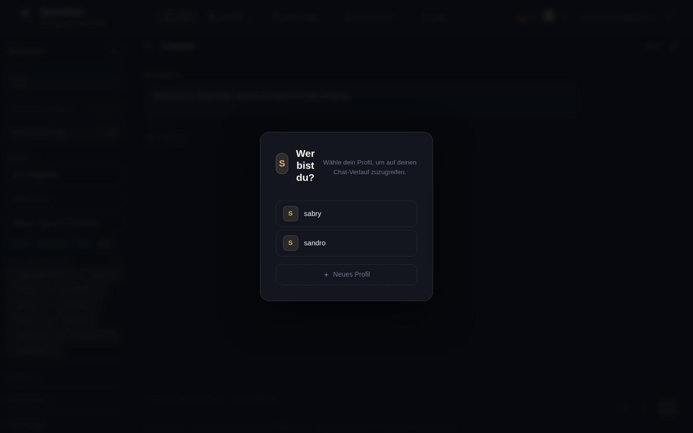

# Authentifizierung und Profile

## Login und Benutzerkonten

**Was es macht.** Jede `/api/v1`-Route erfordert Authentifizierung, außer der öffentlichen Allowlist (`/auth/*`, `/health`, `GET /shared/{token}`). Konten haben E-Mail + Passwort (bcrypt-Hashing) und eine Rolle: `admin`, `user` oder `read-only`. Sitzungen nutzen JWT-Access-Tokens (30 Minuten) und rotierende Refresh-Tokens (14 Tage), die in der Tabelle `refresh_tokens` verfolgt werden und daher widerrufbar sind.

**So wird es benutzt.**
1. Öffne die Web-Konsole: ohne Anmeldung wirst du zu `/login` umgeleitet.
2. Gib E-Mail und Passwort ein und drücke **Anmelden**.
3. Das Frontend erneuert abgelaufene Tokens automatisch (401-Interceptor); abmelden über den Benutzer-Chip in der Navbar.

**Admin-Bootstrap.** Beim ersten Start erstellt das Backend einen Administrator aus `ADMIN_EMAIL` / `ADMIN_PASSWORD` (in `backend/.env`) und „adoptiert" verwaiste Profile, die vor Einführung der Authentifizierung angelegt wurden.

## Profile

**Was es macht.** Jeder Benutzer besitzt N Profile (benannte lokale Identitäten, ohne Passwörter). Unterhaltungsverlauf, Wissensdatenbank, Vorlagen, Tags und Statistiken sind pro Profil getrennt. Die UUID des aktiven Profils liegt im `localStorage` (`spicesibyl_profile`).

**So wird es benutzt.**
- Beim ersten Besuch (oder wenn kein Profil gewählt ist) erscheint der Dialog **„Wer bist du?"**: wähle ein bestehendes Profil oder erstelle eines mit **+ Neues Profil**.
- Du kannst das Profil jederzeit über den Umschalter oben in der Chat-Seitenleiste wechseln.

**Datenisolation.** Jeder profilgebundene Endpoint prüft die Eigentümerschaft über die `resolve_profile`-Dependency: ein Benutzer kann keine Unterhaltungen oder Dokumente fremder Profile lesen.

## Telegram ↔ Web-Verknüpfung

**Was es macht.** Verknüpft einen Telegram-Benutzer mit einem Web-Profil, sodass Unterhaltungen und Statistiken über beide Kanäle geteilt werden.

**So wird es benutzt.**
1. Sende `/link` an den Telegram-Bot: du erhältst einen 6-stelligen Code.
2. Füge den Code in das Feld **„/link-Code von Telegram"** in der Web-Seitenleiste ein und drücke **Verknüpfen**.
3. `/unlink` beim Bot trennt das Konto.

## Rate-Limiting

Sliding-Window-Limit pro Benutzer (`RATE_LIMIT_DEFAULT`, Standard `60/minute`), geschlüsselt auf die Id des angemeldeten Benutzers (auch hinter dem nginx-Proxy korrekt). Bei Überschreitung antwortet der Server mit `429` und einem `Retry-After`-Header. Hinweis: der Speicher ist im RAM (einzelner Prozess).

## Audit-Log

Die Tabelle `audit_log` zeichnet auf, wer was wann getan hat, mit der Client-IP: Logins, Löschungen von Unterhaltungen/Profilen, Aktualisierungen der Anbieter-Schlüssel, Rollen-/Deaktivierungs-Änderungen, Backup-/Restore-Operationen, CRUD eigener Tools und MCP-Server.

**So wird es eingesehen.** Nur Admin: `GET /api/v1/auth/audit`.
