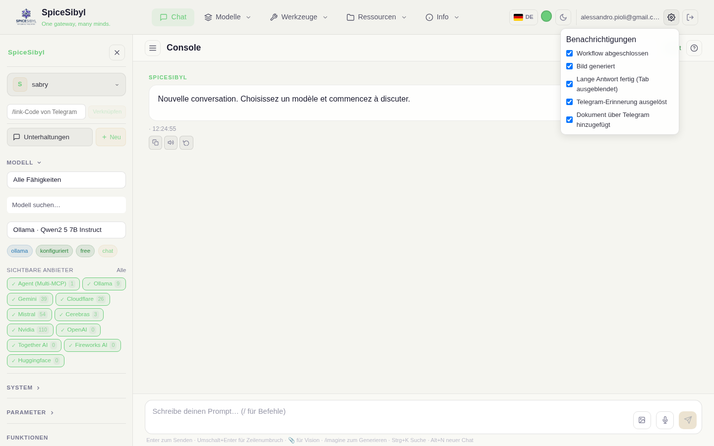

# Web-Chat

Die Hauptseite der Konsole. Links eine **schlanke Seitenleiste** mit nur den Steuerungen des aktuellen Chats (Profil, **Modell**, **System**, **Parameter**) und den **ON/OFF-Schaltern** der Funktionen; die Unterhaltung liegt in der Mitte, der Composer unten. Die Unterhaltungsliste öffnet sich als eigenes **Panel** (Schaltfläche *Unterhaltungen* oder `Strg+K`).

## Unterhaltungen und Streaming

**Was es macht.** Jeder Austausch wird in SQLite gespeichert (pro Profil) mit vollständiger Telemetrie: Anbieter, Latenz, Zeit bis zum ersten Token, Prompt-/Completion-Tokens, Geschwindigkeit (tok/s) — in der Fußzeile jeder Antwort angezeigt. Antworten kommen per SSE gestreamt.

**So wird es benutzt.**
- **Neue Unterhaltung**: Schaltfläche **+ Neu** in der Seitenleiste oder im Unterhaltungs-Panel (oder `Alt+N`).
- **Unterhaltung öffnen/wählen**: Schaltfläche **Unterhaltungen** in der Seitenleiste (oder `Strg+K`) → öffnet das **Panel** mit Suche, Tag-Filter, Auswahl und Löschen; eine auszuwählen lädt die Unterhaltung und schließt das Panel.
- **Modellauswahl**: Bereich **Modell** der Seitenleiste — Filter nach Fähigkeit (chat, vision, tools, free…), Textsuche, ein Filter für **sichtbare Anbieter** (siehe unten), dann Auswahl im Menü. Badges unter der Auswahl zeigen Anbieter, Konfigurationsstatus und Fähigkeiten.
- **Senden**: im Composer tippen und Enter drücken; während der Generierung wird die Sende-Schaltfläche zu **Stopp** und bricht den Stream ab.
- **Löschen**: Papierkorb-Symbol am Unterhaltungseintrag, im Unterhaltungs-Panel.

**Filter sichtbare Anbieter.** Unter der Modellauswahl lässt eine Reihe von Chips (eins pro aktiviertem Anbieter) wählen, **welche Anbieter** in der Modellauswahl erscheinen; die Wahl wird persistiert. Um stattdessen zu kuratieren, **welche einzelnen Modelle** eines Anbieters im Menü erscheinen, nutze die Seite [Anbieter](providers-and-models.md).

**Ladeindikatoren.** Ein animierter Balken unter der Topbar zeigt die aktuelle Phase: bernstein beim Warten auf das Modell („Warte auf das Modell…"), blau während der Tool-Ausführung („Werkzeuge werden ausgeführt…"), Standardtempo beim Streaming („Wird generiert…").

## Nachrichtenaktionen

Bei Hover erscheinende Schaltflächen an jeder Nachricht:

| Aktion | Wo | Wirkung |
|--------|-----|---------|
| 📋 Kopieren | alle | kopiert den Text in die Zwischenablage |
| 🔊 TTS | Antworten | liest die Nachricht vor (Web Speech API, in der aktiven Sprache); erneut drücken zum Stoppen |
| 🔁 Neu generieren | letzte Antwort | fordert eine neue Antwort an **und erzeugt einen Zweig** (siehe unten) |
| ✏️ Bearbeiten | letzte Benutzernachricht | bearbeiten und erneut senden |
| 📌 Anheften | alle | fügt die Nachricht der Angeheftet-Leiste über dem Chat hinzu/entfernt sie (Klick springt zur Nachricht) |

## Antwort-Verzweigung

**Was es macht.** Neu generieren überschreibt nicht: beide Antworten bleiben als parallele Zweige erhalten (in SQLite persistiert mit `parent_id` + `branch_index`).

**So wird es benutzt.** Antworten mit Alternativen zeigen Pfeile `< 1/3 >` zum Navigieren zwischen Zweigen; die Unterhaltung wird vom gewählten Zweig fortgesetzt.

## System-Prompt, Vorlagen und Parameter

- **System** (Seitenleiste): dauerhafte Systemanweisungen (localStorage), mit Speichern/Leeren-Aktionen.
- **Vorlagen** (eigene Seite `/templates`, **Ressourcen → Vorlagen** in der Navbar): Bibliothek wiederverwendbarer System-Prompts („Code review", „ELI5"…). Erstellen/bearbeiten/löschen; **Anwenden** setzt die Vorlage als System-Prompt und bringt dich zum Chat zurück.
- **Parameter** (Seitenleiste): **Temperatur**-Schieberegler (0–2) und **Max-Tokens**-Feld, mit jeder Anfrage gesendet. Das Opt-in für Abschluss-Benachrichtigungen liegt ebenfalls hier (siehe [Oberfläche](interface.md)).

## Tool-Calling im Chat

Schalter **Tool calling ON/OFF** in der Seitenleiste. Aktiviert kann das Modell registrierte Tools aufrufen (integriert, eigene, MCP); Aufrufe und Ergebnisse erscheinen als eigene Blasen — mit einem Spinner bei Aufrufen, die noch auf ihr Ergebnis warten. Details in [Tool-Calling](tool-calling.md).

## Bilder und Bildgenerierung

- **Vision (Bild → Text)**: Bilder mit der 🖼-Schaltfläche des Composers anhängen, per Drag & Drop auf den Chat-Bereich (visuelles Overlay, nur `image/*`, max. 20 MB) oder durch Einfügen aus der Zwischenablage. Bilder werden base64-kodiert an vision-fähige Modelle gesendet (Gemini, Llama-4-Scout auf Groq, …).
- **Generierung (Text → Bild)**: Befehl `/imagine <prompt>` im Composer. Nutzt die Fallback-Kette `IMAGE_GENERATION_CHAIN` (Format `provider:model,...`; unterstützte Anbieter: Gemini/Imagen, HuggingFace FLUX.1-schnell, Cloudflare SDXL, Together FLUX.1-schnell-Free). Direkter Endpoint: `POST /api/v1/images/generations`.

## Spracheingabe

🎤-Schaltfläche im Composer (Web Speech API): die Schaltfläche pulsiert beim Zuhören und der transkribierte Text landet im Composer.

## Funktions-ON/OFF-Schalter im Chat

Der Bereich **Funktionen** der Seitenleiste hat drei Schalter, jeder mit einem **Verwalten →**-Link zu seiner Seite:

- **Tool calling ON/OFF** — aktiviert die Tool-Nutzung für den Chat-Zug (Verwaltung auf `/tools`).
- **Knowledge (RAG) ON/OFF** — aktiviert werden die relevantesten Chunks in die Nachricht injiziert und die Quellen erscheinen als Zitat-Chips unter der Antwort (Dokumente auf `/knowledge`). Details in [Wissensdatenbank und RAG](knowledge-rag.md).
- **Gedächtnis ON/OFF** — ON = die Erinnerungen des Profils werden genutzt; OFF = Inkognito-Chat (Erinnerungen auf `/memory`). Details in [Gedächtnis und Personalisierung](memory-and-personalization.md).

## Kanalübergreifende Benachrichtigungen (Phase 23.c)

Das **⚙ Einstellungen**-Popover in der Navbar (zwischen deiner E-Mail und dem Abmelden-Button) listet die kanalübergreifenden Ereignistypen auf — Workflow abgeschlossen, Bild generiert, lange Antwort fertig bei ausgeblendetem Tab, Telegram-Erinnerung ausgelöst, Dokument über Telegram hinzugefügt — jeweils mit eigener Checkbox; das Deaktivieren einer davon schaltet nur dieses eine Ereignis ab. Die Einstellung folgt dem Konto geräteübergreifend. Siehe [Telegram-Bot](telegram.md#kanalübergreifende-benachrichtigungen-phase-23c) für die Stummschaltung auf Telegram-Seite mit `/notify on|off`.

## Unterhaltungssuche

**Was es macht.** Volltextsuche (SQLite FTS5, Index per Trigger synchron gehalten) über alle Unterhaltungen des Profils.

**So wird es benutzt.** Öffne das **Unterhaltungs**-Panel (Seitenleisten-Schaltfläche oder `Strg+K`) und nutze die Leiste „Unterhaltungen durchsuchen…"; Ergebnisse erscheinen inline mit hervorgehobenen Auszügen; `Escape` leert die Suche. Endpoint: `GET /api/v1/conversations/search?q=...`.

## Organisation: Tags

Farbcodierte Tags, per Popover Unterhaltungen zuweisbar, mit einer **Tag-Filterleiste** im Unterhaltungs-Panel. Die **Tag-Verwaltung** (erstellen/bearbeiten/löschen mit Farbwahl) liegt auf der eigenen Seite `/tags` (**Ressourcen → Tags** in der Navbar).

## Export und Teilen

- **Export**: Schaltflächen **MD** und **JSON** in der Topbar laden die aktuelle Unterhaltung herunter (`GET /conversations/{id}/export?format=md|json`).
- **Teilen**: die Schaltfläche **Teilen** erzeugt einen öffentlichen Nur-Lese-Link (`POST /conversations/{id}/share` → eindeutiges Token; Seite `/shared/{token}` mit Markdown-Rendering und Syntaxhervorhebung, ohne Anmeldung zugänglich). Der Link wird in die Zwischenablage kopiert.

## Rendering

Markdown via `marked` mit DOMPurify-Bereinigung; Codeblöcke mit sprachbewusster `highlight.js`-Syntaxhervorhebung.
