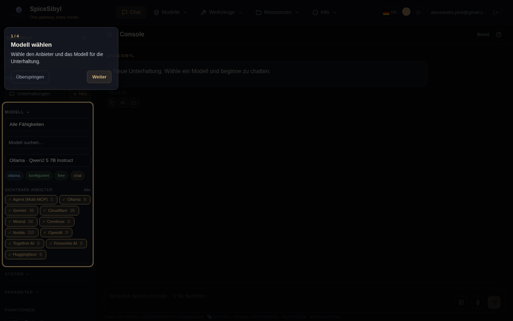

# Oberfläche und UX

## Navigation (Navbar)

**Was es macht.** Die obere Navigationsleiste nutzt **hierarchische Menüs**: Einträge sind in Makro-Einträge mit Dropdown-Untermenüs gruppiert, sodass die Navigation auch mit vielen Seiten übersichtlich bleibt.

**Struktur.**

| Makro-Eintrag | Untermenü |
|---------------|-----------|
| **Chat** | (Direktlink) |
| **Modelle** | Anbieter · Entdeckung · Vergleichen · Statistiken |
| **Werkzeuge** | Werkzeuge · Workflow · MCP *(Admin)* · Arbeitsbereich |
| **Ressourcen** | Vorlagen · Tags · Wissen · Gedächtnis |
| **Info** | Hilfe · Info · Ops *(Admin)* |

**So wird es benutzt.**
- **Klicke** einen Makro-Eintrag, um sein Untermenü zu öffnen; ein Klick außerhalb schließt es. Der Makro-Eintrag ist hervorgehoben, solange eine seiner Seiten aktiv ist.
- **Nur-Admin**-Einträge (MCP, Ops) erscheinen nur mit passender Rolle; eine Gruppe ohne sichtbare Einträge wird ausgeblendet.
- Auf schmalen Bildschirmen (< 576 px) klappt die Navbar in ein Hamburger-Menü zusammen und Untermenüs werden zu Inline-**Akkordeons**.

Rechts sitzen der **Sprachumschalter 🌐**, der **Akzentfarben-Wähler**, der **Design-Umschalter** und der **Benutzer-Chip** mit Abmeldung.

## Dunkles/helles Design und Akzentfarbe

**Was es macht.** Ein Theming-System auf Basis von CSS Custom Properties (`--bg-primary`, `--text-primary`, `--accent`, …) mit Dunkel-/Hell-/System-Modus und anpassbarer Akzentfarbe.

**So wird es benutzt.**
- **Design-Umschalter**: Sonne/Mond-Symbol in der Navbar; die Präferenz liegt im localStorage (`spicesibyl_theme`) und wird über das Attribut `[data-theme]` auf `<html>` angewendet.
- **Akzentfarbe**: Navbar-Wähler mit 8 Vorlagen + freier Farbeingabe; aktualisiert dynamisch alle `--accent-*`-Variablen und funktioniert in beiden Designs (`spicesibyl_accent`).

## Geführtes Onboarding

**Was es macht.** Beim ersten Zugriff startet eine geführte Tour mit Spotlight auf den Schlüsselelementen (Modellauswahl, Werkzeuge, System-Prompt, Slash-Befehle); auf schmalen Viewports wird die Karte zentriert.

**So wird es benutzt.** Folge den Schritten mit **Weiter** oder verlasse die Tour mit **Überspringen**; der Abschluss wird im localStorage gemerkt (`spicesibyl_onboarded`). Die Replay-Schaltfläche in der Chat-Topbar startet sie jederzeit neu.

## Tastenkürzel

| Kürzel | Aktion |
|--------|--------|
| `Strg+K` | öffnet das **Unterhaltungs-Panel** und fokussiert die Suche |
| `Alt+N` | neuer Chat |
| `Strg+Umschalt+S` | Seitenleiste ein/aus |

Kürzel feuern nicht beim Tippen in einem Eingabefeld (außer `Strg+K`).

## Mobiles Layout

- Responsive Media Queries: Seitenleiste als festes Overlay mit Backdrop, Chat und Composer für kleine Bildschirme angepasst.
- **Kanten-Wisch** zum Öffnen/Schließen der Seitenleiste.
- Touch-Ziele ≥ 44 px; Export-Buttons nur als Icons; unter 575 px klappt die Navbar ins Hamburger-Menü.

## PWA (Progressive Web App)

**Was es macht.** Die App ist installierbar (Manifest mit 192/512/maskable Icons + apple-touch-icon), der Angular Service Worker ist nur in Produktion aktiv: die App-Shell funktioniert offline.

**Abschluss-Benachrichtigungen.** Opt-in im Panel **Parameter**: dauert eine Generierung länger als 10 Sekunden und ist der Tab im Hintergrund, feuert bei Fertigstellung eine lokale Systembenachrichtigung (kein Push-Server/VAPID).

**Installation.** In Chrome/Edge: „Installieren"-Symbol in der Adressleiste; mobil: „Zum Startbildschirm hinzufügen".

## Ladeindikatoren

Ein animierter Fortschrittsbalken unter der Topbar während jeder Anfrage, mit Farbe/Tempo je nach Phase: Warten auf das Modell (bernstein), Tool-Ausführung (blau, schneller), Streaming (standard). Tool-Aufruf-Blasen, die auf ihr Ergebnis warten, zeigen einen Spinner statt des ⚙-Symbols.

## Fehlerbehandlung

Globales Toast-System (ErrorInterceptor + NotificationService): HTTP-Fehler und Backend-SSE-Frames `event: error` werden zu Toast + Blasen-Nachricht; Anbieter-Rate-Limits werden auf HTTP 429 abgebildet.
