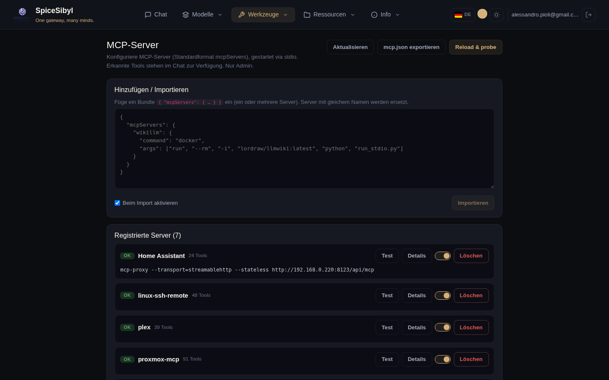
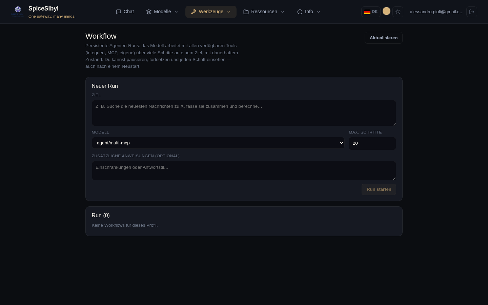

# MCP und Agenten

## Verwaltung der MCP-Server

**Was es macht.** Registriert [MCP](https://modelcontextprotocol.io)-Server (Model Context Protocol) im Standardformat `mcpServers` (`command`/`args`/`env`/`cwd`), startet sie über stdio mit einem minimalen eingebauten JSON-RPC-Client (ohne SDK-Abhängigkeit), prüft ihre Gesundheit und injiziert die entdeckten Tools unter dem Namensraum `mcp__<server>__<tool>` in die Chat-Schleife. Verwaltung **nur für Admins**, globale Konfiguration (Tabelle `mcp_servers`).



**So wird es benutzt.**
1. Seite **MCP** → Bereich **Hinzufügen / Importieren**: füge ein JSON-Bundle `{ "mcpServers": { … } }` ein (ein oder mehrere Server; gleichnamige werden ersetzt) und drücke **Importieren**. Die Checkbox „Beim Import aktivieren" aktiviert sie sofort.
2. In der Liste **Registrierte Server** zeigt jeder Server seinen Status (OK/FEHLER mit Meldung), die Zahl der entdeckten Tools und die Schaltflächen **Test**, **Details** (Tool-Liste), den Aktivierungs-Schalter und **Löschen**.
3. **Reload & probe** führt die Discovery auf allen aktivierten Servern erneut aus; **mcp.json exportieren** lädt die Konfiguration im Standardformat herunter.

**API.** `GET/POST /v1/mcp/servers`, `PATCH`/`DELETE /v1/mcp/servers/{id}`, `POST /v1/mcp/servers/{id}/test`, `POST /v1/mcp/reload`, `GET /v1/mcp/config`, `POST /v1/mcp/import` (alle auditiert).

**Bundle-Beispiel:**

```json
{
  "mcpServers": {
    "wikillm": {
      "command": "docker",
      "args": ["run", "--rm", "-i", "lordraw/llmwiki:latest", "python", "run_stdio.py"]
    }
  }
}
```

## Multi-MCP-Orchestrator (Agentenmodus)

**Was es macht.** Modelle mit dem Präfix `agent/*` werden vom `OrchestratorProvider` an einen externen Sidecar geroutet, der mehrere spezialisierte MCP-Agenten koordiniert (`ask_proxmox`, `ask_synology`, `ask_linux`, `ask_homeassistant`, `ask_watchyourlan`). Nützlich für Heim-/Lab-Infrastrukturfragen, die mehrere Systeme abfragen müssen.

**So wird es benutzt.** Wähle im Chat das Modell `Agent · Multi-MCP Orchestrator`; auf Telegram wechseln die Befehle `/agent` und `/chat` zwischen Agentenmodus und normalem Chat.

## Persistente Workflows

**Was es macht.** Dauerhafte, einsehbare Agenten-Runs: eine serverseitige Hintergrund-Schleife arbeitet mit der **vollständigen** Tool-Registry (integriert, eigene, MCP) über viele Iterationen (`WORKFLOW_DEFAULT_MAX_STEPS`, begrenzt durch `WORKFLOW_MAX_STEPS_LIMIT`) an einem Ziel, weit über die 5 der Chat-Schleife hinaus. Jeder Assistenten-Zug / Tool-Aufruf / Tool-Ergebnis wird als Schritt persistiert (`agent_runs` + `agent_run_steps`) und der Nachrichtenverlauf nach jeder Iteration gesichert: Runs pausieren und setzen verlustfrei fort — **auch über Neustarts hinweg** (als `running` verbliebene Runs werden auf `paused` gesetzt).



**So wird es benutzt.**
1. Seite **Workflow** → Formular **Neuer Run**: Ziel, Modell, max. Schritte, optionale Zusatzanweisungen → **Run starten**.
2. In der Run-Liste: Status-Badges, Pause/Fortsetzen/Abbrechen und Löschen.
3. Die Detailansicht zeigt die **Schritt-Chronik** mit Auto-Refresh: jeder Denk-Schritt und jeder Tool-Aufruf lässt sich inspizieren.

**API.** `POST/GET /v1/workflows`, Detail, `pause`/`resume`/`cancel`/`delete` (auditiert).
