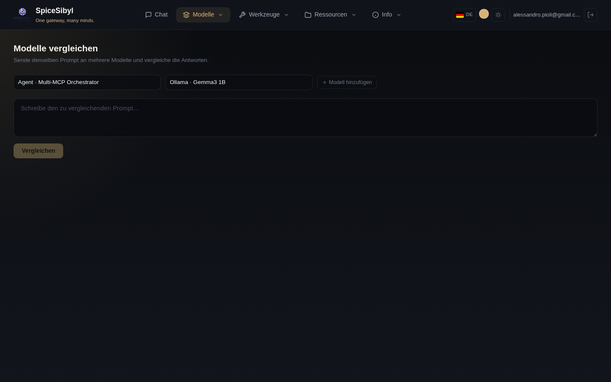

# Modellvergleich

**Was es macht.** Sendet denselben Prompt gleichzeitig an 2–4 Modelle und streamt die Antworten in nebeneinanderliegenden Spalten, jede mit eigener Telemetrie (Latenz, Tokens, Kosten). Nützlich, um das richtige Modell für einen Anwendungsfall zu wählen oder Qualität/Geschwindigkeit/Kosten zu vergleichen.

**So wird es benutzt.**
1. Gehe zur Seite **Vergleichen**.
2. Wähle die Modelle in den Dropdowns (bis zu 4 mit **+ Modell hinzufügen**).
3. Gib den Prompt in das Textfeld ein und drücke **Vergleichen**.
4. Die Antworten streamen parallel, jede in ihrer eigenen Spalte; Latenz, Token-Zahlen und geschätzte Kosten erscheinen unten in jeder Spalte.

**Hinweise.**
- Die Anfragen laufen tatsächlich parallel: die angezeigten Zeiten sind untereinander vergleichbar.
- Jede Spalte erhält exakt denselben Prompt, ohne den System-Prompt des Chats: es ist ein „kalter" Vergleich.
