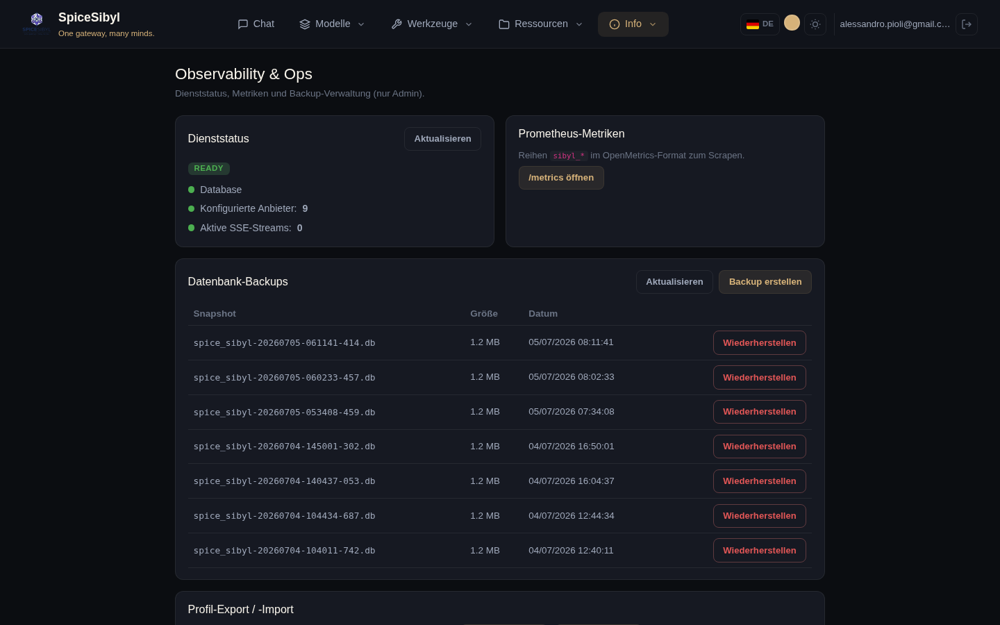

# Observability und Betrieb

## Ops-Seite (nur Admin)

**Was es macht.** Ein auf Admins beschränktes Betriebs-Dashboard (Navbar-Eintrag durch `adminGuard` geschützt): Live-Readiness (DB, konfigurierte Anbieter, aktive SSE-Streams aus `/metrics`), Link zu den Roh-Metriken, Backup-Verwaltung und Export/Import pro Profil.



## Health und Readiness

| Endpoint | Zweck |
|----------|-------|
| `GET /api/v1/health` | Liveness — stabiler Vertrag für den Dockerfile-HEALTHCHECK |
| `GET /api/v1/ready` | Readiness — prüft DB-Verbindung und mindestens einen konfigurierten Anbieter; `503` bei Degradierung |

Die Compose-Datei definiert explizite Backend-Healthchecks; nginx und certbot starten mit `depends_on: condition: service_healthy`.

## Prometheus-Metriken

`GET /api/v1/metrics` (OpenMetrics-Format) liefert:

- `sibyl_http_requests_total` / `sibyl_http_request_duration_seconds`
- `sibyl_provider_requests_total`, `sibyl_provider_tokens_total{kind}`, `sibyl_provider_latency_seconds`
- `sibyl_active_sse_streams`

Optionale Bearer-Token-Absicherung: `METRICS_TOKEN`. Ein fertiges Grafana-Dashboard liegt in [`docs/grafana-dashboard.json`](../grafana-dashboard.json).

## Strukturiertes Logging und Request-Korrelation

Mit `LOG_FORMAT=json` werden Logs als JSON ausgegeben und tragen eine `request_id` (ContextVar), erzeugt von der `RequestContextMiddleware` — sie übernimmt eine eingehende `X-Request-ID` und gibt sie in der Antwort zurück. Die Id wird per Header an den Multi-MCP-Sidecar weitergereicht und in Telegram-Flüsse eingebunden: End-to-End-Tracing jeder Anfrage.

## Datenbank-Backup und -Wiederherstellung

**Was es macht.** Eine opt-in Hintergrundaufgabe, die SQLite über die Online-Backup-API (ohne App-Lock) auf ein gemountetes Volume sichert, mit konfigurierbarem Intervall und Aufbewahrung.

```env
BACKUP_ENABLED=true
BACKUP_DIR=/data/backups
# + Intervall und Aufbewahrung
```

**So wird es benutzt.**
- **Von der Ops-Seite**: Bereich „Datenbank-Backups" — Snapshot-Liste mit Größe und Datum, sofortiges **Backup erstellen**, **Wiederherstellen** auf einen Snapshot.
- **Über die API** (Admin, auditiert): `POST /v1/admin/backup`, `GET /v1/admin/backups`, `POST /v1/admin/restore`.

## Export / Import pro Profil

Ein einzelnes Zip mit Unterhaltungen, Nachrichten, Wissensdatenbank, Vorlagen und Tags eines Profils: `GET /v1/admin/export` / `POST /v1/admin/import`, auch über die Ops-Seite verfügbar. Nützlich zur Migration eines Profils zwischen Instanzen oder als selektives Backup.

## Produktions-Deployment

Kurz gefasst (Details in [deploy.md](../deploy.md)):

- `docker-compose.prod.yml` mit **nginx**, das den statischen Angular-Build auf `/` ausliefert und `/api` zum Backend proxyt;
- `PUBLIC_URL` wird automatisch zu CORS hinzugefügt;
- TLS aus Zertifikaten in `nginx/ssl/` automatisch erkannt, mit optionalem Certbot-Sidecar, HTTP-Fallback falls keine vorhanden;
- Multi-Stage-Dockerfile (`node:20-alpine` → Build → `nginx:1.27-alpine`);
- `VAULT_SECRET_KEY` setzen (beim Start wird eine Sicherheitswarnung geloggt, wenn der Standardwert bleibt).
