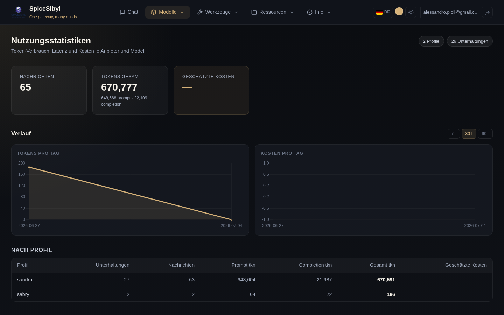

# Nutzungsstatistiken

**Was es macht.** Jede gespeicherte Nachricht trägt ihre Telemetrie (Prompt-/Completion-Tokens, Latenz, vom Anbieter gemeldete Kostenschätzung). Die Seite **Statistiken** aggregiert diese Daten pro Profil oder global.

## Seiteninhalt

- **Übersichtskarten**: Nachrichten gesamt, Tokens gesamt (mit Prompt-/Completion-Aufschlüsselung), geschätzte Kosten.
- **Verlauf** — tägliche Zeitreihen-Diagramme: Token-Flächendiagramm und Kosten-Balkendiagramm, mit umschaltbarem Bereich **7T / 30T / 90T** (`GET /v1/stats/daily`, SQLite-Datumsaggregation).
- **Nach Profil**: Tabelle Unterhaltungen/Nachrichten/Tokens/Kosten je Profil.
- **Nach Anbieter und nach Modell**: Tabellen, die die Nutzung nach Anbieter und einzelnem Modell aufschlüsseln — nützlich, um zu sehen, wohin die Tokens gehen und was tatsächlich Geld kostet.

## So wird es benutzt

Navigiere über die Navbar zu **Statistiken**. Die Daten decken den angemeldeten Benutzer ab (alle seine Profile); die Zähler oben rechts zeigen, wie viele Profile und Unterhaltungen enthalten sind.

**API.** `GET /v1/stats` (pro Profil oder global), `GET /v1/stats/daily` für Tagesreihen.

**Hinweis zu den Kosten.** Die Kosten sind eine von den Anbietern gemeldete Schätzung: bei lokalen Modellen (Ollama) oder kostenlosen Stufen bleiben sie bei null/—.
