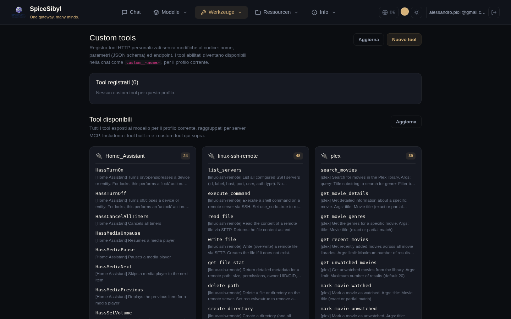

# Tool calling

## Server-side execution loop

**What it does.** With the **Tool calling ON** switch in the sidebar, the backend exposes the registered tools to the model and executes requested calls server-side, feeding results back to the model in a loop (max 5 iterations in chat, configurable via `CHAT_MAX_TOOL_ITERATIONS`; for longer loops see [workflows](mcp-and-agents.md#persistent-workflows)). Calls and results are streamed as SSE `tool_call` / `tool_result` events and rendered as dedicated bubbles in the conversation; pending calls show a spinner.

**List of available tools:** `GET /api/v1/tools` (union of built-ins + the profile's custom tools + MCP). The **Tool calling ON/OFF** switch lives in the sidebar **Funzioni** (Features) section; tool management and overview are on the **Tools** page (*Gestisci →* link).

## Built-in tools

| Tool | What it does |
|------|--------------|
| `get_datetime` | current date/time |
| `calculator` | evaluates mathematical expressions |
| `web_search` | web search via DuckDuckGo (HTML scraping for rich snippets, falling back to the instant-answer API) |
| `read_url` | fetches a web page and returns its text (HTML stripped, max 4,000 characters) |
| `python_exec` | sandboxed code interpreter (see below) |
| `kb_search` | agentic RAG: queries the profile's knowledge base on the model's demand |
| `search_conversations` | episodic memory: full-text (FTS5) search over past conversations |
| `generate_image` | generates an image via the configured provider chain; the image is shown to the user |
| `get_weather` | current weather + forecast via Open-Meteo (free, no API key) |
| `fetch_rss` | latest N entries of an RSS 2.0 / Atom feed |
| `create_reminder` | creates a Telegram reminder for the linked account ("remind me tomorrow at 9…") |
| `extract_document` | downloads a PDF/DOCX/TXT/MD from a URL and returns its text, without KB ingestion |
| `http_request` | generic GET/POST HTTP call to public APIs (optional `HTTP_REQUEST_ALLOWED_DOMAINS` allowlist) |

**SSRF hardening.** `read_url`, `fetch_rss`, `extract_document` and `http_request` refuse URLs whose host resolves to private/loopback/link-local addresses. `kb_search`, `search_conversations` and `create_reminder` automatically operate on the caller's profile.

## Custom tools (HTTP)

**What it does.** Register HTTP-backed tools from the UI, without touching the code: name, description, parameters (JSON Schema), URL/method/headers, authentication (none / bearer / custom header), timeout. They are stored per profile in the `custom_tools` table and injected into the chat loop under the `custom__<name>` namespace.

**How to use it.**
1. **Tools** page → **Nuovo tool** (New tool).
2. Fill in the form (name, description, parameter JSON schema, endpoint, auth, timeout) and save.
3. Use the **inline test panel** for a trial call before enabling it.
4. The enable toggle activates/deactivates the tool without deleting it.

**Call semantics.** Arguments produced by the model are sent as the JSON body (POST/PUT/PATCH) or query string (GET); the response body is the tool result. API: CRUD + test under `/api/v1/tools/custom` (audited operations).

## Available tools grouped by MCP server

**What it does.** Below the custom-tools management, the **Tools** page lists **every tool exposed to the model** for the current profile, **grouped into a card per MCP server** (plus a *Built-in* and a *Custom* card).

**How to use it.** Each card shows the **MCP server name** as its title, a badge with the tool count, and below it the **list of tools** (name without the `mcp__<server>__` prefix, plus its description). Handy to see at a glance what each connected MCP server provides. The **Aggiorna** (Refresh) button reloads the list.

## Sandboxed code interpreter (`python_exec`)

**What it does.** Runs Python code in an isolated `python -I` subprocess with:

- rlimits on CPU, memory (`CODE_INTERPRETER_MEMORY_MB`), file size, fd/process counts;
- wall-clock timeout (`CODE_INTERPRETER_TIMEOUT`, kills the whole process group);
- a minimal environment and **no network** (Python-level socket stubbing);
- an ephemeral working directory with file in/out: input `files` are materialized before the run, created files are reported in the result (small text files inline) and everything is deleted afterwards.

**Configuration.** Enabled by default; opt out with `CODE_INTERPRETER_ENABLED=false`.

**How to use it.** With tool calling enabled, just ask the model something that requires computation/code ("run this script", "analyze these numbers"); the model invokes `python_exec` on its own.
