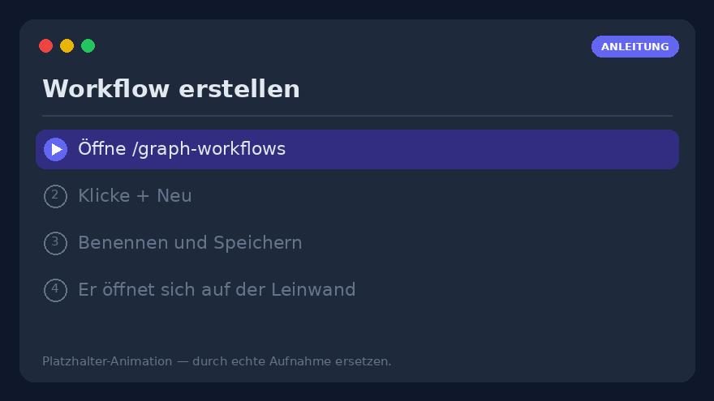
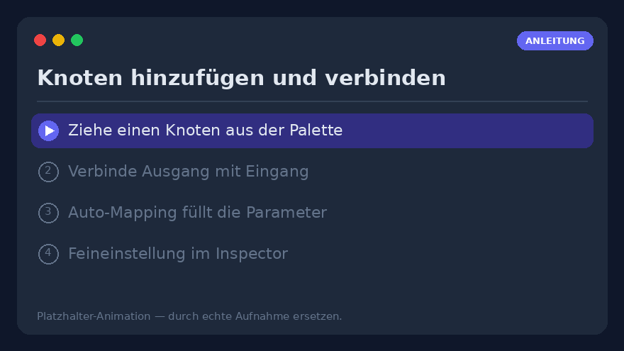
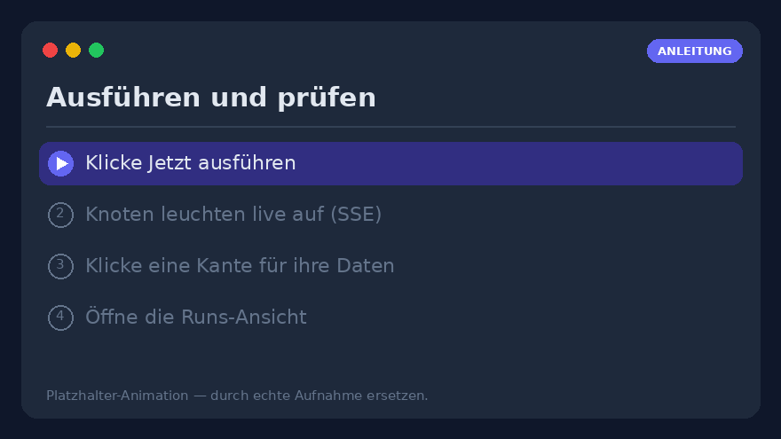
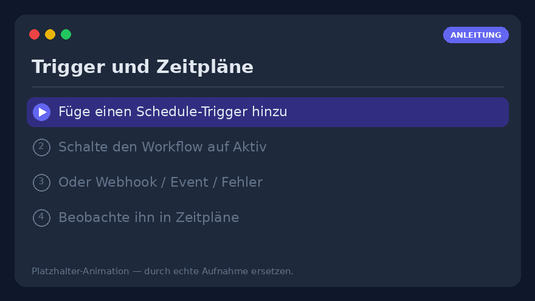
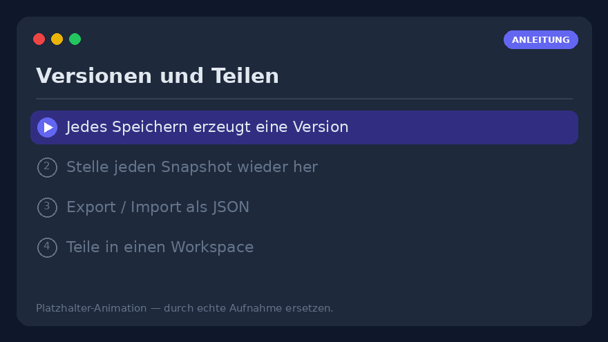

# Workflow-Anleitung — visuelle Workflows erstellen, ausführen und betreiben

Eine praktische Schritt-für-Schritt-Anleitung zum **visuellen Workflow-Editor**
(`/graph-workflows`). Während [Visuelle Workflows](visual-workflows.md) die vollständige
*Referenz* ist (jeder Knoten, jeder Parameter), ist diese Seite die *Anleitung*: Folge ihr
von oben nach unten und du baust, führst aus, planst und teilst einen echten Workflow.

> **Voraussetzung** — visuelle Workflows liegen hinter dem Feature-Flag `graph_workflows`.
> Siehst du **Workflows → Graph** nicht in der Navigationsleiste, bitte einen Admin, es zu
> aktivieren (Einstellungen → Funktionen). Alles Folgende geschieht in deinem eigenen
> Profil.


---

## 1. Erstelle deinen ersten Workflow



1. Öffne **`/graph-workflows`** über die Navigationsleiste (**Workflows → Graph**).
2. Klicke auf **➕ Neu** über der Workflow-Liste.
3. Gib ihm einen **Namen** (z. B. *Morgen-Digest*) und drücke **Speichern**. Der leere Graph
   öffnet sich auf der Leinwand mit einem bereits platzierten **`manual`-Trigger**-Knoten.
4. Fertig — der Workflow existiert und steht links in der Liste. Er ist standardmäßig
   **Inaktiv** (Trigger feuern noch nicht); wir aktivieren ihn in
   [Schritt 9](#9-trigger--von-selbst-laufen-lassen).

> **In Eile?** Klicke auf **✨** (Vorlagengalerie) und **Importiere** einen der fertigen
> [Beispielgraphen](../examples/graph-workflows.md) — einen pro Funktion — und bearbeite
> ihn. Der schnellste Weg, einen funktionierenden Graphen zu sehen.

---

## 2. Die Leinwand lesen

Der Editor hat **drei Bereiche**:

| Bereich | Inhalt |
|---------|--------|
| **Links** | Deine Workflow-Liste (mit ▾/▸ einklappbar) und die **Knoten-Palette**, gruppiert *Trigger · Aktionen · Logik · Daten · KI*. Ein Suchfeld filtert sie nach Label oder Typ. |
| **Mitte** | Die **SVG-Leinwand**. Ziehe Knoten zum Anordnen; ziehe den leeren Hintergrund zum **Verschieben (Pan)**; das Mausrad **zoomt**. Eine **Minimap** (unten rechts) navigiert große Graphen. |
| **Rechts** | Der **Inspector** des ausgewählten Knotens oder — wenn nichts ausgewählt ist — das **Ausführungs- und Trigger-Panel**. |

Jedes eingebaute Tool, jedes entdeckte MCP-Server-Tool und jedes benutzerdefinierte
HTTP-Tool erscheint automatisch als `tool.<name>`-Knoten — du schreibst nie Code, um eines
hinzuzufügen.

Die Werkzeugleiste über der Leinwand bietet **Rückgängig/Wiederholen** (`Ctrl+Z` /
`Ctrl+Shift+Z`), **Kopieren/Einfügen** (`Ctrl+C` / `Ctrl+V`), **Anordnen** (Auto-Layout),
**⛶ Ansicht einpassen** und die Anmerkungen **📝 Notiz** / **▢ Rahmen**.

---

## 3. Knoten hinzufügen und verbinden



1. **Ziehe** einen Knoten aus der linken Palette auf die Leinwand — etwa `tool.rss_read`
   (Aktionen), dann ein `llm.completion` (KI), dann `notify.telegram` (Benachrichtigungen).
2. **Verbinde** sie: halte den **Ausgangs-Anker** eines Knotens (rechter Rand) und ziehe zum
   **Eingangs-Anker** des nächsten Knotens (linker Rand). Eine Verbindung (Kante) erscheint.
3. Beim Ziehen einer Verbindung füllt das **Auto-Mapping** das erste leere Ausdrucksfeld des
   Ziels mit der Ausgabe der Quelle vor — ein Toast bestätigt es, oder ein Auswahldialog
   öffnet sich bei mehreren Kandidaten. Du kannst es immer überschreiben.
4. **Klicke auf eine Kante**, um sie zu inspizieren: das rechte Panel zeigt
   *Quelle → Ziel*, die **Daten, die beim letzten Lauf hindurchflossen**, und die Liste der
   **fertigen Ausdruckspfade** (z. B. `$node.rss.output.result`). Klicke ein Feld, um es als
   `{{ … }}`-Ausdruck zu kopieren.

> **Nur verbundene Knoten laufen.** Trigger-Knoten sind die Einstiegspunkte. Ein nicht
> verbundener Knoten wird als `skipped` verzeichnet — er startet nicht von selbst.

---

## 4. Einen Knoten konfigurieren — der Inspector

Wähle einen Knoten; seine Parameter erscheinen **rechts**, generiert aus dem Schema des
Knotentyps.

- **Literal oder Ausdruck** — jedes Feld akzeptiert einen einfachen Wert **oder** einen
  Ausdruck (siehe [Schritt 5](#5-daten-mit-ausdrücken-weitergeben)).
- **KI-Knoten** (`llm.completion`, `llm.agent`, …) bieten einen **Modell-Picker** — denselben
  Katalog und dieselben Filter wie die Chat-Seite — und eine optionale **Failover-Kette**.
- **Abschnitt Erweitert** — jeder Knoten hat **Wiederholungen + Backoff**, ein **Timeout**
  und eine **Bei Fehler**-Richtlinie (siehe [Schritt 10](#10-fehler-behandeln)).
- **Knoten testen** (⚡) führt *nur diesen Knoten* mit seinen aktuellen, auch ungespeicherten
  Parametern aus und zeigt die Ausgabe inline — nichts wird verzeichnet. Ideal, um einen
  Knoten isoliert abzustimmen.

---

## 5. Daten mit Ausdrücken weitergeben

Bewege Daten zwischen Knoten mit Ausdrücken. Zwei Formen, unterschieden am Präfix:

```text
={{ $node.rss.output.result }}     # die Ausgabe eines anderen Knotens
={{ $trigger.count }}              # die Trigger-Nutzlast
={{ upper($json.title) }}          # eine erlaubte Funktion auf der Eingabe dieses Knotens
={{ default($trigger.name, 'world') }}
Hallo ={{ $trigger.name }}!        # String-Interpolation
=py: [x*2 for x in input]          # Notausgang in die Python-Sandbox
```

- `={{ … }}` ist ein **sicherer Mini-Ausdruck** (kein `eval`), der über den
  Ausführungskontext läuft: `$node.<id>.output.<path>`, `$json` (die Eingabe dieses
  Knotens), `$trigger`, `$vars`, `$secrets`, `$env`, `$now`, plus reine Funktionen
  (`default`, `upper`, `len`, `join`, `first`, `get`, `round`, …).
- Ein nacktes `{{ … }}` (ohne führendes `=`) funktioniert ebenfalls — ein häufiger,
  tolerierter Ausrutscher.
- Ein **alleinstehender** Ausdruck behält seinen nativen Typ (Liste/Zahl/Objekt); umgib ihn
  mit Text, um ihn zu einem String zu machen. Das zählt für das `items`-Feld eines
  `for`/`filter`, das eine echte Liste braucht.

> **Tipp** — das Panel **Ausdruck testen** des Inspectors wertet jeden Ausdruck
> schreibgeschützt gegen die letzten Laufdaten aus, um einen Pfad zu debuggen, *bevor* du ihn
> in einen Parameter verdrahtest.

---

## 6. Geheimnisse aus dem Graphen heraushalten — `$vars` / `$secrets`

Öffne das **Ausführungs-Panel** (klicke auf die leere Leinwand) → **Variablen** /
**Geheimnisse**:

- **Variablen (`$vars`)** — Schlüssel/Wert-Paare pro Workflow, überall als
  `{{ $vars.name }}` lesbar. Sie reisen mit Export/Import; ein JSON-Wert behält seinen
  nativen Typ.
- **Geheimnisse (`$secrets`)** — profilweite Anmeldedaten (API-Token, Verbindungszeichen),
  **im Ruhezustand verschlüsselt** und **nie von der API zurückgegeben** oder in einem
  Export enthalten. Nutze `{{ $secrets.NAME }}`, etwa in einem `http.request`-Header.
  Erstelle sie in jeder Umgebung neu.

Füge nie ein Token direkt in einen Knotenparameter ein — lege es in `$secrets` ab.

---

## 7. Ausführen und die Ergebnisse lesen



1. Drücke **Speichern**, dann **Jetzt ausführen** im Ausführungs-Panel.
2. Knoten **leuchten live** über SSE auf: **grün** = ok, **blau** = läuft, **rot** = Fehler,
   **grau** = übersprungen. Ein fehlgeschlagener Knoten zeigt seinen Fehler in Rot darunter.
3. Eingabe nötig? Füge ein JSON-Objekt in das Feld **Run-Nutzlast** ein — es wird zu
   `$trigger` für diesen Lauf, sodass Graphen, die `={{ $trigger.feld }}` lesen, ohne Webhook
   von Hand geprüft werden können.
4. Das dauerhafte Protokoll lebt in der **Runs-Ansicht** (`/graph-workflows/runs`, oder
   *Runs →* in der Editor-Kopfzeile): jeder Lauf mit Status, Trigger, Dauer und
   **Ergebnissen pro Knoten**. Wähle einen laufenden Lauf, um ihm live zu folgen;
   **↻ Wiederholen** startet ihn mit derselben Nutzlast neu.

---

## 8. Debuggen ohne vollständige Läufe

- **Knoten testen** (⚡) — einen Knoten isoliert ausführen (Schritt 4).
- **Angeheftete Ausgabe** (📌) — friere die Ausgabe eines Knotens ein (die letzte oder
  handbearbeitetes JSON). Nachgelagerte Tests, Ausdruck-Vorschauen und **Teilläufe** lösen
  dann `$node.<id>.output` aus der Anheftung statt das echte Tool erneut aufzurufen — ideal,
  um nachgelagert eines teuren Webhooks oder LLM-Aufrufs zu iterieren. Anheftungen
  beeinflussen Produktionsläufe nie.
- **Ab diesem Knoten ausführen** (▶) — führt nur den gewählten Knoten und seinen
  nachgelagerten Teilgraphen aus; vorgelagerte Knoten werden aus ihrer letzten persistierten
  Ausgabe gespeist.
- **Schritt-Debugging** (🐞) — setze Haltepunkte (der Punkt an jedem Knoten), **Debug-Lauf
  starten** (*pausiert* erstellt), dann **⏭ Schritt** / **▶ Weiter** / **⏹ Stopp**. Die
  Debug-Leiste zeigt die aufgelöste Eingabe jedes Knotens vor seiner Ausführung.

---

## 9. Trigger — von selbst laufen lassen



Füge Trigger im **Ausführungs-Panel** hinzu und **schalte den Workflow dann auf Aktiv** —
das ist der Schritt, den man übersieht:

> ⚠️ **Ein Trigger feuert nur, solange sein *Workflow* Aktiv ist.** Einen Trigger zu
> aktivieren ist getrennt vom Aktiv-Flag des Workflows. Ein perfekter, aktivierter Zeitplan
> auf einem **inaktiven** Workflow läuft nie.

Trigger-Typen:

- **Zeitplan** — Täglich / Wöchentlich / Cron / Einmal über einen strukturierten Picker
  (oder einen validierten Cron-Ausdruck). Eine Hintergrundschleife feuert fällige
  Zeitpläne.
- **Webhook** — eine token-bezogene URL (`POST /api/v1/wf/hooks/{token}`); der JSON-Body
  wird zu `$trigger`. Optional mit einem HMAC-Signatur-Geheimnis schützbar.
- **Ereignis** — interne Ereignisse (`document.ingested`, `chat.message.created`).
- **Fehler / Erfolg** — feuern, wenn der Lauf eines *anderen* Workflows fehlschlägt /
  abschließt.
- **Datei-Überwachung / Eingehende E-Mail** — pollen einen Workspace-Ordner oder ein
  IMAP-Postfach.

Die workflow-übergreifende **Zeitpläne-Ansicht** (`/graph-workflows/schedules`) listet eine
Zeile pro Trigger — nächster Lauf, letzter Status, Fehlerserie und
Aktivieren/Deaktivieren/Ausführen/Löschen — sodass du auf einen Blick siehst, was fällig
oder kaputt ist.

---

## 10. Fehler behandeln

Der Abschnitt **Erweitert** jedes Knotens hat drei Fehlersteuerungen:

1. **Wiederholungen + Backoff** — bis zu N-mal erneut ausführen; **Fester** oder
   **Exponentieller** Backoff (auf 60 s begrenzt). Neue `http.request` / `llm.*`-Knoten
   kommen mit sinnvollen Voreinstellungen.
2. **Timeout (ms)** — eine harte Obergrenze pro Versuch; ein abgelaufener Versuch schlägt wie
   jeder Fehler fehl (und wird weiterhin wiederholt). Die Absicherung für einen hängenden
   HTTP/LLM/MCP-Aufruf.
3. **Bei Fehler** — sobald die Wiederholungen erschöpft sind:
   - **Lauf stoppen** (Standard),
   - **Auf main fortsetzen** — gibt `{ error }` aus und macht weiter,
   - **Zum Fehler-Zweig leiten** — der Knoten erhält einen **`error`**-Anker; verdrahte den
     Erfolgspfad zu `main` und eine Alarm-/Fallback-Kette zu `error` (try/catch auf der
     Leinwand).

Für zentrale Alarmierung füge einen Workflow mit **Fehler-Trigger** hinzu, der bei *jedem*
Fehler feuert und mit einem `notify.*`-Knoten endet.

---

## 11. Versionen, Export/Import und Teilen



- **Versionen** — jedes **Speichern** erstellt einen unveränderlichen Snapshot. Der
  Abschnitt *Versionen* des Ausführungs-Panels listet sie mit einem **Wiederherstellen** per
  Klick (das zuerst den aktuellen Graphen snapshottet, sodass ein Rollback stets umkehrbar
  ist). *Vergleiche* zwei Versionen, um hinzugefügte/geänderte/entfernte Knoten zu sehen.
- **Export** — der Knopf **Exportieren** lädt eine portable `.workflow.json` (Graph,
  Variablen, Umgebungen und die *Namen* referenzierter Geheimnisse — Werte reisen nicht mit).
- **Import** — der Knopf **📥** neben *Neu* lädt eine solche Datei in einen neuen Workflow,
  validiert (unbekannte Knoten / kaputte Kanten / fehlende Geheimnisse erscheinen als
  Warnungen).
- **Teilen** — teile einen Workflow in einen **Workspace** mit einer Rolle: `viewer`
  (inspizieren + kopieren), `editor` (…+ Läufe starten) oder `approver` (…+ seine
  `human.approval`-Anfragen entscheiden).

---

## 12. Durchgängiges Beispiel — RSS-Digest an Telegram

Ein konkreter End-to-End-Aufbau:

1. **Trigger** — behalte vorerst den `manual`-Knoten (füge später einen **Zeitplan**
   *Täglich 08:00* hinzu).
2. `tool.rss_read` — setze die Feed-URL in seinem Parameter.
3. `llm.completion` — Prompt `Fasse diese Schlagzeilen in 5 Stichpunkten zusammen:\n={{ $node.rss.output.result }}`, wähle ein Modell.
4. `notify.telegram` — `text: ={{ $node.llm.output.text }}`, `parse_mode: Markdown`. (Verknüpfe
   zuerst einen Chat in Einstellungen → Telegram.)
5. Verdrahte `manual → rss → llm → telegram`, **Speichern**, **Jetzt ausführen**, prüfe die
   Telegram-Nachricht.
6. Zufrieden? Füge den **Zeitplan**-Trigger hinzu und **schalte auf Aktiv** — ein täglicher
   Digest ohne weitere Klicks.

---

## 13. Checkliste zur Fehlersuche

- **Mein Zeitplan feuert nie** → ist der **Workflow Aktiv** (nicht nur der Trigger
  aktiviert)? Siehe [Schritt 9](#9-trigger--von-selbst-laufen-lassen).
- **Ein Knoten ist `skipped`** → er ist nicht ab einem Trigger in den Fluss eingebunden.
- **Ein Ausdruck ist leer** → teste ihn in **Ausdruck testen**; prüfe den genauen Pfad in
  der Feldliste des Kanten-Inspectors.
- **In einer Schleife ist `$node.<loopId>.output` leer** → nutze `$item` / `$index` im
  **Rumpf** der Schleife; `…output.items` gibt es nur am `done`-Ausgang der Schleife.
- **Ein Geheimnis löst zu `***` auf** → das ist in der Editor-Vorschau erwartet; es wird nur
  während eines echten Laufs entschlüsselt.
- **Ein Webhook liefert 401** → der Anfrage fehlt der HMAC-Header `X-Signature`, nachdem du
  das Geheimnis rotiert hast.

---

## Wohin als Nächstes

- **[Visuelle Workflows](visual-workflows.md)** — die vollständige Referenz: jeder
  Knotentyp, jede Ausdrucksfunktion, jeder Trigger, jede Umgebung, jeder Vertrag und jeder
  API-Endpunkt.
- **[Beispielgraphen](../examples/graph-workflows.md)** — importfertige Workflows, einer pro
  Funktion.
