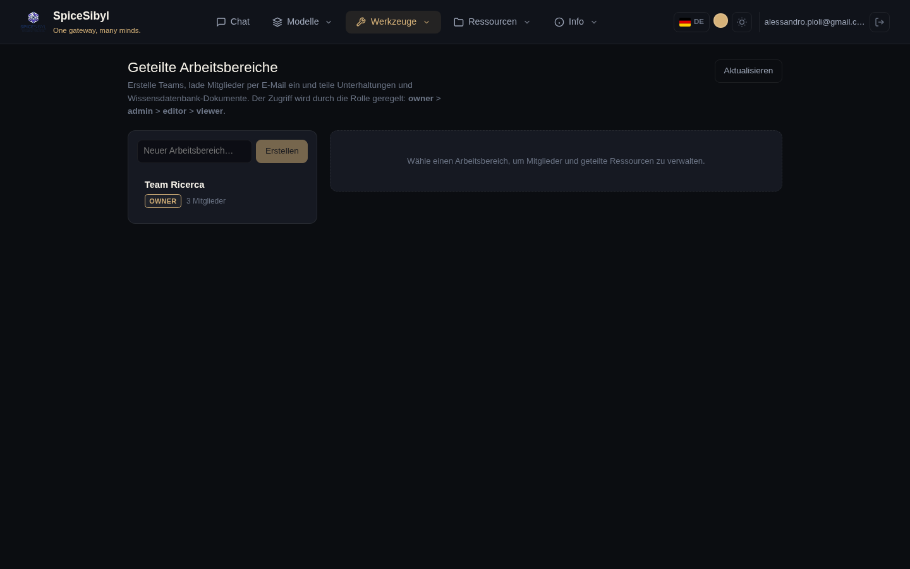

# Arbeitsbereiche und Zusammenarbeit

Team-Funktionen, aufbauend auf den Konten der Phase 13 und der Wissensdatenbank-Eingrenzung der Phase 17: geteilte Arbeitsbereiche mit rollenbasiertem Zugriff und Kommentar-Threads zu geteilten Unterhaltungen.

## Geteilte Arbeitsbereiche

**Was es macht.** Ein Arbeitsbereich ist ein Team-Container, der einem Benutzer gehört. Andere Konten treten als **Mitglieder** mit einer Rolle bei, und der Eigentümer teilt einzelne Unterhaltungen und Wissensdatenbank-Dokumente *in* den Arbeitsbereich, sodass sie für jedes Mitglied sichtbar werden. Ressourcen behalten ihren ursprünglichen Eigentümer — Teilen ist eine Join-Beziehung (`workspace_conversations` / `workspace_documents`), keine Kopie — daher entfernt das Aufheben der Freigabe einfach die Verknüpfung.

**Rollen.** Vier Stufen, absteigend nach Privileg:

| Rolle | Kann |
|-------|------|
| **owner** | Alles, plus Arbeitsbereich umbenennen/löschen und jedes Mitglied verwalten. Hat den Arbeitsbereich erstellt; genau einer pro Arbeitsbereich. |
| **admin** | Mitglieder verwalten (hinzufügen/Rolle ändern/entfernen, außer dem Eigentümer) und Ressourcen teilen/Freigabe aufheben. |
| **editor** | Eigene Ressourcen teilen/Freigabe aufheben und kommentieren. |
| **viewer** | Geteilte Ressourcen lesen und kommentieren. |

Jedes Mitglied (auch ein viewer) kann einen Arbeitsbereich selbst **verlassen**; nur admin+ können *andere* Mitglieder entfernen. Eine Unterhaltung oder ein Dokument zu teilen erfordert editor+ **und** Eigentümerschaft dieser Ressource — man kann nichts teilen, das einem nicht gehört.

**So wird es benutzt.** Öffne die Seite **Arbeitsbereich** über die Navbar:

- Die linke Seitenleiste listet die Arbeitsbereiche, denen du angehörst (mit deiner Rolle und Mitgliederzahl) und ein Feld, um einen neuen zu erstellen — beim Erstellen wirst du Eigentümer.
- Ein Arbeitsbereich zu wählen öffnet den Detailbereich mit drei Karten: **Mitglieder**, **Geteilte Unterhaltungen** und **Geteilte Dokumente**.
- **Mitglieder** — per E-Mail einladen (das Konto muss bereits existieren), die Rolle eines Mitglieds inline ändern oder es entfernen. Verwaltungssteuerungen erscheinen nur für admin+; die Eigentümer-Zeile ist nicht bearbeitbar.
- **Geteilte Unterhaltungen / Dokumente** — wähle eine deiner Unterhaltungen oder KB-Dokumente aus dem Dropdown und teile sie; jedes Mitglied sieht sie dann in der Liste. Das **✕** hebt die Freigabe auf (editor+).

**API.**

| Methode & Pfad | Zweck | Mindestrolle |
|----------------|-------|--------------|
| `GET /v1/workspaces` | Arbeitsbereiche, denen der Aufrufer angehört | Mitglied |
| `POST /v1/workspaces` | Erstellen (Aufrufer wird Eigentümer) | — |
| `PATCH /v1/workspaces/{ws}` | Umbenennen | admin |
| `DELETE /v1/workspaces/{ws}` | Löschen | owner |
| `GET/POST /v1/workspaces/{ws}/members` | Auflisten / per E-Mail einladen | view / admin |
| `PATCH/DELETE /v1/workspaces/{ws}/members/{uid}` | Rolle ändern / entfernen (oder selbst verlassen) | admin |
| `GET/POST /v1/workspaces/{ws}/conversations` | Auflisten / Unterhaltung teilen | view / editor |
| `DELETE /v1/workspaces/{ws}/conversations/{cid}` | Freigabe einer Unterhaltung aufheben | editor |
| `GET/POST /v1/workspaces/{ws}/documents` | Auflisten / KB-Dokument teilen | view / editor |
| `DELETE /v1/workspaces/{ws}/documents/{did}` | Freigabe eines KB-Dokuments aufheben | editor |

## Anmerkungen und Kommentare

**Was es macht.** Kommentar-Threads zu einer geteilten Unterhaltung. Ein Kommentar kann ein Top-Level-Thread oder eine Antwort sein (`parent_id`) und optional an eine bestimmte Nachricht verankert werden (`message_id`). Kommentare sind **soft-deleted** — ein entfernter Kommentar wird geleert und markiert statt gelöscht, damit Antworten darunter ihren Platz im Thread behalten.

**Wer sie sehen kann.** Der Zugriff spiegelt die Reichweite der Unterhaltung: ihr Eigentümer oder jedes Mitglied eines Arbeitsbereichs, in den sie geteilt wurde, kann lesen und posten. Bearbeiten und Löschen sind auf den **Autor** des Kommentars beschränkt — niemand sonst kann deinen Text ändern, unabhängig von der Arbeitsbereich-Rolle.

**So wird es benutzt.** Auf der Arbeitsbereich-Seite hat jede geteilte Unterhaltung einen **Kommentare**-Schalter, der ein Thread-Panel darunter öffnet. Schreibe einen Top-Level-Kommentar in das Feld, nutze **Antworten** zum Verschachteln einer Antwort und **Bearbeiten / Löschen** bei eigenen Kommentaren. Threads verschachteln sich visuell durch Einrückung.

**API** (unter `/v1/conversations/{id}/comments`):

| Methode & Pfad | Zweck |
|----------------|-------|
| `GET /` | Alle Kommentare der Unterhaltung auflisten (clientseitig per `parent_id` verschachtelt) |
| `POST /` | Kommentar hinzufügen (`body`, optionales `message_id`, optionales `parent_id`) |
| `PATCH /{comment_id}` | Eigenen Kommentar bearbeiten |
| `DELETE /{comment_id}` | Eigenen Kommentar soft-delete |

Ein Aufrufer ohne Beziehung zur Unterhaltung erhält ein `404` (statt `403`), sodass die Existenz privater Unterhaltungen nie preisgegeben wird.

## Datenmodell

- `workspaces` — `id`, `name`, `owner_id`, Zeitstempel.
- `workspace_members` — `(workspace_id, user_id)` mit `role`; der Eigentümer wird als Mitgliedszeile gespeichert (`role='owner'`), damit Mitgliedschaftsabfragen einheitlich sind.
- `workspace_conversations` / `workspace_documents` — Join-Tabellen, die einen Arbeitsbereich mit geteilten Unterhaltungen / KB-Dokumenten verknüpfen, mit `shared_by` und `shared_at`.
- `comments` — `id`, `conversation_id`, nullable `message_id`, nullable `parent_id`, `user_id`, `body`, `deleted`, Zeitstempel.

Alle Tabellen kaskadieren beim Löschen über Fremdschlüssel, sodass das Entfernen eines Arbeitsbereichs, einer Unterhaltung oder eines Benutzers die abhängigen Zeilen automatisch bereinigt.

> Echtzeit-Zusammenarbeit (mehrere Benutzer live in einer Unterhaltung über WebSocket, mit Präsenzanzeigen) ist als Phase 20.c geplant und noch nicht implementiert.
