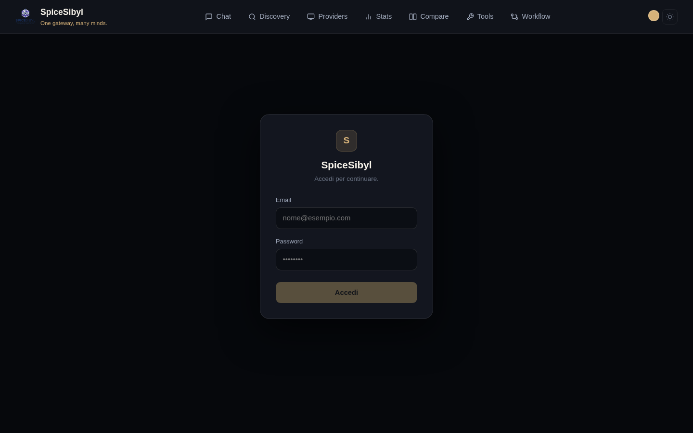
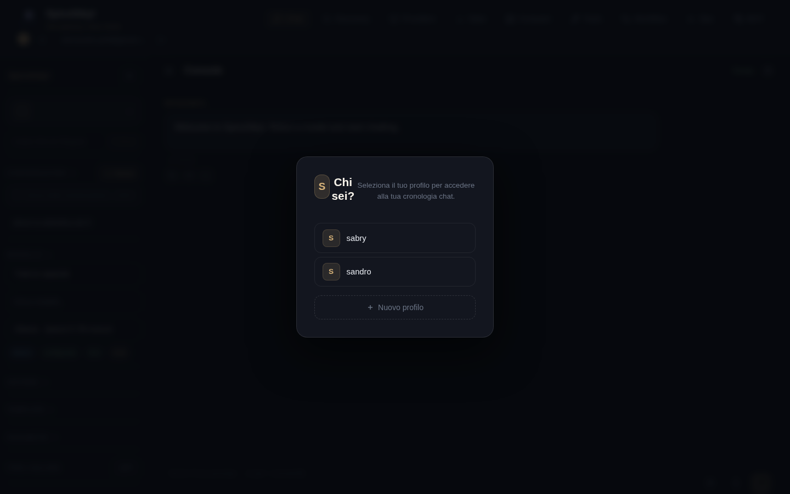

# Authentication and profiles

## Login and user accounts

**What it does.** Every `/api/v1` route requires authentication, except for the public allowlist (`/auth/*`, `/health`, `GET /shared/{token}`). Accounts have email + password (bcrypt hashing) and a role: `admin`, `user` or `read-only`. Sessions use JWT access tokens (30 minutes) and rotating refresh tokens (14 days) tracked in the `refresh_tokens` table, so they can be revoked.

**How to use it.**
1. Open the web console: if you are not authenticated you are redirected to `/login`.
2. Enter email and password and press **Accedi** (Sign in).
3. The frontend silently refreshes expired tokens on its own (401 interceptor); log out from the user chip in the navbar.

**Admin bootstrap.** On first boot the backend creates an administrator from `ADMIN_EMAIL` / `ADMIN_PASSWORD` (in `backend/.env`) and "adopts" any orphan profiles created before authentication was introduced.

## Profiles

**What it does.** Each user owns N profiles (named local identities, no passwords). Conversation history, knowledge base, templates, tags and statistics are scoped per profile. The active profile UUID is stored in `localStorage` (`spicesibyl_profile`).

**How to use it.**
- On first visit (or whenever no profile is selected) the **"Chi sei?"** (Who are you?) modal appears: pick an existing profile or create one with **+ Nuovo profilo**.
- You can switch profile at any time from the selector at the top of the chat sidebar.

**Data isolation.** Every profile-scoped endpoint validates ownership through the `resolve_profile` dependency: a user cannot read conversations or documents belonging to someone else's profiles.

## Telegram ↔ web linking

**What it does.** Associates a Telegram user with a web profile, so conversations and statistics are shared across both channels.

**How to use it.**
1. Send `/link` to the Telegram bot: you receive a 6-character code.
2. Paste the code into the **"Codice /link da Telegram"** field in the web sidebar and press **Collega** (Link).
3. `/unlink` on the bot disconnects the account.

## Rate limiting

Per-user sliding-window limit (`RATE_LIMIT_DEFAULT`, default `60/minute`), keyed by the authenticated user id (correct even behind the nginx proxy). When exceeded the server responds `429` with a `Retry-After` header. Note: the store is in-memory (single process).

## Audit log

The `audit_log` table records who did what and when, with the client IP: logins, conversation/profile deletions, provider key updates, user role/disable changes, backup/restore operations, custom tool and MCP server CRUD.

**How to view it.** Admin only: `GET /api/v1/auth/audit`.
