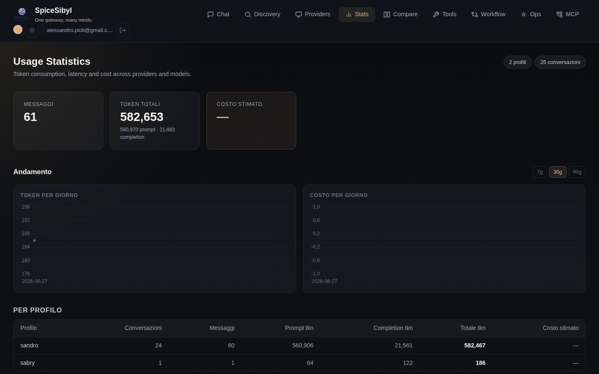

# Usage statistics

**What it does.** Every stored message carries its telemetry (prompt/completion tokens, latency, provider-reported cost estimate). The **Stats** page aggregates this data per profile or globally.

## Page contents

- **Summary cards**: total messages, total tokens (with prompt/completion breakdown), estimated cost.
- **Trend** — daily time-series charts: token area chart and cost bar chart, with a switchable **7d / 30d / 90d** range (`GET /v1/stats/daily`, SQLite date aggregation).
- **Per profile**: conversations/messages/tokens/cost table for each profile.
- **Per provider and per model**: tables breaking usage down by provider and by individual model — useful to see where tokens go and what actually costs money.

## How to use it

Navigate to **Stats** from the navbar. Data covers the authenticated user (all their profiles); the counters at the top right show how many profiles and conversations are included.

**API.** `GET /v1/stats` (per profile or global), `GET /v1/stats/daily` for daily series.

**Note on costs.** Cost is an estimate reported by providers: for local models (Ollama) or free tiers it stays at zero/—.
