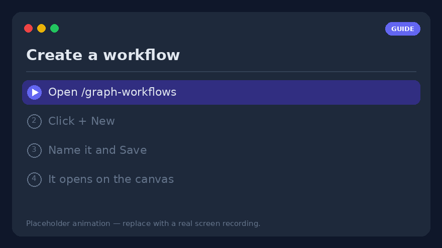
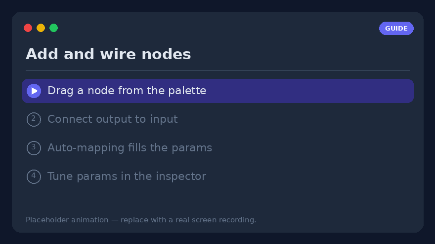
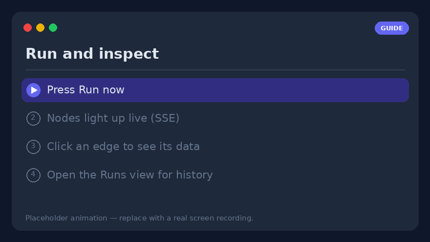
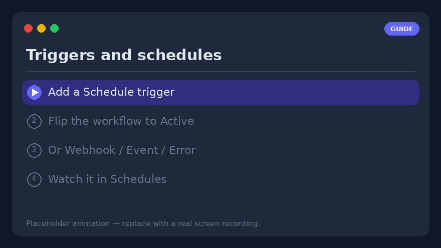
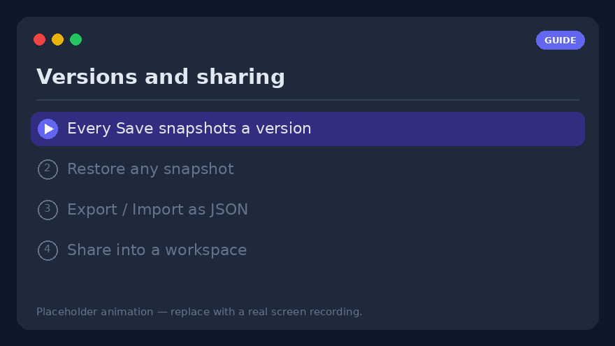

# Workflow how-to — build, run and operate visual workflows

A hands-on, step-by-step guide to the **visual workflow editor** (`/graph-workflows`).
Where [Visual workflows](visual-workflows.md) is the full *reference* (every node, every
parameter), this page is the *how-to*: follow it top to bottom and you will build, run,
schedule and share a real workflow.

> **Prerequisite** — visual workflows live behind the `graph_workflows` feature flag. If
> you don't see **Workflows → Graph** in the navbar, ask an admin to enable it
> (Settings → Features). Everything below happens inside your own profile.


---

## 1. Create your first workflow



1. Open **`/graph-workflows`** from the navbar (**Workflows → Graph**).
2. Click **➕ New** above the workflow list.
3. Give it a **name** (e.g. *Morning digest*) and press **Save**. The empty graph opens
   on the canvas with a single **`manual` trigger** node already placed.
4. That's it — the workflow exists and is listed on the left. It is **Inactive** by
   default (triggers won't fire yet); we'll activate it in [step 9](#9-triggers--make-it-run-by-itself).

> **In a hurry?** Click **✨** (template gallery) and **Import** one of the ready-made
> [example graphs](../examples/graph-workflows.md) — one per feature — then edit it. It's
> the fastest way to see a working graph.

---

## 2. Read the canvas

The editor has **three panes**:

| Pane | What it holds |
|------|---------------|
| **Left** | Your workflow list (collapsible with ▾/▸) and the **node palette**, grouped *Triggers · Actions · Logic · Data · AI*. A search box filters it by label or type. |
| **Center** | The **SVG canvas**. Drag nodes to arrange them; drag the empty background to **pan**; the mouse wheel **zooms**. A **minimap** (bottom-right) navigates large graphs. |
| **Right** | The **inspector** for the selected node, or — when nothing is selected — the **run & triggers panel**. |

Every built-in tool, every discovered MCP server tool and every custom HTTP tool appears
automatically as a `tool.<name>` node — you never write code to add one.

The toolbar above the canvas gives you **Undo/Redo** (`Ctrl+Z` / `Ctrl+Shift+Z`),
**Copy/Paste** (`Ctrl+C` / `Ctrl+V`), **Arrange** (auto-layout), **⛶ fit view**, and the
**📝 Note** / **▢ Frame** annotations.

---

## 3. Add and wire nodes



1. **Drag** a node from the left palette onto the canvas — say `tool.rss_read` (Actions),
   then an `llm.completion` (AI), then `notify.telegram` (Notify).
2. **Connect** them: press and hold a node's **output handle** (right edge) and drag to the
   next node's **input handle** (left edge). A connection (edge) appears.
3. When you draw a connection, **auto-mapping** pre-fills the target's first empty
   expression field with the source's output — a toast confirms it, or a chooser dialog
   opens when there are several candidates. You can always override it.
4. **Click an edge** to inspect it: the right panel shows *source → target*, the **data
   that flowed through it on the last run**, and a list of **ready-made expression paths**
   (e.g. `$node.rss.output.result`). Click a field to copy it as a `{{ … }}` expression.

> **Only wired nodes run.** Trigger nodes are the entry points. A node left unconnected is
> recorded as `skipped` — it does not fire on its own.

---

## 4. Configure a node — the inspector

Select a node; its parameters render on the **right** from the node type's schema.

- **Literal or expression** — any field accepts a plain value **or** an expression
  (see [step 5](#5-pass-data-with-expressions)).
- **AI nodes** (`llm.completion`, `llm.agent`, …) expose a **model picker** — the same
  catalog and filters as the chat page — and an optional **Failover chain**.
- **Advanced section** — every node has **Retries + backoff**, a **Timeout**, and an
  **On error** policy (see [step 10](#10-handle-errors)).
- **Test node** (⚡) runs *only this node* with its current, even unsaved, parameters and
  shows the output inline — nothing is recorded. Great for tuning one node in isolation.

---

## 5. Pass data with expressions

Move data between nodes with expressions. Two forms, dispatched by prefix:

```text
={{ $node.rss.output.result }}     # another node's output
={{ $trigger.count }}              # the trigger payload
={{ upper($json.title) }}          # a whitelisted function on this node's input
={{ default($trigger.name, 'world') }}
Hi ={{ $trigger.name }}!           # string interpolation
=py: [x*2 for x in input]          # escape hatch into the Python sandbox
```

- `={{ … }}` is a **safe mini-expression** (no `eval`) walked over the run context:
  `$node.<id>.output.<path>`, `$json` (this node's input), `$trigger`, `$vars`,
  `$secrets`, `$env`, `$now`, plus pure functions (`default`, `upper`, `len`, `join`,
  `first`, `get`, `round`, …).
- A bare `{{ … }}` (no leading `=`) works too — it's a common, forgiving slip.
- A **lone** expression keeps its native type (list/number/object); wrap it in text to
  stringify it. This matters for a `for`/`filter` `items` field, which needs a real list.

> **Tip** — the inspector's **Test expression** panel evaluates any expression read-only
> against the latest run data, so you can debug a path *before* wiring it into a param.

---

## 6. Keep secrets out of the graph — `$vars` / `$secrets`

Open the **run panel** (click empty canvas) → **Variables** / **Secrets**:

- **Variables (`$vars`)** — per-workflow key/values, read anywhere as `{{ $vars.name }}`.
  They travel with export/import; a JSON value keeps its native type.
- **Secrets (`$secrets`)** — profile-scoped credentials (API tokens, connection strings),
  **encrypted at rest** and **never returned by the API** or included in an export. Use
  `{{ $secrets.NAME }}` in, say, an `http.request` header. Re-create them in each
  environment.

Never paste a token straight into a node parameter — put it in `$secrets`.

---

## 7. Run it and read the results



1. Press **Save**, then **Run now** in the run panel.
2. Nodes **light up live** over SSE: **green** = ok, **blue** = running, **red** = error,
   **grey** = skipped. A failing node shows its error in red beneath it.
3. Need to feed input? Paste a JSON object into the **Run payload** box — it becomes
   `$trigger` for that run, so graphs that read `={{ $trigger.field }}` can be exercised
   manually without a webhook.
4. The durable record lives in the **Runs view** (`/graph-workflows/runs`, or *Runs →* in
   the editor header): every run with status, trigger, duration and **per-node results**.
   Select a running run to follow it live; **↻ Replay** re-runs it with the same payload.

---

## 8. Debug without full runs

- **Test node** (⚡) — run one node in isolation (step 4).
- **Pinned output** (📌) — freeze a node's output (its latest, or hand-edited JSON).
  Downstream tests, expression previews and **partial runs** then resolve
  `$node.<id>.output` from the pin instead of re-calling the real tool — ideal for
  iterating downstream of an expensive webhook or LLM call. Pins never affect production
  runs.
- **Run from this node** (▶) — execute only the selected node and its downstream subgraph;
  upstream nodes are seeded from their last persisted output.
- **Step debugging** (🐞) — set breakpoints (the dot on each node), **Start debug run**
  (created *paused*), then **⏭ Step** / **▶ Continue** / **⏹ Stop**. The debug bar shows
  each node's resolved input before it runs.

---

## 9. Triggers — make it run by itself



Add triggers from the **run panel**, then **flip the workflow to Active** — this is the
step people miss:

> ⚠️ **A trigger only fires while its *workflow* is Active.** Enabling a trigger is
> separate from the workflow's Active flag. A perfect, enabled schedule on an **Inactive**
> workflow will never run.

Trigger types:

- **Schedule** — Daily / Weekly / Cron / Once via a structured picker (or a cron
  expression, validated). A background loop fires due schedules.
- **Webhook** — a token-scoped URL (`POST /api/v1/wf/hooks/{token}`); the JSON body becomes
  `$trigger`. Optionally protect it with an HMAC signature secret.
- **Event** — internal events (`document.ingested`, `chat.message.created`).
- **Error / Success** — fire when *another* workflow's run fails / completes.
- **File watch / Inbound email** — poll a workspace folder or an IMAP inbox.

The cross-workflow **Schedules view** (`/graph-workflows/schedules`) lists one row per
trigger — next run, last status, failure streak, and enable/disable/Run/Delete — so you
see everything that's due or broken at a glance.

---

## 10. Handle errors

Every node's **Advanced** section has three failure controls:

1. **Retries + backoff** — re-run up to N times; **Fixed** or **Exponential** backoff
   (capped at 60 s). New `http.request` / `llm.*` nodes ship with sensible presets.
2. **Timeout (ms)** — a hard cap per attempt; a timed-out attempt fails like any error
   (and is still retried). The guard for a hung HTTP/LLM/MCP call.
3. **On error** — once retries are exhausted:
   - **Stop the run** (default),
   - **Continue on main** — emit `{ error }` and carry on,
   - **Route to error branch** — the node grows an **`error`** handle; wire your happy path
     to `main` and an alert/fallback chain to `error` (try/catch on the canvas).

For centralised alerting, add an **error trigger** workflow that fires on *any* failure and
ends in a `notify.*` node.

---

## 11. Versions, export/import and sharing



- **Versions** — every **Save** snapshots an immutable version. The run panel's *Versions*
  section lists them with a one-click **Restore** (which snapshots the current graph first,
  so a rollback is always reversible). *Compare* two versions to see added/changed/removed
  nodes.
- **Export** — the **Export** button downloads a portable `.workflow.json` (graph, vars,
  environments, and the *names* of referenced secrets — values never travel).
- **Import** — the **📥** button next to *New* loads such a file into a new workflow,
  validated (unknown nodes / broken edges / missing secrets surface as warnings).
- **Share** — share a workflow into a **workspace** with a role: `viewer` (inspect + copy),
  `editor` (…+ launch runs), or `approver` (…+ decide its `human.approval` requests).

---

## 12. Worked example — RSS digest to Telegram

A concrete end-to-end build:

1. **Trigger** — keep the `manual` node for now (add a **Schedule** *Daily 08:00* later).
2. `tool.rss_read` — set the feed URL in its parameter.
3. `llm.completion` — prompt `Summarise these headlines in 5 bullets:\n={{ $node.rss.output.result }}`, pick a model.
4. `notify.telegram` — `text: ={{ $node.llm.output.text }}`, `parse_mode: Markdown`. (Link a
   chat first in Settings → Telegram.)
5. Wire `manual → rss → llm → telegram`, **Save**, **Run now**, check the Telegram message.
6. Happy with it? Add the **Schedule** trigger and **flip Active** — a daily digest with no
   further clicks.

---

## 13. Troubleshooting checklist

- **My schedule never fires** → is the **workflow Active** (not just the trigger enabled)?
  See [step 9](#9-triggers--make-it-run-by-itself).
- **A node is `skipped`** → it isn't connected into the flow from a trigger.
- **An expression is empty** → test it in **Test expression**; check the exact path in the
  edge inspector's field list.
- **Inside a loop, `$node.<loopId>.output` is empty** → use `$item` / `$index` in the loop
  **body**; `…output.items` is only available on the loop's `done` output.
- **A secret resolves to `***`** → that's expected in the editor preview; it decrypts only
  during a real run.
- **A webhook returns 401** → the request is missing the `X-Signature` HMAC header after you
  rotated the secret.

---

## Where to go next

- **[Visual workflows](visual-workflows.md)** — the complete reference: every node type,
  expression function, trigger, environment, contract and API endpoint.
- **[Example graphs](../examples/graph-workflows.md)** — ready-to-import workflows, one per
  feature.
