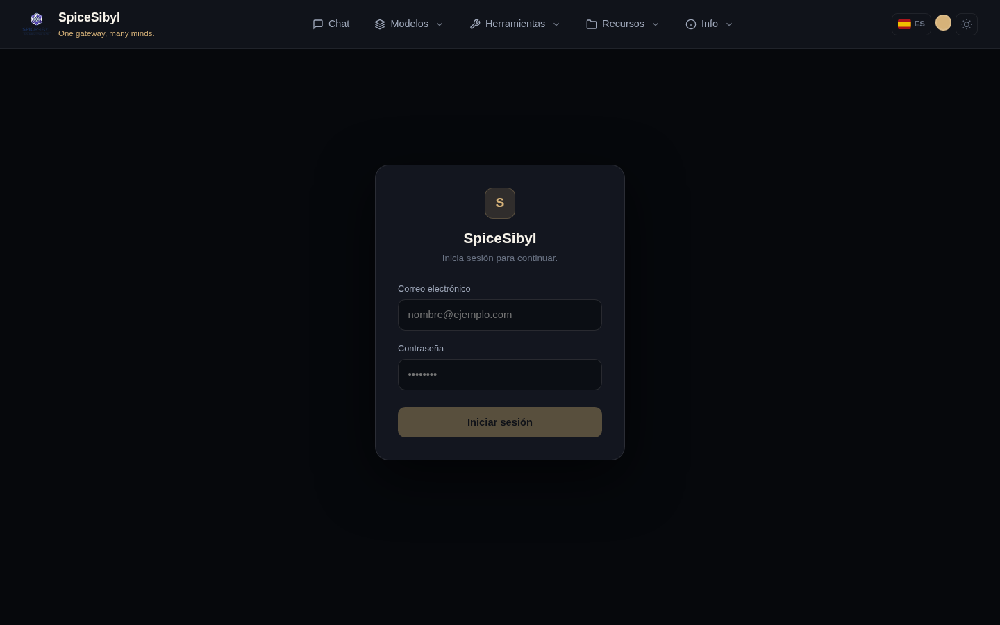
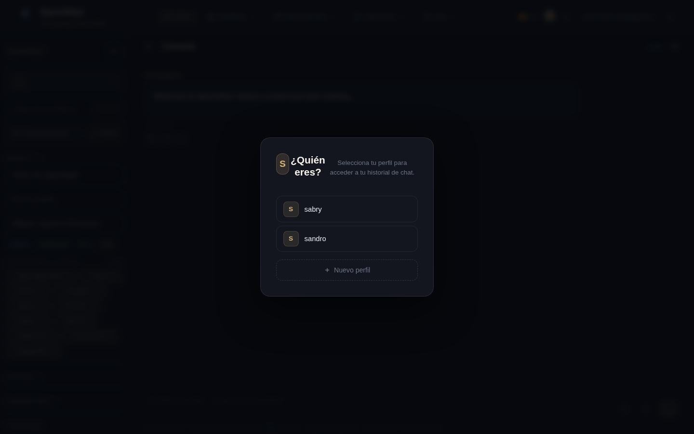

# Autenticación y perfiles

## Inicio de sesión y cuentas de usuario

**Qué hace.** Toda ruta `/api/v1` requiere autenticación, salvo la lista pública (`/auth/*`, `/health`, `GET /shared/{token}`). Las cuentas tienen correo + contraseña (hash bcrypt) y un rol: `admin`, `user` o `read-only`. Las sesiones usan tokens de acceso JWT (30 minutos) y refresh tokens rotativos (14 días) registrados en la tabla `refresh_tokens`, por lo que son revocables.

**Cómo se usa.**
1. Abre la consola web: si no estás autenticado se te redirige a `/login`.
2. Introduce correo y contraseña y pulsa **Iniciar sesión**.
3. El frontend renueva silenciosamente los tokens caducados (interceptor 401); cierra sesión desde el chip de usuario en la barra de navegación.

**Bootstrap del admin.** En el primer arranque el backend crea un administrador a partir de `ADMIN_EMAIL` / `ADMIN_PASSWORD` (en `backend/.env`) y «adopta» los perfiles huérfanos creados antes de introducir la autenticación.

## Perfiles

**Qué hace.** Cada usuario posee N perfiles (identidades locales con nombre, sin contraseñas). Historial de conversaciones, base de conocimiento, plantillas, etiquetas y estadísticas están delimitados por perfil. El UUID del perfil activo se guarda en `localStorage` (`spicesibyl_profile`).

**Cómo se usa.**
- En la primera visita (o cuando no hay perfil seleccionado) aparece el modal **«¿Quién eres?»**: elige un perfil existente o crea uno con **+ Nuevo perfil**.
- Puedes cambiar de perfil en cualquier momento desde el selector en la parte superior de la barra lateral del chat.

**Aislamiento de datos.** Cada endpoint ligado a un perfil valida la propiedad mediante la dependencia `resolve_profile`: un usuario no puede leer conversaciones ni documentos de perfiles ajenos.

## Vinculación Telegram ↔ web

**Qué hace.** Asocia un usuario de Telegram con un perfil web, de modo que conversaciones y estadísticas se comparten entre ambos canales.

**Cómo se usa.**
1. Envía `/link` al bot de Telegram: recibirás un código de 6 caracteres.
2. Pega el código en el campo **«Código /link de Telegram»** de la barra lateral web y pulsa **Vincular**.
3. `/unlink` en el bot desconecta la cuenta.

## Limitación de peticiones

Límite de ventana deslizante por usuario (`RATE_LIMIT_DEFAULT`, por defecto `60/minute`), indexado por el id del usuario autenticado (correcto incluso detrás del proxy nginx). Al superarlo, el servidor responde `429` con cabecera `Retry-After`. Nota: el almacén está en memoria (proceso único).

## Registro de auditoría

La tabla `audit_log` registra quién hizo qué y cuándo, con la IP del cliente: inicios de sesión, borrados de conversaciones/perfiles, actualizaciones de claves de proveedores, cambios de rol/desactivación de usuarios, operaciones de backup/restore, CRUD de herramientas personalizadas y servidores MCP.

**Cómo consultarlo.** Solo admin: `GET /api/v1/auth/audit`.
