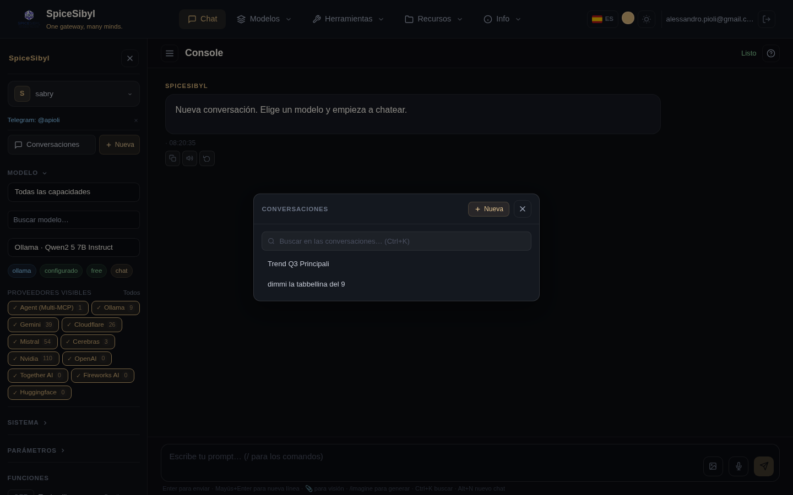

# Chat web

La página principal de la consola. A la izquierda una **barra lateral ligera** con solo los controles del chat actual (perfil, **Modelo**, **Sistema**, **Parámetros**) y los **interruptores ON/OFF** de las funciones; la conversación está en el centro con el compositor abajo. La lista de conversaciones se abre como un **panel** dedicado (botón *Conversaciones* o `Ctrl+K`).

## Conversaciones y streaming

**Qué hace.** Cada intercambio se guarda en SQLite (por perfil) con su telemetría completa: proveedor, latencia, tiempo hasta el primer token, tokens prompt/completion, velocidad (tok/s) — mostrados al pie de cada respuesta. Las respuestas llegan por streaming vía SSE.

**Cómo se usa.**
- **Nueva conversación**: botón **+ Nueva** en la barra lateral o en el panel de Conversaciones (o `Alt+N`).
- **Abrir/seleccionar una conversación**: botón **Conversaciones** en la barra lateral (o `Ctrl+K`) → abre el **panel** con búsqueda, filtro por etiqueta, selección y borrado; elegir una carga la conversación y cierra el panel.
- **Selección de modelo**: sección **Modelo** de la barra lateral — filtro por capacidad (chat, vision, tools, free…), búsqueda de texto, un filtro de **proveedores visibles** (véase abajo), luego elige del menú. Las insignias bajo el selector muestran proveedor, estado de configuración y capacidades.
- **Enviar**: escribe en el compositor y pulsa Enter; durante la generación, el botón de envío se convierte en **Detener** y aborta el stream.
- **Eliminar**: icono de papelera en la entrada de conversación, en el panel de Conversaciones.

**Filtro de proveedores visibles.** Bajo el selector de modelo, una fila de chips (uno por proveedor activado) permite elegir **qué proveedores** aparecen en el selector; la elección se persiste. Para elegir en cambio **qué modelos individuales** de un proveedor aparecen, usa la página [Proveedores](providers-and-models.md).

**Indicadores de carga.** Una barra animada bajo la barra superior muestra la fase actual: ámbar mientras se espera el modelo («Esperando el modelo…»), azul durante la ejecución de herramientas («Ejecutando herramientas…»), ritmo estándar durante el streaming («Generando…»).

## Acciones sobre los mensajes

Botones que aparecen al pasar el ratón en cada mensaje:

| Acción | Dónde | Efecto |
|--------|-------|--------|
| 📋 Copiar | todos | copia el texto al portapapeles |
| 🔊 TTS | respuestas | lee el mensaje en voz alta (Web Speech API, en el idioma activo); vuelve a pulsar para detener |
| 🔁 Regenerar | última respuesta | pide una nueva respuesta **creando una rama** (véase abajo) |
| ✏️ Editar | último mensaje del usuario | editar y reenviar |
| 📌 Fijar | todos | añade/quita el mensaje de la barra de fijados sobre el chat (clic para saltar al mensaje) |

## Ramas de respuesta

**Qué hace.** Regenerar no sobrescribe: ambas respuestas se conservan como ramas paralelas (persistidas en SQLite con `parent_id` + `branch_index`).

**Cómo se usa.** Las respuestas con alternativas muestran flechas `< 1/3 >` para navegar entre ramas; la conversación continúa desde la rama seleccionada.

## Prompt de sistema, plantillas y parámetros

- **Sistema** (barra lateral): instrucciones de sistema persistentes (localStorage), con acciones guardar/borrar.
- **Plantillas** (página dedicada `/templates`, **Recursos → Plantillas** en la barra de navegación): biblioteca de prompts de sistema reutilizables («Code review», «ELI5»…). Crea/edita/elimina; **Aplicar** establece la plantilla como prompt de sistema y te devuelve al chat.
- **Parámetros** (barra lateral): control deslizante de **temperatura** (0–2) y campo **max tokens**, enviados con cada petición. El opt-in de notificaciones de finalización también vive aquí (véase [Interfaz](interface.md)).

## Tool calling en el chat

Interruptor **Tool calling ON/OFF** en la barra lateral. Activado, el modelo puede invocar herramientas registradas (integradas, personalizadas, MCP); llamadas y resultados aparecen como burbujas dedicadas — con un spinner en las llamadas aún pendientes de resultado. Detalles en [Llamadas a herramientas](tool-calling.md).

## Imágenes y generación de imágenes

- **Visión (imagen → texto)**: adjunta imágenes con el botón 🖼 del compositor, por arrastrar y soltar sobre el área de chat (superposición visual, solo `image/*`, máx. 20 MB) o pegando desde el portapapeles. Las imágenes se envían codificadas en base64 a modelos con visión (Gemini, Llama-4-Scout en Groq, …).
- **Generación (texto → imagen)**: comando `/imagine <prompt>` en el compositor. Usa la cadena de respaldo `IMAGE_GENERATION_CHAIN` (formato `provider:model,...`; proveedores compatibles: Gemini/Imagen, HuggingFace FLUX.1-schnell, Cloudflare SDXL, Together FLUX.1-schnell-Free). Endpoint directo: `POST /api/v1/images/generations`.

## Entrada de voz

Botón 🎤 en el compositor (Web Speech API): el botón pulsa mientras escucha y el texto transcrito aterriza en el compositor.

## Interruptores ON/OFF de funciones en el chat

La sección **Funciones** de la barra lateral tiene tres interruptores, cada uno con un enlace **Gestionar →** a su página:

- **Tool calling ON/OFF** — activa el uso de herramientas para el turno de chat (gestión en `/tools`).
- **Knowledge (RAG) ON/OFF** — activado, los chunks más relevantes se inyectan en el mensaje y las fuentes aparecen como chips de cita bajo la respuesta (documentos en `/knowledge`). Detalles en [Base de conocimiento y RAG](knowledge-rag.md).
- **Memoria ON/OFF** — ON = se usan los recuerdos del perfil; OFF = chat de incógnito (recuerdos en `/memory`). Detalles en [Memoria y personalización](memory-and-personalization.md).

## Búsqueda en conversaciones

**Qué hace.** Búsqueda de texto completo (SQLite FTS5, índice sincronizado por triggers) en todas las conversaciones del perfil.

**Cómo se usa.** Abre el panel **Conversaciones** (botón de la barra lateral o `Ctrl+K`) y usa la barra «Buscar en las conversaciones…»; los resultados aparecen en línea con fragmentos resaltados; `Escape` limpia la búsqueda. Endpoint: `GET /api/v1/conversations/search?q=...`.

## Organización: etiquetas

Etiquetas de colores asignables a conversaciones mediante popover, con una **barra de filtro** en el panel de Conversaciones. La **gestión de etiquetas** (crear/editar/eliminar con elección de color) vive en la página dedicada `/tags` (**Recursos → Etiquetas** en la barra de navegación).

## Exportación y compartir

- **Exportación**: los botones **MD** y **JSON** de la barra superior descargan la conversación actual (`GET /conversations/{id}/export?format=md|json`).
- **Compartir**: el botón **Compartir** genera un enlace público de solo lectura (`POST /conversations/{id}/share` → token único; página `/shared/{token}` con renderizado markdown y resaltado de sintaxis, accesible sin iniciar sesión). El enlace se copia al portapapeles.

## Renderizado

Markdown vía `marked` con saneamiento DOMPurify; bloques de código con resaltado de sintaxis `highlight.js` según el lenguaje.
