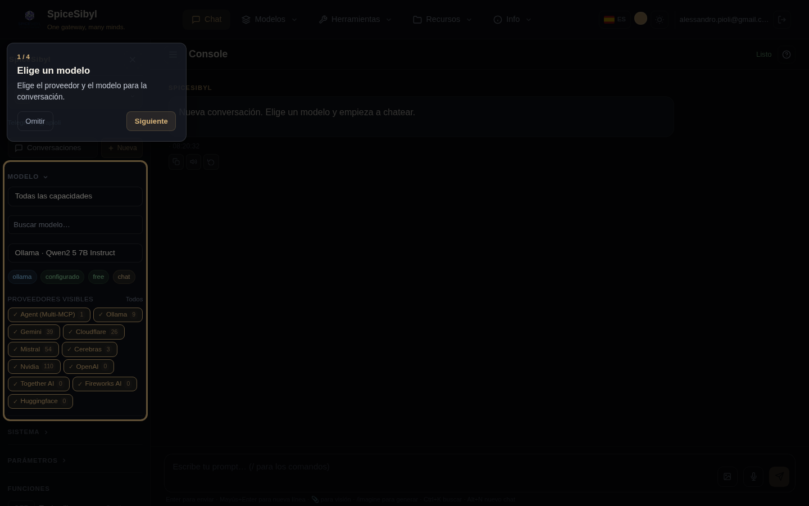

# Interfaz y UX

## Navegación (barra superior)

**Qué hace.** La barra de navegación superior usa **menús jerárquicos**: las entradas se agrupan en macro-entradas con submenús desplegables, para que la navegación siga ordenada incluso con muchas páginas.

**Estructura.**

| Macro-entrada | Submenú |
|---------------|---------|
| **Chat** | (enlace directo) |
| **Modelos** | Proveedores · Descubrimiento · Comparar · Estadísticas |
| **Herramientas** | Herramientas · Workflow · MCP *(admin)* · Espacio de trabajo |
| **Recursos** | Plantillas · Etiquetas · Conocimiento · Memoria |
| **Info** | Ayuda · Info · Ops *(admin)* |

**Cómo se usa.**
- **Haz clic** en una macro-entrada para abrir su submenú; un clic fuera lo cierra. La macro-entrada queda resaltada mientras una de sus páginas está activa.
- Las entradas **solo admin** (MCP, Ops) aparecen únicamente con el rol adecuado; un grupo sin entradas visibles se oculta.
- En pantallas estrechas (< 576 px) la barra se pliega en un menú hamburguesa y los submenús se vuelven **acordeones** en línea.

A la derecha están el **selector de idioma 🌐**, el **selector de color de acento**, el **conmutador de tema** y el **chip de usuario** con cierre de sesión.

## Tema oscuro/claro y color de acento

**Qué hace.** Un sistema de temas basado en propiedades CSS personalizadas (`--bg-primary`, `--text-primary`, `--accent`, …) con modos oscuro / claro / sistema y un color de acento personalizable.

**Cómo se usa.**
- **Conmutador de tema**: icono sol/luna en la barra; la preferencia se guarda en localStorage (`spicesibyl_theme`) y se aplica mediante el atributo `[data-theme]` en `<html>`.
- **Color de acento**: selector en la barra con 8 muestras predefinidas + un campo de color libre; actualiza dinámicamente todas las variables `--accent-*` y funciona en ambos temas (`spicesibyl_accent`).

## Onboarding guiado

**Qué hace.** En el primer acceso arranca un recorrido guiado, con un foco sobre los elementos clave (selección de modelo, herramientas, prompt de sistema, comandos slash); en pantallas estrechas la tarjeta se centra.

**Cómo se usa.** Sigue los pasos con **Siguiente** o sal con **Omitir**; la finalización se recuerda en localStorage (`spicesibyl_onboarded`). El botón de repetición en la barra del chat lo reinicia en cualquier momento.

## Atajos de teclado

| Atajo | Acción |
|-------|--------|
| `Ctrl+K` | abre el **panel de Conversaciones** y enfoca la búsqueda |
| `Alt+N` | nuevo chat |
| `Ctrl+Shift+S` | muestra/oculta la barra lateral |

Los atajos no se disparan mientras escribes en un campo (excepto `Ctrl+K`).

## Diseño móvil

- Media queries responsivas: barra lateral como superposición fija con fondo, chat y compositor adaptados a pantallas pequeñas.
- **Deslizamiento desde el borde** para abrir/cerrar la barra lateral.
- Objetivos táctiles ≥ 44 px; botones de exportación solo con icono; por debajo de 575 px la barra se pliega en hamburguesa.

## PWA (Progressive Web App)

**Qué hace.** La aplicación es instalable (manifest con iconos 192/512/maskable + apple-touch-icon) con el service worker de Angular activo solo en producción: el shell funciona sin conexión.

**Notificaciones de finalización.** Opt-in en el panel **Parámetros**: si una generación tarda más de 10 segundos y la pestaña está en segundo plano, se dispara una notificación local del sistema al terminar (sin servidor push/VAPID).

**Cómo instalar.** Desde Chrome/Edge: icono «instalar» en la barra de direcciones; en móvil: «Añadir a pantalla de inicio».

## Indicadores de carga

Una barra de progreso animada bajo la barra superior durante cada petición, con color/velocidad según la fase: esperando el modelo (ámbar), ejecución de herramientas (azul, más rápida), streaming (estándar). Las burbujas de llamada a herramienta pendientes de resultado muestran un spinner en lugar del icono ⚙.

## Gestión de errores

Sistema global de toasts (ErrorInterceptor + NotificationService): los errores HTTP y los frames SSE `event: error` del backend se convierten en toast + mensaje en burbuja; los límites de peticiones de los proveedores se mapean a HTTP 429.
