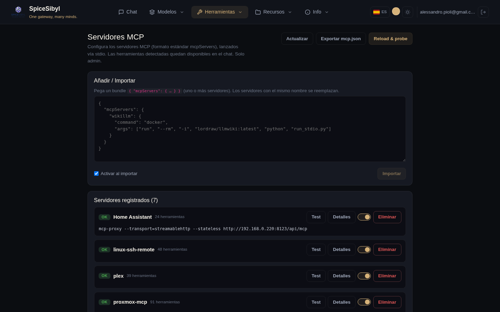
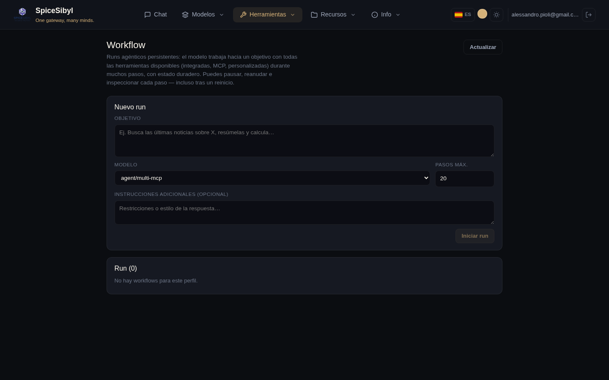

# MCP y agentes

## Gestión de servidores MCP

**Qué hace.** Registra servidores [MCP](https://modelcontextprotocol.io) (Model Context Protocol) en el formato estándar `mcpServers` (`command`/`args`/`env`/`cwd`), los lanza vía stdio con un cliente JSON-RPC mínimo integrado (sin dependencia de SDK), sondea su salud e inyecta las herramientas descubiertas en el bucle de chat bajo el espacio de nombres `mcp__<servidor>__<herramienta>`. Gestión **solo para admins**, configuración global (tabla `mcp_servers`).



**Cómo se usa.**
1. Página **MCP** → recuadro **Añadir / Importar**: pega un bundle JSON `{ "mcpServers": { … } }` (uno o más servidores; los de mismo nombre se reemplazan) y pulsa **Importar**. La casilla «Activar al importar» los habilita de inmediato.
2. En la lista **Servidores registrados** cada servidor muestra su estado (OK/ERROR con mensaje), el número de herramientas descubiertas y los botones **Test**, **Detalles** (lista de herramientas), el interruptor de activación y **Eliminar**.
3. **Reload & probe** vuelve a ejecutar la discovery en todos los servidores activados; **Exportar mcp.json** descarga la configuración en el formato estándar.

**API.** `GET/POST /v1/mcp/servers`, `PATCH`/`DELETE /v1/mcp/servers/{id}`, `POST /v1/mcp/servers/{id}/test`, `POST /v1/mcp/reload`, `GET /v1/mcp/config`, `POST /v1/mcp/import` (todos auditados).

**Ejemplo de bundle:**

```json
{
  "mcpServers": {
    "wikillm": {
      "command": "docker",
      "args": ["run", "--rm", "-i", "lordraw/llmwiki:latest", "python", "run_stdio.py"]
    }
  }
}
```

## Orquestador Multi-MCP (modo agente)

**Qué hace.** Los modelos con prefijo `agent/*` son enrutados por el `OrchestratorProvider` hacia un sidecar externo que coordina varios agentes MCP especializados (`ask_proxmox`, `ask_synology`, `ask_linux`, `ask_homeassistant`, `ask_watchyourlan`). Útil para preguntas de infraestructura doméstica/lab que requieren consultar varios sistemas.

**Cómo se usa.** En el chat, selecciona el modelo `Agent · Multi-MCP Orchestrator`; en Telegram los comandos `/agent` y `/chat` alternan entre modo agente y chat normal.

## Workflows persistentes

**Qué hace.** Runs de agente duraderos e inspeccionables: un bucle en segundo plano del servidor trabaja hacia un objetivo con el registro **completo** de herramientas (integradas, personalizadas, MCP) durante muchas iteraciones (`WORKFLOW_DEFAULT_MAX_STEPS`, limitado por `WORKFLOW_MAX_STEPS_LIMIT`), mucho más allá de las 5 del bucle de chat. Cada turno del asistente / llamada a herramienta / resultado se persiste como paso (`agent_runs` + `agent_run_steps`) y el historial de mensajes se guarda tras cada iteración: los runs se pausan y reanudan sin pérdidas — **incluso tras reinicios** (los runs que quedaron en `running` se reconcilian a `paused`).



**Cómo se usa.**
1. Página **Workflow** → formulario **Nuevo run**: objetivo, modelo, pasos máx., instrucciones adicionales opcionales → **Iniciar run**.
2. En la lista de runs: insignias de estado, botones de pausa/reanudar/cancelar y borrado.
3. La vista de detalle muestra la **cronología de pasos** con auto-refresco: cada paso de razonamiento y cada llamada a herramienta puede inspeccionarse.

**API.** `POST/GET /v1/workflows`, detalle, `pause`/`resume`/`cancel`/`delete` (auditados).
