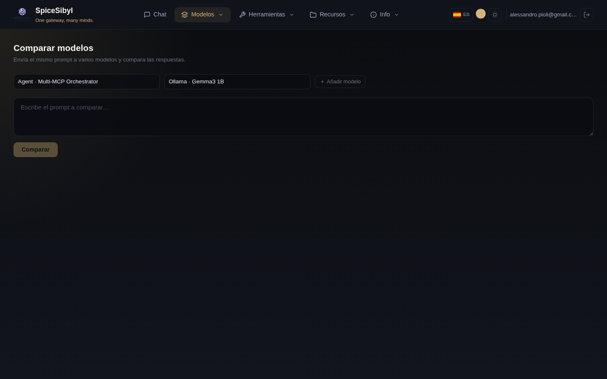

# Comparación de modelos

**Qué hace.** Envía el mismo prompt a 2–4 modelos simultáneamente y transmite las respuestas en columnas lado a lado, cada una con su propia telemetría (latencia, tokens, coste). Útil para elegir el modelo adecuado para un caso de uso o comparar calidad/velocidad/coste.

**Cómo se usa.**
1. Ve a la página **Comparar**.
2. Selecciona los modelos en los desplegables (hasta 4 con **+ Añadir modelo**).
3. Escribe el prompt en el área de texto y pulsa **Comparar**.
4. Las respuestas llegan en paralelo, cada una en su columna; la latencia, el recuento de tokens y el coste estimado aparecen al pie de cada una.

**Notas.**
- Las solicitudes se ejecutan realmente en paralelo: los tiempos mostrados son comparables entre sí.
- Cada columna recibe exactamente el mismo prompt, sin el prompt de sistema del chat: es una comparación «en frío».
