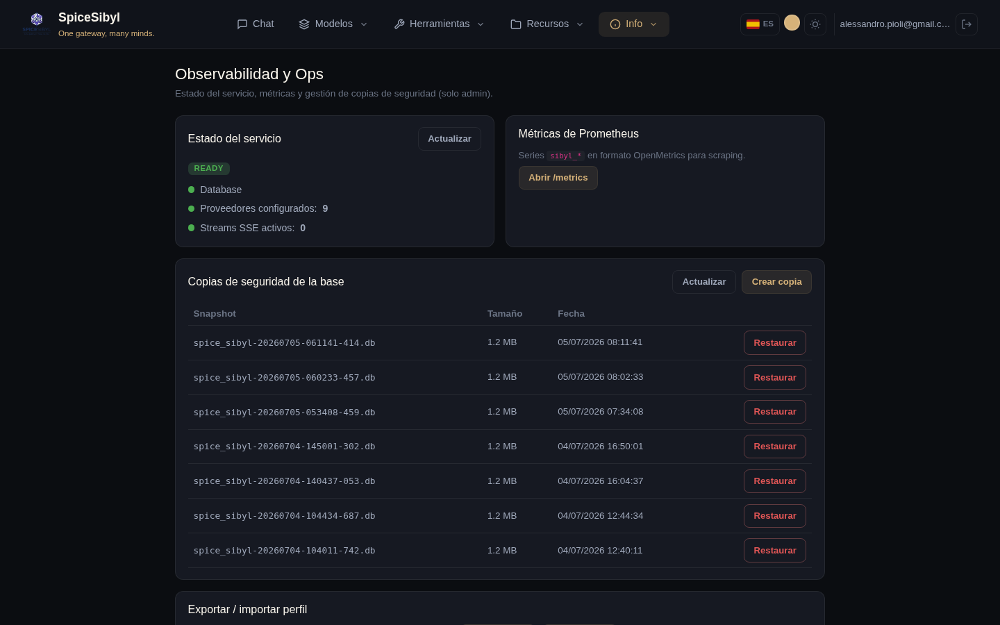

# Observabilidad y operaciones

## Página Ops (solo admin)

**Qué hace.** Un panel operativo restringido a admins (entrada de la barra de navegación protegida por `adminGuard`): readiness en vivo (BD, proveedores configurados, streams SSE activos extraídos de `/metrics`), enlace a las métricas en bruto, gestión de copias de seguridad y export/import por perfil.



## Health y readiness

| Endpoint | Uso |
|----------|-----|
| `GET /api/v1/health` | liveness — contrato estable usado por el HEALTHCHECK del Dockerfile |
| `GET /api/v1/ready` | readiness — verifica la conectividad de la BD y al menos un proveedor configurado; `503` si está degradado |

El fichero compose define healthchecks explícitos del backend; nginx y certbot arrancan con `depends_on: condition: service_healthy`.

## Métricas de Prometheus

`GET /api/v1/metrics` (formato OpenMetrics) expone:

- `sibyl_http_requests_total` / `sibyl_http_request_duration_seconds`
- `sibyl_provider_requests_total`, `sibyl_provider_tokens_total{kind}`, `sibyl_provider_latency_seconds`
- `sibyl_active_sse_streams`

Protección opcional con token bearer: `METRICS_TOKEN`. Hay un panel de Grafana listo para usar en [`docs/grafana-dashboard.json`](../grafana-dashboard.json).

## Logging estructurado y correlación de peticiones

Con `LOG_FORMAT=json` los logs se emiten en JSON y llevan un `request_id` (ContextVar) generado por el `RequestContextMiddleware` — reutiliza una `X-Request-ID` entrante y la devuelve en la respuesta. El id se propaga al sidecar Multi-MCP vía cabecera y se enlaza a los flujos de Telegram: trazado de extremo a extremo de cada petición.

## Copia y restauración de la base de datos

**Qué hace.** Una tarea en segundo plano opt-in que instantánea SQLite mediante la API de backup online (sin bloqueo de la app) en un volumen montado, con intervalo y retención configurables.

```env
BACKUP_ENABLED=true
BACKUP_DIR=/data/backups
# + intervalo y retención
```

**Cómo se usa.**
- **Desde la página Ops**: sección «Copias de seguridad de la base» — lista de instantáneas con tamaño y fecha, **Crear copia** inmediata, **Restaurar** sobre una instantánea.
- **Desde la API** (admin, auditado): `POST /v1/admin/backup`, `GET /v1/admin/backups`, `POST /v1/admin/restore`.

## Export / import por perfil

Un único zip con conversaciones, mensajes, base de conocimiento, plantillas y etiquetas de un perfil: `GET /v1/admin/export` / `POST /v1/admin/import`, también disponibles desde la página Ops. Útil para migrar un perfil entre instancias o como copia selectiva.

## Despliegue en producción

En resumen (detalles en [deploy.md](../deploy.md)):

- `docker-compose.prod.yml` con **nginx** sirviendo el build estático de Angular en `/` y haciendo proxy de `/api` al backend;
- `PUBLIC_URL` añadido automáticamente al CORS;
- TLS autodetectado a partir de los certificados en `nginx/ssl/` con un sidecar Certbot opcional, y repliegue a HTTP si faltan;
- Dockerfile multi-etapa (`node:20-alpine` → build → `nginx:1.27-alpine`);
- recuerda establecer `VAULT_SECRET_KEY` (se registra un aviso de seguridad al arrancar si queda en el valor por defecto).
