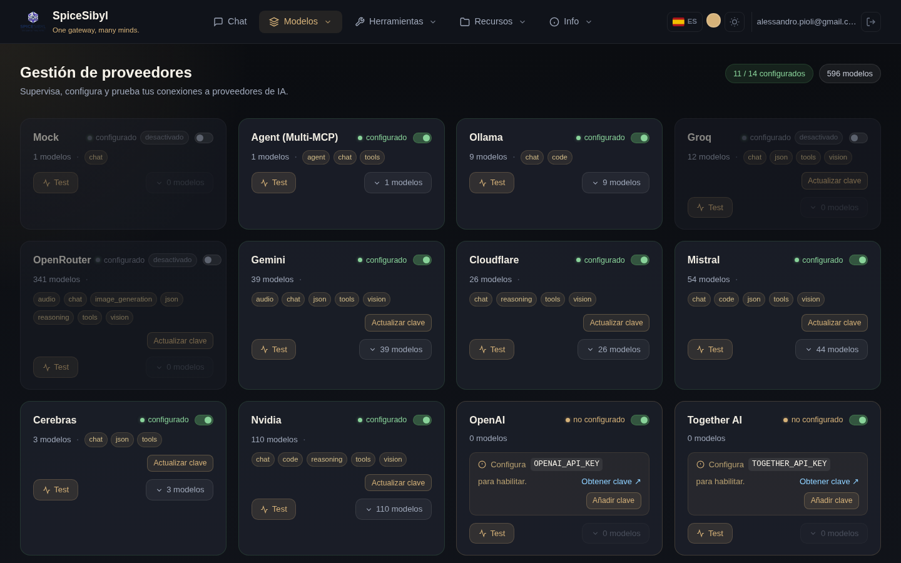
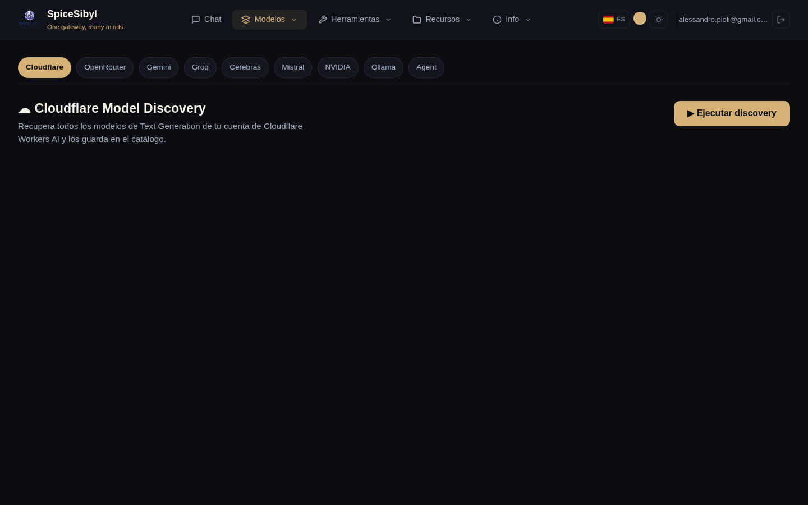

# Proveedores y modelos

## Página de Proveedores

**Qué hace.** Un panel de todos los proveedores compatibles: estado de configuración, número de modelos catalogados, capacidades agregadas (chat, vision, tools, json…), interruptor on/off, prueba de conectividad y gestión de claves API.



**Cómo se usa.**
- **Añadir clave / Actualizar clave**: guarda o actualiza la clave API del proveedor. La clave va al **almacén cifrado** (véase abajo), no a un fichero de configuración.
- **Test**: `POST /providers/{id}/test` lanza una petición real mínima de completion contra el proveedor cloud (no una simple comprobación de clave) y reporta resultado/latencia.
- **Interruptor**: activa/desactiva el proveedor **globalmente**, sin eliminar la clave.
- **N modelos**: despliega el catálogo de modelos del proveedor, con los controles de visibilidad (véase abajo).

El recuadro de arriba a la derecha resume cuántos proveedores están configurados y el total de modelos disponibles.

## Visibilidad de modelos en el selector

**Qué hace.** Algunos proveedores exponen decenas o cientos de modelos, haciendo interminable el menú de modelos del chat. Desde aquí puedes **elegir qué modelos** aparecen en el selector, por proveedor.

**Cómo se usa.** Despliega un proveedor (**N modelos**): cada modelo tiene un icono de **ojo**:
- 👁 **visible** → aparece en el menú del chat; haz clic para ocultarlo.
- 👁‍🗨 **tachado** → oculto (fila atenuada); haz clic para volver a mostrarlo.

Arriba de la lista: un contador **«N visibles · M ocultos»** y los botones **Mostrar todos / Ocultar todos** para actuar sobre todo el proveedor de una vez. Cuando un proveedor tiene modelos ocultos, la tarjeta muestra una insignia **«N ocultos»** siempre visible (incluso con la lista plegada). La elección se **persiste** (preferencia `hiddenModels`) y los modelos ocultos se excluyen del menú del chat en tiempo real.

> **Dos filtros distintos.** Este es un filtro **por modelo**. En la barra lateral del chat, bajo **Modelo**, está en cambio el filtro de **proveedores visibles** que actúa sobre un proveedor entero. Ambos se combinan: primero excluye proveedores enteros, luego refina modelo a modelo. Ambos son personales y no tocan la activación global del proveedor.

## Almacén de claves API

**Qué hace.** Las claves se cifran con Fernet (AES-128-CBC + HMAC-SHA256) y se guardan en SQLite, con caché en memoria. Todos los proveedores hacen fallback almacén → variable de entorno: si la clave no está en el almacén, se usa la de `.env`.

**Configuración.** Establece un `VAULT_SECRET_KEY` robusto en producción: se registra un aviso de seguridad al arrancar si sigue siendo el marcador por defecto. API: `PUT /providers/{id}/key`, `DELETE /providers/{id}/key`.

## Descubrimiento de modelos

**Qué hace.** Recupera en vivo el catálogo de modelos desde la API de cada proveedor (Cloudflare, OpenRouter, Gemini, Groq, Cerebras, Mistral, NVIDIA, Ollama, Agent) y lo guarda en el catálogo interno — así la lista de modelos seleccionable en el chat se mantiene al día sin ediciones manuales.



**Cómo se usa.** Página **Descubrimiento** → elige el proveedor en la barra de pestañas → **Ejecutar discovery**. Los modelos descubiertos se listan y se guardan en el catálogo.

## Enrutado por prefijo

La pasarela enruta cada petición según el prefijo del nombre del modelo:

| Prefijo | Proveedor |
|---------|-----------|
| `ollama/…`, `groq/…`, `mistral/…`, `together_ai/…`, `fireworks_ai/…`, `huggingface/…` | LiteLLM |
| `gemini/…` | adaptador dedicado de Google Generative AI |
| `openrouter/…` | OpenRouter |
| `cloudflare/…` | Cloudflare Workers AI |
| `cerebras/…` | Cerebras (HTTP directo) |
| `agent/…` | orquestador Multi-MCP (véase [MCP y agentes](mcp-and-agents.md)) |

## Fallback automático de proveedor

**Qué hace.** Si un proveedor falla o agota el tiempo **antes** de emitir el primer token, la pasarela reintenta de forma transparente con el siguiente proveedor de la `CHAT_FALLBACK_CHAIN` (formato `provider:model,provider:model,...`). El cambio se señala con un frame SSE `provider_switch`, mostrado como aviso en la interfaz. Una vez que los tokens han empezado a fluir, el error se propaga (sin salida duplicada).

**Configuración.** En `backend/.env`:

```env
CHAT_FALLBACK_CHAIN=groq:llama-3.3-70b-versatile,ollama:qwen2.5:7b-instruct
```

Existen cadenas análogas para imágenes (`IMAGE_GENERATION_CHAIN`) y embeddings (`EMBEDDING_CHAIN`).
