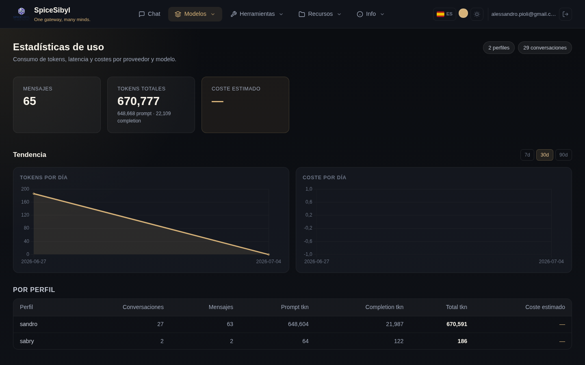

# Estadísticas de uso

**Qué hace.** Cada mensaje almacenado lleva su telemetría (tokens de prompt/completion, latencia, estimación de coste reportada por el proveedor). La página **Estadísticas** agrega estos datos por perfil o globalmente.

## Contenido de la página

- **Tarjetas de resumen**: mensajes totales, tokens totales (con desglose prompt/completion), coste estimado.
- **Tendencia** — gráficos diarios: área de tokens y barras de coste, con rango conmutable **7d / 30d / 90d** (`GET /v1/stats/daily`, agregación por fecha en SQLite).
- **Por perfil**: tabla de conversaciones/mensajes/tokens/coste para cada perfil.
- **Por proveedor y por modelo**: tablas que desglosan el uso por proveedor y por modelo individual — útiles para ver adónde van los tokens y qué cuesta dinero realmente.

## Cómo se usa

Navega a **Estadísticas** desde la barra de navegación. Los datos cubren al usuario autenticado (todos sus perfiles); los contadores de arriba a la derecha muestran cuántos perfiles y conversaciones se incluyen.

**API.** `GET /v1/stats` (por perfil o global), `GET /v1/stats/daily` para las series diarias.

**Nota sobre los costes.** El coste es una estimación reportada por los proveedores: para modelos locales (Ollama) o niveles gratuitos permanece en cero/—.
