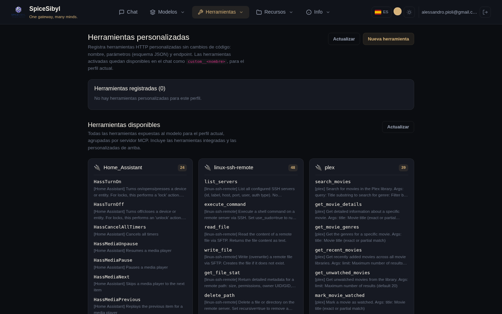

# Llamadas a herramientas (tool calling)

## Bucle de ejecución en el servidor

**Qué hace.** Con el interruptor **Tool calling ON** de la barra lateral, el backend expone las herramientas registradas al modelo y ejecuta las llamadas solicitadas en el servidor, devolviendo los resultados al modelo en un bucle (máx. 5 iteraciones en el chat, configurable con `CHAT_MAX_TOOL_ITERATIONS`; para bucles más largos véanse los [workflows](mcp-and-agents.md#workflows-persistentes)). Llamadas y resultados se transmiten como eventos SSE `tool_call` / `tool_result` y se muestran como burbujas dedicadas en la conversación; las llamadas pendientes muestran un spinner.

**Lista de herramientas disponibles:** `GET /api/v1/tools` (unión de integradas + herramientas personalizadas del perfil + MCP). El interruptor **Tool calling ON/OFF** vive en la sección **Funciones** de la barra lateral; la gestión y visión general están en la página **Herramientas** (enlace *Gestionar →*).

## Herramientas integradas

| Herramienta | Qué hace |
|-------------|----------|
| `get_datetime` | fecha/hora actuales |
| `calculator` | evalúa expresiones matemáticas |
| `web_search` | búsqueda web vía DuckDuckGo (scraping HTML para fragmentos ricos, con repliegue a la API instant-answer) |
| `read_url` | recupera una página web y devuelve su texto (HTML eliminado, máx. 4 000 caracteres) |
| `python_exec` | intérprete de código en sandbox (véase abajo) |
| `kb_search` | RAG agéntico: consulta la base de conocimiento del perfil a demanda del modelo |
| `search_conversations` | memoria episódica: búsqueda de texto completo (FTS5) en conversaciones pasadas |
| `generate_image` | genera una imagen mediante la cadena de proveedores configurada; la imagen se muestra al usuario |
| `get_weather` | tiempo actual + previsión vía Open-Meteo (gratis, sin clave API) |
| `fetch_rss` | las últimas N entradas de un feed RSS 2.0 / Atom |
| `create_reminder` | crea un recordatorio de Telegram para la cuenta vinculada («recuérdame mañana a las 9…») |
| `extract_document` | descarga un PDF/DOCX/TXT/MD desde una URL y devuelve su texto, sin ingesta en la KB |
| `http_request` | llamada HTTP genérica GET/POST a APIs públicas (lista de permitidos opcional `HTTP_REQUEST_ALLOWED_DOMAINS`) |

**Refuerzo anti-SSRF.** `read_url`, `fetch_rss`, `extract_document` y `http_request` rechazan URLs cuyo host resuelve a direcciones privadas/loopback/link-local. `kb_search`, `search_conversations` y `create_reminder` operan automáticamente sobre el perfil del llamante.

## Herramientas personalizadas (HTTP)

**Qué hace.** Registra herramientas basadas en HTTP desde la interfaz, sin tocar el código: nombre, descripción, parámetros (JSON Schema), URL/método/cabeceras, autenticación (ninguna / bearer / cabecera personalizada), timeout. Se guardan por perfil en la tabla `custom_tools` y se inyectan en el bucle de chat bajo el espacio de nombres `custom__<nombre>`.

**Cómo se usa.**
1. Página **Herramientas** → **Nueva herramienta**.
2. Rellena el formulario (nombre, descripción, esquema JSON de parámetros, endpoint, auth, timeout) y guarda.
3. Usa el **panel de prueba integrado** para una llamada de ensayo antes de activarla.
4. El interruptor de activación habilita/deshabilita la herramienta sin borrarla.

**Semántica de la llamada.** Los argumentos producidos por el modelo se envían como body JSON (POST/PUT/PATCH) o query string (GET); el cuerpo de la respuesta es el resultado de la herramienta. API: CRUD + test bajo `/api/v1/tools/custom` (operaciones auditadas).

## Herramientas disponibles agrupadas por servidor MCP

**Qué hace.** Bajo la gestión de herramientas personalizadas, la página **Herramientas** lista **todas las herramientas expuestas al modelo** para el perfil actual, **agrupadas en una tarjeta por servidor MCP** (más una tarjeta *Built-in* y otra *Custom*).

**Cómo se usa.** Cada tarjeta muestra el **nombre del servidor MCP** como título, una insignia con el número de herramientas y debajo la **lista de herramientas** (nombre sin el prefijo `mcp__<servidor>__`, más su descripción). Práctico para ver de un vistazo qué aporta cada servidor MCP conectado. El botón **Actualizar** recarga la lista.

## Intérprete de código en sandbox (`python_exec`)

**Qué hace.** Ejecuta código Python en un subproceso aislado `python -I` con:

- rlimits de CPU, memoria (`CODE_INTERPRETER_MEMORY_MB`), tamaño de archivo, número de fd/procesos;
- timeout de reloj de pared (`CODE_INTERPRETER_TIMEOUT`, mata todo el grupo de procesos);
- un entorno mínimo y **sin red** (stub de sockets a nivel Python);
- un directorio de trabajo efímero con archivos de entrada/salida: los `files` de entrada se materializan antes de la ejecución, los archivos creados se reportan en el resultado (archivos de texto pequeños en línea) y todo se borra después.

**Configuración.** Activado por defecto; se desactiva con `CODE_INTERPRETER_ENABLED=false`.

**Cómo se usa.** Con el tool calling activado, pide al modelo algo que requiera cálculo/código («ejecuta este script», «analiza estos números»); el modelo invoca `python_exec` por sí solo.
