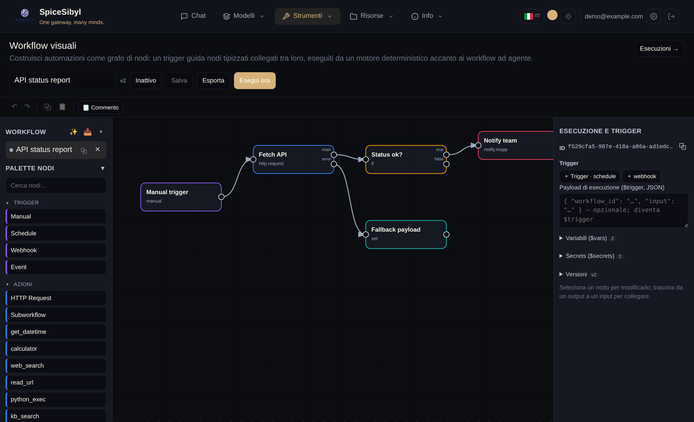
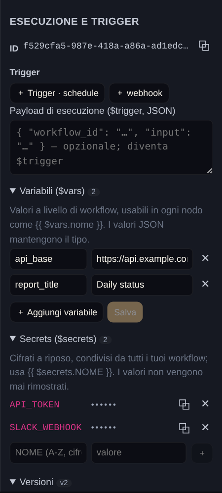
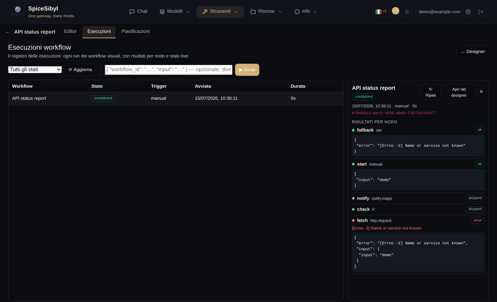

# Workflows visuales de grafo de nodos (Fase 29)

SpiceSibyl tiene dos motores de automatización complementarios:

- **Workflows de agente** (`/workflows`, Fase 18) — das un *objetivo* y un LLM itera de forma
  autónoma sobre todo el registro de herramientas hasta producir una respuesta. Potente, pero
  no determinista y sin flujo de control explícito.
- **Workflows visuales** (`/graph-workflows`, Fase 29) — dibujas un *grafo*: un **disparador**
  alimenta **nodos tipados** conectados entre sí. El motor ejecuta el grafo de forma
  **determinista**, con la forma exacta que diseñaste. El bucle de agente sigue disponible aquí
  como nodo `llm.agent`, para inyectar autonomía donde quieras dentro de una pipeline determinista.




<p align="center">
  
</p>



## El lienzo

El editor tiene tres paneles:

- **Izquierda** — tus workflows y una **paleta de nodos** por categorías (Disparadores ·
  Acciones · Lógica · Datos · IA). Cada herramienta integrada, MCP y personalizada aparece
  automáticamente como nodo `tool.<nombre>` — sin código adicional por herramienta.
- Una pequeña barra de herramientas sobre el lienzo ofrece **Deshacer/Rehacer** (`Ctrl+Z` /
  `Ctrl+Mayús+Z`, también `Ctrl+Y`), **Copiar/Pegar** un nodo (`Ctrl+C` / `Ctrl+V` — pega un
  duplicado desplazado con el mismo tipo y parámetros) y **Comentario**: un nodo tipo
  nota adhesiva solo del lado del cliente, sin entradas/salidas y nunca conectado al
  flujo — el motor simplemente lo registra como `skipped`, sin cambios en el backend. Los
  atajos se ignoran mientras se escribe en un campo. Un **cuadro de búsqueda** sobre la
  paleta filtra los nodos por etiqueta o tipo (expandiendo automáticamente los grupos
  MCP/personalizados coincidentes durante la búsqueda).
- **Centro** — un **lienzo SVG** sin dependencias. Arrastra los nodos para colocarlos; arrastra
  desde una **salida** (derecha) a una **entrada** (izquierda) para conectar. **Haz clic en una
  arista** para inspeccionarla: el panel derecho muestra origen → destino, los **datos que
  pasaron por ella en la última ejecución** y una lista de **campos disponibles con su ruta de
  expresión ya lista** (p. ej. `$node.weather.output.result`) — clic en un campo para copiarlo
  como expresión `{{ … }}`. Un botón elimina la conexión. Cuando un nodo falla, su **mensaje de
  error** aparece en rojo bajo el nodo en el panel en vivo (y en el detalle de la vista de
  Ejecuciones).
- **Derecha** — el **inspector** del nodo seleccionado (sus parámetros, generados desde el
  esquema del tipo de nodo) o, cuando no hay nada seleccionado, el **panel de ejecución y disparadores**.

Guarda con **Guardar**, activa **Activo** para que los disparadores actúen y **Ejecutar ahora**
para lanzar el grafo — los nodos se colorean en verde/azul/rojo/gris (ok/ejecutando/error/omitido)
en tiempo real mientras el motor transmite el estado por SSE. El panel de ejecución tiene un
campo opcional de **payload** (JSON): su objeto se convierte en el `$trigger` de la ejecución,
así los grafos que leen `={{ $trigger.<campo> }}` se pueden probar a mano sin llamar al webhook.

### La vista por workflow — `/graph-workflows/{id}`

Cada workflow tiene además su propia página (ábrela con ⧉ en la lista o desde una fila
de ejecución/programación): una barra de pestañas **Editor | Ejecuciones |
Programaciones** limitada a ese workflow. La pestaña Ejecuciones es el registro
prefiltrado; la pestaña Programaciones lista y crea disparadores solo para él. Las
páginas globales siguen siendo las vistas transversales.

El editor está componentizado (roadmap fase 1): lienzo SVG, paleta, barra de
herramientas, inspectores de nodo/arista y run panel son componentes Angular standalone
en `features/workflows/editor/` — véase `docs/frontend-overview.md`.

### DX del editor — probar, fijar, navegar (fase 3)

Construir y depurar un grafo no requiere ejecuciones completas:

- **Probar nodo** (⚡ en el inspector) ejecuta **solo el nodo seleccionado**, con sus
  parámetros actuales — incluso sin guardar — y muestra output, handle activo y duración
  inline (`POST /{id}/nodes/{node_id}/test`; no se registra nada en el registro de
  ejecuciones). El input llega del output fijado/más reciente del nodo anterior, o del
  JSON de **input simulado** opcional del inspector.
- **Outputs fijados** (📌): congela el output de un nodo — un clic sobre su último
  output, o JSON editado a mano. Las pruebas de nodos, las **ejecuciones parciales**
  (*Ejecutar desde este nodo*) y las vistas previas de expresiones resuelven
  `$node.<id>.output` desde el pin en lugar del historial: ideal para desarrollar aguas
  abajo de un payload webhook real sin volver a dispararlo. Los pins se guardan con el
  workflow (y viajan con el export), muestran una insignia 📌 en el lienzo y las
  **ejecuciones de producción los ignoran por completo** (manual/schedule/webhook/event).
- **Última ejecución** en el inspector muestra el estado, output y error más recientes
  del nodo seleccionado (ejecución en vivo, prueba o historial) sin salir del lienzo.
- **Multiselección**: shift+clic añade/quita nodos; arrastrar mueve toda la selección;
  `Ctrl+A` selecciona todo; `Ctrl+C/V` copia y pega la selección **incluidas sus aristas
  internas** (ids reasignados); `Supr`/`Backspace` la elimina.
- **Pan y zoom**: arrastra el lienzo vacío para desplazarte, rueda del ratón para hacer
  zoom alrededor del cursor. Un **minimapa** (abajo a la derecha) muestra el grafo entero
  más el viewport — clic/arrastre para navegar, doble clic para ajustar. La barra añade
  **Ordenar** (auto-layout por capas, deshacible) y **⛶ ajustar vista**.
- La **galería de plantillas** (✨) se abre como un **modal grande centrado** sobre el
  editor: rejilla multicolumna de tarjetas, cada una con una vista previa mayor del
  grafo, la categoría, la cadena del flujo (nombres de nodos unidos por →), el recuento
  de nodos/conexiones y la descripción completa — filtrable por categoría antes de
  importar. La **lista de workflows es plegable** (▾/▸ en su cabecera, recordado entre
  sesiones), dejando el espacio de la barra lateral a la paleta de nodos.

## Tipos de nodo

| Categoría | Nodos |
|-----------|-------|
| **Disparador** | `manual`, `schedule`, `webhook`, `event` |
| **Acción** | `tool.<nombre>` — cualquier herramienta del registro (RSS, read_url, clima, kb_search, http_request, python_exec, MCP, personalizada…) · `http.request` (llamada HTTP genérica) · `subworkflow` (ejecuta otro workflow en línea) · `human.approval` (suspende hasta que un humano aprueba/rechaza — fase 4.4) |
| **Lógica** | `if` (rama verdadero/falso), `switch` (ramas por caso), `merge` (reúne las entradas), `wait` (espera N segundos o hasta un instante concreto) |
| **Datos** | `set` (construye un objeto), `filter` (conserva los elementos que cumplen la condición), `code` (sandbox Python), `aggregate` (reduce un array — sum/avg/min/max/count/concat sobre un campo), `batch` (divide un array en bloques de tamaño fijo), `db.query` (SQL parametrizado — sqlite/postgres), `file.read` / `file.write` (almacenamiento del workspace), `file.parse` (parsea JSON/CSV/líneas al vuelo) |
| **IA** | `llm.completion` (una llamada al proveedor), `llm.agent` (todo el bucle de agente de la Fase 18), `llm.classify` / `llm.extract` (salida estructurada garantizada — fase 4.1) |

> **Cadenas de failover** — `llm.completion` y `llm.agent` exponen un menú **Failover
> chain**, alimentado por las listas de modelos nombradas definidas en Ajustes → Modelos →
> Cadenas de failover de LLM. Si se establece, un fallo de llamada en el `model` del nodo
> reintenta en orden los modelos restantes de la cadena; la salida del nodo incluye entonces
> `_failover: { tried: [...], used: "<model>" }`.

### Llamadas HTTP, composición y manejo de errores

- **`http.request`** — llama a cualquier API HTTP externa (`method`, `url`,
  `query`/`headers`, `body`, `timeout` ≤ 120 s). Salida: `{ status, ok, headers, json, text }`.
  Por defecto una respuesta no-2xx lanza un error (se aplican los reintentos y la política
  *En caso de error*); con `allow_errors` la respuesta vuelve sea cual sea el estado.
- **`subworkflow`** — ejecuta otro workflow del mismo perfil como ejecución hija y devuelve
  `{ run_id, workflow_id, status, output }` (`output` = salida del nodo final del hijo).
  El `payload` se convierte en el `$trigger` del hijo. Anidamiento máximo: 5 niveles.
- **Tiempo límite (ms)** (inspector, sección Avanzado) — tope rígido de tiempo para un
  *único* intento (`0` lo desactiva, máx. 600 000). Un intento agotado se aborta y falla
  como cualquier error, así que sigue sujeto a los reintentos y a la política *En caso de
  error* — la protección idiomática para un `http.request`, `llm.agent` o herramienta MCP
  colgado que si no bloquearía toda la ejecución.
- **Reintentos y estrategia de backoff** (inspector, sección Avanzado — fase 2.1) —
  reejecuta el nodo hasta N veces esperando `backoff` segundos entre intentos. **Fijo**
  espera siempre `backoff` segundos; **Exponencial** espera `backoff × 2^intento` (máx.
  60 s por pausa). Los nuevos nodos `http.request` y `llm.*` llegan preconfigurados desde
  el catálogo (p. ej. HTTP: 2 reintentos, backoff exponencial de 2 s, timeout 60 s).
- **En caso de error** (inspector, sección Avanzado) — agotados los reintentos: **detener la
  ejecución** (por defecto), **continuar por la rama principal** con `{ error }`, o
  **enrutar a la rama de error**: el nodo gana una salida **`error`** dedicada y
  `{ error, input }` fluye por esa rama mientras `main` se omite — un try/catch dibujado
  en el lienzo.
- **Notificaciones** — `notify.telegram` (chat de Telegram vinculado; `parse_mode`
  opcional `Markdown`/`MarkdownV2`/`HTML` para renderizar formato — el `**negrita**` de
  CommonMark se normaliza al `*negrita*` de un solo asterisco propio de Telegram; los
  mensajes de más de 4096 caracteres se dividen automáticamente en varios mensajes),
  `notify.email` (SMTP vía `SMTP_*`), `notify.webhook` (Slack/Discord/ntfy/…), `notify.inapp`
  (campana de la web UI, sin configuración).
- **Vista de Ejecuciones** — `/graph-workflows/runs`: el registro de todas las ejecuciones
  del perfil (estado, disparador, duración, resultados por nodo, SSE en vivo), separado del
  designer; el editor se reengancha a la ejecución en curso al reabrir su workflow.

### Nodos de la fase 4 — IA estructurada, BD/archivos, aprobación humana

- **`llm.classify` / `llm.extract`** (fase 4.1) — nodos de IA con **forma de salida
  garantizada**: `llm.classify` clasifica la entrada en una de las `categories` declaradas
  (salida `{ category, confidence }` — una categoría fuera de la lista lanza error, así
  que aplican los reintentos); `llm.extract` extrae datos conforme a un **JSON Schema**
  del inspector (se exigen las propiedades `required`; salida `{ data }`). Ambos usan el
  selector de modelos, la cadena de failover y la caché de respuestas como
  `llm.completion`.
- **`db.query`, `file.read`, `file.write`, `file.parse`** (fase 4.2) — SQL parametrizado
  (`{ rows, count, rowcount }`, máx. 1000 filas; las bases sqlite viven en el
  almacenamiento del workspace, Postgres vía `dsn` desde `$secrets`) y nodos de archivo
  sobre el **almacenamiento del workspace** (`GRAPH_WORKFLOW_FILES_DIR`, máx. 10 MB):
  `json → {data}`, `csv → {rows, count}`, `lines → {lines, count}`, `text → {text, size}`.
  Toda ruta se resuelve *dentro* del almacenamiento — rutas absolutas y traversal `..`
  fallan el nodo.
- **`human.approval`** (fase 4.4) — la ejecución se **suspende** (estado `waiting`), crea
  una solicitud de aprobación, notifica in-app (Telegram opcional) y espera la decisión
  desde la vista de Ejecuciones (**✓ Aprobar / ✕ Rechazar**, comentario opcional) o vía
  API (`GET /approvals`, `POST /approvals/{id}/decision`). La decisión enruta el grafo por
  la salida **`approved`** o **`rejected`**; `timeout` (24 h por defecto, tope
  `GRAPH_WORKFLOW_APPROVAL_MAX_TIMEOUT` = 7 días) y `onTimeout` (`reject` | `fail`)
  gobiernan la expiración. La espera sobrevive a reinicios (checkpoints de la fase 2.4);
  cancelar una ejecución en espera cierra la solicitud como `cancelled`.

### Fase 5 — métricas, import/compartición, workflows generados

- **Métricas** (fase 5.1) — `GET /v1/graph-workflows/stats` agrega por workflow:
  ejecuciones por resultado, **tasa de éxito**, **duración media** y los **totales de
  tokens LLM** de la clave `_usage` de los nodos `llm.*`. La vista de Ejecuciones los
  muestra como franja de dashboard; el detalle muestra los tokens de la ejecución abierta.
- **Export/import y compartición** (fase 5.2) — el export incluye ahora un array
  `secrets` (solo los **nombres** de los `$secrets` referenciados);
  `POST /v1/graph-workflows/import` valida el snapshot (esquema + límite de nodos) y
  devuelve avisos no bloqueantes (tipos de nodo desconocidos, `$secrets` ausentes). Los
  workflows se comparten en un workspace (`POST /v1/workspaces/{ws}/workflows`) y los
  miembros pueden importar una copia a su perfil (`POST /{ws}/workflows/{wid}/import`).
- **Workflows generados** (fase 5.3) — el botón 🪄 abre el diálogo «describe lo que
  quieres» con **selector de modelo** y **cadena de failover** opcional:
  `POST /v1/graph-workflows/generate` produce un **borrador validado y normalizado** a
  partir del catálogo de nodos (tipos desconocidos/aristas rotas eliminados, trigger
  añadido si falta, auto-layout) y lo abre en el editor. La UI usa el gemelo en
  streaming `POST /generate/stream`: eventos SSE `log` muestran cada paso como
  **registro en vivo** (catálogo, llamada al modelo, respuesta, validación, layout) en
  lugar de un simple spinner.

## Expresiones

Cualquier parámetro puede ser un literal **o** una expresión, distinguida por su prefijo:

- `={{ … }}` — una **miniexpresión segura**, analizada y evaluada sobre una lista blanca
  (**sin `eval`/`exec`**). Puedes navegar el contexto de ejecución y llamar a un conjunto fijo
  de funciones puras:

  ```
  ={{ $node.rss.output.result }}          # salida de otro nodo
  ={{ $trigger.count }}                    # payload del disparador
  ={{ upper($json.title) }}                # función permitida
  ={{ default($trigger.name, 'mundo') }}
  ={{ $trigger.count > 3 }}                # comparaciones → if/switch
  ¡Hola ={{ $trigger.name }}!              # interpolación de cadena
  ```

  Contexto: `$node.<id>.output.<ruta>`, `$json` (entrada principal del nodo), `$trigger`,
  `$env` (variables de entorno con prefijo WF_), `$vars` (variables del workflow), `$secrets` (secrets del perfil, descifrados solo durante la ejecución), `$now`. Funciones: `default`, `upper`, `lower`,
  `trim`, `len`, `join`, `slice`, `first`, `last`, `get`, `keys`, `values`, `round`, …

- `=py: …` — una **vía de escape** hacia la sandbox `python_exec` para lógica real. `ctx`,
  `input`, `node`, `trigger` están disponibles; la última expresión (o una variable `result`)
  se convierte en el valor.

Todo lo que no empiece por `=` es un literal.

## Variables y secrets — `$vars` / `$secrets`

Dos ámbitos de configuración sacan los valores de los parámetros de los nodos (roadmap fase 1):

- **Variables (`$vars`)** — pares clave/valor por workflow, editables en la sección
  *Variables* del run panel y legibles desde cualquier nodo como `{{ $vars.nombre }}`.
  Un valor que parsea como JSON conserva su tipo nativo. Las variables viajan con
  Export/Import y con la API (`variables` en `POST`/`PATCH`); cambiarlas **no**
  incrementa la versión del grafo.
- **Secrets (`$secrets`)** — credenciales a nivel de perfil compartidas por todos tus
  workflows (tokens de API, cadenas de conexión…), gestionadas en la sección *Secrets*
  del run panel. Los valores se **cifran en reposo con Fernet** (derivado de
  `VAULT_SECRET_KEY`) y **nunca los devuelve la API** — la lista muestra solo nombres.
  Se referencian como `{{ $secrets.NOMBRE }}` (p. ej. en una cabecera de
  `http.request`). El motor los descifra solo durante la ejecución; el contexto
  persistido nunca los contiene, *Test expression* los resuelve como `***` y el Export
  los omite deliberadamente.

## Disparadores

Desde el panel de ejecución:

- **Schedule** — cron / RRULE / lenguaje natural ("cada día a las 9:00"), interpretado por el
  mismo motor que los recordatorios. Un bucle de sondeo ejecuta los programados vencidos y
  recalcula el próximo horario. (Solo actúa si el workflow está **Activo**.)
- **Webhook** — una URL pública con token (`POST /api/v1/wf/hooks/{token}`). El cuerpo JSON se
  convierte en `$trigger`. Solo actúa si el workflow está Activo. Puedes protegerlo con un
  secreto compartido: `POST /v1/graph-workflows/triggers/{tid}/rotate-secret` genera uno
  (mostrado una sola vez); a partir de entonces la petición debe llevar la cabecera
  `X-Signature: sha256=<hmac-sha256 hexadecimal del cuerpo bruto>`, o se rechaza con 401
  antes de interpretar el cuerpo.
- **Event** — eventos internos. Define `config.event` con el nombre del evento (vacío o `*`
  para capturarlos todos). Hoy hay dos eventos conectados: `document.ingested` (tras
  ingerir un documento/URL en la KB — payload `{doc_id, filename, profile_id}`) y
  `chat.message.created` (tras persistir un intercambio de chat — payload
  `{conversation_id, profile_id}`).
- **Error** (fase 2.5) — se activa cuando la ejecución de *otro* workflow falla.
  `config.workflow_id` lo restringe a un workflow vigilado (vacío / `*` = todos). El
  payload es `{workflow_id, workflow_name, run_id, error, failed_node}`; en el lienzo, el
  *nodo* disparador `error` sirve de punto de entrada. Protegido contra bucles: un
  workflow nunca reacciona a sus propios fallos y las ejecuciones lanzadas por un
  disparador de error no encadenan otros. Ideal para alertas centralizadas con los nodos
  `notify.*`.

Tanto los disparadores **schedule** como **event** llevan la cuenta de fallos consecutivos
(`fail_count`/`last_error`): tras `GRAPH_WORKFLOW_TRIGGER_MAX_FAILURES` (5 por defecto)
fallos seguidos, el disparador se desactiva solo y se lanza una notificación in-app.
Reactivarlo (`POST /triggers/{tid}/enable`) reinicia el contador.

### Vista Programaciones — resumen de disparadores entre workflows

`/graph-workflows/schedules` (Fase 30.e, mismo grupo de navbar y feature flag) lista **una
fila por disparador** de todos los workflows del perfil: nombre del workflow, tipo de
disparador, próxima ejecución (disparadores schedule), estado/hora de la última ejecución,
contador de fallos consecutivos y un interruptor de habilitar/deshabilitar — todo de un
vistazo, sin abrir cada workflow por separado, además de **Ejecutar** y **Eliminar**.
Backend: `GET /v1/graph-workflows/schedules`.

> **Un disparador solo se activa si su *workflow* está Activo** — habilitar el disparador
> es independiente del indicador Activo del workflow (se cambia desde el diseñador, o con
> la píldora Activo/Inactivo junto al nombre del workflow aquí). Un disparador perfectamente
> configurado y habilitado en un workflow Inactivo nunca se activará; el formulario
> **+ Nuevo disparador** avisa y ofrece activar con un clic cuando el workflow elegido está
> Inactivo — es la causa más común de que una programación recién creada no haga nada en
> silencio.

**Crear un disparador** (Fase 30.f) — el panel **+ Nuevo disparador** elige un workflow y
un tipo (`schedule`/`webhook`/`event`); para `schedule` expone un patrón estructurado en
vez de lenguaje natural libre: **Diario** (una hora HH:MM), **Semanal** (uno o más días +
hora), **Cron** (preajustes como "cada 15 min"/"cada hora"/"medianoche"/"laborables a las
9:00" que rellenan un **campo cron libre de 5 campos**, siempre editable, validado con
`croniter`), **Una vez** (fecha opcional + hora). Los disparadores `event` toman un nombre
de evento libre (`document.ingested` y `chat.message.created` están conectados hoy); los
`webhook` no necesitan configuración aquí — el secreto de firma se genera/rota desde el
diseñador tras la creación.

### Producción: concurrencia, uso de tokens, alertas

- **Límite de concurrencia** — un semáforo `GRAPH_WORKFLOW_MAX_CONCURRENT_NODES` (8 por
  defecto) limita cuántos nodos independientes se ejecutan en paralelo dentro de una misma
  ejecución.
- **Cola de ejecuciones por workflow** (fase 2.3) — define **Ejecuciones simultáneas máx.**
  en la sección **Ejecución** del panel de ejecución (o `max_concurrent_runs` vía API,
  `0` = ilimitado): las ejecuciones que superan el límite nacen en estado **`queued`** (con
  el payload del disparador aparcado en la ejecución) y arrancan en orden FIFO al liberarse
  un hueco. Las ejecuciones encoladas aparecen en la vista de Ejecuciones y se pueden
  cancelar; las hijas de `subworkflow` omiten la cola (una hija encolada bloquearía a su
  padre).
- **Checkpoint y reanudación** (fase 2.4) — el contexto de la ejecución (la salida **y los
  handles de salida activos** de cada nodo) se persiste tras cada oleada. Al arrancar
  (indicador `GRAPH_WORKFLOW_RESUME_ON_STARTUP`, true por defecto), las ejecuciones que
  quedaron `running`/`pending` por un crash o reinicio se reanudan desde el checkpoint: los
  nodos completados no se reejecutan, solo corre el subgrafo pendiente; las ejecuciones de
  nodo huérfanas se cierran como error ("interrupted by restart").
- **Disparador de error** (fase 2.5) — ver la sección Disparadores: un workflow con
  disparador `error` arranca cuando otro falla, recibiendo
  `{workflow_id, workflow_name, run_id, error, failed_node}` como `$trigger`.
- **Uso de tokens** — la salida de los nodos `llm.completion` y `llm.agent` incluye una
  clave `_usage` (`{tokens_in, tokens_out, tokens_total}`, sumada en los pasos del agente)
  cuando el proveedor la reporta; `null` si no. El coste no se estima — todavía no existe
  una tabla de precios por modelo en el proyecto.
- **Alerta por fallos recurrentes** — tras `GRAPH_WORKFLOW_RUN_FAILURE_ALERT_THRESHOLD`
  (3 por defecto) ejecuciones fallidas consecutivas del mismo workflow, se lanza una
  notificación in-app una sola vez (no en cada fallo posterior).
- **Caché de respuestas** — `llm.completion` y cada paso de `llm.agent` reutilizan la misma
  caché de respuestas que el chat (`RESPONSE_CACHE_ENABLED`, `RESPONSE_CACHE_TTL_SECONDS`,
  `RESPONSE_CACHE_MAX_ENTRIES`, más la capa difusa `SEMANTIC_CACHE_*` de la Fase 26). Una
  solicitud `(model, messages, temperature, max_tokens)` idéntica evita por completo al
  proveedor; la salida del nodo incluye `_cache: "hit" | "semantic" | "miss"` junto a
  `_usage`. Los pasos de `llm.agent` que llaman herramientas nunca se cachean (misma regla
  que el chat: una solicitud con `tools` nunca obtiene clave de caché).

## Versiones y ejecuciones

El run panel tiene una sección **Versiones**: cada snapshot con su marca de tiempo y un
**Restaurar** de un clic — restaurar guarda primero el grafo actual como nueva versión,
así que un rollback siempre es reversible.

Cada guardado crea una versión inmutable; puedes listar versiones y revertir. Cada ejecución
almacena el grafo ejecutado, el contexto resuelto y un registro por nodo (entrada, salida, error,
tiempos) inspeccionable a posteriori.

Como cada valor se persiste, el editor no necesita una ejecución en vivo para mostrar
datos: al abrir un workflow carga **la última salida registrada de cada nodo en todas las
ejecuciones pasadas** (`GET /{id}/node-outputs`), así que al hacer clic en una flecha ves
los campos y el payload que fluyeron históricamente — con la nota "datos de una ejecución
anterior" y su marca de tiempo. Una nueva ejecución simplemente los reemplaza por los datos en vivo.

**Exportar**: el botón *Exportar* (o `GET /{id}/export`) descarga el workflow como un
snapshot JSON portable (`{ kind, schema_version, name, description, graph, … }`); el mismo
cuerpo es re-importable vía `POST /v1/graph-workflows`.

**Importar**: el botón 📥 junto a **Nuevo** (arriba de la lista de workflows) abre un
archivo `.workflow.json` desde el disco — exactamente el archivo que produce **Exportar**
— y crea un nuevo workflow a partir de él, abriéndolo de inmediato para editarlo. Solo lee
`name`, `description` y `graph`; los campos exclusivos del export (`kind`,
`schema_version`, `exported_at`, …) se aceptan y se ignoran. Un archivo JSON inválido o
que no sea un workflow se rechaza en el cliente con un aviso de error, sin llegar al
servidor.

**Repetir una ejecución (replay)**: toda ejecución terminada (completada, fallida o
cancelada) muestra un botón **↻ Repetir** en el panel de detalle de la vista de
ejecuciones. Vuelve a lanzar el workflow con el *mismo payload del disparador* de esa
ejecución sobre el grafo **actual** — así, tras corregir un nodo, reproduces el input
original con un clic y confirmas el arreglo (API: `POST
/v1/graph-workflows/runs/{rid}/replay`). Las ejecuciones parciales no se pueden repetir y
devuelven `409`.

## API

Todo lo que hace la UI está disponible bajo `/v1/graph-workflows` (protegido por JWT). Consulta la
[guía del desarrollador](../developer-guide.md) para la referencia completa de endpoints.

Ajustes: `GRAPH_WORKFLOW_SCHEDULER_ENABLED` (activo por defecto) habilita el bucle de sondeo;
`GRAPH_WORKFLOW_MAX_NODES` limita el tamaño de un grafo; `GRAPH_WORKFLOW_FILES_DIR` es la
raíz del almacenamiento del workspace para `file.*` / `db.query` sqlite (fase 4.2);
`GRAPH_WORKFLOW_APPROVAL_MAX_TIMEOUT` limita la espera de un nodo `human.approval`
(fase 4.4, 7 días por defecto).
