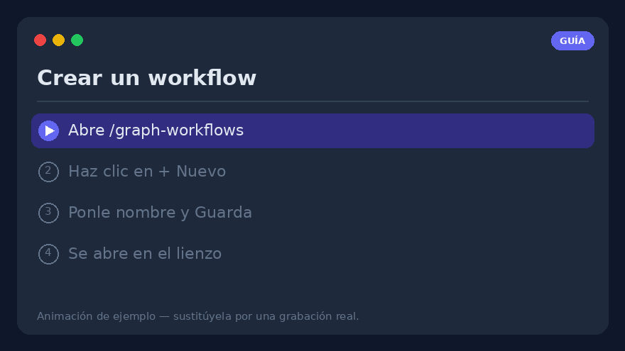
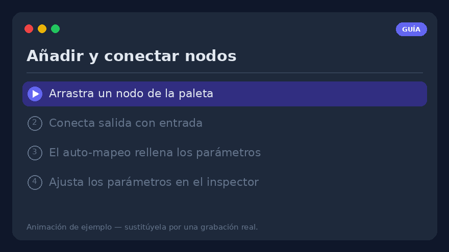
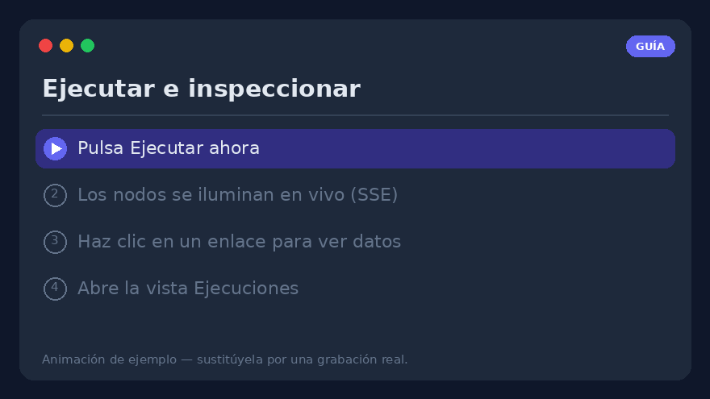
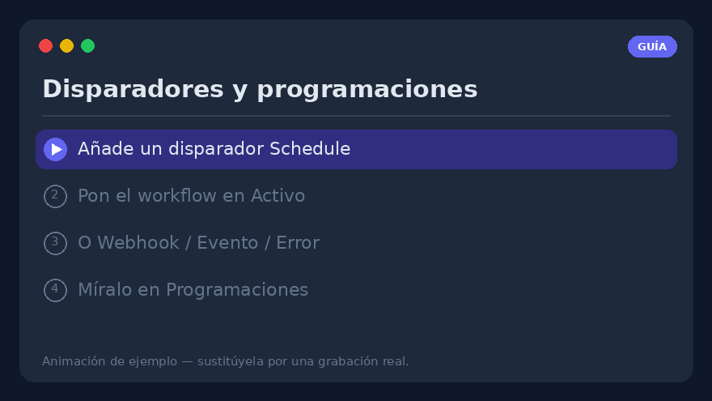
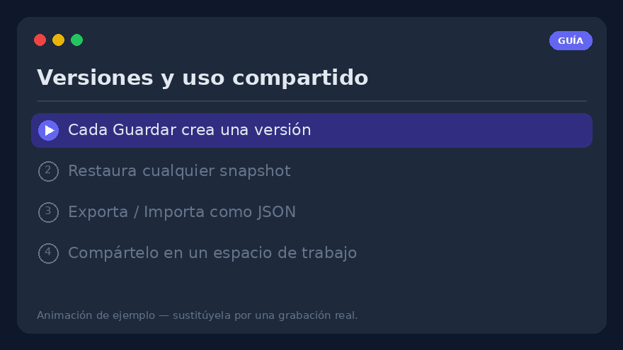

# Guía práctica de workflows — crear, ejecutar y operar workflows visuales

Una guía práctica, paso a paso, del **editor visual de workflows** (`/graph-workflows`).
Donde [Workflows visuales](visual-workflows.md) es la *referencia* completa (cada nodo, cada
parámetro), esta página es el *cómo hacerlo*: síguela de arriba abajo y construirás,
ejecutarás, programarás y compartirás un workflow real.

> **Requisito** — los workflows visuales están tras el flag de funcionalidad
> `graph_workflows`. Si no ves **Workflows → Graph** en la barra de navegación, pide a un
> administrador que lo active (Ajustes → Funcionalidades). Todo lo que sigue ocurre en tu
> propio perfil.


---

## 1. Crea tu primer workflow



1. Abre **`/graph-workflows`** desde la barra de navegación (**Workflows → Graph**).
2. Haz clic en **➕ Nuevo** encima de la lista de workflows.
3. Dale un **nombre** (p. ej. *Resumen matutino*) y pulsa **Guardar**. El grafo vacío se
   abre en el lienzo con un nodo **disparador `manual`** ya colocado.
4. Listo: el workflow existe y aparece a la izquierda. Está **Inactivo** por defecto (los
   disparadores aún no se activan); lo activaremos en el
   [paso 9](#9-disparadores--que-se-ejecute-solo).

> **¿Con prisa?** Haz clic en **✨** (galería de plantillas) e **Importa** uno de los
> [grafos de ejemplo](../examples/graph-workflows.md) ya listos — uno por funcionalidad — y
> edítalo. Es la forma más rápida de ver un grafo funcionando.

---

## 2. Leer el lienzo

El editor tiene **tres paneles**:

| Panel | Qué contiene |
|-------|--------------|
| **Izquierda** | Tu lista de workflows (plegable con ▾/▸) y la **paleta de nodos**, agrupada *Disparadores · Acciones · Lógica · Datos · IA*. Un campo de búsqueda la filtra por etiqueta o tipo. |
| **Centro** | El **lienzo SVG**. Arrastra nodos para colocarlos; arrastra el fondo vacío para **desplazar (pan)**; la rueda del ratón hace **zoom**. Un **minimapa** (abajo a la derecha) navega grafos grandes. |
| **Derecha** | El **inspector** del nodo seleccionado o — cuando no hay nada seleccionado — el **panel de ejecución y disparadores**. |

Cada herramienta integrada, cada herramienta de servidor MCP descubierto y cada herramienta
HTTP personalizada aparece automáticamente como un nodo `tool.<nombre>` — nunca escribes
código para añadir una.

La barra de herramientas sobre el lienzo ofrece **Deshacer/Rehacer** (`Ctrl+Z` /
`Ctrl+Shift+Z`), **Copiar/Pegar** (`Ctrl+C` / `Ctrl+V`), **Organizar** (auto-layout),
**⛶ ajustar vista** y las anotaciones **📝 Nota** / **▢ Marco**.

---

## 3. Añadir y conectar nodos



1. **Arrastra** un nodo desde la paleta izquierda al lienzo — por ejemplo `tool.rss_read`
   (Acciones), luego un `llm.completion` (IA), luego `notify.telegram` (Notificaciones).
2. **Conéctalos**: mantén pulsado el **conector de salida** de un nodo (borde derecho) y
   arrastra hasta el **conector de entrada** del siguiente nodo (borde izquierdo). Aparece una
   conexión (arista).
3. Al trazar una conexión, el **auto-mapeo** rellena el primer campo de expresión vacío del
   destino con la salida del origen — un toast lo confirma, o se abre un diálogo de elección
   cuando hay varios candidatos. Siempre puedes sobrescribirlo.
4. **Haz clic en una arista** para inspeccionarla: el panel derecho muestra
   *origen → destino*, los **datos que pasaron por ella en la última ejecución** y la lista de
   **rutas de expresión listas** (p. ej. `$node.rss.output.result`). Haz clic en un campo
   para copiarlo como expresión `{{ … }}`.

> **Solo se ejecutan los nodos conectados.** Los nodos disparadores son los puntos de
> entrada. Un nodo sin conectar se registra como `skipped` — no se dispara solo.

---

## 4. Configurar un nodo — el inspector

Selecciona un nodo; sus parámetros aparecen a la **derecha**, generados desde el esquema del
tipo de nodo.

- **Literal o expresión** — cada campo acepta un valor simple **o** una expresión
  (ver [paso 5](#5-pasar-datos-con-expresiones)).
- **Nodos IA** (`llm.completion`, `llm.agent`, …) exponen un **selector de modelo** — el
  mismo catálogo y filtros que la página de chat — y una **cadena de failover** opcional.
- **Sección Avanzado** — cada nodo tiene **Reintentos + backoff**, un **Timeout** y una
  política **En caso de error** (ver [paso 10](#10-gestionar-errores)).
- **Probar nodo** (⚡) ejecuta *solo este nodo* con sus parámetros actuales, incluso sin
  guardar, y muestra la salida en línea — no se registra nada. Ideal para ajustar un nodo de
  forma aislada.

---

## 5. Pasar datos con expresiones

Mueve datos entre nodos con expresiones. Dos formas, distinguidas por el prefijo:

```text
={{ $node.rss.output.result }}     # la salida de otro nodo
={{ $trigger.count }}              # la carga del disparador
={{ upper($json.title) }}          # una función permitida sobre la entrada de este nodo
={{ default($trigger.name, 'world') }}
Hola ={{ $trigger.name }}!         # interpolación en cadena
=py: [x*2 for x in input]          # escape hacia el sandbox de Python
```

- `={{ … }}` es una **mini-expresión segura** (sin `eval`) recorrida sobre el contexto de
  ejecución: `$node.<id>.output.<path>`, `$json` (la entrada de este nodo), `$trigger`,
  `$vars`, `$secrets`, `$env`, `$now`, más funciones puras (`default`, `upper`, `len`,
  `join`, `first`, `get`, `round`, …).
- Un `{{ … }}` desnudo (sin `=` inicial) también funciona — es un desliz común y tolerado.
- Una expresión **sola** conserva su tipo nativo (lista/número/objeto); envuélvela en texto
  para convertirla en cadena. Importa para el campo `items` de un `for`/`filter`, que
  necesita una lista real.

> **Consejo** — el panel **Probar expresión** del inspector evalúa cualquier expresión en
> solo lectura sobre los datos de la última ejecución, para depurar una ruta *antes* de
> cablearla en un parámetro.

---

## 6. Mantener los secretos fuera del grafo — `$vars` / `$secrets`

Abre el **panel de ejecución** (haz clic en el lienzo vacío) → **Variables** / **Secretos**:

- **Variables (`$vars`)** — pares clave/valor por workflow, legibles en cualquier lugar como
  `{{ $vars.nombre }}`. Viajan con exportar/importar; un valor JSON conserva su tipo nativo.
- **Secretos (`$secrets`)** — credenciales a nivel de perfil (tokens de API, cadenas de
  conexión), **cifrados en reposo** y **nunca devueltos por la API** ni incluidos en una
  exportación. Usa `{{ $secrets.NOMBRE }}`, por ejemplo en una cabecera `http.request`.
  Recréalos en cada entorno.

Nunca pegues un token directamente en un parámetro de nodo — ponlo en `$secrets`.

---

## 7. Ejecutar y leer los resultados



1. Pulsa **Guardar**, luego **Ejecutar ahora** en el panel de ejecución.
2. Los nodos **se iluminan en vivo** por SSE: **verde** = ok, **azul** = ejecutando,
   **rojo** = error, **gris** = omitido. Un nodo que falla muestra su error en rojo debajo.
3. ¿Necesitas una entrada? Pega un objeto JSON en la casilla **Carga de ejecución** — se
   convierte en `$trigger` para esa ejecución, así los grafos que leen
   `={{ $trigger.campo }}` se prueban a mano sin un webhook.
4. El registro duradero vive en la **vista Ejecuciones** (`/graph-workflows/runs`, o
   *Ejecuciones →* en la cabecera del editor): cada ejecución con estado, disparador, duración
   y **resultados por nodo**. Selecciona una ejecución en curso para seguirla en vivo;
   **↻ Repetir** la reejecuta con la misma carga.

---

## 8. Depurar sin ejecuciones completas

- **Probar nodo** (⚡) — ejecuta un nodo de forma aislada (paso 4).
- **Salida fijada** (📌) — congela la salida de un nodo (la última, o JSON editado a mano).
  Las pruebas aguas abajo, las vistas previas de expresión y las **ejecuciones parciales**
  resuelven entonces `$node.<id>.output` desde la fijación en vez de volver a llamar a la
  herramienta real — ideal para iterar aguas abajo de un webhook o una llamada LLM costosos.
  Las fijaciones nunca afectan a las ejecuciones de producción.
- **Ejecutar desde este nodo** (▶) — ejecuta solo el nodo seleccionado y su subgrafo aguas
  abajo; los nodos aguas arriba se siembran desde su última salida persistida.
- **Depuración paso a paso** (🐞) — pon puntos de interrupción (el punto en cada nodo),
  **Iniciar ejecución de depuración** (creada *en pausa*), luego **⏭ Paso** / **▶ Continuar** /
  **⏹ Detener**. La barra de depuración muestra la entrada resuelta de cada nodo antes de
  ejecutarse.

---

## 9. Disparadores — que se ejecute solo



Añade disparadores desde el **panel de ejecución**, y luego **pon el workflow en Activo** —
este es el paso que se olvida:

> ⚠️ **Un disparador solo se activa mientras su *workflow* está Activo.** Habilitar un
> disparador es distinto del flag Activo del workflow. Una programación perfecta y habilitada
> sobre un workflow **Inactivo** nunca se ejecutará.

Tipos de disparador:

- **Programación** — Diario / Semanal / Cron / Una vez mediante un selector estructurado (o
  una expresión cron, validada). Un bucle en segundo plano dispara las programaciones
  vencidas.
- **Webhook** — una URL con token (`POST /api/v1/wf/hooks/{token}`); el cuerpo JSON se
  convierte en `$trigger`. Se puede proteger con un secreto de firma HMAC.
- **Evento** — eventos internos (`document.ingested`, `chat.message.created`).
- **Error / Éxito** — se disparan cuando la ejecución de *otro* workflow falla / termina.
- **Vigilancia de archivos / Correo entrante** — sondean una carpeta del workspace o un buzón
  IMAP.

La **vista Programaciones** transversal (`/graph-workflows/schedules`) lista una fila por
disparador — próxima ejecución, último estado, racha de fallos y
habilitar/deshabilitar/Ejecutar/Eliminar — para ver de un vistazo todo lo pendiente o roto.

---

## 10. Gestionar errores

La sección **Avanzado** de cada nodo tiene tres controles de fallo:

1. **Reintentos + backoff** — reejecuta hasta N veces; backoff **Fijo** o **Exponencial**
   (limitado a 60 s). Los nuevos nodos `http.request` / `llm.*` vienen con presets sensatos.
2. **Timeout (ms)** — un tope estricto por intento; un intento agotado falla como cualquier
   error (y se sigue reintentando). La protección para una llamada HTTP/LLM/MCP colgada.
3. **En caso de error** — agotados los reintentos:
   - **Detener la ejecución** (por defecto),
   - **Continuar en main** — emite `{ error }` y sigue,
   - **Enrutar a la rama de error** — el nodo gana un conector **`error`**; cablea el camino
     feliz a `main` y una cadena de alerta/respaldo a `error` (try/catch en el lienzo).

Para alertas centralizadas, añade un workflow con **disparador de error** que se active ante
*cualquier* fallo y termine en un nodo `notify.*`.

---

## 11. Versiones, exportar/importar y compartir



- **Versiones** — cada **Guardar** crea un snapshot inmutable. La sección *Versiones* del
  panel de ejecución las lista con un **Restaurar** de un clic (que primero hace snapshot del
  grafo actual, así un rollback siempre es reversible). *Compara* dos versiones para ver nodos
  añadidos/modificados/eliminados.
- **Exportar** — el botón **Exportar** descarga un `.workflow.json` portable (grafo,
  variables, entornos y los *nombres* de los secretos referenciados — los valores no viajan).
- **Importar** — el botón **📥** junto a *Nuevo* carga tal archivo en un nuevo workflow,
  validado (nodos desconocidos / aristas rotas / secretos faltantes surgen como avisos).
- **Compartir** — comparte un workflow en un **workspace** con un rol: `viewer` (inspeccionar
  + copiar), `editor` (…+ lanzar ejecuciones) o `approver` (…+ decidir sus solicitudes
  `human.approval`).

---

## 12. Ejemplo completo — resumen RSS a Telegram

Una construcción concreta de extremo a extremo:

1. **Disparador** — por ahora mantén el nodo `manual` (añade una **Programación** *Diario
   08:00* más tarde).
2. `tool.rss_read` — pon la URL del feed en su parámetro.
3. `llm.completion` — prompt `Resume estos titulares en 5 viñetas:\n={{ $node.rss.output.result }}`, elige un modelo.
4. `notify.telegram` — `text: ={{ $node.llm.output.text }}`, `parse_mode: Markdown`. (Primero
   vincula un chat en Ajustes → Telegram.)
5. Cablea `manual → rss → llm → telegram`, **Guarda**, **Ejecuta ahora**, revisa el mensaje
   de Telegram.
6. ¿Satisfecho? Añade el disparador **Programación** y **pon en Activo** — un resumen diario
   sin más clics.

---

## 13. Lista de comprobación de problemas

- **Mi programación nunca se dispara** → ¿está el **workflow Activo** (no solo el disparador
  habilitado)? Ver [paso 9](#9-disparadores--que-se-ejecute-solo).
- **Un nodo está `skipped`** → no está conectado al flujo desde un disparador.
- **Una expresión está vacía** → pruébala en **Probar expresión**; comprueba la ruta exacta
  en la lista de campos del inspector de aristas.
- **Dentro de un bucle, `$node.<loopId>.output` está vacío** → usa `$item` / `$index` en el
  **cuerpo** del bucle; `…output.items` solo está disponible en la salida `done` del bucle.
- **Un secreto se resuelve como `***`** → es lo esperado en la vista previa del editor; solo
  se descifra durante una ejecución real.
- **Un webhook devuelve 401** → a la petición le falta la cabecera HMAC `X-Signature` tras
  rotar el secreto.

---

## Adónde ir después

- **[Workflows visuales](visual-workflows.md)** — la referencia completa: cada tipo de nodo,
  función de expresión, disparador, entorno, contrato y endpoint de API.
- **[Grafos de ejemplo](../examples/graph-workflows.md)** — workflows listos para importar,
  uno por funcionalidad.
