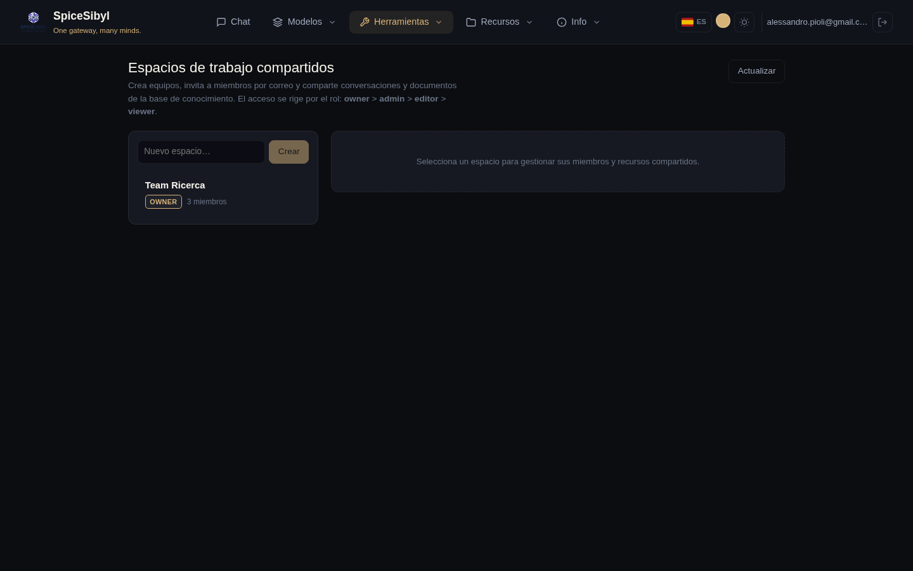

# Espacios de trabajo y colaboración

Funciones de equipo construidas sobre las cuentas de la fase 13 y el alcance de la base de conocimiento de la fase 17: espacios compartidos con acceso por rol, y comentarios en hilo sobre conversaciones compartidas.

## Espacios de trabajo compartidos

**Qué hace.** Un espacio de trabajo es un contenedor de equipo propiedad de un usuario. Otras cuentas se unen como **miembros** con un rol, y el propietario comparte conversaciones y documentos de la base de conocimiento *dentro* del espacio, haciéndolos visibles a cada miembro. Los recursos conservan su propietario original — compartir es una relación de unión (`workspace_conversations` / `workspace_documents`), no una copia — así que dejar de compartir simplemente quita el enlace.

**Roles.** Cuatro niveles, en orden descendente de privilegio:

| Rol | Puede |
|-----|-------|
| **owner** | Todo, además de renombrar/eliminar el espacio y gestionar a cada miembro. Creó el espacio; exactamente uno por espacio. |
| **admin** | Gestionar miembros (añadir/cambiar rol/quitar, salvo el propietario) y compartir/dejar de compartir recursos. |
| **editor** | Compartir/dejar de compartir sus propios recursos y comentar. |
| **viewer** | Leer recursos compartidos y comentar. |

Cualquier miembro (incluido un viewer) puede **abandonar** un espacio por sí mismo; solo admin+ pueden quitar a *otros* miembros. Compartir una conversación o documento requiere editor+ **y** la propiedad de ese recurso — no puedes compartir algo que no es tuyo.

**Cómo se usa.** Abre la página **Espacio de trabajo** desde la barra de navegación:

- La barra lateral izquierda lista los espacios a los que perteneces (con tu rol y número de miembros) y un campo para crear uno nuevo — crearlo te convierte en propietario.
- Seleccionar un espacio abre el panel de detalle con tres tarjetas: **Miembros**, **Conversaciones compartidas** y **Documentos compartidos**.
- **Miembros** — invita por correo (la cuenta debe existir ya), cambia el rol de un miembro en línea, o quítalo. Los controles de gestión solo aparecen para admin+; la fila del propietario no es editable.
- **Conversaciones / documentos compartidos** — elige una de tus conversaciones o documentos KB del desplegable y compártela; cada miembro la ve entonces en la lista. La **✕** deja de compartir (editor+).

**API.**

| Método y ruta | Propósito | Rol mínimo |
|---------------|-----------|------------|
| `GET /v1/workspaces` | Espacios a los que pertenece el llamante | miembro |
| `POST /v1/workspaces` | Crear (el llamante se convierte en propietario) | — |
| `PATCH /v1/workspaces/{ws}` | Renombrar | admin |
| `DELETE /v1/workspaces/{ws}` | Eliminar | owner |
| `GET/POST /v1/workspaces/{ws}/members` | Listar / invitar por correo | view / admin |
| `PATCH/DELETE /v1/workspaces/{ws}/members/{uid}` | Cambiar rol / quitar (o auto-abandono) | admin |
| `GET/POST /v1/workspaces/{ws}/conversations` | Listar / compartir una conversación | view / editor |
| `DELETE /v1/workspaces/{ws}/conversations/{cid}` | Dejar de compartir una conversación | editor |
| `GET/POST /v1/workspaces/{ws}/documents` | Listar / compartir un documento KB | view / editor |
| `DELETE /v1/workspaces/{ws}/documents/{did}` | Dejar de compartir un documento KB | editor |

## Anotaciones y comentarios

**Qué hace.** Comentarios en hilo sobre una conversación compartida. Un comentario puede ser un hilo de nivel superior o una respuesta (`parent_id`), y puede anclarse opcionalmente a un mensaje concreto (`message_id`). Los comentarios son **soft-deleted** — un comentario eliminado se vacía y se marca en vez de descartarse, para que las respuestas debajo conserven su lugar en el hilo.

**Quién puede verlos.** El acceso refleja el alcance de la conversación: su propietario, o cualquier miembro de un espacio en el que se haya compartido, puede leer y publicar. La edición y el borrado se restringen al **autor** del comentario — nadie más puede alterar tu texto, sea cual sea el rol en el espacio.

**Cómo se usa.** En la página de Espacio de trabajo, cada conversación compartida tiene un botón **Comentarios** que abre un panel en hilo debajo. Escribe un comentario de nivel superior en el cuadro, usa **Responder** para anidar una respuesta, y **Editar / Eliminar** en tus propios comentarios. Los hilos se anidan visualmente por sangría.

**API** (bajo `/v1/conversations/{id}/comments`):

| Método y ruta | Propósito |
|---------------|-----------|
| `GET /` | Listar todos los comentarios de la conversación (anidados en cliente por `parent_id`) |
| `POST /` | Añadir un comentario (`body`, `message_id` opcional, `parent_id` opcional) |
| `PATCH /{comment_id}` | Editar tu comentario |
| `DELETE /{comment_id}` | Soft-delete de tu comentario |

Un llamante sin relación con la conversación obtiene un `404` (en lugar de `403`) para no filtrar nunca la existencia de conversaciones privadas.

## Modelo de datos

- `workspaces` — `id`, `name`, `owner_id`, marcas de tiempo.
- `workspace_members` — `(workspace_id, user_id)` con `role`; el propietario se guarda como fila de miembro (`role='owner'`) para uniformar las consultas de pertenencia.
- `workspace_conversations` / `workspace_documents` — tablas de unión que enlazan un espacio con conversaciones / documentos KB compartidos, con `shared_by` y `shared_at`.
- `comments` — `id`, `conversation_id`, `message_id` nullable, `parent_id` nullable, `user_id`, `body`, `deleted`, marcas de tiempo.

Todas las tablas cascadan al eliminar mediante claves foráneas, así que quitar un espacio, conversación o usuario limpia automáticamente las filas dependientes.

> La colaboración en tiempo real (varios usuarios en vivo en una conversación por WebSocket, con indicadores de presencia) está planeada como fase 20.c y aún no está implementada.
