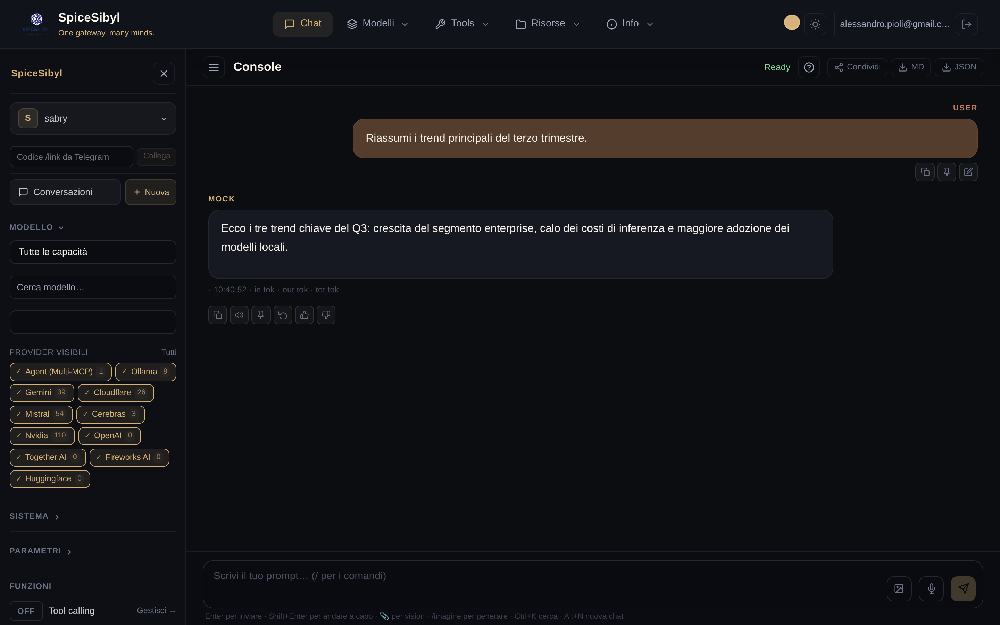

# SpiceSibyl — Feature documentation

A feature-by-feature guide to SpiceSibyl: what each feature does, how to use it, and how to configure it. Screenshots live in [`docs/screenshots/`](../screenshots/).

> 🇮🇹 Versione italiana: [docs/funzionalita/](../funzionalita/README.md)

## Index

| Area | Document | Contents |
|------|----------|----------|
| 🔐 Access | [Authentication and profiles](authentication-and-profiles.md) | Login, roles, JWT, local profiles, audit log, rate limiting |
| 💬 Chat | [Web chat](chat.md) | Streaming, message actions, branching, voice, TTS, images, templates, tags, search, export, sharing |
| 🔌 Providers | [Providers and models](providers-and-models.md) | Provider management, API key vault, model discovery, automatic fallback |
| 🛠 Tools | [Tool calling](tool-calling.md) | Built-in tools, custom HTTP tools, sandboxed code interpreter |
| 🤖 Agents | [MCP and agents](mcp-and-agents.md) | MCP server management, Multi-MCP orchestrator, persistent workflows |
| 📚 RAG | [Knowledge base and RAG](knowledge-rag.md) | Document/URL ingestion, hybrid search, reranking, citations |
| ⚖️ Compare | [Model comparison](model-comparison.md) | Same prompt across 2–4 models in parallel |
| 📊 Stats | [Usage statistics](statistics.md) | Tokens, latency, costs; daily charts |
| ✈️ Telegram | [Telegram bot](telegram.md) | Commands, voice, photos, documents, reminders, web profile linking |
| 🧠 Memory | [Memory & personalization](memory-and-personalization.md) | Persistent memory, automatic titles, response cache, 👍/👎 feedback, Info page |
| 🖥 UI | [Interface and UX](interface.md) | Themes, PWA, mobile, onboarding, keyboard shortcuts |
| ⚙️ Ops | [Observability and operations](operations.md) | Health/readiness, Prometheus metrics, structured logging, backups |

## Overview

SpiceSibyl is an OpenAI-compatible multi-provider AI gateway with a built-in Angular web console. A single endpoint (`/api/v1/chat/completions`) routes requests to the right provider based on the model prefix (e.g. `ollama/...`, `groq/...`, `agent/...`), with no client-side changes.

Supported providers: Ollama (local), Groq, OpenRouter, Cloudflare Workers AI, Google Gemini, Mistral, Cerebras, Together AI, Fireworks AI, HuggingFace, NVIDIA, plus the Multi-MCP orchestrator (`agent/*`).



## Quick start

```bash
# development
docker compose up -d --build
# web console: http://localhost:8888  ·  API: http://localhost:8800/api/v1
```

On first boot an admin user is created from the `ADMIN_EMAIL` / `ADMIN_PASSWORD` variables in `backend/.env`. For production deployment (nginx, TLS, PUBLIC_URL) see [deploy.md](../deploy.md).
