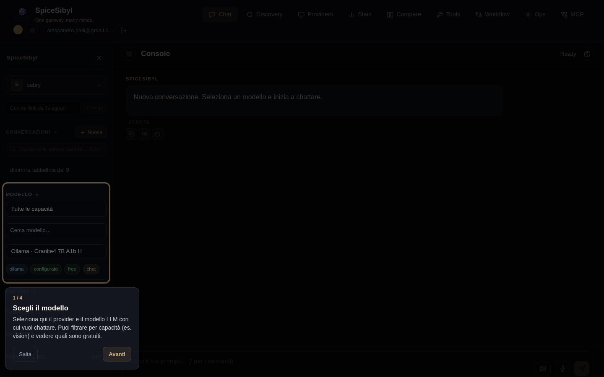

# Interface and UX

## Dark/light theme and accent color

**What it does.** A theming system based on CSS custom properties (`--bg-primary`, `--text-primary`, `--accent`, …) with dark / light / system modes and a customizable accent color.

**How to use it.**
- **Theme toggle**: sun/moon icon in the navbar; the preference is stored in localStorage (`spicesibyl_theme`) and applied via the `[data-theme]` attribute on `<html>`.
- **Accent color**: navbar picker with 8 preset swatches + a free color input; dynamically updates all `--accent-*` variables and works in both themes (`spicesibyl_accent`).

## Guided onboarding

**What it does.** On first access a guided tour starts, with a spotlight overlay on the key elements (model selection, tools, system prompt, slash commands); on narrow viewports the card is centered instead.

**How to use it.** Follow the steps with **Avanti** (Next) or leave with **Salta** (Skip); completion is remembered in localStorage (`spicesibyl_onboarded`). The replay button in the chat topbar restarts it at any time.

## Keyboard shortcuts

| Shortcut | Action |
|----------|--------|
| `Ctrl+K` | conversation search (opens the sidebar and focuses the search bar) |
| `Alt+N` | new chat |
| `Ctrl+Shift+S` | toggle the sidebar |

Shortcuts do not fire while typing in an input field (except `Ctrl+K`).

## Mobile layout

- Responsive media queries: sidebar as a fixed overlay with backdrop, chat and composer adapted to small screens.
- **Edge swipe** to open/close the sidebar.
- Touch targets ≥ 44 px; icon-only topbar export buttons; below 575 px the navbar collapses into a hamburger menu.

## PWA (Progressive Web App)

**What it does.** The app is installable (manifest with 192/512/maskable icons + apple-touch-icon) with the Angular service worker active in production only: the app shell works offline.

**Completion notifications.** Opt-in in the **Parametri** panel: if a generation takes more than 10 seconds and the tab is in the background, a local system notification fires when it finishes (no push server/VAPID).

**How to install.** From Chrome/Edge: "install" icon in the address bar; on mobile: "Add to Home Screen".

## Loading indicators

An animated progress bar below the topbar during every request, with color/speed tied to the phase: waiting for the model (amber), tool execution (blue, faster), streaming (standard). Tool-call bubbles awaiting their result show a spinner instead of the ⚙ icon.

## Error handling

Global toast system (ErrorInterceptor + NotificationService): HTTP errors and backend SSE `event: error` frames become a toast + a bubble message; provider rate limits are mapped to HTTP 429.
