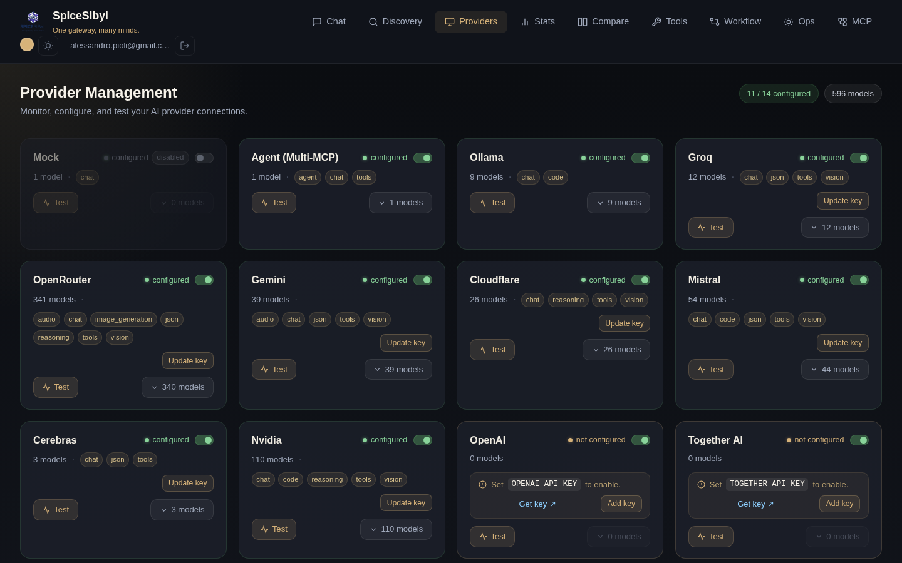
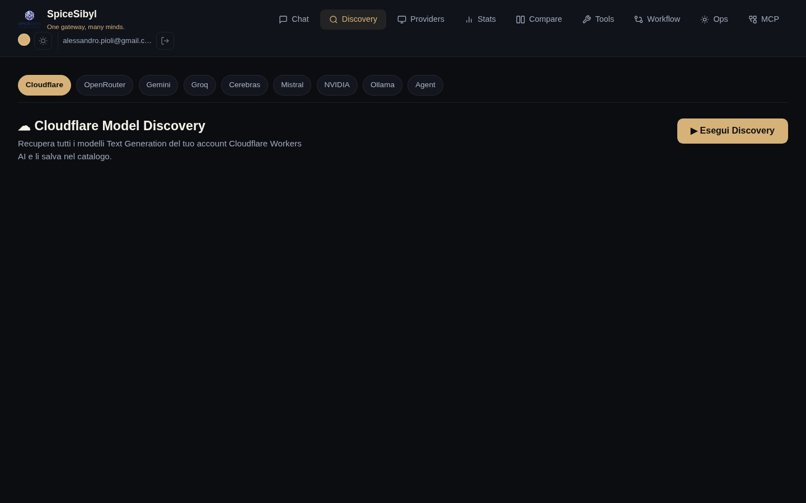

# Providers and models

## Providers page

**What it does.** A dashboard of all supported providers: configuration status, number of catalogued models, aggregated capabilities (chat, vision, tools, json…), on/off toggle, connectivity test and API key management.



**How to use it.**
- **Add key / Update key**: stores or updates the provider's API key. The key goes into the **encrypted vault** (see below), not into a config file.
- **Test**: `POST /providers/{id}/test` runs a real minimal completion request against the cloud provider (not just a key-presence check) and reports outcome/latency.
- **Toggle**: enables/disables the provider without removing the key.
- **N models**: expands the provider's model catalog.

The box at the top right summarizes how many providers are configured and the total number of available models.

## API key vault

**What it does.** Keys are encrypted with Fernet (AES-128-CBC + HMAC-SHA256) and stored in SQLite, with an in-memory cache. All providers fall back vault → environment variable: if the key is not in the vault, the one from `.env` is used.

**Configuration.** Set a strong `VAULT_SECRET_KEY` in production: a security warning is logged at startup if it is still the default placeholder. API: `PUT /providers/{id}/key`, `DELETE /providers/{id}/key`.

## Model discovery

**What it does.** Fetches the model catalog live from each provider's API (Cloudflare, OpenRouter, Gemini, Groq, Cerebras, Mistral, NVIDIA, Ollama, Agent) and saves it into the internal catalog — so the model list selectable in chat stays current without manual edits.



**How to use it.** **Discovery** page → pick the provider from the tab bar → **Esegui Discovery** (Run Discovery). Discovered models are listed and saved to the catalog.

## Prefix-based routing

The gateway routes each request based on the model name prefix:

| Prefix | Provider |
|--------|----------|
| `ollama/…`, `groq/…`, `mistral/…`, `together_ai/…`, `fireworks_ai/…`, `huggingface/…` | LiteLLM |
| `gemini/…` | dedicated Google Generative AI adapter |
| `openrouter/…` | OpenRouter |
| `cloudflare/…` | Cloudflare Workers AI |
| `cerebras/…` | Cerebras (direct HTTP) |
| `agent/…` | Multi-MCP orchestrator (see [MCP and agents](mcp-and-agents.md)) |

## Automatic provider fallback

**What it does.** If a provider fails or times out **before** emitting the first token, the gateway transparently retries the next provider in the `CHAT_FALLBACK_CHAIN` (`provider:model,provider:model,...` format). The switch is signalled with an SSE `provider_switch` frame, surfaced as a notice in the UI. Once tokens have started streaming, the error is propagated instead (no duplicate output).

**Configuration.** In `backend/.env`:

```env
CHAT_FALLBACK_CHAIN=groq:llama-3.3-70b-versatile,ollama:qwen2.5:7b-instruct
```

Analogous chains exist for images (`IMAGE_GENERATION_CHAIN`) and embeddings (`EMBEDDING_CHAIN`).
