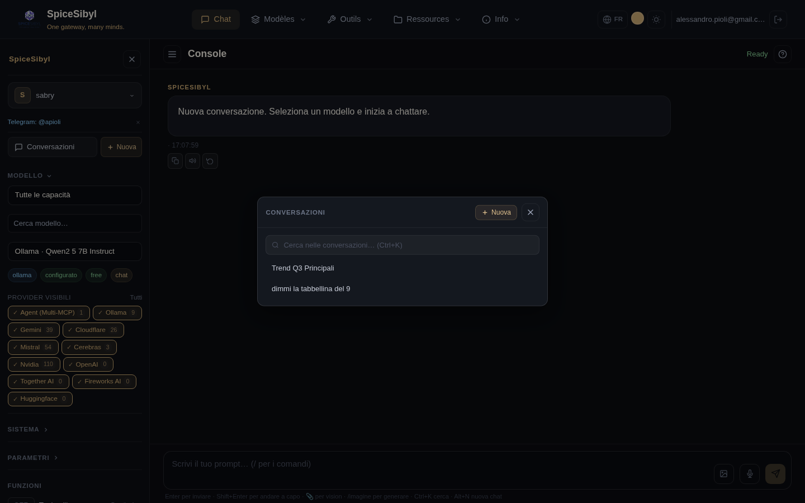

# SpiceSibyl — Documentation des fonctionnalités

Un guide fonctionnalité par fonctionnalité de SpiceSibyl : ce que fait chaque fonction, comment l'utiliser et comment la configurer. Les captures d'écran sont dans [`docs/fr/screenshots/`](screenshots/).

> Versions : [English](../en/README.md) · [Italiano](../it/README.md)

## Index

| Domaine | Document | Contenu |
|---------|----------|---------|
| 🔐 Accès | [Authentification et profils](authentication-and-profiles.md) | Connexion, rôles, JWT, profils locaux, journal d'audit, limitation de débit |
| 💬 Chat | [Chat web](chat.md) | Streaming, actions sur les messages, branches, voix, TTS, images, modèles, étiquettes, recherche, export, partage |
| 🔌 Fournisseurs | [Fournisseurs et modèles](providers-and-models.md) | Gestion des fournisseurs, coffre des clés API, découverte des modèles, repli automatique |
| 🛠 Outils | [Appel d'outils](tool-calling.md) | Outils intégrés, outils HTTP personnalisés, interpréteur de code sandboxé |
| 🤖 Agents | [MCP et agents](mcp-and-agents.md) | Gestion des serveurs MCP, orchestrateur Multi-MCP, workflows persistants |
| 📚 RAG | [Base de connaissances et RAG](knowledge-rag.md) | Ingestion de documents/URL, recherche hybride, reranking, citations |
| ⚖️ Comparaison | [Comparaison de modèles](model-comparison.md) | Le même prompt sur 2–4 modèles en parallèle |
| 📊 Statistiques | [Statistiques d'utilisation](statistics.md) | Tokens, latence, coûts ; graphiques quotidiens |
| ✈️ Telegram | [Bot Telegram](telegram.md) | Commandes, voix, photos, documents, base de connaissances (RAG), mémoire, rappels, liaison au profil web |
| 🧠 Mémoire | [Mémoire et personnalisation](memory-and-personalization.md) | Mémoire persistante, titres automatiques, cache des réponses (exact + sémantique), feedback 👍/👎, page Info |
| 👥 Collaboration | [Espaces de travail et collaboration](workspaces-and-collaboration.md) | Espaces partagés, accès par rôle, conversations/documents partagés, commentaires en fil |
| 🖥 UI | [Interface et UX](interface.md) | Thèmes, PWA, mobile, onboarding, raccourcis clavier |
| ⚙️ Ops | [Observabilité et opérations](operations.md) | Health/readiness, métriques Prometheus, logs structurés, sauvegardes |
| 🌐 i18n | [Internationalisation](internationalization.md) | UI web + Telegram en 5 langues, sélecteur à runtime, formatage localisé |

## Aperçu

SpiceSibyl est une passerelle IA multi-fournisseurs compatible avec l'API OpenAI, avec une console web Angular intégrée. Un endpoint unique (`/api/v1/chat/completions`) route les requêtes vers le bon fournisseur selon le préfixe du modèle (ex. `ollama/...`, `groq/...`, `agent/...`), sans changement côté client.

Fournisseurs pris en charge : Ollama (local), Groq, OpenRouter, Cloudflare Workers AI, Google Gemini, Mistral, Cerebras, Together AI, Fireworks AI, HuggingFace, NVIDIA, plus l'orchestrateur Multi-MCP (`agent/*`).



## Démarrage rapide

```bash
# développement
docker compose up -d --build
# console web : http://localhost:8888  ·  API : http://localhost:8800/api/v1
```

Au premier démarrage, un utilisateur admin est créé à partir des variables `ADMIN_EMAIL` / `ADMIN_PASSWORD` dans `backend/.env`. Pour le déploiement en production (nginx, TLS, PUBLIC_URL) voir [deploy.md](../deploy.md).
