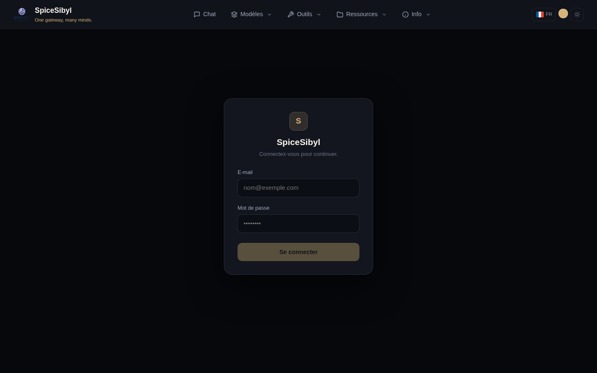
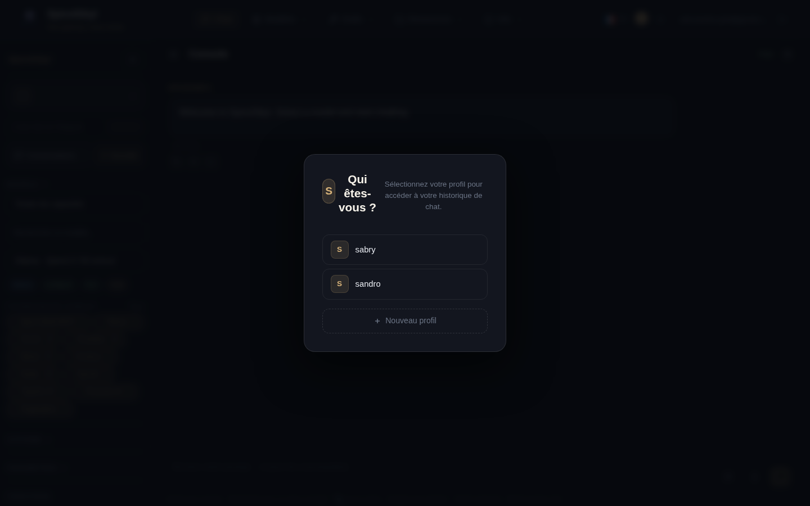

# Authentification et profils

## Connexion et comptes utilisateur

**Ce que ça fait.** Chaque route `/api/v1` exige une authentification, sauf la liste publique (`/auth/*`, `/health`, `GET /shared/{token}`). Les comptes ont e-mail + mot de passe (hachage bcrypt) et un rôle : `admin`, `user` ou `read-only`. Les sessions utilisent des jetons d'accès JWT (30 minutes) et des jetons de rafraîchissement rotatifs (14 jours) suivis dans la table `refresh_tokens`, donc révocables.

**Comment l'utiliser.**
1. Ouvrez la console web : si vous n'êtes pas authentifié, vous êtes redirigé vers `/login`.
2. Saisissez e-mail et mot de passe puis appuyez sur **Se connecter**.
3. Le frontend rafraîchit silencieusement les jetons expirés (intercepteur 401) ; déconnectez-vous depuis la puce utilisateur dans la barre de navigation.

**Bootstrap admin.** Au premier démarrage, le backend crée un administrateur à partir de `ADMIN_EMAIL` / `ADMIN_PASSWORD` (dans `backend/.env`) et « adopte » les profils orphelins créés avant l'introduction de l'authentification.

## Profils

**Ce que ça fait.** Chaque utilisateur possède N profils (identités locales nommées, sans mot de passe). Historique des conversations, base de connaissances, modèles, étiquettes et statistiques sont limités à chaque profil. L'UUID du profil actif est stocké dans `localStorage` (`spicesibyl_profile`).

**Comment l'utiliser.**
- À la première visite (ou dès qu'aucun profil n'est sélectionné) la fenêtre **« Qui êtes-vous ? »** apparaît : choisissez un profil existant ou créez-en un avec **+ Nouveau profil**.
- Vous pouvez changer de profil à tout moment depuis le sélecteur en haut de la barre latérale du chat.

**Isolation des données.** Chaque endpoint lié à un profil valide la propriété via la dépendance `resolve_profile` : un utilisateur ne peut pas lire les conversations ou documents des profils d'autrui.

## Liaison Telegram ↔ web

**Ce que ça fait.** Associe un utilisateur Telegram à un profil web, pour partager conversations et statistiques entre les deux canaux.

**Comment l'utiliser.**
1. Envoyez `/link` au bot Telegram : vous recevez un code de 6 caractères.
2. Collez le code dans le champ **« Code /link de Telegram »** de la barre latérale web et appuyez sur **Associer**.
3. `/unlink` sur le bot déconnecte le compte.

## Limitation de débit

Limite à fenêtre glissante par utilisateur (`RATE_LIMIT_DEFAULT`, défaut `60/minute`), indexée sur l'id de l'utilisateur authentifié (correcte même derrière le proxy nginx). En cas de dépassement, le serveur répond `429` avec un en-tête `Retry-After`. Remarque : le stockage est en mémoire (processus unique).

## Journal d'audit

La table `audit_log` enregistre qui a fait quoi et quand, avec l'IP du client : connexions, suppressions de conversations/profils, mises à jour des clés des fournisseurs, changements de rôle/désactivation des utilisateurs, opérations de sauvegarde/restauration, CRUD des outils personnalisés et des serveurs MCP.

**Comment le consulter.** Admin uniquement : `GET /api/v1/auth/audit`.
