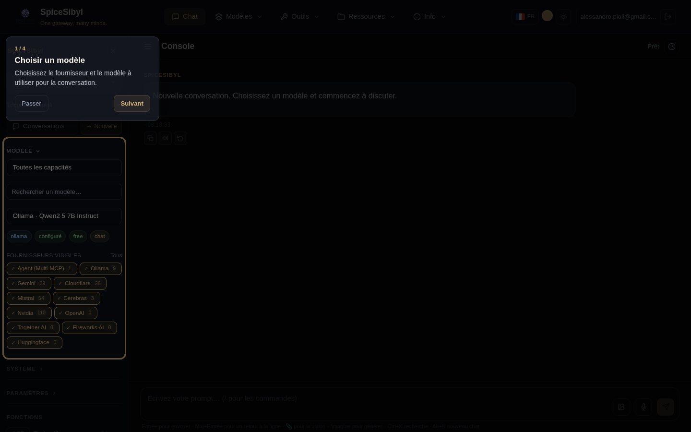

# Interface et UX

## Navigation (navbar)

**Ce que ça fait.** La barre de navigation supérieure utilise des **menus hiérarchiques** : les entrées sont regroupées en macro-entrées avec sous-menus déroulants, pour une navigation ordonnée même avec beaucoup de pages.

**Structure.**

| Macro-entrée | Sous-menu |
|--------------|-----------|
| **Chat** | (lien direct) |
| **Modèles** | Fournisseurs · Découverte · Comparer · Statistiques |
| **Outils** | Outils · Workflow · MCP *(admin)* · Espace de travail |
| **Ressources** | Modèles · Étiquettes · Connaissances · Mémoire |
| **Info** | Aide · Info · Ops *(admin)* |

**Comment l'utiliser.**
- **Cliquez** une macro-entrée pour ouvrir son sous-menu ; un clic à l'extérieur le ferme. La macro-entrée est surlignée quand l'une de ses pages est active.
- Les entrées **admin uniquement** (MCP, Ops) n'apparaissent qu'avec le bon rôle ; un groupe sans entrée visible est masqué.
- Sur écrans étroits (< 576 px) la navbar se replie en menu hamburger et les sous-menus deviennent des **accordéons** en ligne.

À droite se trouvent le **sélecteur de langue 🌐**, le **sélecteur de couleur d'accent**, le **bouton de thème** et la **puce utilisateur** avec déconnexion.

## Thème sombre/clair et couleur d'accent

**Ce que ça fait.** Un système de thèmes basé sur les propriétés CSS personnalisées (`--bg-primary`, `--text-primary`, `--accent`, …) avec modes sombre / clair / système et une couleur d'accent personnalisable.

**Comment l'utiliser.**
- **Bouton de thème** : icône soleil/lune dans la navbar ; la préférence est stockée dans localStorage (`spicesibyl_theme`) et appliquée via l'attribut `[data-theme]` sur `<html>`.
- **Couleur d'accent** : sélecteur de navbar avec 8 pastilles prédéfinies + un champ couleur libre ; met à jour dynamiquement toutes les variables `--accent-*` et fonctionne dans les deux thèmes (`spicesibyl_accent`).

## Onboarding guidé

**Ce que ça fait.** Au premier accès, une visite guidée démarre, avec un projecteur sur les éléments clés (sélection du modèle, outils, prompt système, commandes slash) ; sur les petits écrans la carte est centrée.

**Comment l'utiliser.** Suivez les étapes avec **Suivant** ou quittez avec **Passer** ; l'achèvement est mémorisé dans localStorage (`spicesibyl_onboarded`). Le bouton de relecture dans la barre du chat la relance à tout moment.

## Raccourcis clavier

| Raccourci | Action |
|-----------|--------|
| `Ctrl+K` | ouvre le **panneau Conversations** et met le focus sur la recherche |
| `Alt+N` | nouveau chat |
| `Ctrl+Shift+S` | affiche/masque la barre latérale |

Les raccourcis ne se déclenchent pas pendant la saisie dans un champ (sauf `Ctrl+K`).

## Disposition mobile

- Media queries responsives : barre latérale en superposition fixe avec fond, chat et composeur adaptés aux petits écrans.
- **Balayage du bord** pour ouvrir/fermer la barre latérale.
- Cibles tactiles ≥ 44 px ; boutons d'export en icône seule ; sous 575 px la navbar se replie en hamburger.

## PWA (Progressive Web App)

**Ce que ça fait.** L'application est installable (manifest avec icônes 192/512/maskable + apple-touch-icon) avec le service worker Angular actif en production seulement : le shell fonctionne hors ligne.

**Notifications de fin.** Opt-in dans le panneau **Paramètres** : si une génération dure plus de 10 secondes avec l'onglet en arrière-plan, une notification système locale se déclenche à la fin (sans serveur push/VAPID).

**Comment installer.** Depuis Chrome/Edge : icône « installer » dans la barre d'adresse ; sur mobile : « Ajouter à l'écran d'accueil ».

## Indicateurs de chargement

Une barre de progression animée sous la barre supérieure pendant chaque requête, avec couleur/vitesse liées à la phase : attente du modèle (ambre), exécution d'outils (bleu, plus rapide), streaming (standard). Les bulles d'appel d'outil en attente de résultat montrent un spinner au lieu de l'icône ⚙.

## Gestion des erreurs

Système de toasts global (ErrorInterceptor + NotificationService) : les erreurs HTTP et les trames SSE `event: error` du backend deviennent un toast + un message en bulle ; les limites de débit des fournisseurs sont mappées sur HTTP 429.
