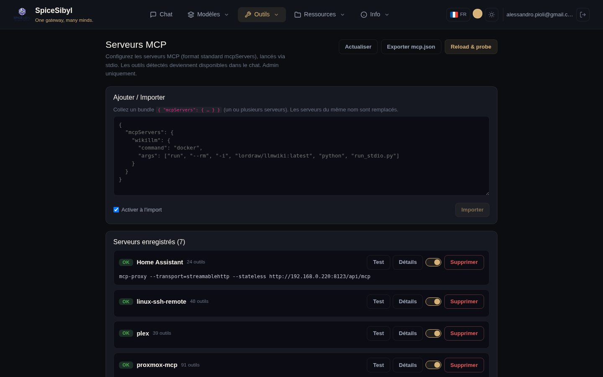
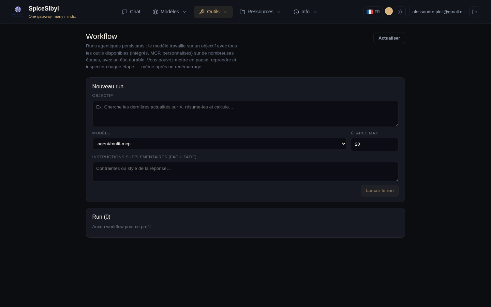

# MCP et agents

## Gestion des serveurs MCP

**Ce que ça fait.** Enregistre des serveurs [MCP](https://modelcontextprotocol.io) (Model Context Protocol) au format standard `mcpServers` (`command`/`args`/`env`/`cwd`), les lance via stdio avec un client JSON-RPC minimal intégré (sans dépendance SDK), sonde leur santé et injecte les outils découverts dans la boucle de chat sous l'espace de noms `mcp__<serveur>__<outil>`. Gestion **admin uniquement**, configuration globale (table `mcp_servers`).



**Comment l'utiliser.**
1. Page **MCP** → encart **Ajouter / Importer** : collez un bundle JSON `{ "mcpServers": { … } }` (un ou plusieurs serveurs ; ceux du même nom sont remplacés) et appuyez sur **Importer**. La case « Activer à l'import » les active immédiatement.
2. Dans la liste **Serveurs enregistrés**, chaque serveur affiche son état (OK/ERREUR avec message), le nombre d'outils découverts et les boutons **Test**, **Détails** (liste des outils), l'interrupteur d'activation et **Supprimer**.
3. **Reload & probe** relance la découverte sur tous les serveurs activés ; **Exporter mcp.json** télécharge la configuration au format standard.

**API.** `GET/POST /v1/mcp/servers`, `PATCH`/`DELETE /v1/mcp/servers/{id}`, `POST /v1/mcp/servers/{id}/test`, `POST /v1/mcp/reload`, `GET /v1/mcp/config`, `POST /v1/mcp/import` (tous audités).

**Exemple de bundle :**

```json
{
  "mcpServers": {
    "wikillm": {
      "command": "docker",
      "args": ["run", "--rm", "-i", "lordraw/llmwiki:latest", "python", "run_stdio.py"]
    }
  }
}
```

## Orchestrateur Multi-MCP (mode agent)

**Ce que ça fait.** Les modèles préfixés `agent/*` sont routés par l'`OrchestratorProvider` vers un sidecar externe qui coordonne plusieurs agents MCP spécialisés (`ask_proxmox`, `ask_synology`, `ask_linux`, `ask_homeassistant`, `ask_watchyourlan`). Utile pour les questions d'infrastructure maison/lab qui nécessitent d'interroger plusieurs systèmes.

**Comment l'utiliser.** Dans le chat, sélectionnez le modèle `Agent · Multi-MCP Orchestrator` ; sur Telegram les commandes `/agent` et `/chat` basculent entre mode agent et chat normal.

## Workflows persistants

**Ce que ça fait.** Des runs d'agent durables et inspectables : une boucle serveur en arrière-plan travaille sur un objectif avec le registre d'outils **complet** (intégrés, personnalisés, MCP) pendant de nombreuses itérations (`WORKFLOW_DEFAULT_MAX_STEPS`, plafonné par `WORKFLOW_MAX_STEPS_LIMIT`), bien au-delà des 5 de la boucle de chat. Chaque tour de l'assistant / appel d'outil / résultat est persisté comme étape (`agent_runs` + `agent_run_steps`) et l'historique des messages est sauvegardé après chaque itération : les runs se mettent en pause et reprennent sans perte — **même après un redémarrage** (les runs restés `running` sont ramenés à `paused`).



**Comment l'utiliser.**
1. Page **Workflow** → formulaire **Nouveau run** : objectif, modèle, étapes max, instructions supplémentaires facultatives → **Lancer le run**.
2. Dans la liste des runs : badges d'état, boutons pause/reprise/annulation et suppression.
3. La vue détaillée montre la **chronologie des étapes** avec rafraîchissement automatique : chaque étape de raisonnement et chaque appel d'outil peut être inspecté.

**API.** `POST/GET /v1/workflows`, détail, `pause`/`resume`/`cancel`/`delete` (audités).
