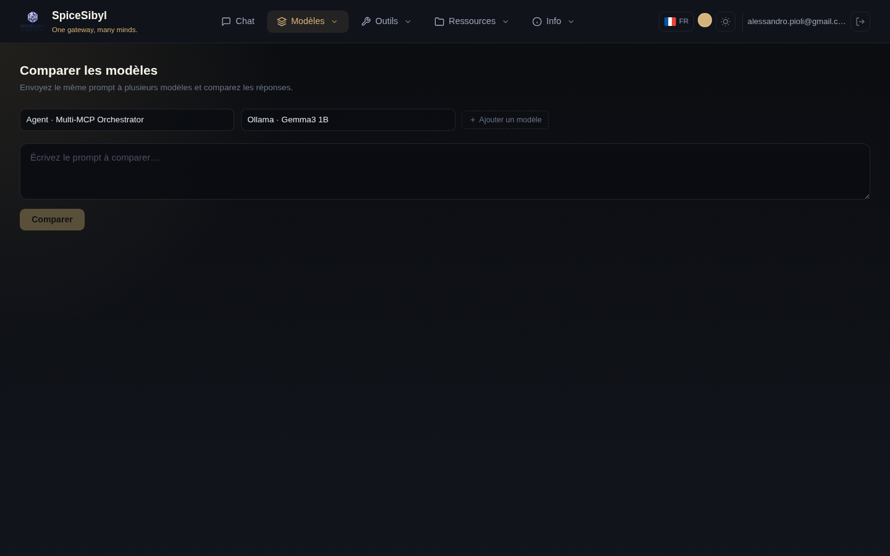

# Comparaison de modèles

**Ce que ça fait.** Envoie le même prompt à 2–4 modèles simultanément et diffuse les réponses dans des colonnes côte à côte, chacune avec sa propre télémétrie (latence, tokens, coût). Utile pour choisir le bon modèle pour un cas d'usage ou comparer qualité/vitesse/coût.

**Comment l'utiliser.**
1. Allez sur la page **Comparer**.
2. Sélectionnez les modèles dans les listes déroulantes (jusqu'à 4 avec **+ Ajouter un modèle**).
3. Saisissez le prompt dans la zone de texte et appuyez sur **Comparer**.
4. Les réponses arrivent en parallèle, chacune dans sa colonne ; la latence, le nombre de tokens et le coût estimé apparaissent en bas de chacune.

**Remarques.**
- Les requêtes s'exécutent réellement en parallèle : les temps affichés sont comparables entre eux.
- Chaque colonne reçoit exactement le même prompt, sans le prompt système du chat : c'est une comparaison « à froid ».
