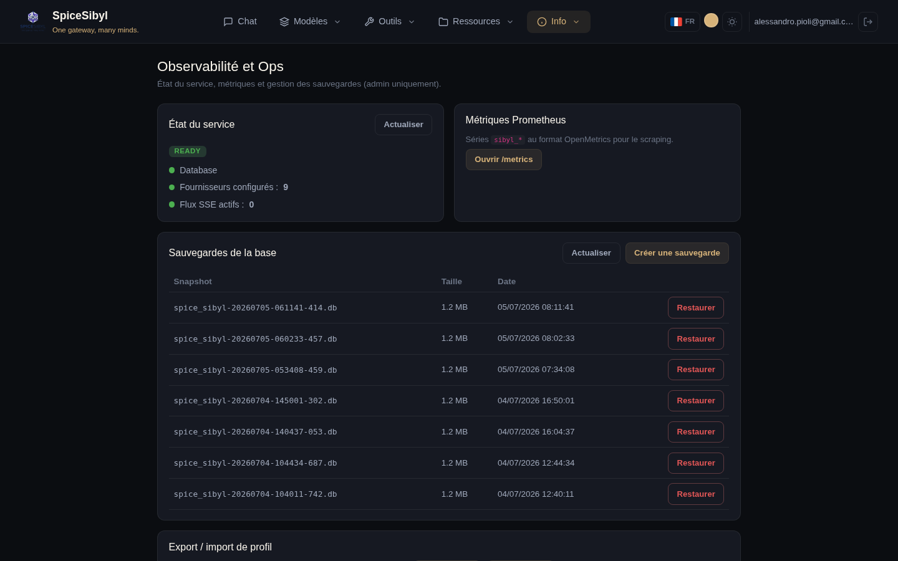

# Observabilité et opérations

## Page Ops (admin uniquement)

**Ce que ça fait.** Un tableau de bord opérationnel réservé aux admins (entrée de navbar protégée par `adminGuard`) : readiness en direct (BDD, fournisseurs configurés, flux SSE actifs extraits de `/metrics`), lien vers les métriques brutes, gestion des sauvegardes et export/import par profil.



## Health et readiness

| Endpoint | Usage |
|----------|-------|
| `GET /api/v1/health` | liveness — contrat stable utilisé par le HEALTHCHECK du Dockerfile |
| `GET /api/v1/ready` | readiness — vérifie la connectivité BDD et au moins un fournisseur configuré ; `503` si dégradé |

Le fichier compose définit des healthchecks backend explicites ; nginx et certbot démarrent avec `depends_on: condition: service_healthy`.

## Métriques Prometheus

`GET /api/v1/metrics` (format OpenMetrics) expose :

- `sibyl_http_requests_total` / `sibyl_http_request_duration_seconds`
- `sibyl_provider_requests_total`, `sibyl_provider_tokens_total{kind}`, `sibyl_provider_latency_seconds`
- `sibyl_active_sse_streams`

Garde par jeton bearer facultative : `METRICS_TOKEN`. Un tableau de bord Grafana prêt à l'emploi est dans [`docs/grafana-dashboard.json`](../grafana-dashboard.json).

## Logs structurés et corrélation des requêtes

Avec `LOG_FORMAT=json` les logs sortent en JSON et portent un `request_id` (ContextVar) généré par le `RequestContextMiddleware` — il réutilise un `X-Request-ID` entrant et le renvoie dans la réponse. L'id est propagé au sidecar Multi-MCP via en-tête et lié aux flux Telegram : traçage de bout en bout de chaque requête.

## Sauvegarde et restauration de la base

**Ce que ça fait.** Une tâche d'arrière-plan opt-in qui fige SQLite via l'API de sauvegarde en ligne (sans verrou applicatif) sur un volume monté, avec intervalle et rétention configurables.

```env
BACKUP_ENABLED=true
BACKUP_DIR=/data/backups
# + intervalle et rétention
```

**Comment l'utiliser.**
- **Depuis la page Ops** : section « Sauvegardes de la base » — liste des instantanés avec taille et date, **Créer une sauvegarde** immédiate, **Restaurer** sur un instantané.
- **Depuis l'API** (admin, audité) : `POST /v1/admin/backup`, `GET /v1/admin/backups`, `POST /v1/admin/restore`.

## Export / import par profil

Un zip unique avec conversations, messages, base de connaissances, modèles et étiquettes d'un profil : `GET /v1/admin/export` / `POST /v1/admin/import`, aussi disponibles depuis la page Ops. Utile pour migrer un profil entre instances ou comme sauvegarde sélective.

## Déploiement en production

En bref (détails dans [deploy.md](../deploy.md)) :

- `docker-compose.prod.yml` avec **nginx** servant le build Angular statique sur `/` et proxyfiant `/api` vers le backend ;
- `PUBLIC_URL` ajouté automatiquement au CORS ;
- TLS auto-détecté depuis les certificats dans `nginx/ssl/` avec un sidecar Certbot facultatif, repli HTTP si absents ;
- Dockerfile multi-étapes (`node:20-alpine` → build → `nginx:1.27-alpine`) ;
- pensez à définir `VAULT_SECRET_KEY` (un avertissement de sécurité est journalisé au démarrage s'il reste à la valeur par défaut).
