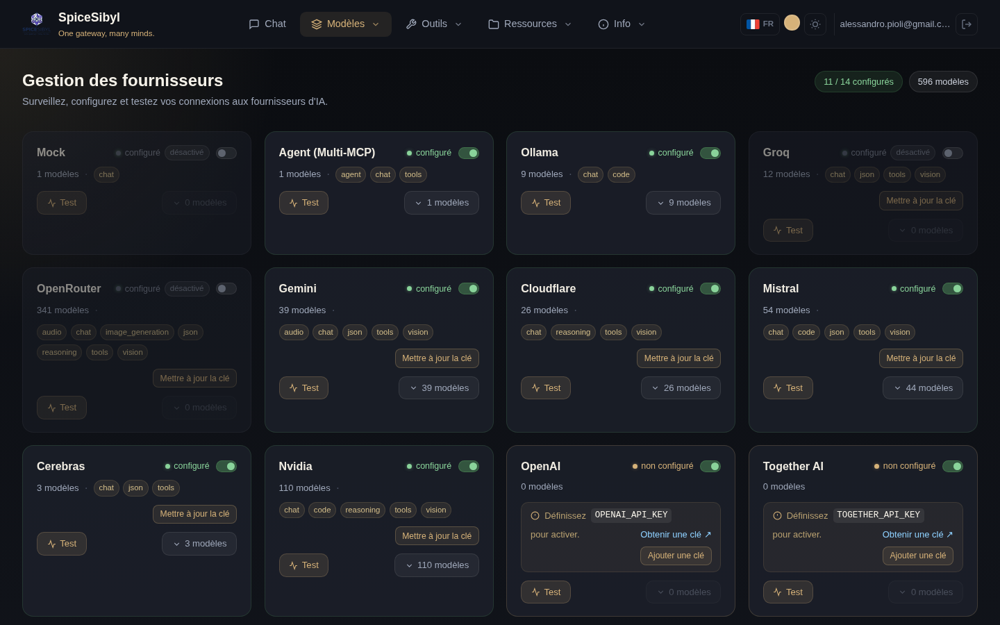
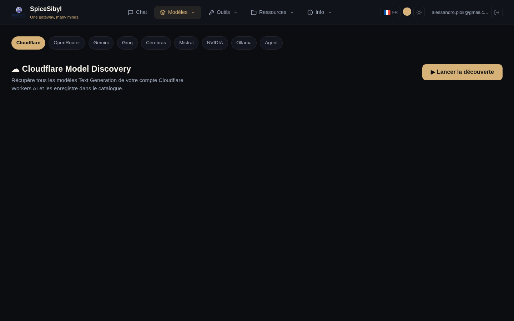

# Fournisseurs et modèles

## Page Fournisseurs

**Ce que ça fait.** Un tableau de bord de tous les fournisseurs pris en charge : état de configuration, nombre de modèles catalogués, capacités agrégées (chat, vision, tools, json…), interrupteur on/off, test de connectivité et gestion des clés API.



**Comment l'utiliser.**
- **Ajouter une clé / Mettre à jour la clé** : stocke ou met à jour la clé API du fournisseur. La clé va dans le **coffre chiffré** (voir ci-dessous), pas dans un fichier de config.
- **Test** : `POST /providers/{id}/test` exécute une vraie requête de complétion minimale contre le fournisseur cloud (pas un simple contrôle de présence de clé) et rapporte résultat/latence.
- **Interrupteur** : active/désactive le fournisseur **globalement**, sans supprimer la clé.
- **N modèles** : déplie le catalogue de modèles du fournisseur, avec les contrôles de visibilité (voir ci-dessous).

L'encart en haut à droite résume combien de fournisseurs sont configurés et le nombre total de modèles disponibles.

## Visibilité des modèles dans le sélecteur

**Ce que ça fait.** Certains fournisseurs exposent des dizaines ou centaines de modèles, rendant le menu des modèles interminable. Ici vous pouvez **choisir quels modèles** apparaissent dans le sélecteur, par fournisseur.

**Comment l'utiliser.** Dépliez un fournisseur (**N modèles**) : chaque modèle a une icône **œil** :
- 👁 **visible** → apparaît dans le menu du chat ; cliquez pour le masquer.
- 👁‍🗨 **barré** → masqué (ligne grisée) ; cliquez pour le réafficher.

En haut de la liste : un compteur **« N visibles · M masqués »** et les boutons **Tout afficher / Tout masquer** pour agir sur tout le fournisseur d'un coup. Quand un fournisseur a des modèles masqués, la carte affiche un badge **« N masqués »** toujours visible (même liste repliée). Le choix est **persisté** (préférence `hiddenModels`) et les modèles masqués sont exclus du menu du chat en temps réel.

> **Deux filtres distincts.** Ceci est un filtre **par modèle**. Dans la barre latérale du chat, sous **Modèle**, il y a en revanche le filtre des **fournisseurs visibles** qui agit sur un fournisseur entier. Les deux se combinent : excluez d'abord des fournisseurs entiers, puis affinez modèle par modèle. Les deux sont personnels et ne touchent pas l'activation globale du fournisseur.

## Coffre des clés API

**Ce que ça fait.** Les clés sont chiffrées avec Fernet (AES-128-CBC + HMAC-SHA256) et stockées dans SQLite, avec un cache en mémoire. Tous les fournisseurs se replient coffre → variable d'environnement : si la clé n'est pas dans le coffre, celle de `.env` est utilisée.

**Configuration.** Définissez un `VAULT_SECRET_KEY` robuste en production : un avertissement de sécurité est journalisé au démarrage s'il reste à la valeur par défaut. API : `PUT /providers/{id}/key`, `DELETE /providers/{id}/key`.

## Découverte des modèles

**Ce que ça fait.** Récupère en direct le catalogue de modèles depuis l'API de chaque fournisseur (Cloudflare, OpenRouter, Gemini, Groq, Cerebras, Mistral, NVIDIA, Ollama, Agent) et l'enregistre dans le catalogue interne — la liste des modèles sélectionnables dans le chat reste à jour sans éditions manuelles.



**Comment l'utiliser.** Page **Découverte** → choisissez le fournisseur dans la barre d'onglets → **Lancer la découverte**. Les modèles découverts sont listés et enregistrés dans le catalogue.

## Routage par préfixe

La passerelle route chaque requête selon le préfixe du nom de modèle :

| Préfixe | Fournisseur |
|---------|-------------|
| `ollama/…`, `groq/…`, `mistral/…`, `together_ai/…`, `fireworks_ai/…`, `huggingface/…` | LiteLLM |
| `gemini/…` | adaptateur dédié Google Generative AI |
| `openrouter/…` | OpenRouter |
| `cloudflare/…` | Cloudflare Workers AI |
| `cerebras/…` | Cerebras (HTTP direct) |
| `agent/…` | orchestrateur Multi-MCP (voir [MCP et agents](mcp-and-agents.md)) |

## Repli automatique de fournisseur

**Ce que ça fait.** Si un fournisseur échoue ou expire **avant** d'émettre le premier token, la passerelle réessaie de façon transparente le fournisseur suivant de la `CHAT_FALLBACK_CHAIN` (format `provider:model,provider:model,...`). Le basculement est signalé par une trame SSE `provider_switch`, affichée comme avis dans l'interface. Une fois les tokens en cours de streaming, l'erreur est propagée (pas de sortie dupliquée).

**Configuration.** Dans `backend/.env` :

```env
CHAT_FALLBACK_CHAIN=groq:llama-3.3-70b-versatile,ollama:qwen2.5:7b-instruct
```

Des chaînes analogues existent pour les images (`IMAGE_GENERATION_CHAIN`) et les embeddings (`EMBEDDING_CHAIN`).
