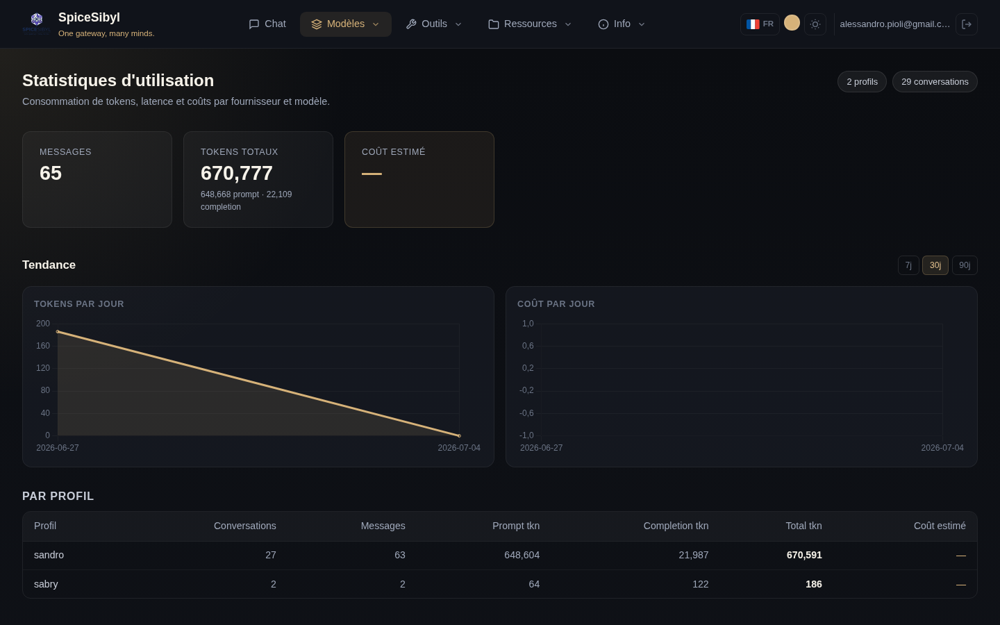

# Statistiques d'utilisation

**Ce que ça fait.** Chaque message stocké porte sa télémétrie (tokens prompt/completion, latence, estimation de coût rapportée par le fournisseur). La page **Statistiques** agrège ces données par profil ou globalement.

## Contenu de la page

- **Cartes de synthèse** : messages totaux, tokens totaux (avec répartition prompt/completion), coût estimé.
- **Tendance** — graphiques quotidiens : aire des tokens et barres des coûts, avec une plage commutable **7j / 30j / 90j** (`GET /v1/stats/daily`, agrégation par date SQLite).
- **Par profil** : tableau conversations/messages/tokens/coût pour chaque profil.
- **Par fournisseur et par modèle** : tableaux ventilant l'utilisation par fournisseur et par modèle — utiles pour voir où vont les tokens et ce qui coûte réellement.

## Comment l'utiliser

Accédez à **Statistiques** depuis la barre de navigation. Les données couvrent l'utilisateur authentifié (tous ses profils) ; les compteurs en haut à droite indiquent combien de profils et de conversations sont inclus.

**API.** `GET /v1/stats` (par profil ou global), `GET /v1/stats/daily` pour les séries quotidiennes.

**Remarque sur les coûts.** Le coût est une estimation rapportée par les fournisseurs : pour les modèles locaux (Ollama) ou les paliers gratuits il reste à zéro/—.
