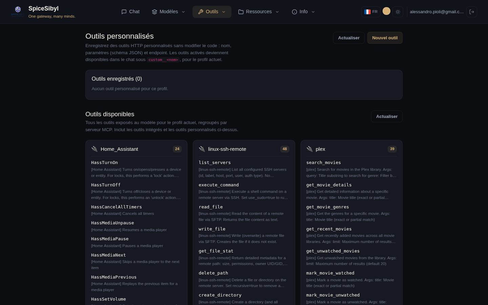

# Appel d'outils (tool calling)

## Boucle d'exécution côté serveur

**Ce que ça fait.** Avec l'interrupteur **Tool calling ON** de la barre latérale, le backend expose les outils enregistrés au modèle et exécute les appels demandés côté serveur, en renvoyant les résultats au modèle dans une boucle (max 5 itérations en chat, configurable via `CHAT_MAX_TOOL_ITERATIONS` ; pour des boucles plus longues voir les [workflows](mcp-and-agents.md#workflows-persistants)). Appels et résultats sont diffusés comme événements SSE `tool_call` / `tool_result` et rendus comme bulles dédiées dans la conversation ; les appels en attente affichent un spinner.

**Liste des outils disponibles :** `GET /api/v1/tools` (union des intégrés + outils personnalisés du profil + MCP). L'interrupteur **Tool calling ON/OFF** se trouve dans la section **Fonctions** de la barre latérale ; la gestion et la vue d'ensemble des outils sont sur la page **Outils** (lien *Gérer →*).

## Outils intégrés

| Outil | Ce qu'il fait |
|-------|---------------|
| `get_datetime` | date/heure actuelles |
| `calculator` | évalue des expressions mathématiques |
| `web_search` | recherche web via DuckDuckGo (scraping HTML pour des extraits riches, avec repli sur l'API instant-answer) |
| `read_url` | récupère une page web et renvoie son texte (HTML retiré, max 4 000 caractères) |
| `python_exec` | interpréteur de code sandboxé (voir ci-dessous) |
| `kb_search` | RAG agentique : interroge la base de connaissances du profil à la demande du modèle |
| `search_conversations` | mémoire épisodique : recherche plein texte (FTS5) dans les conversations passées |
| `generate_image` | génère une image via la chaîne de fournisseurs configurée ; l'image est montrée à l'utilisateur |
| `get_weather` | météo actuelle + prévisions via Open-Meteo (gratuit, sans clé API) |
| `fetch_rss` | les N dernières entrées d'un flux RSS 2.0 / Atom |
| `create_reminder` | crée un rappel Telegram pour le compte associé (« rappelle-moi demain à 9h… ») |
| `extract_document` | télécharge un PDF/DOCX/TXT/MD depuis une URL et renvoie son texte, sans ingestion en KB |
| `http_request` | appel HTTP générique GET/POST vers des API publiques (liste d'autorisation facultative `HTTP_REQUEST_ALLOWED_DOMAINS`) |

**Durcissement SSRF.** `read_url`, `fetch_rss`, `extract_document` et `http_request` refusent les URL dont l'hôte résout vers des adresses privées/loopback/link-local. `kb_search`, `search_conversations` et `create_reminder` opèrent automatiquement sur le profil de l'appelant.

## Outils personnalisés (HTTP)

**Ce que ça fait.** Enregistrez des outils HTTP depuis l'interface, sans toucher au code : nom, description, paramètres (JSON Schema), URL/méthode/en-têtes, authentification (aucune / bearer / en-tête personnalisé), timeout. Ils sont stockés par profil dans la table `custom_tools` et injectés dans la boucle de chat sous l'espace de noms `custom__<nom>`.

**Comment l'utiliser.**
1. Page **Outils** → **Nouvel outil**.
2. Remplissez le formulaire (nom, description, schéma JSON des paramètres, endpoint, auth, timeout) et enregistrez.
3. Utilisez le **panneau de test intégré** pour un appel d'essai avant de l'activer.
4. L'interrupteur d'activation active/désactive l'outil sans le supprimer.

**Sémantique d'appel.** Les arguments produits par le modèle sont envoyés en corps JSON (POST/PUT/PATCH) ou en query string (GET) ; le corps de la réponse est le résultat de l'outil. API : CRUD + test sous `/api/v1/tools/custom` (opérations auditées).

## Outils disponibles groupés par serveur MCP

**Ce que ça fait.** Sous la gestion des outils personnalisés, la page **Outils** liste **tous les outils exposés au modèle** pour le profil actuel, **regroupés en une carte par serveur MCP** (plus une carte *Built-in* et une *Custom*).

**Comment l'utiliser.** Chaque carte affiche le **nom du serveur MCP** en titre, un badge avec le nombre d'outils, et en dessous la **liste des outils** (nom sans le préfixe `mcp__<serveur>__`, plus sa description). Pratique pour voir d'un coup d'œil ce que fournit chaque serveur MCP connecté. Le bouton **Actualiser** recharge la liste.

## Interpréteur de code sandboxé (`python_exec`)

**Ce que ça fait.** Exécute du code Python dans un sous-processus isolé `python -I` avec :

- des rlimits sur CPU, mémoire (`CODE_INTERPRETER_MEMORY_MB`), taille de fichier, nombre de fd/processus ;
- un timeout mural (`CODE_INTERPRETER_TIMEOUT`, tue tout le groupe de processus) ;
- un environnement minimal et **pas de réseau** (stub des sockets au niveau Python) ;
- un répertoire de travail éphémère avec fichiers en entrée/sortie : les `files` d'entrée sont matérialisés avant l'exécution, les fichiers créés sont rapportés dans le résultat (petits fichiers texte en inline) et tout est supprimé ensuite.

**Configuration.** Activé par défaut ; désactivation avec `CODE_INTERPRETER_ENABLED=false`.

**Comment l'utiliser.** Avec le tool calling activé, demandez simplement au modèle quelque chose qui exige du calcul/du code (« exécute ce script », « analyse ces nombres ») ; le modèle invoque `python_exec` de lui-même.
