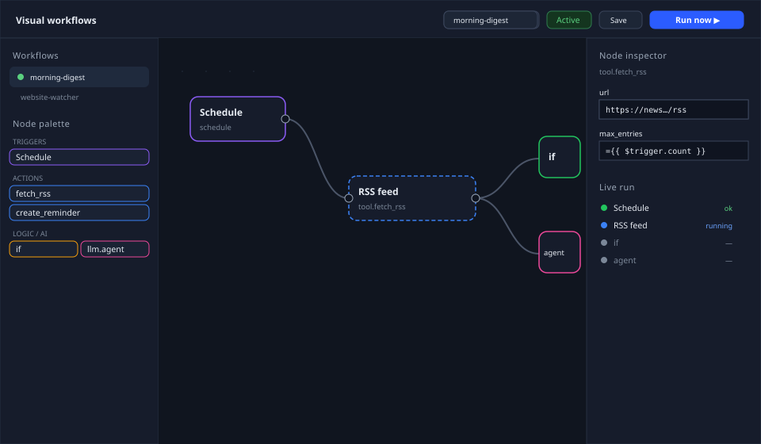

# Workflows visuels en graphe de nœuds (Phase 29)

SpiceSibyl dispose de deux moteurs d'automatisation complémentaires :

- **Workflows agent** (`/workflows`, Phase 18) — vous donnez un *objectif* et un LLM itère
  de façon autonome sur tout le registre d'outils jusqu'à produire une réponse. Puissant,
  mais non déterministe et sans flux de contrôle explicite.
- **Workflows visuels** (`/graph-workflows`, Phase 29) — vous dessinez un *graphe* : un
  **déclencheur** alimente des **nœuds typés** reliés par des connexions. Le moteur exécute
  le graphe de manière **déterministe**, exactement dans la forme conçue. La boucle agent
  reste disponible ici via le nœud `llm.agent`, pour injecter de l'autonomie là où vous le
  souhaitez dans une pipeline déterministe.




<p align="center">
  
</p>


## Le canevas

L'éditeur se compose de trois volets :

- **Gauche** — vos workflows et une **palette de nœuds** par catégorie (Déclencheurs ·
  Actions · Logique · Données · IA). Chaque outil intégré, MCP et personnalisé apparaît
  automatiquement comme nœud `tool.<nom>` — aucun code supplémentaire par outil.
- Une barre d'outils au-dessus du canevas propose **Annuler/Rétablir** (`Ctrl+Z` /
  `Ctrl+Maj+Z`, aussi `Ctrl+Y`), **Copier/Coller** un nœud (`Ctrl+C` / `Ctrl+V` — colle un
  duplicata décalé avec le même type et les mêmes paramètres) et **Commentaire** : un nœud
  "post-it" côté client uniquement, sans poignées d'entrée/sortie et jamais câblé au flux —
  le moteur l'enregistre simplement comme `skipped`, sans changement backend. Les
  raccourcis sont ignorés pendant la saisie dans un champ. Une **zone de recherche**
  au-dessus de la palette filtre les nœuds par libellé ou type (et développe
  automatiquement les groupes MCP/personnalisés correspondants pendant la recherche).
- **Centre** — un **canevas SVG** sans dépendance. Glissez les nœuds pour les placer ;
  glissez d'une **sortie** (à droite) vers une **entrée** (à gauche) pour connecter.
  **Cliquez sur une arête** pour l'inspecter : le panneau de droite affiche source → cible,
  les **données qui y ont transité lors de la dernière exécution** et une liste des
  **champs disponibles avec leur chemin d'expression prêt à l'emploi** (p. ex.
  `$node.weather.output.result`) — un clic sur un champ le copie comme expression
  `{{ … }}`. Un bouton supprime la connexion. Quand un nœud échoue, son **message
  d'erreur** apparaît en rouge sous le nœud dans le panneau en direct (et dans le détail
  de la vue Exécutions).
- **Droite** — l'**inspecteur** du nœud sélectionné (ses paramètres, générés depuis le schéma
  du type de nœud) ou, si rien n'est sélectionné, le **panneau exécution et déclencheurs**.

Enregistrez avec **Enregistrer**, basculez **Actif** pour laisser les déclencheurs se
déclencher, et **Exécuter** pour lancer le graphe — les nœuds passent au vert/bleu/rouge/gris
(ok/en cours/erreur/ignoré) en temps réel via SSE. Le panneau d'exécution propose un champ
**payload** optionnel (JSON) : son objet devient le `$trigger` de l'exécution, ce qui permet
de tester à la main les graphes qui lisent `={{ $trigger.<champ> }}`, sans appel webhook.

### La vue par workflow — `/graph-workflows/{id}`

Chaque workflow a aussi sa propre page (ouvrez-la avec ⧉ dans la liste, ou depuis une
ligne d'exécution/planification) : une barre d'onglets **Éditeur | Exécutions |
Planifications** limitée à ce workflow. L'onglet Exécutions est le registre préfiltré ;
l'onglet Planifications liste et crée les déclencheurs pour lui seul. Les pages globales
restent les vues transversales.

L'éditeur est composantisé (roadmap phase 1) : canevas SVG, palette, barre d'outils,
inspecteurs de nœud/arête et run panel sont des composants Angular standalone dans
`features/workflows/editor/` — voir `docs/frontend-overview.md`.

### DX de l'éditeur — tester, épingler, naviguer (phase 3)

Construire et déboguer un graphe n'exige pas d'exécutions complètes :

- **Tester le nœud** (⚡ dans l'inspecteur) exécute **uniquement le nœud sélectionné**,
  avec ses paramètres actuels — même non enregistrés — et affiche la sortie, le handle
  actif et la durée inline (`POST /{id}/nodes/{node_id}/test` ; rien n'est enregistré
  dans le registre des exécutions). L'entrée provient de la sortie épinglée/la plus
  récente du nœud amont, ou du JSON d'**entrée simulée** optionnel de l'inspecteur.
- **Sorties épinglées** (📌) : fige la sortie d'un nœud — un clic sur sa dernière
  sortie, ou un JSON édité à la main. Les tests de nœuds, les **exécutions partielles**
  (*Exécuter depuis ce nœud*) et les aperçus d'expressions résolvent
  `$node.<id>.output` depuis l'épingle au lieu de l'historique : idéal pour développer
  en aval d'un payload webhook réel sans le redéclencher. Les épingles sont enregistrées
  avec le workflow (et voyagent avec l'export), affichent un badge 📌 sur le canevas et
  sont **totalement ignorées par les exécutions de production**
  (manual/schedule/webhook/event).
- **Dernière exécution** dans l'inspecteur montre le statut, la sortie et l'erreur les
  plus récents du nœud sélectionné (exécution live, test ou historique) sans quitter le
  canevas.
- **Multi-sélection** : shift+clic ajoute/retire des nœuds ; le glisser déplace toute la
  sélection ; `Ctrl+A` sélectionne tout ; `Ctrl+C/V` copie et colle la sélection **avec
  ses arêtes internes** (ids réattribués) ; `Suppr`/`Backspace` la supprime.
- **Pan & zoom** : faites glisser le canevas vide pour le déplacer, molette pour zoomer
  autour du curseur. Une **minimap** (en bas à droite) montre le graphe entier plus le
  viewport — clic/glisser pour naviguer, double-clic pour ajuster. La barre d'outils
  ajoute **Réorganiser** (auto-layout par couches, annulable) et **⛶ ajuster la vue**.
- La **galerie de modèles** (✨) s'ouvre en **grande modale centrée** au-dessus de
  l'éditeur : grille multi-colonnes de cartes, chacune avec un aperçu du graphe plus
  grand, la catégorie, la chaîne du flux (noms des nœuds reliés par →), le nombre de
  nœuds/connexions et la description complète — filtrable par catégorie avant import.
  La **liste des workflows est repliable** (▾/▸ dans son en-tête, mémorisé entre les
  sessions), laissant l'espace de la barre latérale à la palette de nœuds.

## Types de nœuds

| Catégorie | Nœuds |
|-----------|-------|
| **Déclencheur** | `manual`, `schedule`, `webhook`, `event`, `error`, `success` (autre workflow terminé — phase 6.1), `file.watch` / `email.inbound` (déclencheurs par sondage — phase 6.2) |
| **Action** | `tool.<nom>` — n'importe quel outil du registre (RSS, read_url, météo, kb_search, http_request, python_exec, MCP, personnalisé…) · `http.request` (appel HTTP générique) · `subworkflow` (exécute un autre workflow en ligne) · `human.approval` (suspend jusqu'à approbation/rejet humain — phase 4.4) · `human.input` (suspend jusqu'à ce qu'une personne remplisse un formulaire JSON-Schema — phase 10.1) · `wait.event` (suspend jusqu'à l'arrivée d'un événement externe corrélé — phase 10.2) |
| **Logique** | `if` (branche vrai/faux), `switch` (branches par cas), `merge` (rassemble les entrées), `wait` (attend N secondes ou jusqu'à un instant précis) |
| **Données** | `set` (construit un objet), `filter` (garde les éléments qui correspondent), `code` (sandbox Python), `aggregate` (réduit un tableau — sum/avg/min/max/count/concat sur un champ), `batch` (découpe un tableau en blocs de taille fixe), `db.query` (SQL paramétré — sqlite/postgres), `file.read` / `file.write` (stockage du workspace), `file.parse` (parse JSON/CSV/lignes à la volée) |
| **IA** | `llm.completion` (un appel au fournisseur), `llm.agent` (toute la boucle agent de la Phase 18), `llm.classify` / `llm.extract` (sortie structurée garantie — phase 4.1) |

> **Chaînes de secours** — `llm.completion` et `llm.agent` exposent un menu **Failover
> chain**, alimenté par les listes de modèles nommées définies dans Réglages → Modèles →
> Chaînes de secours LLM. Si elle est définie, un échec d'appel sur le `model` du nœud
> réessaie dans l'ordre les modèles restants de la chaîne ; la sortie du nœud porte alors
> `_failover: { tried: [...], used: "<model>" }`.

### Requêtes HTTP, composition et gestion d'erreurs

- **`http.request`** — appelle n'importe quelle API HTTP externe (`method`, `url`,
  `query`/`headers`, `body`, `timeout` ≤ 120 s). Sortie : `{ status, ok, headers, json, text }`.
  Par défaut une réponse non-2xx lève une erreur (les retries et la politique *En cas
  d'erreur* s'appliquent donc) ; `allow_errors` renvoie la réponse quel que soit le statut.
- **`subworkflow`** — exécute un autre workflow du même profil comme run enfant et renvoie
  `{ run_id, workflow_id, status, output }` (`output` = sortie du nœud terminal de l'enfant).
  Le `payload` devient le `$trigger` de l'enfant. Imbrication limitée à 5 niveaux.
- **Délai d'expiration (ms)** (inspecteur, section Avancé) — plafond strict de temps pour
  une *seule* tentative (`0` le désactive, max 600 000). Une tentative expirée est
  interrompue et échoue comme n'importe quelle erreur, donc toujours soumise aux retries et
  à la politique *En cas d'erreur* — la protection idiomatique pour un `http.request`, un
  `llm.agent` ou un outil MCP bloqué qui figerait sinon toute l'exécution.
- **Retries & stratégie de backoff** (inspecteur, section Avancé — phase 2.1) — réexécute
  le nœud jusqu'à N fois en attendant `backoff` secondes entre les tentatives. **Fixe**
  attend toujours `backoff` secondes ; **Exponentiel** attend `backoff × 2^tentative`
  (max 60 s par pause). Les nouveaux nœuds `http.request` et `llm.*` arrivent préréglés
  depuis le catalogue (ex. HTTP : 2 retries, backoff exponentiel 2 s, timeout 60 s).
- **En cas d'erreur** (inspecteur, section Avancé) — après épuisement des retries :
  **arrêter l'exécution** (défaut), **continuer sur la branche principale** avec `{ error }`,
  ou **router vers la branche d'erreur** : le nœud gagne une sortie **`error`** dédiée et
  `{ error, input }` suit cette branche pendant que `main` est ignorée — un try/catch
  dessiné sur le canevas.
- **Notifications** — `notify.telegram` (chat Telegram liée au profil ; `parse_mode`
  optionnel `Markdown`/`MarkdownV2`/`HTML` pour rendre le formatage — `**gras**` CommonMark
  est normalisé en `*gras*` à un astérisque, propre à Telegram ; les messages de plus de
  4096 caractères sont automatiquement découpés en plusieurs messages), `notify.email`
  (SMTP via `SMTP_*`), `notify.webhook` (Slack/Discord/ntfy/…), `notify.inapp`
  (cloche de la web UI, aucune configuration).
- **Vue Exécutions** — `/graph-workflows/runs` : le registre de toutes les exécutions du
  profil (statut, déclencheur, durée, résultats par nœud, suivi SSE en direct), séparé du
  designer ; l'éditeur se rattache à l'exécution en cours quand on rouvre son workflow.

### Nœuds de la phase 4 — IA structurée, BD/fichiers, approbation humaine

- **`llm.classify` / `llm.extract`** (phase 4.1) — nœuds IA à **forme de sortie
  garantie** : `llm.classify` classe l'entrée dans l'une des `categories` déclarées
  (sortie `{ category, confidence }` — une catégorie hors liste lève une erreur, les
  reprises s'appliquent donc) ; `llm.extract` extrait des données conformes à un **JSON
  Schema** déclaré dans l'inspecteur (les propriétés `required` sont exigées ; sortie
  `{ data }`). Les deux utilisent le sélecteur de modèles, la chaîne de secours et le
  cache de réponses comme `llm.completion`.
- **`db.query`, `file.read`, `file.write`, `file.parse`** (phase 4.2) — SQL paramétré
  (`{ rows, count, rowcount }`, max 1000 lignes ; les bases sqlite vivent dans le
  stockage du workspace, Postgres via un `dsn` tiré de `$secrets`) et nœuds fichiers sur
  le **stockage du workspace** (`GRAPH_WORKFLOW_FILES_DIR`, max 10 Mo) :
  `json → {data}`, `csv → {rows, count}`, `lines → {lines, count}`, `text → {text, size}`.
  Tout chemin est résolu *à l'intérieur* du stockage — chemins absolus et traversée `..`
  font échouer le nœud.
- **`human.approval`** (phase 4.4) — l'exécution se **suspend** (statut `waiting`), crée
  une demande d'approbation, notifie in-app (Telegram en option) et attend la décision
  depuis la vue Exécutions (**✓ Approuver / ✕ Rejeter**, commentaire facultatif) ou via
  l'API (`GET /approvals`, `POST /approvals/{id}/decision`). La décision route le graphe
  par la sortie **`approved`** ou **`rejected`** ; `timeout` (24 h par défaut, plafond
  `GRAPH_WORKFLOW_APPROVAL_MAX_TIMEOUT` = 7 jours) et `onTimeout` (`reject` | `fail`)
  gouvernent l'expiration. L'attente survit aux redémarrages (checkpoints de la phase
  2.4) ; annuler une exécution en attente clôt la demande en `cancelled`.

### Human-in-the-loop avancé — `human.input`, `wait.event` (phase 10)

Deux nœuds supplémentaires suspendent l'exécution (`waiting`) de la même façon que
`human.approval`, en généralisant sa ligne de demande en un `kind` (`approval` | `input` |
`event`) : les trois partagent ainsi la même boucle de sondage/reprise et survivent
identiquement à un redémarrage du backend.

**`human.input`** — la demande porte un **formulaire défini par un JSON Schema**
(paramètre `schema` : champs, types, `required`, `enum`). La décision se prend depuis la
vue Exécutions (les champs s'affichent sous forme de formulaire) ou via l'API ; les
`data` soumises sont **validées par rapport au schéma** avant d'être acceptées.
L'exécution reprend sur la branche **`submitted`** avec `{ data, status, comment,
decided_by }` en sortie ; un dépassement de délai suit `onTimeout` (`branch` route vers
la branche **`timeout`**, `fail` fait échouer le nœud). Débloque les flux « demander à
l'opérateur la valeur manquante » — par exemple un montant de dépense et sa catégorie
avant de continuer.

```
POST /v1/graph-workflows/approvals/{aid}/submit  { data: {...}, comment? }
```

**`wait.event`** — l'exécution se suspend jusqu'à ce qu'un **système externe** délivre un
événement portant un **identifiant de corrélation** correspondant. `correlationId`
(expression, p. ex. un id de commande tiré de `$trigger`) nomme la clé ;
`POST /v1/graph-workflows/events/{correlation_id}` (authentifié, cantonné au profil)
réveille l'exécution et livre son `payload` comme **sortie** du nœud, via la branche
**`main`**. Mêmes `timeout` / `onTimeout` (`branch` | `fail`) que `human.input`. Couvre
les vrais callbacks asynchrones — paiements, signatures électroniques, tickets, webhooks
tiers — sans sondage. Une exécution `waiting` n'occupe pas de créneau de
`max_concurrent_runs`.

```
POST /v1/graph-workflows/events/{correlation_id}  { payload: {...} }
```

Paramètres (les deux nœuds) : `title`, `message` (expression), `timeout` (secondes,
24 h par défaut, plafonné par `GRAPH_WORKFLOW_APPROVAL_MAX_TIMEOUT`), `onTimeout`.
`human.input` prend en plus `schema` (le JSON Schema du formulaire) ; `wait.event` prend
`correlationId` à la place.

### Phase 5 — métriques, import/partage, workflows générés

- **Métriques** (phase 5.1) — `GET /v1/graph-workflows/stats` agrège par workflow :
  exécutions par issue, **taux de réussite**, **durée moyenne** et les **totaux de
  tokens LLM** issus de la clé `_usage` des nœuds `llm.*`. La vue Exécutions les
  affiche en bandeau de tableau de bord ; le détail montre les tokens de l'exécution
  ouverte.
- **Export/import et partage** (phase 5.2) — l'export porte désormais un tableau
  `secrets` (uniquement les **noms** des `$secrets` référencés) ;
  `POST /v1/graph-workflows/import` valide le snapshot (schéma + limite de nœuds) et
  renvoie des avertissements non bloquants (types de nœuds inconnus, `$secrets`
  manquants). Les workflows se partagent dans un workspace
  (`POST /v1/workspaces/{ws}/workflows`) et les membres peuvent en importer une copie
  dans leur profil (`POST /{ws}/workflows/{wid}/import`).
- **Workflows générés** (phase 5.3) — le bouton 🪄 ouvre le dialogue « décrivez ce que
  vous voulez » avec **sélecteur de modèle** et **chaîne de secours** facultative :
  `POST /v1/graph-workflows/generate` produit un **brouillon validé et normalisé** à
  partir du catalogue de nœuds (types inconnus/arêtes cassées supprimés, trigger ajouté
  s'il manque, auto-layout) et l'ouvre dans l'éditeur. L'UI utilise le jumeau en
  streaming `POST /generate/stream` : des événements SSE `log` affichent chaque étape en
  **journal en direct** (catalogue, appel du modèle, réponse, validation, layout) au
  lieu d'un simple spinner.

## Expressions

Tout paramètre peut être un littéral **ou** une expression, distinguée par son préfixe :

- `={{ … }}` — une **mini-expression sûre**, analysée et évaluée sur une liste blanche
  (**pas de `eval`/`exec`**). Vous pouvez naviguer dans le contexte d'exécution et appeler un
  ensemble fixe de fonctions pures :

  ```
  ={{ $node.rss.output.result }}          # sortie d'un autre nœud
  ={{ $trigger.count }}                    # charge utile du déclencheur
  ={{ upper($json.title) }}                # fonction autorisée
  ={{ default($trigger.name, 'monde') }}
  ={{ $trigger.count > 3 }}                # comparaisons → if/switch
  Bonjour ={{ $trigger.name }} !           # interpolation de chaîne
  ```

  Contexte : `$node.<id>.output.<chemin>`, `$json` (entrée principale du nœud), `$trigger`,
  `$env` (variables d'environnement préfixées WF_), `$vars` (variables du workflow), `$secrets` (secrets du profil, déchiffrés seulement le temps d'une exécution), `$now`. Fonctions : `default`, `upper`,
  `lower`, `trim`, `len`, `join`, `slice`, `first`, `last`, `get`, `keys`, `values`, `round`, …

- `=py: …` — une **porte de sortie** vers la sandbox `python_exec` pour de la vraie logique.
  `ctx`, `input`, `node`, `trigger` sont disponibles ; la dernière expression (ou une variable
  `result`) devient la valeur.

Tout ce qui ne commence pas par `=` est un littéral.

## Variables et secrets — `$vars` / `$secrets`

Deux portées de configuration sortent les valeurs des paramètres de nœuds (roadmap phase 1) :

- **Variables (`$vars`)** — paires clé/valeur par workflow, éditables dans la section
  *Variables* du run panel et lisibles depuis n'importe quel nœud via
  `{{ $vars.nom }}`. Une valeur qui parse comme JSON garde son type natif. Les variables
  voyagent avec Export/Import et via l'API (`variables` sur `POST`/`PATCH`) ; les
  modifier n'incrémente **pas** la version du graphe.
- **Secrets (`$secrets`)** — identifiants au niveau du profil partagés par tous vos
  workflows (tokens d'API, chaînes de connexion…), gérés dans la section *Secrets* du
  run panel. Les valeurs sont **chiffrées au repos avec Fernet** (dérivé de
  `VAULT_SECRET_KEY`) et **jamais renvoyées par l'API** — la liste n'affiche que les
  noms. Référence : `{{ $secrets.NOM }}` (p. ex. dans un en-tête `http.request`). Le
  moteur ne les déchiffre que le temps d'une exécution ; le contexte persistant ne les
  contient jamais, *Test expression* les résout en `***` et l'Export les omet
  volontairement.

## Déclencheurs

Depuis le panneau d'exécution :

- **Schedule** — cron / RRULE / langage naturel (« chaque jour à 9:00 »), interprété par le
  même moteur que les rappels. Une boucle de polling exécute les planifications dues et
  recalcule la prochaine échéance. (Ne se déclenche que si le workflow est **Actif**.)
- **Webhook** — une URL publique à jeton (`POST /api/v1/wf/hooks/{token}`). Le corps JSON
  devient `$trigger`. Ne se déclenche que si le workflow est Actif. Vous pouvez le protéger
  avec un secret partagé : `POST /v1/graph-workflows/triggers/{tid}/rotate-secret` en génère
  un (affiché une seule fois) ; ensuite la requête doit porter l'en-tête
  `X-Signature: sha256=<hmac-sha256 hexadécimal du corps brut>`, sinon elle est rejetée (401)
  avant même d'être interprétée.
- **Event** — événements internes. Réglez `config.event` sur le nom de l'événement (vide ou
  `*` pour tous les capter). Deux événements sont câblés aujourd'hui : `document.ingested`
  (après l'ingestion d'un document/URL — payload `{doc_id, filename, profile_id}`) et
  `chat.message.created` (après la persistance d'un échange de chat — payload
  `{conversation_id, profile_id}`).
- **Error** (phase 2.5) — se déclenche quand la run d'un *autre* workflow échoue.
  `config.workflow_id` le restreint à un workflow surveillé (vide / `*` = tous). Le
  payload est `{workflow_id, workflow_name, run_id, error, failed_node}` ; sur le canevas,
  le *nœud* déclencheur `error` sert de point d'entrée. Protégé contre les boucles : un
  workflow ne réagit jamais à ses propres échecs et les runs lancées par un déclencheur
  d'erreur n'en déclenchent pas d'autres. Idéal pour l'alerte centralisée avec les nœuds
  `notify.*`.

Les déclencheurs **schedule** et **event** suivent un compteur d'échecs consécutifs
(`fail_count`/`last_error`) : après `GRAPH_WORKFLOW_TRIGGER_MAX_FAILURES` (5 par défaut)
échecs d'affilée, le déclencheur se désactive automatiquement et une notification in-app
est levée. Le réactiver (`POST /triggers/{tid}/enable`) remet le compteur à zéro.

### Vue Planifications — aperçu des déclencheurs multi-workflows

`/graph-workflows/schedules` (Phase 30.e, même groupe de navbar et feature flag) liste
**une ligne par déclencheur** sur tous les workflows du profil : nom du workflow, type de
déclencheur, prochaine exécution (déclencheurs schedule), statut/heure de la dernière
exécution, compteur d'échecs consécutifs et un interrupteur activer/désactiver — pour tout
voir en un coup d'œil sans ouvrir chaque workflow, ainsi que **Lancer** et **Supprimer**.
Backend : `GET /v1/graph-workflows/schedules`.

> **Un déclencheur ne se déclenche que si son *workflow* est Actif** — l'activation du
> déclencheur est indépendante du drapeau Actif du workflow (à changer depuis le
> concepteur, ou via la pastille Actif/Inactif à côté du nom du workflow ici). Un
> déclencheur parfaitement configuré et activé sur un workflow Inactif ne se déclenchera
> jamais ; le formulaire **+ Nouveau déclencheur** avertit et propose une activation en un
> clic quand le workflow choisi est Inactif — c'est la cause la plus fréquente d'une
> planification fraîchement créée qui ne fait rien en silence.

**Créer un déclencheur** (Phase 30.f) — le panneau **+ Nouveau déclencheur** choisit un
workflow et un type (`schedule`/`webhook`/`event`) ; pour `schedule` il expose un motif
structuré au lieu du langage naturel libre : **Quotidien** (une heure HH:MM),
**Hebdomadaire** (un ou plusieurs jours + heure), **Cron** (préréglages comme "toutes les
15 min"/"toutes les heures"/"minuit"/"jours ouvrés à 9h" qui remplissent un **champ cron
libre à 5 champs**, toujours modifiable, validé avec `croniter`), **Une fois** (date
optionnelle + heure). Les déclencheurs `event` prennent un nom d'événement libre
(`document.ingested` et `chat.message.created` sont câblés aujourd'hui) ; les `webhook` ne
nécessitent aucune config ici — le secret de signature se génère/renouvelle depuis le
concepteur après création.

### Production : concurrence, usage de tokens, alertes

- **Plafond de concurrence** — un sémaphore `GRAPH_WORKFLOW_MAX_CONCURRENT_NODES` (8 par
  défaut) limite le nombre de nœuds indépendants exécutés en parallèle dans une même run.
- **File d'attente par workflow** (phase 2.3) — réglez **Exécutions simultanées max** dans
  la section **Exécution** du panneau d'exécution (ou `max_concurrent_runs` via l'API,
  `0` = illimité) : les runs au-delà de la limite naissent en statut **`queued`** (payload
  du déclencheur parqué avec la run) et démarrent en FIFO dès qu'un emplacement se libère.
  Les runs en file apparaissent dans la vue Exécutions et s'annulent comme les autres ;
  les runs enfants de `subworkflow` contournent la file (un enfant en attente bloquerait
  son parent).
- **Checkpoint & reprise** (phase 2.4) — le contexte de la run (sortie **et handles de
  sortie actifs** de chaque nœud) est persisté après chaque vague. Au démarrage (drapeau
  `GRAPH_WORKFLOW_RESUME_ON_STARTUP`, true par défaut), les runs restées
  `running`/`pending` après un crash/redémarrage reprennent depuis le checkpoint : les
  nœuds terminés ne sont pas réexécutés, seul le sous-graphe manquant tourne ; les runs de
  nœud orphelines sont clôturées en erreur (« interrupted by restart »).
- **Déclencheur d'erreur** (phase 2.5) — voir la section Déclencheurs : un workflow avec
  un déclencheur `error` démarre quand un autre échoue, avec
  `{workflow_id, workflow_name, run_id, error, failed_node}` comme `$trigger`.
- **Usage de tokens** — la sortie des nœuds `llm.completion` et `llm.agent` inclut une clé
  `_usage` (`{tokens_in, tokens_out, tokens_total}`, cumulée sur les étapes de l'agent)
  quand le fournisseur la renvoie ; `null` sinon. Le coût n'est pas estimé — aucune table
  de tarifs par modèle n'existe encore dans le projet.
- **Alerte sur échecs récurrents** — après `GRAPH_WORKFLOW_RUN_FAILURE_ALERT_THRESHOLD`
  (3 par défaut) échecs consécutifs du même workflow, une notification in-app est levée
  une seule fois (pas à chaque échec suivant).
- **Cache de réponses** — `llm.completion` et chaque étape de `llm.agent` réutilisent le
  même cache de réponses que le chat (`RESPONSE_CACHE_ENABLED`, `RESPONSE_CACHE_TTL_SECONDS`,
  `RESPONSE_CACHE_MAX_ENTRIES`, plus la couche floue `SEMANTIC_CACHE_*` de la Phase 26). Une
  requête `(model, messages, temperature, max_tokens)` identique évite entièrement le
  fournisseur ; la sortie du nœud porte `_cache: "hit" | "semantic" | "miss"` à côté de
  `_usage`. Les étapes `llm.agent` avec appels d'outils ne sont jamais mises en cache (même
  règle que le chat : une requête avec `tools` n'obtient jamais de clé de cache).

## Versions et exécutions

Le run panel a une section **Versions** : chaque snapshot avec son horodatage et un
**Restaurer** en un clic — la restauration sauvegarde d'abord le graphe courant comme
nouvelle version, un rollback est donc toujours réversible.

Chaque enregistrement crée une version immuable ; vous pouvez lister les versions et revenir
en arrière. Chaque exécution stocke le graphe exécuté, le contexte résolu et un enregistrement
par nœud (entrée, sortie, erreur, durée) inspectable après coup.

Comme chaque valeur est persistée, l'éditeur n'a pas besoin d'une exécution en direct pour
afficher des données : à l'ouverture d'un workflow il charge **la dernière sortie
enregistrée de chaque nœud sur toutes les exécutions passées** (`GET /{id}/node-outputs`) ;
cliquer sur une flèche montre donc les champs et le payload qui y ont transité
historiquement — avec la note « données d'une exécution passée » et son horodatage. Une
nouvelle exécution remplace simplement ces valeurs par les données en direct.

**Export** : le bouton *Exporter* (ou `GET /{id}/export`) télécharge le workflow en
snapshot JSON portable (`{ kind, schema_version, name, description, graph, … }`) ; le même
corps est ré-importable via `POST /v1/graph-workflows`. Depuis la phase 7.2, le snapshot
porte aussi `environments` — les environnements nommés du workflow (uniquement les
surcharges `$vars` et les **alias** `$secrets`, jamais les valeurs ; une `version`
épinglée ne s'applique dans l'environnement cible qu'après une nouvelle promotion
là-bas, les numéros de version n'étant pas portables entre workflows).

**Import** : le bouton 📥 à côté de **Nouveau** (en haut de la liste des workflows) ouvre
un fichier `.workflow.json` depuis le disque — exactement le fichier produit par
**Exporter** — et crée un nouveau workflow à partir de celui-ci, ouvert immédiatement
pour édition. Seuls `name`, `description` et `graph` sont lus ; les champs propres à
l'export (`kind`, `schema_version`, `exported_at`, …) sont acceptés et ignorés. Un fichier
JSON invalide ou qui n'est pas un workflow est rejeté côté client avec un message
d'erreur, sans être envoyé au serveur.

**Rejouer une exécution (replay)** : toute exécution terminée (réussie, échouée ou annulée)
affiche un bouton **↻ Rejouer** dans le panneau de détail de la vue Exécutions. Il relance
le workflow avec la *charge utile du déclencheur* de cette exécution sur le graphe
**actuel** — après avoir corrigé un nœud, vous reproduisez l'entrée d'origine en un clic et
vérifiez le correctif (API : `POST /v1/graph-workflows/runs/{rid}/replay`). Les exécutions
partielles ne peuvent pas être rejouées et renvoient `409`.

## Phase 6 — extension du moteur (déclencheurs, boucles, composition)

Implémentée dans la v3.1.0 (Phase 38) :

- **Déclencheur `success` (6.1)** — le miroir du déclencheur `error` : se déclenche quand
  une exécution d'un autre workflow **se termine avec succès** (filtre
  `config.workflow_id`, mêmes gardes anti-boucle). Payload :
  `{workflow_id, workflow_name, run_id, output}` — des pipelines « A puis B » sans
  subworkflows.
- **Plusieurs expressions cron par planification (6.1)** — le motif `cron` accepte une
  liste `crons` (dans l'UI, une expression par ligne) : la prochaine exécution est la plus
  proche parmi toutes — horaires mixtes sur un seul déclencheur.
- **Déclencheur `file.watch` (6.2)** — par sondage (réutilise la boucle des
  planifications, pas d'inotify) : surveille un sous-dossier du stockage du workspace
  (`config.path`) avec un motif glob ; se déclenche par fichier créé/modifié avec
  `$trigger = {path, event, size}`. Le premier sondage n'initialise que l'état ;
  `config.interval` a pour plancher `GRAPH_WORKFLOW_WATCH_POLL_SECONDS` (60 s).
- **Déclencheur `email.inbound` (6.2)** — interroge une boîte IMAP (identifiants via
  `$secrets`, `password_secret` nomme le secret) avec filtres expéditeur/objet.
  `$trigger = {from, subject, body, attachments}` ; les pièces jointes sont enregistrées
  dans `email_attachments/` du stockage, lisibles avec `file.read`.
- **Nœud `while` (6.3)** — boucle pilotée par condition (sondage d'API asynchrones,
  pagination) sans récursion de subworkflows. La `condition` est **réévaluée avant chaque
  itération** avec `$item` = sortie du corps de l'itération précédente et `$index` = numéro
  d'itération. Plafond obligatoire : `maxIterations` (100 par défaut), limite dure
  `GRAPH_WORKFLOW_WHILE_MAX_ITERATIONS` (1000). Sortie sur `done` : `{items, count, capped}`.
- **Contrats de subworkflow (6.4)** — `input_schema` / `output_schema` (JSON Schema,
  section **Contrats** du panneau d'exécution ; portables via export/import) : le nœud
  `subworkflow` valide l'entrée avant l'exécution enfant et la sortie au retour. Les
  workflows avec contrat d'entrée apparaissent dans la palette comme nœuds typés
  **`workflow.<id>`**, et le générateur LLM (phase 5.3) peut les composer.
- **Nœud `kb.search` (6.5)** — recherche sémantique sur la base de connaissances depuis un
  workflow : `query`, `top_k`, filtre `document_ids` optionnel. Sortie :
  `{results: [{text, score, source, chunk_index}], count}` — du RAG dans les workflows
  sans `llm.agent` générique.
- **Limitation de débit par hôte (6.6)** — `http.request` (et `notify.webhook`) est
  régulé par hôte via une fenêtre glissante d'une minute : `maxRequestsPerMinute` sur le
  nœud et/ou la carte globale `GRAPH_WORKFLOW_RATE_LIMITS` (`host=rpm` ou JSON ; le
  plafond le plus strict gagne). Les requêtes au-delà **attendent, elles n'échouent pas** ;
  l'attente est rapportée comme `rate_limited_s` dans la sortie du nœud.

## Opérations et gouvernance (phase 7)

**Relance depuis le nœud en échec** (7.1) : les exécutions en échec affichent un bouton
**↺ Réessayer**. Contrairement à la relecture — qui repart de zéro avec le trigger
d'origine sur le graphe actuel — la relance crée une nouvelle exécution sur le **snapshot
exact du graphe de l'exécution d'origine**, amorcée avec les sorties déjà enregistrées
dans le checkpoint : seuls le nœud en échec et son sous-graphe aval se ré-exécutent
(`POST /runs/{rid}/retry`, `409` si l'exécution n'est pas `failed`). Relance et relecture
enregistrent `origin_run_id`, visible dans le détail.

**Environnements** (7.2) : la section **Environnements** du panneau d'exécution définit
des environnements nommés sous forme de map JSON — `{"prod": {"vars": {...}, "secrets":
{"TOKEN": "TOKEN_PROD"}, "version": 5}}`. Les `vars` recouvrent les `$vars` du workflow,
les `secrets` remappent les alias `$secrets.<alias>` vers un autre secret stocké (noms
uniquement, jamais de valeurs), `version` épingle la version du graphe exécutée dans cet
environnement. **⇧ Promouvoir** (`POST /{id}/environments/{env}/promote`) épingle la
version actuelle — « promote to prod » pendant que l'éditeur continue sur le graphe
actuel. L'environnement se choisit sur les exécutions manuelles (`environment`) et dans
la config des triggers schedule/webhook ; chaque exécution enregistre son environnement
(badge dans la vue Exécutions).

**Audit et rôles de partage** (7.3) : `GET /{id}/audit` renvoie le journal d'audit du
workflow (créations, modifications, activations, exécutions, approbations, promotions…),
du plus récent au plus ancien. Le partage dans un espace de travail porte désormais un
**rôle** : `viewer` (inspecter/importer), `editor` (peut aussi lancer des exécutions —
sous le profil du propriétaire), `approver` (peut aussi décider les demandes
`human.approval`).

**Métriques par nœud** (7.4) : `GET /{id}/stats/nodes` agrège l'historique par nœud —
exécutions par issue, taux d'erreur, durée moyenne/p50/p95, jetons LLM — trié du nœud le
plus problématique au moins. Le nouvel onglet **Santé** du shell affiche le tableau et le
journal d'audit.

**Approbation depuis Telegram** (7.5) : les notifications `human.approval` avec Telegram
activé portent des boutons inline **✅ Approuver / ❌ Rejeter** ; le bot vérifie le lien
chat ↔ profil et tranche la demande comme l'endpoint web (le premier écrivain gagne), et
l'exécution suspendue reprend en quelques secondes.

### Éditeur avancé — diff, notes, débogage pas à pas (phase 8)

**Diff de versions (8.1)** — dans la section **Versions** du panneau d'exécution, la ligne
*Comparer* oppose deux versions enregistrées (**Diff**) : les nœuds ajoutés brillent en
vert, les modifiés en jaune, les supprimés sont listés dans la barre de diff. La position
d'un nœud est volontairement ignorée. API : `GET /{id}/versions/{a}/diff/{b}`.

**Notes et cadres (8.2)** — les boutons **📝 Note** et **▢ Cadre** posent des notes
autocollantes et des cadres de regroupement sur le canevas (déplaçables, double-clic pour
éditer, vide = supprimer). Ils sont enregistrés avec le graphe, versionnés et exportés,
mais **le moteur les ignore entièrement**.

**Débogage pas à pas (8.3)** — **🐞 Débogage** active le mode débogage ; cliquer sur le
point d'un nœud pose un **point d'arrêt**. **Lancer le débogage** crée l'exécution à l'état
**`paused`** ; puis **⏭ Pas** (nœud suivant puis pause), **▶ Continuer** (jusqu'au prochain
point d'arrêt) et **⏹ Arrêter**. API : `POST /{id}/run` avec `debug:true`, puis
`POST /runs/{id}/debug` (`{command, breakpoints?, input?}`). Le champ `input` optionnel
simule l'entrée du nœud suivant. Les sessions en pause au-delà de
`GRAPH_WORKFLOW_DEBUG_MAX_PAUSE` (1 h par défaut) sont annulées.

### Workflows comme outils de l'écosystème (fase 9)

Un workflow peut devenir un **composant** appelable par d'autres.

- **Publier comme outil (9.1)** — donnez au workflow un **contrat d'entrée** (panneau
  d'exécution → *Contrats*), cochez **Publier comme outil** et **activez-le** : il devient
  un outil `workflow__<id>` appelable par les nœuds **`llm.agent`**, par les nœuds
  **`tool.*`** d'autres workflows et par le **chat**. L'appel l'exécute comme une exécution
  normale (métriques et audit s'appliquent) et renvoie sa sortie. Une limite de profondeur
  (`GRAPH_WORKFLOW_TOOL_MAX_DEPTH`, 3 par défaut) empêche la récursion infinie. `GET /tools`
  liste les outils publiés.
- **Serveur MCP du produit (9.2)** — les mêmes workflows sont accessibles aux clients MCP
  externes (Claude Desktop, IDE) via `POST /v1/graph-workflows/mcp`, endpoint JSON-RPC 2.0
  (`initialize` / `tools/list` / `tools/call` / `ping`) ; un `tools/call` exécute le
  workflow en ligne (origine `mcp`).
- **Déclencheur `chat` (9.3)** — ajoutez un déclencheur **`chat`** et terminez le graphe
  par un nœud **`chat.reply`** : `POST /v1/graph-workflows/{id}/chat` avec `{ message,
  session_id? }` exécute le workflow avec `$trigger = {session_id, message, history}` et
  renvoie la réponse. L'état de session persiste entre les tours (purge après
  `GRAPH_WORKFLOW_CHAT_SESSION_TTL`).
- **Import OpenAPI (9.4)** — `POST /v1/graph-workflows/openapi/import` (`spec` en ligne ou
  `url`) transforme chaque opération en nœud **`http.request`** préconfiguré (méthode, URL,
  query, auth mappée sur `$secrets`), renvoyé non enregistré à glisser sur le canevas.

### Tests, simulation et estimation de coût (fase 11)

Traitez le workflow comme du code, depuis le panneau d'exécution → **Tests & simulation** :

- **Suites de tests (11.1)** — enregistrez un **cas de test** : payload `$trigger` fixe +
  **assertions** sur la sortie d'un nœud (`equals`, `contains`, `json_path`, `schema`).
  **Lancer les tests** exécute chaque cas comme une exécution réelle et observable et
  affiche vert/rouge par assertion. Un nœud à effet externe (`http.request`, `db.query`,
  `notification.*`/`email.*`, `llm.*`) doté d'une **sortie épinglée** (fase 3.2) rend le
  test déterministe — aucun appel réel ; sans épingle, le nœud s'exécute quand même pour
  de vrai.
- **Simulation complète (11.2)** — **Lancer la simulation** simule tout le graphe : chaque
  nœud à effet externe est simulé (son épingle, ou un substitut typé) — **rien d'externe ne
  se produit jamais**. Le rapport montre le chemin d'exécution, les sorties simulées et
  quels nœuds auraient eu un effet réel. À utiliser avant d'activer une planification sur
  un nouveau graphe.
- **Estimation de coût (11.3)** — projection statique en tokens/mois : nœuds `llm.*` du
  graphe × moyenne historique de tokens par exécution × fréquence de la planification
  active. Uniquement des tokens, aucun tarif inventé.

### Budgets, rétention et masquage (fase 12)

Des garde-fous avant de mettre en production la combinaison planification + LLM, aux
côtés du journal d'audit et des rôles de partage (fase 7.3).

- **Budgets et quotas (12.1)** — fixez un plafond mensuel de **tokens** et/ou
  d'**exécutions** sur un workflow (panneau d'exécution → **Budget & quotas**, sous Tests
  & simulation) et/ou un plafond global au profil (`GET/PUT /v1/graph-workflows/budget`)
  qui s'applique en plus sur tous les workflows. L'usage est mesuré sur le mois civil UTC
  en cours à partir du même historique d'exécutions que les statistiques de la fase 5.1 —
  rien à réinitialiser à la main, la période se renouvelle d'elle-même. Une fois un
  plafond atteint, les nouvelles exécutions s'arrêtent : une exécution manuelle est
  rejetée avec une erreur explicite, et un déclencheur planification/événement qui
  continue de se déclencher budget épuisé se désactive de lui-même après la série
  habituelle d'échecs consécutifs (le même mécanisme qui retire déjà un déclencheur
  défaillant). Dépasser 80 % d'un plafond (configurable via
  `GRAPH_WORKFLOW_BUDGET_WARN_PCT`) déclenche une alerte in-app unique par période.
- **Rétention et masquage (12.2)** — donnez à un workflow sa propre fenêtre de rétention
  des exécutions en jours, ou laissez la valeur par défaut de l'instance
  (`GRAPH_WORKFLOW_RUNS_RETENTION_DAYS`, 0 = conserver indéfiniment) ; un nettoyage
  périodique purge les exécutions terminées (completed/failed/cancelled) au-delà du seuil
  — une exécution encore en cours ou en attente d'un humain n'est jamais touchée. Pour un
  nœud dont la sortie porte quelque chose de sensible, listez ses chemins pointés (ex.
  `body.card_number`) dans le champ **Masquer** de l'inspecteur : ces champs sont masqués
  en `***` partout où la sortie est persistée, diffusée en direct ou exportée — mais la
  valeur réelle reste ce que voit le nœud *suivant*, un champ masqué peut donc toujours
  piloter la logique en aval pendant l'exécution elle-même.

### Copilote et workflow-as-code (fase 13)

- **Autocomplétion des expressions (13.1)** — tapez `$node.` dans un champ d'expression
  et l'inspecteur propose les ids des nœuds en amont de celui en cours d'édition ; une fois
  un id choisi, `.` complète avec les vrais champs de sa sortie (depuis une sortie épinglée
  ou sa dernière exécution). `$vars.` et `$secrets.` complètent de même à partir des
  variables déclarées et des *noms* de secrets du workflow — jamais leurs valeurs — et
  `$item`/`$index` apparaissent pour un nœud situé dans un corps for/repeat.
- **Expliquer / réparer (13.2)** — quand une exécution échoue, le nœud en échec dans le
  panneau d'exécution affiche un bouton **Expliquer / réparer** : il envoie le type, les
  paramètres actuels, l'entrée reçue et l'erreur du nœud au LLM, qui répond par une cause
  en langage simple et, s'il est confiant dans un correctif concret, un objet de
  paramètres corrigé affiché en différence. Rien n'est appliqué automatiquement —
  **Appliquer le correctif** le fusionne dans le nœud sur le canevas (il faut ensuite
  enregistrer normalement), **Ignorer** l'abandonne.
- **Synchronisation Git des définitions (13.3)** — reliez un workflow à un dépôt Git
  (panneau d'exécution → Versions → **Synchronisation Git** : URL du dépôt, branche, nom
  d'un secret contenant le token d'accès, chemin optionnel dans le dépôt) et chaque
  version enregistrée dès lors y est committée en JSON — un commit par version, message
  nommant la version et l'auteur. **Pull maintenant** récupère la branche et, si le
  fichier y a changé (par ex. une PR fusionnée), l'importe comme nouvelle version
  **brouillon** — le graphe actif n'est jamais écrasé, vous la révisez/restaurez comme
  n'importe quelle autre version.

### Exécution distante et scalabilité (fase 14)

**Runners distants (fase 14.1).** Certaines tâches doivent s'exécuter ailleurs que dans
le processus backend : une API interne accessible seulement depuis le réseau du client,
une base de données non exposée publiquement, un nœud `code` lourd voulant une machine
plus puissante, de l'inférence locale sur une machine GPU. Depuis **Graph workflows →
Runners**, enregistrez un runner (un nom, des labels comme `gpu`/`internal-network`/`dmz`
et une liste blanche optionnelle de types de nœuds autorisés) — un jeton à usage unique
vous est renvoyé, affiché une seule fois. Démarrez le processus agent partout où un accès
sortant vers le backend est possible :

```
SIBYL_RUNNER_TOKEN=<token> python -m app.runner.agent
```

Il envoie des battements de cœur et interroge en long-poll pour du travail ; rien ne
nécessite d'ouvrir un port entrant. Donnez à un nœud un label **runOn** (réglages
avancés) correspondant à un label de votre runner et il s'exécute là-bas plutôt que sur
le backend — uniquement pour les types de nœuds ne nécessitant aucun contexte backend
(`http.request`, `code`, `db.query`, `set`, `if`, `switch`, `merge`, `filter`,
`aggregate`, `batch`, `wait`, `queue.publish`) ; tout ce qui référence `$secrets` dans ses
paramètres arrive au runner déjà résolu en valeur littérale, jamais le coffre. Aucun
runner correspondant en ligne dans le délai imparti : **runOnFallback** `fail` (par
défaut) fait échouer le nœud comme toute autre erreur (retry/On error s'appliquent
toujours), `local` l'exécute plutôt sur le backend.

**Bac à sable du nœud `code` (fase 14.2).** Rien à activer — le nœud `code` s'est
toujours exécuté dans un sous-processus isolé (limites CPU/mémoire/temps, sans réseau),
sur le backend comme, à l'identique, sur un runner distant.

**Scale-out du moteur (fase 14.3).** En coulisses, chaque exécution est "louée" à
l'instance de processus qui l'exécute, et le bail se renouvelle tout seul tant que
l'exécution est active ; un bail laissé par un plantage est libre pour la prochaine
instance (même redémarrée) — le même mécanisme de checkpoint/reprise que la fase 2.4.
Rien à configurer sur un déploiement à instance unique ; c'est le point d'ancrage qu'un
futur déploiement multi-répliques/Postgres utiliserait pour se coordonner.

**Déclencheurs de file de messages (fase 14.4).** Un nœud **Queue publish** envoie un
message vers un topic nommé ; un déclencheur **Queue consume** sur un autre (ou le même)
workflow se déclenche une fois par message reçu, avec `$trigger = {message, topic,
headers}`. Par défaut les messages sont persistés (`GRAPH_WORKFLOW_QUEUE_DRIVER=db`),
donc rien n'est perdu lors d'un redémarrage ; aucun broker externe requis. Un broker réel
(RabbitMQ/Kafka/MQTT) pourra être branché plus tard en remplacement direct, sans toucher
au nœud ni au déclencheur.

**CLI (fase 14.5).** `python -m app.cli.sibyl_wf` pilote la même API REST depuis un
terminal ou un pipeline CI — `run <id>`, `export`/`import`, `test <id> <node_id>`,
`logs <run_id>` — authentifié par un jeton bearer (`SIBYL_API_KEY`).

### Connecteurs et nœuds multimodaux (fase 15)

**Connecteurs prêts à l'emploi (fase 15.1).** Une catégorie de palette **Connecteurs**
fournit des nœuds `connector.<service>.<opération>` réglés à la main au-dessus de
`http.request`, avec l'endpoint, l'authentification et le payload déjà câblés : **Slack** /
**Discord** (poster un message), **GitHub** / **GitLab** (créer un ticket), **Jira** (créer
un ticket), **Google Sheets** (ajouter / lire). Les identifiants viennent de `$secrets`
(p. ex. le champ token à `={{ $secrets.SLACK_TOKEN }}`), jamais en dur. Comme ce *sont* des
`http.request` en dessous, retry/backoff, test de nœud, pins et limites de débit par hôte
s'appliquent ; la sortie est la sortie HTTP plus `{operation}`.

**`ssh.exec` (fase 15.2).** Exécute une commande sur un hôte distant via SSH — clé ou mot
de passe depuis `$secrets`, liste blanche d'hôtes via `GRAPH_WORKFLOW_SSH_ALLOWED_HOSTS`
(vide = n'importe lequel), délai par commande. Sortie `{stdout, stderr, exit_code}` ; un
code de sortie non nul lève une erreur (retry / En cas d'erreur s'appliquent) sauf si
**Autoriser un code non nul** est coché.

**`browser` (fase 15.3).** Scraping/vérifications en navigateur headless (Playwright) :
ouvrir une URL, attendre éventuellement un sélecteur CSS, puis extraire du **texte**, un
**attribut** ou une **capture** (enregistrée dans le stockage du workspace, lisible par
`file.*`). S'exécute dans un thread avec un délai par action ; nécessite `playwright` (+ un
navigateur) dans l'image.

**Déclencheur `rss.read` (fase 15.4).** Interroge un flux RSS/Atom et déclenche **une
exécution par nouvelle entrée**, dédupliquée par guid, avec `$trigger = {title, link,
published, summary, guid}`. Réutilise la boucle de polling file.watch/queue ; le premier
poll ne fait qu'amorcer l'ensemble vu (`GRAPH_WORKFLOW_RSS_MAX_ENTRIES` plafonne les tirs
par poll). Se rattache avec `{url, interval}`. Idéal pour « actus → LLM → notifier ».

**`doc.convert` (fase 15.5).** Convertit un document PDF/DOCX/HTML/PPTX/… du stockage du
workspace en **markdown** via markitdown, sortie `{markdown, chars, path}` ; `path` revient
à l'entrée du nœud, s'enchaînant directement depuis `file.watch` `$trigger.path`. Les
autres nœuds média (`audio.transcribe`, `image.ocr`, `image.generate`, `tts`) dépendent du
support de la couche fournisseur et sont reportés.

### État et sémantique d'exécution (fase 16)

**État persistant entre les exécutions (fase 16.1).** Trois nœuds de la catégorie **Data** lisent
et écrivent un magasin clé/valeur par workflow qui **survit entre les exécutions** : `state.get` →
`{key, value, found}` (avec un `default` optionnel lorsque la clé est absente/expirée), `state.set`
(dont `value` prend par défaut l'entrée du nœud) et `state.increment` (addition numérique atomique,
renvoie la nouvelle valeur — idéal pour les compteurs et les fenêtres de débit). Un `ttlSeconds`
donne à une clé une expiration ; une clé expirée se lit comme absente. Le magasin est consultable
et modifiable depuis le panneau d'exécution — `GET/PUT/DELETE /v1/graph-workflows/{id}/state` — les
modifications manuelles étant enregistrées dans l'audit, et il **n'est jamais inclus dans un
export** (il vit dans sa propre table, pas dans la définition du workflow).

**Idempotence des déclencheurs (fase 16.2).** Définissez une expression `dedupKey` sur un
déclencheur **webhook** ou **event** (p. ex. `{{ $trigger.order_id }}`) : la même clé livrée deux
fois dans `dedupWindowSeconds` renvoie le `run_id` **d'origine** (HTTP 200, `deduped: true`) au lieu
de lancer une seconde exécution — traitement exactement-une-fois pour les systèmes qui réessaient
les livraisons. Les clés sont stockées avec un TTL ; la fenêtre par défaut provient de
`GRAPH_WORKFLOW_DEDUP_DEFAULT_WINDOW_SECONDS`.

**Compensations / saga (fase 16.3).** Câblez une arête `compensate` depuis un nœud à effet de bord
vers un petit sous-graphe de rollback. Si l'exécution **échoue plus loin**, le moteur parcourt les
nœuds terminés dans l'**ordre inverse** et exécute la branche de compensation de chacun, alimentée
par la sortie propre de ce nœud (p. ex. libérer le stock réservé lorsque le paiement ultérieur
échoue). Les exécutions de nœud de compensation sont marquées `compensation: true` dans le flux en
direct ; un échec dans une compensation marque l'exécution comme `failed` avec une erreur composée.
Entièrement optionnel — un graphe sans arête `compensate` n'est pas affecté.

**Priorité d'exécution (fase 16.4).** Une `priority` sur une exécution (depuis la config du
déclencheur `priority` ou l'API de lancement `priority`) fait que la file par workflow promeut
d'abord les exécutions de priorité plus élevée, FIFO au sein d'une même priorité — une exécution
interactive peut passer devant un backfill par lots.

## Exemples détaillés par fonctionnalité

Recettes complètes et reproductibles, une par domaine du moteur. Chaque exemple donne
l'**objectif**, la **chaîne du graphe**, la **configuration nœud par nœud** avec des valeurs
et expressions concrètes, la **sortie attendue** et la **fonctionnalité démontrée**. Elles
sont faites pour être reconstruites à la main sur le canevas ou adaptées : remplace les
URL/villes/API par les tiennes. Beaucoup ont un jumeau importable en un clic dans la galerie
✨ (voir [graphes d'exemple](../examples/graph-workflows.md)).

> **Convention** — là où tu vois `={{ … }}` c'est une expression (évaluée) ; une valeur nue
> est un littéral. Les id de nœud (`rss`, `api`, `triage`…) sont ceux choisis dans
> l'inspecteur et utilisés dans les chemins `$node.<id>.output`.

### 1. Digest RSS matinal — déclencheur schedule + tool + LLM

**Objectif :** chaque matin à 08:00, résumer la une d'un flux en cinq puces et construire un
objet digest titré.

**Graphe :** `schedule → tool.fetch_rss → llm.completion → set`

**Nœuds :**
- `schedule` (déclencheur `schedule`) — motif **Quotidien**, heure `08:00`. Rappel : ne se
  déclenche que si le workflow est **Actif**.
- `rss` (`tool.fetch_rss`) — `url` : `={{ $vars.FEED }}` (définis `FEED =
  https://hnrss.org/frontpage` dans le panneau *Variables*).
- `summary` (`llm.completion`) — modèle depuis le sélecteur ; `prompt` :
  ```
  Résume ces actualités en 5 puces concises :
  ={{ $node.rss.output.result }}
  ```
- `digest` (`set`) — construit l'objet :
  - `title` → `Digest du ={{ $now }}`
  - `body` → `={{ $node.summary.output.content }}`

**Sortie attendue :** `{ title: "Digest du 2026-07-20…", body: "• …\n• …" }`.

**Démontre :** déclencheur schedule, chaînage sortie→entrée via `$node.<id>.output`, `$vars`,
interpolation de chaîne, la chaîne déclencheur → action → IA → données.

### 2. Webhook → réponse depuis la base de connaissances (RAG) — `$trigger` + signature HMAC

**Objectif :** exposer une URL publique qui répond à une question **uniquement** avec les
passages récupérés de la KB.

**Graphe :** `webhook → kb.search → llm.completion → set`

**Nœuds :**
- `webhook` (déclencheur `webhook`) — après enregistrement, génère le secret de signature
  avec **Faire tourner le secret** (affiché une seule fois).
- `search` (`kb.search`) — `query` : `={{ $trigger.question }}`, `top_k` : `5`.
- `answer` (`llm.completion`) — `prompt` :
  ```
  Réponds en utilisant UNIQUEMENT ces passages. S'ils ne suffisent pas, dis-le.
  Question : ={{ $trigger.question }}
  Passages : ={{ $node.search.output.results }}
  ```
- `out` (`set`) — `answer` → `={{ $node.answer.output.content }}`.

**Comment l'appeler** (workflow Actif) :
```bash
BODY='{"question":"comment configurer SMTP ?"}'
SIG=$(printf '%s' "$BODY" | openssl dgst -sha256 -hmac "$SECRET" -hex | sed 's/^.* //')
curl -X POST https://ton-hote/api/v1/wf/hooks/$TOKEN \
     -H "X-Signature: sha256=$SIG" -H 'Content-Type: application/json' -d "$BODY"
```

**Démontre :** déclencheur webhook, lecture de `$trigger.<champ>`, RAG avec `kb.search`,
protection HMAC (une requête sans en-tête valide est rejetée en 401 avant même d'être
interprétée).

### 3. Branche conditionnelle — `if` + expressions en liste blanche

**Objectif :** vérifier une page web et brancher selon la présence d'un mot-clé.

**Graphe :** `schedule → tool.read_url → if → set (vrai) | set (faux)`

**Nœuds :**
- `fetch` (`tool.read_url`) — `url` : `={{ $vars.PAGE }}`.
- `check` (`if`) — `condition` :
  `={{ 'soldes' in lower($node.fetch.output.result) }}`.
- `hit` (`set`, branche **true**) — `alert` → `"soldes" trouvé à ={{ $now }}`.
- `miss` (`set`, branche **false**) — `status` → `aucun changement`.

**Sortie attendue :** une seule branche s'exécute ; le nœud de la branche non choisie est
enregistré comme `skipped`.

**Démontre :** routage `if`, opérateur `in`, fonction `lower()`, branches mutuellement
exclusives.

### 4. Appel API avec réessais et branche d'erreur — try/catch sur le canevas

**Objectif :** appeler une API externe, réessayer deux fois, et **alerter** seulement si tous
les essais échouent.

**Graphe :** `manual → http.request → set (main) | notify.telegram (error)`

**Nœuds :**
- `api` (`http.request`) — `method` `GET`, `url` `={{ $vars.API_URL }}`, `timeout` `60`.
  Section **Avancé** : **Réessais** `2`, **Backoff** `2` s **Exponentiel**, **En cas
  d'erreur → Router vers la branche d'erreur**.
- `ok` (`set`, sortie **main**) — `status` → `={{ $node.api.output.status }}`,
  `data` → `={{ $node.api.output.json }}`.
- `alert` (`notify.telegram`, sortie **error**) — `text` :
  `API injoignable : ={{ $node.api.output.error }}`.

**Sortie attendue :** en cas de succès `main` porte `{ status, ok, headers, json, text }` ;
une fois les réessais épuisés, `{ error, input }` circule sur le handle `error` et la branche
`main` est sautée. Le nœud `api` reste enregistré comme **erreur** même quand il route la
branche d'erreur.

**Démontre :** `http.request`, réessais avec backoff exponentiel, la politique *En cas
d'erreur → branche d'erreur*, `$vars`.

### 5. Routage multi-branche — `switch`

**Objectif :** router par canal vers l'une de trois files.

**Graphe :** `manual → switch → set | set | set`

**Nœuds :**
- `route` (`switch`) — `value` : `={{ default($trigger.channel, 'a') }}` ; `cases` :
  `["a","b","c"]`. Handles de sortie : `a`, `b`, `c`, `default`.
- trois nœuds `set` reliés à leurs handles.

**Essaie :** mets `{"channel":"b"}` dans **Payload d'exécution** → seule la branche `b`
s'exécute ; une valeur hors liste tombe sur `default`.

**Démontre :** `switch` multi-cas, `default()`, payload d'exécution manuel comme `$trigger`.

### 6. Boucle for-each sur un tableau — handles `loop` / `done`, `$item` / `$index`

**Objectif :** pour chaque URL d'une liste, la télécharger et collecter les titres.

**Graphe :** `manual → set (liste) → for → (loop) tool.read_url → set` · `(done) set`

**Nœuds :**
- `urls` (`set`) — `list` → `={{ ['https://a.dev','https://b.dev'] }}` (une expression seule
  reste une liste native).
- `loop` (`for`) — `items` : `={{ $node.urls.output.list }}`.
- corps, relié au handle **`loop`** :
  - `get` (`tool.read_url`) — `url` : `={{ $item }}` (dans le corps on utilise
    `$item`/`$index`, **pas** `$node.loop.output`).
  - `title` (`set`) — `t` → `={{ slice($node.get.output.result, 0, 80) }}`.
- continuation, reliée au handle **`done`** :
  - `all` (`set`) — `titles` → `={{ $node.loop.output.items }}`.

**Sortie attendue :** sur `done`, `loop` produit `{ items: [...], count: 2 }`.

**Démontre :** `for`, portée par itération (`$item`/`$index`), séparation corps (`loop`) /
continuation (`done`), collecte des résultats.

### 7. Boucle pilotée par condition — `while` (pagination / sondage)

**Objectif :** télécharger des pages tant que l'API renvoie un curseur.

**Graphe :** `manual → while → (loop) http.request → set` · `(done) aggregate`

**Nœuds :**
- `pager` (`while`) — `condition` :
  `={{ $index == 0 or $item.next != null }}`, `maxIterations` : `50`.
- corps (`loop`) :
  - `page` (`http.request`) — `url` :
    `={{ $vars.API }}?cursor=={{ default($item.next, '') }}`.
  - `norm` (`set`) — `items` → `={{ $node.page.output.json.items }}`,
    `next` → `={{ $node.page.output.json.next }}` (devient le `$item` de l'itération
    suivante).
- `flat` (`aggregate`, sur `done`) — `op` `concat` sur le champ `items`.

**Sortie attendue :** sur `done`, `{ items, count, capped }` (`capped: true` si le plafond
est atteint).

**Démontre :** `while` (condition réévaluée avant chaque passage avec `$item` = sortie du
corps précédent), plafond `maxIterations`, `aggregate`.

### 8. Pipeline de données — `set` + `filter` + `aggregate` avec l'échappatoire `=py:`

**Objectif :** ne garder que les grosses commandes et sommer leurs totaux.

**Graphe :** `manual → set → filter → aggregate → set`

**Nœuds :**
- `orders` (`set`) — `list` →
  `={{ [{'id':1,'total':40},{'id':2,'total':150},{'id':3,'total':300}] }}`.
- `big` (`filter`) — `items` : `={{ $node.orders.output.list }}` ; masque **keep** via
  l'échappatoire sandbox : `=py:[o['total'] > 100 for o in input]`.
- `sum` (`aggregate`) — `op` `sum` sur le champ `total`.
- `out` (`set`) — `total` → `={{ $node.sum.output.result }}` (`450`).

**Démontre :** `filter` avec masque booléen, l'échappatoire `=py:` (vraie compréhension),
`aggregate` (`sum/avg/min/max/count/concat`).

### 9. Composition avec contrat — `subworkflow` + `input_schema`/`output_schema`

**Objectif :** réutiliser un workflow « enrichir client » comme étape d'un autre, en validant
entrée et sortie.

**Prérequis** — dans le workflow enfant, panneau d'exécution → **Contrats** :
- `input_schema` : `{"type":"object","required":["email"],"properties":{"email":{"type":"string"}}}`
- `output_schema` : `{"type":"object","required":["score"]}`

**Graphe (parent) :** `manual → subworkflow → set`

**Nœuds :**
- `enrich` (`subworkflow`) — **Workflow** : choisis l'enfant dans le menu ; `payload` :
  `={{ {'email': $trigger.email} }}`. Le payload est validé contre `input_schema` **avant**
  l'exécution enfant ; la sortie au retour contre `output_schema`.
- `out` (`set`) — `score` → `={{ $node.enrich.output.output.score }}`.

**Sortie attendue :** `{ run_id, workflow_id, status, output }` — `output` est la sortie du
nœud terminal de l'enfant. Imbrication limitée à 5 niveaux ; l'auto-récursion fait échouer
l'exécution.

**Démontre :** `subworkflow`, contrats E/S JSON Schema, exécution enfant observable
(`trigger_type: subworkflow`). Avec un `input_schema`, l'enfant apparaît aussi comme nœud
typé **`workflow.<id>`** dans la palette.

### 10. Porte d'approbation humaine — `human.approval`

**Objectif :** retenir un déploiement jusqu'à ce qu'une personne approuve.

**Graphe :** `manual → human.approval → notify.inapp (approved) | notify.inapp (rejected)`

**Nœuds :**
- `gate` (`human.approval`) — `title` : `Déploiement ={{ $trigger.subject }}`, `message` :
  `Confirmes-tu la livraison ?`, `timeout` : `86400` (24 h), `onTimeout` : `reject`,
  `telegram` : `true` (boutons inline dans le chat).
- `go` (`notify.inapp`, handle **approved**) — `title` : `Déploiement approuvé`.
- `stop` (`notify.inapp`, handle **rejected**) — `title` : `Déploiement rejeté`.

**Comment décider :** l'exécution passe en état **`waiting`** (pastille violette). Ouvre-la
depuis **Exécutions** → **✓ Approuver / ✕ Rejeter** (avec commentaire), ou via l'API :
```
POST /v1/graph-workflows/approvals/{aid}/decision  {"approved": true, "comment": "ok"}
```

**Sortie attendue :** `{ approved, status, comment, decided_by }` sur la branche choisie.
L'attente survit aux redémarrages (checkpoints) et **n'occupe pas** un créneau de
concurrence.

**Démontre :** HITL, état `waiting`, handles `approved`/`rejected`, décision web ou Telegram.

### 10a. Formulaire d'approbation de dépense — `human.input`

**Objectif :** recueillir un montant + une catégorie validés avant de continuer.

**Graphe :** `manual → human.input → notify.inapp (submitted) | notify.inapp (timeout)`

**Nœuds :**
- `form` (`human.input`) — `title` : `Expense approval`, `schema` : `{ "type": "object",
  "required": ["amount", "category"], "properties": { "amount": {"type": "number"},
  "category": {"type": "string", "enum": ["travel", "meals", "software", "other"]} } }`,
  `timeout` : `86400`, `onTimeout` : `branch`.
- `logged` (`notify.inapp`, handle **submitted**) — le corps utilise
  `={{ $node.form.output.data.category }}: ={{ $node.form.output.data.amount }}`.
- `expired` (`notify.inapp`, handle **timeout**).

**Comment décider :** l'exécution passe en état **`waiting`** ; ouvre-la depuis
**Exécutions** — les champs s'affichent à partir du schéma — ou via l'API :
```
POST /v1/graph-workflows/approvals/{aid}/submit  {"data": {"amount": 42, "category": "travel"}}
```

**Sortie attendue :** `{ data, status, comment, decided_by }` sur `submitted` — les `data`
sont validées côté serveur par rapport au `schema` avant d'être acceptées.

**Démontre :** collecte de formulaire HITL, validation JSON Schema, handles
`submitted`/`timeout`.

### 10b. Attente d'un paiement — `wait.event`

**Objectif :** suspendre une exécution de commande jusqu'à ce qu'un prestataire de
paiement externe la confirme.

**Graphe :** `manual → wait.event → notify.inapp (main) | notify.inapp (timeout)`

**Nœuds :**
- `wait` (`wait.event`) — `correlationId` : `={{ $trigger.order_id }}`, `timeout` :
  `3600`, `onTimeout` : `branch`.
- `paid` (`notify.inapp`, handle **main**) — `body` : `={{ $node.wait.output }}`.
- `expired` (`notify.inapp`, handle **timeout**).

**Comment livrer :** un système externe (ou un test manuel) fait un POST vers
l'identifiant de corrélation :
```
POST /v1/graph-workflows/events/ord-123  {"payload": {"paid": true}}
```

**Sortie attendue :** le `payload` livré devient la sortie du nœud sur `main`.

**Démontre :** livraison d'événement par identifiant de corrélation, vrais callbacks
asynchrones sans sondage.

### 11. Tri de tickets — `llm.classify` + `switch` + `file.write` CSV

**Objectif :** étiqueter un ticket avec une structure garantie, le router et le journaliser.

**Graphe :** `manual → llm.classify → switch → notify.inapp ×3` (+ `file.write`)

**Nœuds :**
- `triage` (`llm.classify`) — `input` : `={{ $trigger.text }}` ; `categories` :
  `billing, bug, question`. Une réponse hors liste lève une erreur (donc les réessais
  s'appliquent).
- `route` (`switch`) — `value` : `={{ $node.triage.output.category }}` ; `cases` :
  `["billing","bug","question"]`.
- trois `notify.inapp` sur leurs handles.
- `log` (`file.write`) — `path` : `tickets/triage-log.csv`, `format` : `csv`, `append` :
  `true`, `content` : `={{ {'cat': $node.triage.output.category, 'text': $trigger.text} }}`.

**Essaie :** payload `{"text":"ma facture est fausse"}` → catégorie `billing`.

**Démontre :** `llm.classify` (sortie `{category, confidence}` garantie), `switch` sur le
résultat, `file.write` CSV en append dans le stockage de workspace.

### 12. Extraction structurée — `llm.extract` avec un JSON Schema

**Objectif :** extraire des champs typés depuis du texte libre.

**Graphe :** `manual → llm.extract → db.query`

**Nœuds :**
- `parse` (`llm.extract`) — `input` : `={{ $trigger.text }}` ; `schema` :
  ```json
  {
    "type": "object",
    "required": ["name", "amount"],
    "properties": {
      "name":   {"type": "string"},
      "amount": {"type": "number"},
      "due":    {"type": "string"}
    }
  }
  ```
- `save` (`db.query`) — `driver` : `sqlite`, `database` : `invoices.db`,
  `query` : `INSERT INTO invoices(name, amount, due) VALUES (?,?,?)`,
  `params` : `={{ [$node.parse.output.data.name, $node.parse.output.data.amount, $node.parse.output.data.due] }}`.

**Sortie attendue :** `parse` → `{ data: {...}, model, _usage }` (les `required` de premier
niveau sont vérifiées ; une réponse non conforme lève une erreur). `save` → `{ rows, count,
rowcount }`.

**Démontre :** `llm.extract` avec JSON Schema, `db.query` paramétré (placeholders `?` pour
sqlite ; le fichier vit dans le stockage de workspace).

### 13. Requête Postgres avec identifiants sécurisés — `db.query` + `$secrets`

**Objectif :** lire des lignes de Postgres sans jamais mettre le DSN dans le graphe.

**Prérequis :** panneau d'exécution → **Secrets** → ajoute `PG_DSN` (chiffré au repos, jamais
exporté).

**Graphe :** `schedule → db.query → notify.email`

**Nœuds :**
- `q` (`db.query`) — `driver` : `postgres`, `dsn` : `={{ $secrets.PG_DSN }}`,
  `query` : `SELECT id, email FROM users WHERE created_at > $1`,
  `params` : `={{ [$vars.SINCE] }}` (placeholders `$1…` pour postgres).
- `mail` (`notify.email`) — `to` : `={{ $vars.OPS }}`, `subject` : `Nouveaux utilisateurs`,
  `body` : `={{ $node.q.output.count }} nouveaux : ={{ $node.q.output.rows }}`.

**Démontre :** `db.query` postgres, secrets chiffrés (`$secrets`, résolus seulement pendant
l'exécution, `***` dans *Tester l'expression*), placeholders paramétrés.

### 14. Diffusion sur tous les canaux — `notify.*` en parallèle

**Objectif :** livrer un message vers in-app, Telegram, e-mail et webhook, avec dégradation
élégante des canaux non configurés.

**Graphe :** `manual → set → notify.inapp + notify.telegram + notify.email + notify.webhook`

**Nœuds :**
- `msg` (`set`) — `text` → `={{ $trigger.text }}`.
- les quatre `notify.*` reliés en parallèle à `msg`. Sur Telegram/e-mail/webhook mets **En
  cas d'erreur → Continuer sur la branche principale**, ainsi un canal non configuré (pas de
  chat lié, pas de SMTP) ne fait pas échouer l'exécution ; la cloche in-app marche toujours.
- `notify.telegram` avec `parse_mode` : `Markdown` si `text` vient d'un nœud `llm.*` en
  CommonMark (le `**gras**` est normalisé en `*gras*` de Telegram).

**Démontre :** fan-out parallèle, les quatre canaux de notification, la politique *Continuer*
pour la tolérance aux pannes.

### 15. Hub d'alerte centralisé — déclencheur `error`

**Objectif :** un workflow gardien qui alerte quand **n'importe quel autre** workflow échoue.

**Graphe :** `error → set → notify.telegram`

**Nœuds :**
- déclencheur `error` — panneau d'exécution → **＋ error** ; laisse `config.workflow_id`
  **vide** pour réagir à *chaque* échec (ou mets-en un pour surveiller un seul workflow).
  Active le workflow.
- `fmt` (`set`) — `text` →
  `❌ ={{ $trigger.workflow_name }} nœud ={{ $trigger.failed_node }} : ={{ $trigger.error }}`.
- `send` (`notify.telegram`) — `text` : `={{ $node.fmt.output.text }}`.

**Sortie attendue :** à chaque exécution échouée ailleurs, celui-ci démarre avec
`$trigger = {workflow_id, workflow_name, run_id, error, failed_node}`.

**Démontre :** déclencheur `error`, protection anti-boucle (ne réagit jamais à ses propres
échecs, les exécutions déclenchées par erreur ne cascadent pas). Miroir : le déclencheur
`success` pour les pipelines « A puis B ».

### 16. Agent autonome dans une pipeline — `llm.agent`

**Objectif :** confier un objectif ouvert à la boucle d'agent (avec outils intégrés + MCP +
custom) et livrer sa réponse.

**Graphe :** `manual → llm.agent → notify.inapp`

**Nœuds :**
- `agent` (`llm.agent`) — modèle depuis le sélecteur ; **Failover chain** optionnelle ;
  `goal` : `={{ default($trigger.goal, 'Recherche les nouveautés sur X et résume-les') }}` ;
  `max_steps` : `8`.
- `bell` (`notify.inapp`) — `body` : `={{ $node.agent.output.content }}`.

**Sortie attendue :** `{ content, _usage, _cache }` ; `_usage` somme les tokens de toutes les
étapes de l'agent. Un failover réussi est persistant (les étapes suivantes partent du modèle
qui a fonctionné).

**Démontre :** autonomie insérable là où c'est utile, accès à tout le registre d'outils dans
un graphe déterministe, `_usage`/failover.

### 17. Environnements dev/prod sans dupliquer le graphe — `environments` + promotion

**Objectif :** le même graphe avec des endpoints et identifiants différents entre prod et
dev.

**Configuration** — panneau d'exécution → **Environnements** :
```json
{
  "prod": { "vars": {"API": "https://api.example.com"},
            "secrets": {"TOKEN": "TOKEN_PROD"}, "version": 5 },
  "dev":  { "vars": {"API": "https://staging.example.com"},
            "secrets": {"TOKEN": "TOKEN_DEV"} }
}
```
Un nœud lit `={{ $vars.API }}` et `={{ $secrets.TOKEN }}` : la surcouche d'environnement
écrase `$vars` et remappe les alias `$secrets` (noms seulement, jamais de valeurs).

**Promouvoir :** **⇧ Promouvoir** (`POST /{id}/environments/prod/promote`) épingle la version
courante sur `prod` pendant que tu continues à travailler sur le graphe. Choisis
l'environnement sur une exécution manuelle (champ `environment`) ou dans la config d'un
déclencheur ; chaque exécution enregistre son badge.

**Démontre :** environnements nommés, surcouche `$vars` / alias `$secrets`, épinglage de
version, « promote to prod ».

### 18. Débogage pas à pas avec points d'arrêt — mode Debug (phase 8.3)

**Objectif :** inspecter l'entrée résolue nœud par nœud avant son exécution.

**Étapes :**
1. **🐞 Debug** active le mode ; clique le point d'un nœud pour poser un **point d'arrêt**.
2. **Démarrer le débogage** — l'exécution naît **`paused`**, avant tout nœud (`POST /{id}/run`
   avec `debug:true`).
3. **⏭ Pas** exécute le nœud suivant et se remet en pause ; **▶ Continuer** va au point
   d'arrêt suivant ; **⏹ Arrêter** annule (`POST /runs/{id}/debug` avec
   `{command, breakpoints?, input?}`).
4. Le nœud en attente est violet et la barre de débogage montre son **entrée résolue** ; le
   champ `input` optionnel simule cette entrée (edit-the-pin).

**Démontre :** débogage bâti sur le mécanisme de reprise (chaque commande reprend depuis le
checkpoint, exécute un nœud, se remet en pause) ; les sessions en pause au-delà de
`GRAPH_WORKFLOW_DEBUG_MAX_PAUSE` (défaut 1 h) sont annulées.

### 19. Le workflow devient un outil — publier comme outil + déclencheur `chat` (phase 9)

**Objectif :** rendre un workflow appelable depuis `llm.agent`, depuis le chat et depuis des
clients MCP externes.

**Comme outil (9.1) :** donne au workflow un **contrat d'entrée** (panneau d'exécution →
*Contrats*), coche **Publier comme outil** et **active-le**. Il devient `workflow__<id>`,
invocable depuis les nœuds `llm.agent`/`tool.*` d'autres workflows et depuis le chat ; chaque
invocation est une exécution normale (métriques + audit). Plafond de profondeur
`GRAPH_WORKFLOW_TOOL_MAX_DEPTH` (défaut 3).

**Comme chatbot (9.3) :**
- **Graphe :** `chat → llm.completion → chat.reply`
- `reply` (`chat.reply`) — `text` : `={{ $node.<llm>.output.content }}`.
- Appelle : `POST /v1/graph-workflows/{id}/chat` avec
  `{ "message": "salut", "session_id": "s1" }`. Le graphe reçoit
  `$trigger = {session_id, message, history}` et la session persiste entre les tours (purgée
  après `GRAPH_WORKFLOW_CHAT_SESSION_TTL`).

**Via MCP (9.2) :** le même workflow est joignable depuis Claude Desktop/IDE via
`POST /v1/graph-workflows/mcp` (JSON-RPC 2.0 : `initialize` / `tools/list` / `tools/call`).

**Démontre :** workflow-comme-outil avec anti-récursion, déclencheur `chat` + `chat.reply`
avec état de session, le serveur MCP du produit.

### 20. Planification, SLA et navigateur (phase 17)

Exploiter des dizaines de workflows sans les surveiller. Tout se configure sur le workflow via
`PATCH /v1/graph-workflows/{id}` :

- **Calendriers et fenêtres (17.1) :** mettez un fuseau sur le déclencheur `schedule`
  (`"tz": "Europe/Rome"`) pour que chaque planification se déclenche dans son propre fuseau. Ignorez
  les jours fériés avec `"skip_dates": ["2026-12-25"]` (sur la planification ou le workflow). Ajoutez
  des fenêtres de blocage sur le workflow : `blackout = {"windows": [{"start":"01:00","end":"02:30","days":[0,1,2,3,4]}],
  "on_conflict":"defer"}` — une exécution prévue pendant le déploiement nocturne est ignorée (`skip`,
  passe au cycle suivant) ou reportée (`defer`, réessaie jusqu'à ce que la fenêtre se libère). Un
  `end <= start` franchit minuit.
- **Moniteurs SLA (17.2) :** `sla = {"max_duration_s":120, "missed_grace_s":900, "channels":["inapp"]}`.
  Vous recevez une alerte unique quand une exécution dépasse `max_duration_s`, ou quand une
  planification active est en retard au-delà de `missed_grace_s` (l'exécution n'a jamais démarré — le
  angle mort du déclencheur `error`).
- **Navigateur (17.3) :** `folder`, `tags` et `archived` sur les workflows.
  `GET /search?q=slack&tag=billing&folder=finance&include_archived=false` fait une recherche plein
  texte sur le nom, la description **et le contenu des nœuds** ; `GET /folders` liste l'arbre des
  dossiers.
- **Comparaison d'exécutions (17.4) :** `GET /runs/compare?a=<run>&b=<run>` — statut/durée/sortie par
  nœud de deux exécutions et le **premier nœud divergent** (« pourquoi ça marchait hier ? »).
- **Digest de notifications (17.5) :** `notify = {"digest": {"enabled":true, "interval_s":86400,
  "channel":"inapp"}}` — un résumé quotidien (comptes par issue) au lieu d'un message par exécution ;
  les alertes `error`/`waiting` restent immédiates.

**Exemple :** le modèle curé **Nightly report with blackout & digest** fournit le graphe ; appliquez
les réglages ci-dessus pour le compléter.

## API

Tout ce que fait l'UI est disponible sous `/v1/graph-workflows` (protégé par JWT). Voir le
[guide développeur](../developer-guide.md) pour la référence complète des endpoints.

Paramètres : `GRAPH_WORKFLOW_SCHEDULER_ENABLED` (activé par défaut) active la boucle de polling ;
`GRAPH_WORKFLOW_MAX_NODES` borne la taille d'un graphe ; `GRAPH_WORKFLOW_FILES_DIR` est la
racine du stockage du workspace pour `file.*` / `db.query` sqlite (phase 4.2) ;
`GRAPH_WORKFLOW_APPROVAL_MAX_TIMEOUT` plafonne l'attente d'un nœud `human.approval` /
`human.input` / `wait.event` (phase 4.4/10, 7 jours par défaut). Phase 12 :
`GRAPH_WORKFLOW_BUDGET_WARN_PCT` (0,8 par défaut) est la fraction d'usage qui déclenche
l'alerte de budget ; `GRAPH_WORKFLOW_RUNS_RETENTION_DAYS` (0 par défaut = conserver
indéfiniment) est la rétention par défaut de l'instance, que le réglage propre à chaque
workflow peut remplacer.

## Phase 19 — SDK de nœuds personnalisés

Étendez la palette vous-même. Un **nœud personnalisé** est un paquet avec un
**manifeste** `node.json` (`type` — toujours `custom.<name>`, `name`, `category`,
schémas JSON `params`/`outputs`, `handles`, `secrets`, `permissions`, `kind`) en deux niveaux :

- **declarative** — sans code : un modèle `http.request` paramétré avec des
  espaces réservés `{{param.x}}` / `{{input}}`. Sûr par construction ; retry, limite de
  débit et pins s'appliquent comme pour un connecteur curé.
- **python** — un module définissant `run(params, input, ctx)`, exécuté **toujours**
  dans le sous-processus sandbox (pas de réseau, limites CPU/mémoire/temps). `ctx`
  n'expose que les secrets déclarés (`ctx.secrets`) et `ctx.log` — jamais le coffre.

Les paquets envoyés sont versionnés (la version la plus haute est courante) ; un nœud
activé apparaît dans la palette avec un badge *custom*. La suppression d'un type est
bloquée tant qu'un workflow l'utilise. Une **signature** HMAC peut être exigée par
instance. Création via la CLI : `sibyl-wf node init|test|pack|push`.

```
GET/POST /v1/graph-workflows/custom-nodes            (liste / installation)
GET      /v1/graph-workflows/custom-nodes/{type}     (détail, avec code)
GET/POST /v1/graph-workflows/custom-nodes/{type}/versions
PATCH    /v1/graph-workflows/custom-nodes/{type}     ({ enabled })
DELETE   /v1/graph-workflows/custom-nodes/{type}     (409 + dépendants si utilisé)
```

Réglages : `GRAPH_WORKFLOW_CUSTOM_NODES_DIR`, `GRAPH_WORKFLOW_REQUIRE_SIGNED_NODES`,
`GRAPH_WORKFLOW_NODE_SIGNING_KEY`.

## Phase 20 — Telegram comme canal de workflow

Telegram devient un canal **bidirectionnel**, pas seulement un puits de notifications :

- **Déclencheur `telegram` + lanceur `/run`** — liez une commande du bot (`/report`) à
  un workflow, ou lancez tout workflow actif depuis le chat avec `/run`. `$trigger =
  {chat_id, thread_id, user, text, command, args, launched_via, file?}` ; la sortie
  terminale `chat.reply`/`telegram.*` revient au chat.
- **`telegram.send` / `sendMedia` / `editMessage` / `deleteMessage`** — vers tout chat
  (`chat_id` par défaut `$trigger.chat_id`). Hors Telegram, no-op propre.
- **`telegram.ask`** — présente des boutons inline, suspend l'exécution (réutilise la
  corrélation `wait.event`), reprend avec la valeur choisie sur `main` (timeout → `timeout`).
- **Médias entrants** — un document/photo sur un déclencheur `telegram` est récupéré
  dans le stockage du workspace et exposé sur `$trigger.file` pour `file.*` /
  `doc.convert` / `kb.search` (limite `GRAPH_WORKFLOW_TELEGRAM_MAX_FILE_MB`).
- **Liaisons du bot** — `GET/POST/DELETE /v1/graph-workflows/telegram-bindings`
  (collisions de commande par profil rejetées) ; les commandes liées sont publiées via
  `setMyCommands` au démarrage.
