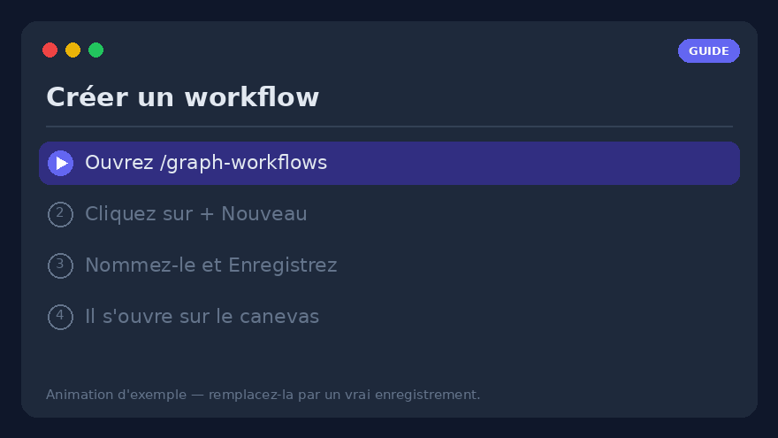
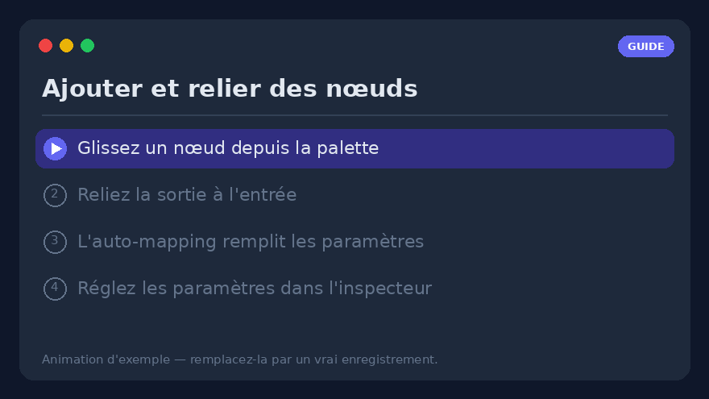
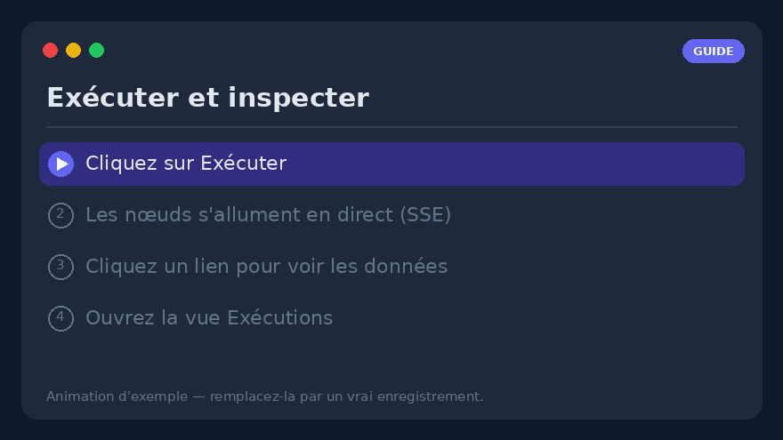
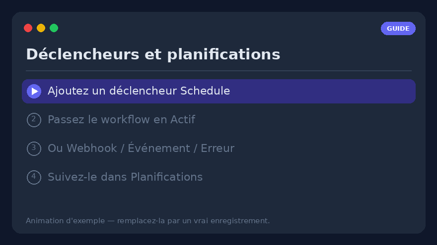
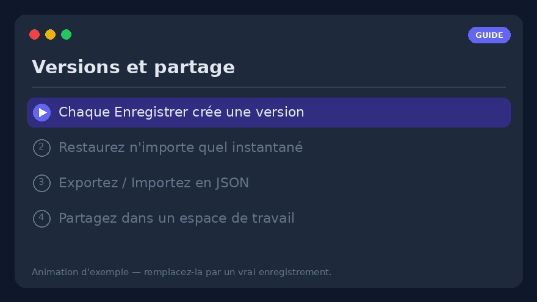

# Guide pratique des workflows — créer, exécuter et exploiter les workflows visuels

Un guide pratique, étape par étape, de l'**éditeur visuel de workflows**
(`/graph-workflows`). Là où [Workflows visuels](visual-workflows.md) est la *référence*
complète (chaque nœud, chaque paramètre), cette page est le *comment faire* : suivez-la de
haut en bas et vous construirez, exécuterez, planifierez et partagerez un vrai workflow.

> **Prérequis** — les workflows visuels sont derrière le drapeau de fonctionnalité
> `graph_workflows`. Si vous ne voyez pas **Workflows → Graph** dans la barre de
> navigation, demandez à un admin de l'activer (Paramètres → Fonctionnalités). Tout ce qui
> suit se passe dans votre propre profil.


---

## 1. Créez votre premier workflow



1. Ouvrez **`/graph-workflows`** depuis la barre de navigation (**Workflows → Graph**).
2. Cliquez sur **➕ Nouveau** au-dessus de la liste des workflows.
3. Donnez-lui un **nom** (ex. *Digest du matin*) et appuyez sur **Enregistrer**. Le graphe
   vide s'ouvre sur le canevas avec un nœud **déclencheur `manual`** déjà placé.
4. C'est fait : le workflow existe et figure à gauche. Il est **Inactif** par défaut (les
   déclencheurs ne se déclenchent pas encore) ; nous l'activerons à
   l'[étape 9](#9-déclencheurs--le-faire-tourner-tout-seul).

> **Pressé ?** Cliquez sur **✨** (galerie de modèles) et **Importez** l'un des
> [graphes d'exemple](../examples/graph-workflows.md) prêts à l'emploi — un par
> fonctionnalité — puis modifiez-le. C'est le moyen le plus rapide de voir un graphe qui
> fonctionne.

---

## 2. Lire le canevas

L'éditeur a **trois volets** :

| Volet | Contenu |
|-------|---------|
| **Gauche** | Votre liste de workflows (repliable avec ▾/▸) et la **palette de nœuds**, groupée *Déclencheurs · Actions · Logique · Données · IA*. Un champ de recherche la filtre par libellé ou type. |
| **Centre** | Le **canevas SVG**. Faites glisser les nœuds pour les disposer ; faites glisser le fond vide pour **naviguer (pan)** ; la molette **zoome**. Une **minimap** (en bas à droite) parcourt les grands graphes. |
| **Droite** | L'**inspecteur** du nœud sélectionné ou — quand rien n'est sélectionné — le **panneau d'exécution et de déclencheurs**. |

Chaque outil intégré, chaque outil de serveur MCP découvert et chaque outil HTTP
personnalisé apparaît automatiquement comme un nœud `tool.<nom>` — vous n'écrivez jamais de
code pour en ajouter un.

La barre d'outils au-dessus du canevas offre **Annuler/Rétablir** (`Ctrl+Z` /
`Ctrl+Shift+Z`), **Copier/Coller** (`Ctrl+C` / `Ctrl+V`), **Organiser** (auto-layout),
**⛶ ajuster la vue** et les annotations **📝 Note** / **▢ Cadre**.

---

## 3. Ajouter et relier des nœuds



1. **Glissez** un nœud depuis la palette de gauche sur le canevas — par exemple
   `tool.rss_read` (Actions), puis un `llm.completion` (IA), puis `notify.telegram`
   (Notifications).
2. **Reliez-les** : maintenez le **point de sortie** d'un nœud (bord droit) et glissez
   jusqu'au **point d'entrée** du nœud suivant (bord gauche). Un lien (arête) apparaît.
3. Lorsque vous tracez un lien, l'**auto-mapping** pré-remplit le premier champ d'expression
   vide de la cible avec la sortie de la source — un toast le confirme, ou une boîte de
   choix s'ouvre s'il y a plusieurs candidats. Vous pouvez toujours le remplacer.
4. **Cliquez sur une arête** pour l'inspecter : le panneau de droite montre
   *source → cible*, les **données qui y ont transité lors de la dernière exécution** et la
   liste des **chemins d'expression prêts** (ex. `$node.rss.output.result`). Cliquez un
   champ pour le copier comme expression `{{ … }}`.

> **Seuls les nœuds reliés s'exécutent.** Les nœuds déclencheurs sont les points d'entrée.
> Un nœud laissé non connecté est enregistré comme `skipped` — il ne se lance pas tout seul.

---

## 4. Configurer un nœud — l'inspecteur

Sélectionnez un nœud ; ses paramètres s'affichent à **droite**, générés depuis le schéma du
type de nœud.

- **Littéral ou expression** — chaque champ accepte une valeur simple **ou** une expression
  (voir [étape 5](#5-faire-circuler-les-données-avec-les-expressions)).
- **Nœuds IA** (`llm.completion`, `llm.agent`, …) exposent un **sélecteur de modèle** — le
  même catalogue et les mêmes filtres que la page de chat — et une **chaîne de bascule
  (failover)** optionnelle.
- **Section Avancé** — chaque nœud a **Réessais + backoff**, un **Timeout** et une politique
  **En cas d'erreur** (voir [étape 10](#10-gérer-les-erreurs)).
- **Tester le nœud** (⚡) exécute *uniquement ce nœud* avec ses paramètres actuels, même non
  enregistrés, et montre la sortie en ligne — rien n'est enregistré. Idéal pour régler un
  nœud isolément.

---

## 5. Faire circuler les données avec les expressions

Déplacez les données entre nœuds avec des expressions. Deux formes, distinguées par le
préfixe :

```text
={{ $node.rss.output.result }}     # la sortie d'un autre nœud
={{ $trigger.count }}              # la charge utile du déclencheur
={{ upper($json.title) }}          # une fonction autorisée sur l'entrée de ce nœud
={{ default($trigger.name, 'world') }}
Bonjour ={{ $trigger.name }}!      # interpolation dans une chaîne
=py: [x*2 for x in input]          # échappatoire vers le bac à sable Python
```

- `={{ … }}` est une **mini-expression sûre** (pas d'`eval`) parcourue sur le contexte
  d'exécution : `$node.<id>.output.<path>`, `$json` (l'entrée de ce nœud), `$trigger`,
  `$vars`, `$secrets`, `$env`, `$now`, plus des fonctions pures (`default`, `upper`, `len`,
  `join`, `first`, `get`, `round`, …).
- Un `{{ … }}` nu (sans `=` initial) fonctionne aussi — c'est une erreur courante et
  tolérée.
- Une expression **seule** garde son type natif (liste/nombre/objet) ; entourez-la de texte
  pour la convertir en chaîne. Cela compte pour le champ `items` d'un `for`/`filter`, qui
  attend une vraie liste.

> **Astuce** — le panneau **Tester l'expression** de l'inspecteur évalue n'importe quelle
> expression en lecture seule sur les données de la dernière exécution, pour déboguer un
> chemin *avant* de le câbler dans un paramètre.

---

## 6. Garder les secrets hors du graphe — `$vars` / `$secrets`

Ouvrez le **panneau d'exécution** (cliquez sur le canevas vide) → **Variables** /
**Secrets** :

- **Variables (`$vars`)** — paires clé/valeur par workflow, lisibles partout comme
  `{{ $vars.nom }}`. Elles voyagent avec l'export/import ; une valeur JSON garde son type
  natif.
- **Secrets (`$secrets`)** — identifiants au niveau du profil (jetons API, chaînes de
  connexion), **chiffrés au repos** et **jamais renvoyés par l'API** ni inclus dans un
  export. Utilisez `{{ $secrets.NOM }}`, par exemple dans un en-tête `http.request`.
  Recréez-les dans chaque environnement.

Ne collez jamais un jeton directement dans un paramètre de nœud — mettez-le dans `$secrets`.

---

## 7. Exécuter et lire les résultats



1. Appuyez sur **Enregistrer**, puis **Exécuter** dans le panneau d'exécution.
2. Les nœuds **s'allument en direct** via SSE : **vert** = ok, **bleu** = en cours,
   **rouge** = erreur, **gris** = ignoré. Un nœud en échec affiche son erreur en rouge
   dessous.
3. Besoin d'une entrée ? Collez un objet JSON dans la case **Charge utile d'exécution** — il
   devient `$trigger` pour cette exécution, de sorte que les graphes qui lisent
   `={{ $trigger.champ }}` s'essaient à la main sans webhook.
4. Le registre durable vit dans la **vue Exécutions** (`/graph-workflows/runs`, ou
   *Exécutions →* dans l'en-tête de l'éditeur) : chaque exécution avec statut, déclencheur,
   durée et **résultats par nœud**. Sélectionnez une exécution en cours pour la suivre en
   direct ; **↻ Rejouer** la relance avec la même charge utile.

---

## 8. Déboguer sans exécutions complètes

- **Tester le nœud** (⚡) — exécutez un nœud isolément (étape 4).
- **Sortie épinglée** (📌) — figez la sortie d'un nœud (sa dernière, ou un JSON édité à la
  main). Les tests en aval, les aperçus d'expression et les **exécutions partielles**
  résolvent alors `$node.<id>.output` depuis l'épingle au lieu de rappeler l'outil réel —
  idéal pour itérer en aval d'un webhook ou d'un appel LLM coûteux. Les épingles n'affectent
  jamais les exécutions de production.
- **Exécuter depuis ce nœud** (▶) — n'exécute que le nœud sélectionné et son sous-graphe
  aval ; les nœuds amont sont amorcés depuis leur dernière sortie persistée.
- **Débogage pas à pas** (🐞) — placez des points d'arrêt (le point sur chaque nœud),
  **Démarrer l'exécution de débogage** (créée *en pause*), puis **⏭ Pas** / **▶ Continuer** /
  **⏹ Arrêter**. La barre de débogage montre l'entrée résolue de chaque nœud avant son
  exécution.

---

## 9. Déclencheurs — le faire tourner tout seul



Ajoutez des déclencheurs depuis le **panneau d'exécution**, puis **passez le workflow en
Actif** — c'est l'étape qu'on oublie :

> ⚠️ **Un déclencheur ne se déclenche que si son *workflow* est Actif.** Activer un
> déclencheur est distinct du drapeau Actif du workflow. Une planification parfaite et
> activée sur un workflow **Inactif** ne tournera jamais.

Types de déclencheurs :

- **Planification** — Quotidien / Hebdomadaire / Cron / Une fois via un sélecteur structuré
  (ou une expression cron, validée). Une boucle en arrière-plan déclenche les planifications
  dues.
- **Webhook** — une URL à jeton (`POST /api/v1/wf/hooks/{token}`) ; le corps JSON devient
  `$trigger`. Protégeable par un secret de signature HMAC.
- **Événement** — événements internes (`document.ingested`, `chat.message.created`).
- **Erreur / Succès** — se déclenchent quand l'exécution d'un *autre* workflow échoue /
  réussit.
- **Surveillance de fichiers / Email entrant** — interrogent un dossier du workspace ou une
  boîte IMAP.

La **vue Planifications** transversale (`/graph-workflows/schedules`) liste une ligne par
déclencheur — prochaine exécution, dernier statut, série d'échecs et
activer/désactiver/Exécuter/Supprimer — pour voir d'un coup d'œil tout ce qui est dû ou
cassé.

---

## 10. Gérer les erreurs

La section **Avancé** de chaque nœud a trois contrôles d'échec :

1. **Réessais + backoff** — réexécute jusqu'à N fois ; backoff **Fixe** ou **Exponentiel**
   (plafonné à 60 s). Les nouveaux nœuds `http.request` / `llm.*` arrivent avec des préréglages
   raisonnables.
2. **Timeout (ms)** — un plafond strict par tentative ; une tentative expirée échoue comme
   toute erreur (et reste réessayée). La garde pour un appel HTTP/LLM/MCP bloqué.
3. **En cas d'erreur** — une fois les réessais épuisés :
   - **Arrêter l'exécution** (défaut),
   - **Continuer sur main** — émet `{ error }` et poursuit,
   - **Router vers la branche d'erreur** — le nœud gagne un point **`error`** ; câblez le
     chemin heureux vers `main` et une chaîne d'alerte/repli vers `error` (try/catch sur le
     canevas).

Pour une alerte centralisée, ajoutez un workflow à **déclencheur d'erreur** qui se déclenche
sur *tout* échec et se termine par un nœud `notify.*`.

---

## 11. Versions, export/import et partage



- **Versions** — chaque **Enregistrer** crée un instantané immuable. La section *Versions*
  du panneau d'exécution les liste avec un **Restaurer** en un clic (qui instantane d'abord
  le graphe actuel, donc un retour arrière est toujours réversible). *Comparez* deux
  versions pour voir les nœuds ajoutés/modifiés/supprimés.
- **Export** — le bouton **Exporter** télécharge un `.workflow.json` portable (graphe,
  variables, environnements et les *noms* des secrets référencés — les valeurs ne voyagent
  pas).
- **Import** — le bouton **📥** à côté de *Nouveau* charge un tel fichier dans un nouveau
  workflow, validé (nœuds inconnus / arêtes cassées / secrets manquants apparaissent en
  avertissements).
- **Partage** — partagez un workflow dans un **espace de travail** avec un rôle : `viewer`
  (inspecter + copier), `editor` (…+ lancer des exécutions) ou `approver` (…+ décider ses
  demandes `human.approval`).

---

## 12. Exemple complet — digest RSS vers Telegram

Une construction concrète de bout en bout :

1. **Déclencheur** — gardez le nœud `manual` pour l'instant (ajoutez une **Planification**
   *Quotidien 08:00* plus tard).
2. `tool.rss_read` — réglez l'URL du flux dans son paramètre.
3. `llm.completion` — invite `Résume ces titres en 5 puces :\n={{ $node.rss.output.result }}`, choisissez un modèle.
4. `notify.telegram` — `text: ={{ $node.llm.output.text }}`, `parse_mode: Markdown`. (Liez
   d'abord un chat dans Paramètres → Telegram.)
5. Câblez `manual → rss → llm → telegram`, **Enregistrez**, **Exécutez**, vérifiez le
   message Telegram.
6. Satisfait ? Ajoutez le déclencheur **Planification** et **passez en Actif** — un digest
   quotidien sans autre clic.

---

## 13. Liste de dépannage

- **Ma planification ne se déclenche jamais** → le **workflow est-il Actif** (pas seulement
  le déclencheur activé) ? Voir [étape 9](#9-déclencheurs--le-faire-tourner-tout-seul).
- **Un nœud est `skipped`** → il n'est pas relié au flux depuis un déclencheur.
- **Une expression est vide** → testez-la dans **Tester l'expression** ; vérifiez le chemin
  exact dans la liste des champs de l'inspecteur d'arête.
- **Dans une boucle, `$node.<loopId>.output` est vide** → utilisez `$item` / `$index` dans le
  **corps** de la boucle ; `…output.items` n'est disponible que sur la sortie `done` de la
  boucle.
- **Un secret se résout en `***`** → c'est attendu dans l'aperçu de l'éditeur ; il ne se
  déchiffre que lors d'une exécution réelle.
- **Un webhook renvoie 401** → il manque à la requête l'en-tête HMAC `X-Signature` après la
  rotation du secret.

---

## Pour aller plus loin

- **[Workflows visuels](visual-workflows.md)** — la référence complète : chaque type de
  nœud, fonction d'expression, déclencheur, environnement, contrat et endpoint API.
- **[Graphes d'exemple](../examples/graph-workflows.md)** — workflows prêts à importer, un
  par fonctionnalité.
