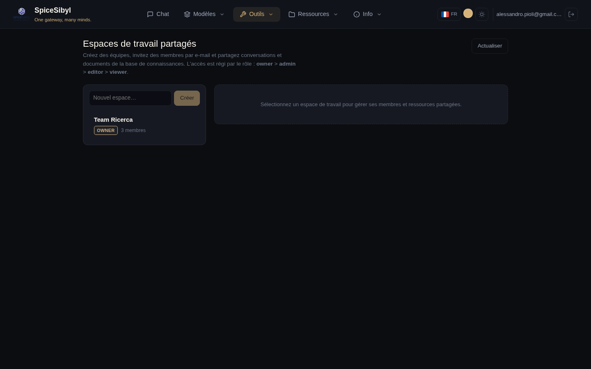

# Espaces de travail et collaboration

Fonctionnalités d'équipe bâties sur les comptes de la phase 13 et le cloisonnement de la base de connaissances de la phase 17 : espaces partagés avec accès par rôle, et commentaires en fil sur les conversations partagées.

## Espaces de travail partagés

**Ce que ça fait.** Un espace de travail est un conteneur d'équipe possédé par un utilisateur. D'autres comptes le rejoignent comme **membres** avec un rôle, et le propriétaire partage des conversations et des documents de la base de connaissances *dans* l'espace, les rendant visibles à chaque membre. Les ressources gardent leur propriétaire d'origine — le partage est une relation de jointure (`workspace_conversations` / `workspace_documents`), pas une copie — donc retirer le partage supprime simplement le lien.

**Rôles.** Quatre niveaux, par ordre décroissant de privilège :

| Rôle | Peut faire |
|------|------------|
| **owner** | Tout, plus renommer/supprimer l'espace et gérer chaque membre. A créé l'espace ; exactement un par espace. |
| **admin** | Gérer les membres (ajouter/changer de rôle/retirer, sauf le propriétaire) et partager/retirer des ressources. |
| **editor** | Partager/retirer ses propres ressources et commenter. |
| **viewer** | Lire les ressources partagées et commenter. |

Tout membre (y compris un viewer) peut **quitter** un espace lui-même ; seuls admin+ peuvent retirer *d'autres* membres. Partager une conversation ou un document exige editor+ **et** la propriété de cette ressource — vous ne pouvez pas partager ce qui n'est pas à vous.

**Comment l'utiliser.** Ouvrez la page **Espace de travail** depuis la navbar :

- La barre latérale gauche liste les espaces auxquels vous appartenez (avec votre rôle et le nombre de membres) et un champ pour en créer un nouveau — le créer fait de vous le propriétaire.
- Sélectionner un espace ouvre le panneau de détail avec trois cartes : **Membres**, **Conversations partagées** et **Documents partagés**.
- **Membres** — invitez par e-mail (le compte doit déjà exister), changez le rôle d'un membre en ligne, ou retirez-le. Les contrôles de gestion n'apparaissent que pour admin+ ; la ligne du propriétaire n'est pas modifiable.
- **Conversations / documents partagés** — choisissez une de vos conversations ou documents KB dans la liste déroulante et partagez ; chaque membre le voit alors dans la liste. Le **✕** retire le partage (editor+).

**API.**

| Méthode et chemin | But | Rôle minimum |
|-------------------|-----|--------------|
| `GET /v1/workspaces` | Espaces auxquels l'appelant appartient | membre |
| `POST /v1/workspaces` | Créer (l'appelant devient propriétaire) | — |
| `PATCH /v1/workspaces/{ws}` | Renommer | admin |
| `DELETE /v1/workspaces/{ws}` | Supprimer | owner |
| `GET/POST /v1/workspaces/{ws}/members` | Lister / inviter par e-mail | view / admin |
| `PATCH/DELETE /v1/workspaces/{ws}/members/{uid}` | Changer de rôle / retirer (ou se retirer) | admin |
| `GET/POST /v1/workspaces/{ws}/conversations` | Lister / partager une conversation | view / editor |
| `DELETE /v1/workspaces/{ws}/conversations/{cid}` | Retirer le partage d'une conversation | editor |
| `GET/POST /v1/workspaces/{ws}/documents` | Lister / partager un document KB | view / editor |
| `DELETE /v1/workspaces/{ws}/documents/{did}` | Retirer le partage d'un document KB | editor |

## Annotations et commentaires

**Ce que ça fait.** Commentaires en fil sur une conversation partagée. Un commentaire peut être un fil de premier niveau ou une réponse (`parent_id`), et peut être facultativement ancré à un message précis (`message_id`). Les commentaires sont **soft-deleted** — un commentaire retiré est vidé et marqué plutôt que supprimé, pour que les réponses en dessous gardent leur place dans le fil.

**Qui peut les voir.** L'accès reflète la portée de la conversation : son propriétaire, ou tout membre d'un espace où elle a été partagée, peut lire et poster. La modification et la suppression sont réservées à l'**auteur** du commentaire — personne d'autre ne peut altérer votre texte, quel que soit le rôle dans l'espace.

**Comment l'utiliser.** Dans la page Espace de travail, chaque conversation partagée a un bouton **Commentaires** qui ouvre un panneau en fil en dessous. Écrivez un commentaire de premier niveau dans le champ, utilisez **Répondre** pour imbriquer une réponse, et **Modifier / Supprimer** sur vos propres commentaires. Les fils s'imbriquent visuellement par indentation.

**API** (sous `/v1/conversations/{id}/comments`) :

| Méthode et chemin | But |
|-------------------|-----|
| `GET /` | Lister tous les commentaires de la conversation (mis en fil côté client par `parent_id`) |
| `POST /` | Ajouter un commentaire (`body`, `message_id` facultatif, `parent_id` facultatif) |
| `PATCH /{comment_id}` | Modifier votre commentaire |
| `DELETE /{comment_id}` | Soft-delete de votre commentaire |

Un appelant sans relation avec la conversation obtient un `404` (plutôt qu'un `403`) pour ne jamais divulguer l'existence de conversations privées.

## Modèle de données

- `workspaces` — `id`, `name`, `owner_id`, horodatages.
- `workspace_members` — `(workspace_id, user_id)` avec `role` ; le propriétaire est stocké comme ligne membre (`role='owner'`) pour uniformiser les requêtes d'appartenance.
- `workspace_conversations` / `workspace_documents` — tables de jointure liant un espace aux conversations / documents KB partagés, avec `shared_by` et `shared_at`.
- `comments` — `id`, `conversation_id`, `message_id` nullable, `parent_id` nullable, `user_id`, `body`, `deleted`, horodatages.

Toutes les tables cascadent à la suppression via des clés étrangères, donc supprimer un espace, une conversation ou un utilisateur nettoie automatiquement les lignes dépendantes.

> La collaboration en temps réel (plusieurs utilisateurs en direct dans une conversation via WebSocket, avec indicateurs de présence) est prévue comme phase 20.c et n'est pas encore implémentée.
