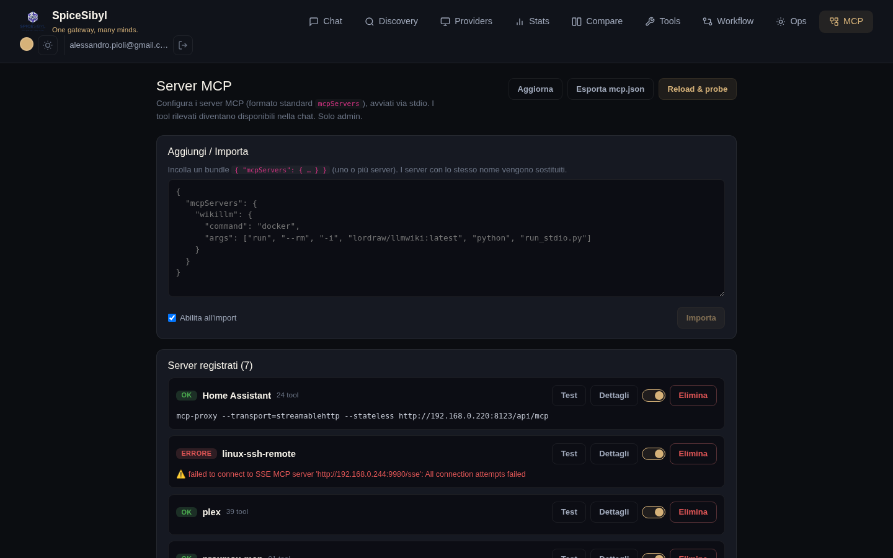
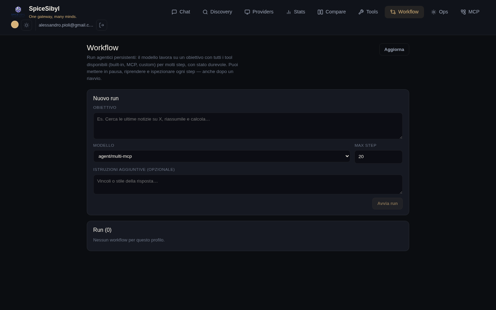

# MCP e agenti

## Gestione server MCP

**Cosa fa.** Registra server [MCP](https://modelcontextprotocol.io) (Model Context Protocol) nel formato standard `mcpServers` (`command`/`args`/`env`/`cwd`), li avvia via stdio con un client JSON-RPC minimale integrato (nessuna dipendenza dall'SDK), ne verifica la salute e inietta i tool scoperti nel loop di chat col namespace `mcp__<server>__<tool>`. Gestione **solo admin**, configurazione globale (tabella `mcp_servers`).



**Come si usa.**
1. Pagina **MCP** → riquadro **Aggiungi / Importa**: incolla un bundle JSON `{ "mcpServers": { … } }` (uno o più server; i server omonimi vengono sostituiti) e premi **Importa**. La spunta «Abilita all'import» li attiva subito.
2. Nell'elenco **Server registrati** ogni server mostra stato (OK/ERRORE con messaggio), numero di tool scoperti e i pulsanti **Test**, **Dettagli** (elenco tool), toggle enable, **Elimina**.
3. **Reload & probe** riavvia la discovery su tutti i server abilitati; **Esporta mcp.json** scarica la configurazione nel formato standard.

**API.** `GET/POST /v1/mcp/servers`, `PATCH`/`DELETE /v1/mcp/servers/{id}`, `POST /v1/mcp/servers/{id}/test`, `POST /v1/mcp/reload`, `GET /v1/mcp/config`, `POST /v1/mcp/import` (tutte auditate).

**Esempio di bundle:**

```json
{
  "mcpServers": {
    "wikillm": {
      "command": "docker",
      "args": ["run", "--rm", "-i", "lordraw/llmwiki:latest", "python", "run_stdio.py"]
    }
  }
}
```

## Orchestratore Multi-MCP (agent mode)

**Cosa fa.** I modelli con prefisso `agent/*` vengono instradati dall'`OrchestratorProvider` a un sidecar esterno che coordina più agenti MCP specializzati (`ask_proxmox`, `ask_synology`, `ask_linux`, `ask_homeassistant`, `ask_watchyourlan`). Utile per domande sull'infrastruttura di casa/lab che richiedono interrogare più sistemi.

**Come si usa.** In chat seleziona il modello `Agent · Multi-MCP Orchestrator`; su Telegram i comandi `/agent` e `/chat` commutano tra modalità agente e chat normale.

## Workflow persistenti

**Cosa fa.** Run agentici durevoli e ispezionabili: un loop server-side in background lavora su un obiettivo con **tutto** il registro tool (integrati, custom, MCP) per molte iterazioni (`WORKFLOW_DEFAULT_MAX_STEPS`, limite `WORKFLOW_MAX_STEPS_LIMIT`), ben oltre le 5 del loop di chat. Ogni turno assistant / chiamata tool / risultato è persistito come step (`agent_runs` + `agent_run_steps`) e la cronologia è checkpointata a ogni iterazione: i run si mettono in pausa e riprendono senza perdite, **anche dopo un riavvio** (i run rimasti `running` vengono riconciliati a `paused`).



**Come si usa.**
1. Pagina **Workflow** → form **Nuovo run**: obiettivo, modello, max step, istruzioni aggiuntive opzionali → **Avvia run**.
2. Nell'elenco dei run: badge di stato, pulsanti pausa/riprendi/annulla ed eliminazione.
3. Il dettaglio mostra la **timeline degli step** con auto-refresh: ogni passo del ragionamento e ogni chiamata tool sono ispezionabili.

**API.** `POST/GET /v1/workflows`, dettaglio, `pause`/`resume`/`cancel`/`delete` (auditate).
