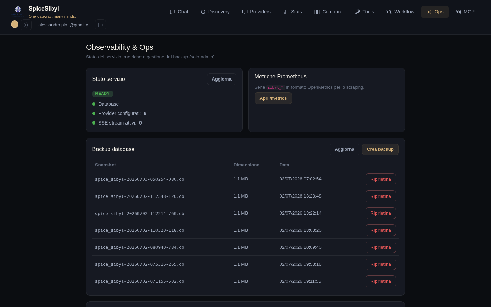

# Osservabilità e operazioni

## Pagina Ops (solo admin)

**Cosa fa.** Cruscotto operativo riservato agli admin (voce navbar protetta da `adminGuard`): readiness live (DB, provider configurati, stream SSE attivi letti da `/metrics`), link alle metriche raw, gestione backup e export/import per profilo.



## Health e readiness

| Endpoint | Uso |
|----------|-----|
| `GET /api/v1/health` | liveness — contratto stabile usato dall'HEALTHCHECK del Dockerfile |
| `GET /api/v1/ready` | readiness — verifica connettività DB e almeno un provider configurato; `503` se degradato |

Il compose definisce healthcheck espliciti sul backend; nginx e certbot partono con `depends_on: condition: service_healthy`.

## Metriche Prometheus

`GET /api/v1/metrics` (formato OpenMetrics) espone:

- `sibyl_http_requests_total` / `sibyl_http_request_duration_seconds`
- `sibyl_provider_requests_total`, `sibyl_provider_tokens_total{kind}`, `sibyl_provider_latency_seconds`
- `sibyl_active_sse_streams`

Protezione opzionale con bearer token: `METRICS_TOKEN`. Una dashboard Grafana pronta è in [`docs/grafana-dashboard.json`](../grafana-dashboard.json).

## Log strutturati e correlazione richieste

Con `LOG_FORMAT=json` i log escono in JSON e portano un `request_id` (ContextVar) generato dal `RequestContextMiddleware` — riusa l'`X-Request-ID` in ingresso e lo rimanda nella risposta. L'id è propagato al sidecar Multi-MCP via header e agganciato ai flussi Telegram: tracing end-to-end di ogni richiesta.

## Backup e restore del database

**Cosa fa.** Task in background opt-in che fotografa SQLite con l'online backup API (nessun lock dell'app) su un volume montato, con intervallo e retention configurabili.

```env
BACKUP_ENABLED=true
BACKUP_DIR=/data/backups
# + intervallo e retention
```

**Come si usa.**
- **Dalla pagina Ops**: sezione «Backup database» — elenco snapshot con dimensione e data, **Crea backup** immediato, **Ripristina** su uno snapshot.
- **Da API** (admin, auditate): `POST /v1/admin/backup`, `GET /v1/admin/backups`, `POST /v1/admin/restore`.

## Export / import per profilo

Zip unico con conversazioni, messaggi, knowledge base, template e tag di un profilo: `GET /v1/admin/export` / `POST /v1/admin/import`, disponibili anche dalla pagina Ops. Utile per migrare un profilo tra istanze o come backup selettivo.

## Deploy in produzione

In breve (dettagli in [deploy.md](../deploy.md)):

- `docker-compose.prod.yml` con **nginx** che serve la build statica Angular su `/` e proxa `/api` al backend;
- `PUBLIC_URL` aggiunto automaticamente ai CORS;
- TLS auto-rilevato dai certificati in `nginx/ssl/` con sidecar Certbot opzionale, fallback HTTP se assenti;
- Dockerfile multi-stage (`node:20-alpine` → build → `nginx:1.27-alpine`);
- ricordarsi di impostare `VAULT_SECRET_KEY` (warning di sicurezza all'avvio se lasciata al default).
