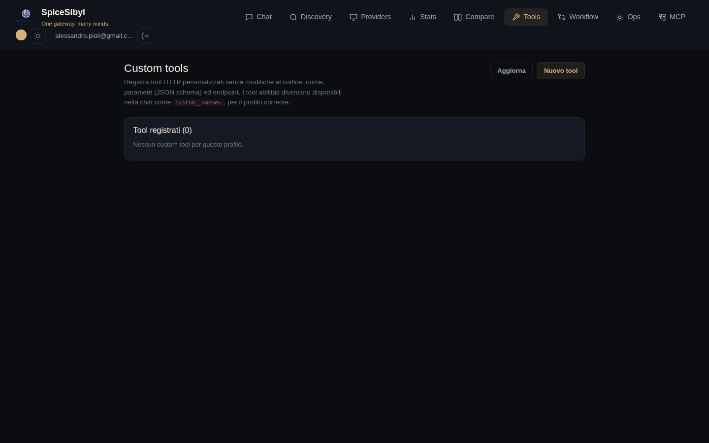

# Tool calling

## Loop di esecuzione server-side

**Cosa fa.** Con l'interruttore **Tool calling ON** in sidebar, il backend espone al modello i tool registrati ed esegue lato server le chiamate richieste, reinviando i risultati al modello in un loop (max 5 iterazioni in chat; per loop più lunghi vedi i [workflow](mcp-e-agenti.md#workflow-persistenti)). Chiamate e risultati sono trasmessi come eventi SSE `tool_call` / `tool_result` e resi come bolle dedicate nella conversazione; le chiamate in attesa mostrano uno spinner.

**Elenco tool disponibili:** `GET /api/v1/tools` (unione di integrati + custom del profilo + MCP).

## Tool integrati

| Tool | Cosa fa |
|------|---------|
| `get_datetime` | data/ora corrente |
| `calculator` | valutazione di espressioni matematiche |
| `web_search` | ricerca web via DuckDuckGo (scraping HTML per snippet ricchi, fallback sull'API instant-answer) |
| `read_url` | scarica una pagina web e restituisce il testo (HTML rimosso, max 4 000 caratteri) |
| `python_exec` | code interpreter sandbox (vedi sotto) |

## Tool custom (HTTP)

**Cosa fa.** Registra tool basati su endpoint HTTP dalla UI, senza toccare il codice: nome, descrizione, parametri (JSON Schema), URL/metodo/header, autenticazione (nessuna / bearer / header custom), timeout. Sono salvati per profilo nella tabella `custom_tools` e iniettati nel loop di chat col namespace `custom__<nome>`.

**Come si usa.**
1. Pagina **Tools** → **Nuovo tool**.
2. Compila il form (nome, descrizione, schema JSON dei parametri, endpoint, auth, timeout) e salva.
3. Usa il pannello di **test inline** per una chiamata di prova prima di abilitarlo.
4. L'interruttore enable attiva/disattiva il tool senza cancellarlo.

**Semantica della chiamata.** Gli argomenti prodotti dal modello vengono inviati come body JSON (POST/PUT/PATCH) o query string (GET); il body della risposta è il risultato del tool. API: CRUD + test sotto `/api/v1/tools/custom` (operazioni auditate).

## Code interpreter sandbox (`python_exec`)

**Cosa fa.** Esegue codice Python in un sottoprocesso isolato `python -I` con:

- rlimit su CPU, memoria (`CODE_INTERPRETER_MEMORY_MB`), dimensione file, numero di fd/processi;
- timeout wall-clock (`CODE_INTERPRETER_TIMEOUT`, uccide l'intero process group);
- ambiente minimale e **nessuna rete** (socket stub a livello Python);
- directory di lavoro effimera con file in/out: i `files` di input vengono materializzati prima dell'esecuzione, i file creati sono riportati nel risultato (quelli di testo piccoli inline) e tutto viene cancellato al termine.

**Configurazione.** Abilitato di default; disattivabile con `CODE_INTERPRETER_ENABLED=false`.

**Come si usa.** Con tool calling attivo, basta chiedere al modello qualcosa che richieda calcolo/codice («esegui questo script», «analizza questi numeri»); il modello invoca `python_exec` autonomamente.
