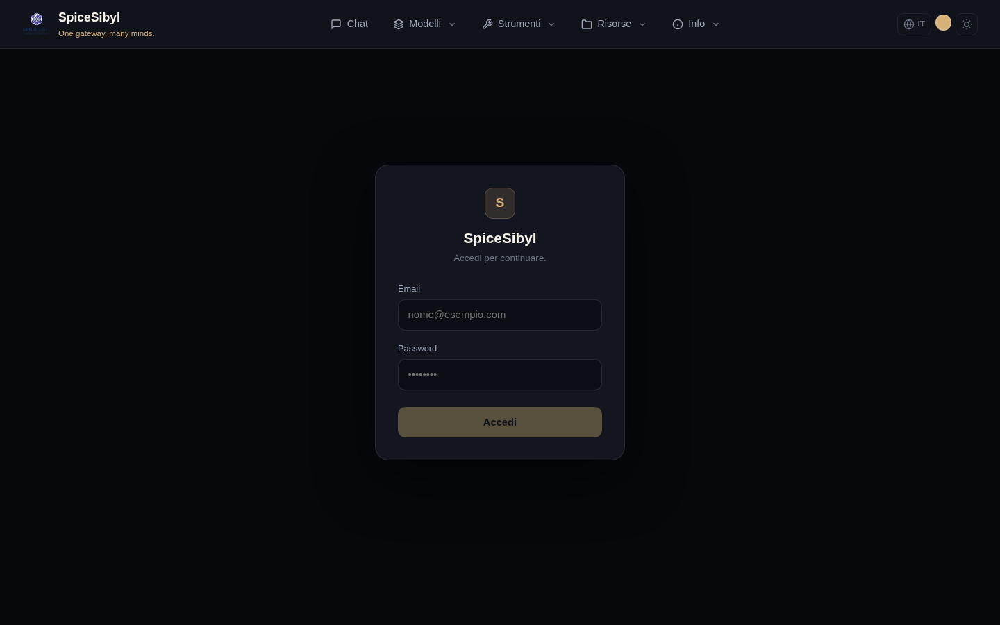
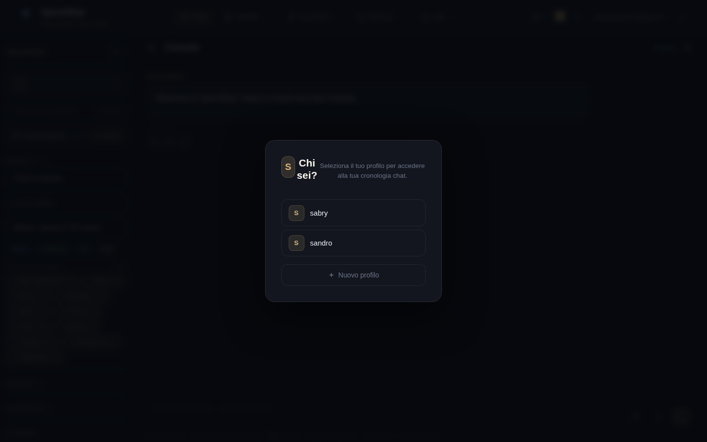

# Autenticazione e profili

## Login e account utente

**Cosa fa.** Tutte le rotte `/api/v1` richiedono autenticazione, con l'eccezione della allowlist pubblica (`/auth/*`, `/health`, `GET /shared/{token}`). Gli account hanno email + password (hash bcrypt) e un ruolo: `admin`, `user` o `read-only`. Le sessioni usano JWT di accesso (30 minuti) e refresh token a rotazione (14 giorni) tracciati nella tabella `refresh_tokens`, quindi revocabili.

**Come si usa.**
1. Apri la console web: se non sei autenticato vieni rediretto a `/login`.
2. Inserisci email e password e premi **Accedi**.
3. Il frontend gestisce da solo il rinnovo silenzioso del token alla scadenza (interceptor su 401); il logout si fa dal chip utente nella navbar.

**Bootstrap admin.** Al primo avvio il backend crea un amministratore da `ADMIN_EMAIL` / `ADMIN_PASSWORD` (in `backend/.env`) e "adotta" gli eventuali profili orfani creati prima dell'introduzione dell'autenticazione.

## Profili

**Cosa fa.** Ogni utente possiede N profili (identità locali con nome, senza password). Cronologia conversazioni, knowledge base, template, tag e statistiche sono separati per profilo. L'UUID del profilo attivo è salvato in `localStorage` (`spicesibyl_profile`).

**Come si usa.**
- Alla prima visita (o quando nessun profilo è selezionato) compare il modal **«Chi sei?»**: scegli un profilo esistente o creane uno con **+ Nuovo profilo**.
- Puoi cambiare profilo in ogni momento dal selettore in cima alla sidebar della chat.

**Isolamento dati.** Ogni endpoint legato a un profilo valida la proprietà tramite la dependency `resolve_profile`: un utente non può leggere conversazioni o documenti dei profili altrui.

## Collegamento Telegram ↔ web

**Cosa fa.** Associa un utente Telegram a un profilo web, così conversazioni e statistiche sono condivise tra i due canali.

**Come si usa.**
1. Nel bot Telegram invia `/link`: ricevi un codice di 6 caratteri.
2. Incolla il codice nel campo **«Codice /link da Telegram»** nella sidebar web e premi **Collega**.
3. `/unlink` sul bot scollega l'account.

## Rate limiting

Limite per utente a finestra scorrevole (`RATE_LIMIT_DEFAULT`, default `60/minute`), calcolato sull'id utente autenticato (corretto anche dietro il proxy nginx). Superato il limite il server risponde `429` con header `Retry-After`. Nota: lo store è in-memory (singolo processo).

## Audit log

La tabella `audit_log` registra chi ha fatto cosa e quando, con IP del client: login, cancellazioni di conversazioni/profili, aggiornamenti delle chiavi provider, cambi ruolo/disabilitazione utenti, operazioni di backup/restore, CRUD di tool custom e server MCP.

**Come si consulta.** Solo admin: `GET /api/v1/auth/audit`.
