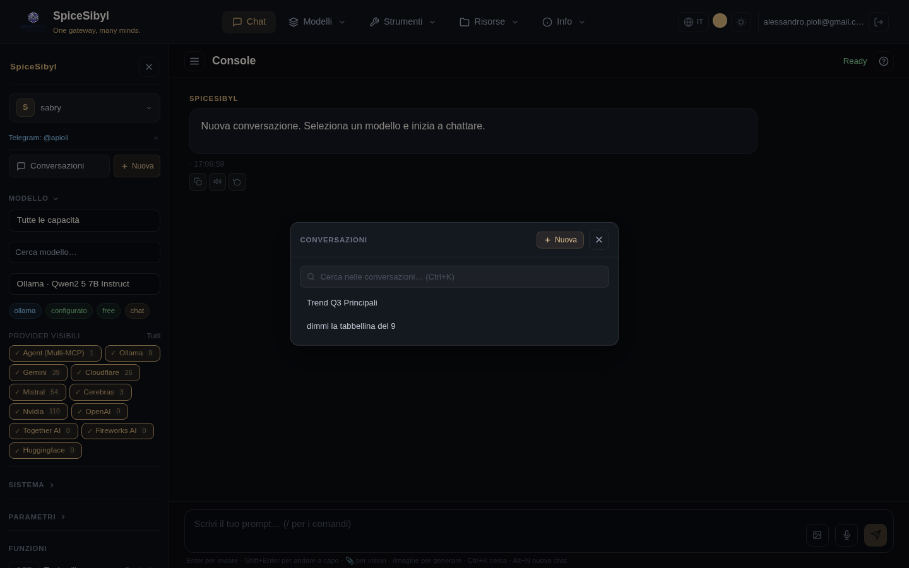
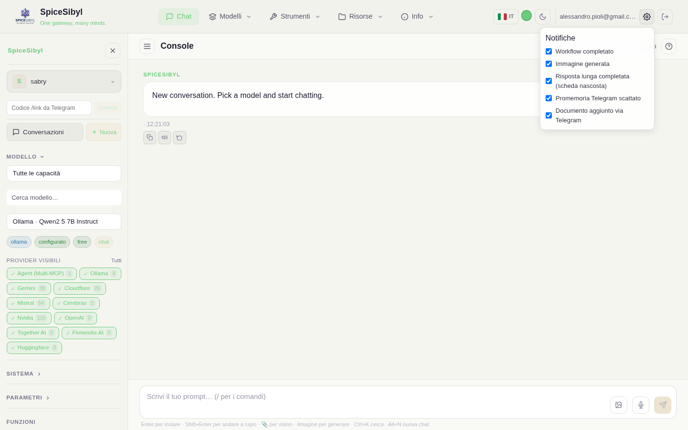

# Chat web

La pagina principale della console. A sinistra una **sidebar leggera** con i soli controlli della chat corrente (profilo, **Modello**, **Sistema**, **Parametri**) e gli interruttori **ON/OFF** delle funzioni; al centro la conversazione con composer in basso. L'elenco delle conversazioni si apre come **pannello** dedicato (pulsante *Conversazioni* o `Ctrl+K`).

## Conversazioni e streaming

**Cosa fa.** Ogni scambio è salvato in SQLite (per profilo) con telemetria completa: provider, latenza, tempo al primo token, token prompt/completion, velocità (tok/s) — visibile nel piè di pagina di ogni risposta. Le risposte arrivano in streaming via SSE.

**Come si usa.**
- **Nuova conversazione**: pulsante **+ Nuova** nella sidebar o nel pannello Conversazioni (o `Alt+N`).
- **Aprire/selezionare una conversazione**: pulsante **Conversazioni** nella sidebar (o `Ctrl+K`) → si apre il **pannello** con ricerca, filtro per tag, selezione e cancellazione; alla selezione la conversazione viene caricata e il pannello si chiude.
- **Selezione modello**: sezione **Modello** della sidebar — filtro per capacità (chat, vision, tools, free…), ricerca testuale, filtro **Provider visibili** (vedi sotto), poi scelta dal menu. I badge sotto il selettore indicano provider, stato di configurazione e capacità.
- **Invio**: scrivi nel composer e premi invio; durante la generazione il pulsante di invio diventa **Stop** e interrompe lo stream.
- **Eliminazione**: icona cestino sulla voce di conversazione, nel pannello Conversazioni.

**Filtro provider visibili.** Sotto il selettore del modello, una fila di chip (una per provider abilitato) permette di scegliere **quali provider** mostrare nella scelta del modello; la preferenza è persistente. Per curare invece **quali singoli modelli** di un provider compaiono nel menu, usa la pagina [Providers](provider-e-modelli.md).

**Indicatori di caricamento.** Una barra animata sotto la topbar mostra lo stato: ambra durante l'attesa del modello («In attesa del modello…»), blu durante l'esecuzione dei tool («Esecuzione tool…»), standard durante lo streaming («Generazione in corso…»).

## Azioni sui messaggi

Pulsanti a comparsa (hover) su ogni messaggio:

| Azione | Dove | Effetto |
|--------|------|---------|
| 📋 Copia | tutti | copia il testo negli appunti |
| 🔊 TTS | risposte | legge il messaggio ad alta voce (Web Speech API, default italiano); ripremere ferma |
| 🔁 Rigenera | ultima risposta | richiede una nuova risposta **creando un ramo** (vedi sotto) |
| ✏️ Modifica | ultimo messaggio utente | modifica e reinvia |
| 📌 Pin | tutti | aggiunge/rimuove il messaggio dalla barra dei preferiti sopra la chat (click per saltare al messaggio) |

## Branching delle risposte

**Cosa fa.** Rigenerare non sovrascrive: entrambe le risposte restano come rami paralleli (persistiti in SQLite con `parent_id` + `branch_index`).

**Come si usa.** Sulle risposte con alternative compaiono le frecce `< 1/3 >`: navigano tra i rami; la conversazione prosegue dal ramo selezionato.

## System prompt, template e parametri

- **Sistema** (sidebar): istruzioni di sistema persistenti (localStorage), con azioni salva/pulisci.
- **Template** (pagina dedicata `/templates`, voce **Risorse → Template** nella navbar): libreria di prompt di sistema riusabili («Code review», «ELI5»…). Crea/modifica/elimina i template e con **Applica** imposti il template come system prompt e torni alla chat.
- **Parametri** (sidebar): slider **temperature** (0–2) e campo **max tokens**, inviati con ogni richiesta. Qui c'è anche l'opt-in alle notifiche di completamento (vedi [Interfaccia](interfaccia.md)).

## Tool calling in chat

Interruttore **Tool calling ON/OFF** in sidebar. Quando è attivo il modello può invocare i tool registrati (integrati, custom, MCP); le chiamate e i risultati compaiono come bolle dedicate nella conversazione — con spinner sulle chiamate in attesa di risultato. Dettagli in [Tool calling](tool-calling.md).

## Immagini e generazione immagini

- **Vision (immagine → testo)**: allega immagini col pulsante 🖼 del composer, con drag & drop sull'area chat (overlay visivo, solo `image/*`, max 20 MB) o incollando dagli appunti. L'immagine è inviata in base64 ai modelli con capacità vision (Gemini, Llama-4-Scout su Groq, …).
- **Generazione (testo → immagine)**: comando `/imagine <prompt>` nel composer. Usa la catena di fallback `IMAGE_GENERATION_CHAIN` (formato `provider:model,...`; provider supportati: Gemini/Imagen, HuggingFace FLUX.1-schnell, Cloudflare SDXL, Together FLUX.1-schnell-Free). Endpoint diretto: `POST /api/v1/images/generations`.

## Input vocale

Pulsante 🎤 nel composer (Web Speech API): il pulsante pulsa durante l'ascolto e il testo trascritto finisce nel composer.

## Funzioni ON/OFF in chat

Nella sezione **Funzioni** della sidebar ci sono tre interruttori, ognuno con un link **Gestisci →** alla pagina dedicata:

- **Tool calling ON/OFF** — abilita l'uso dei tool nel turno di chat (gestione su `/tools`).
- **Knowledge (RAG) ON/OFF** — quando attivo, i chunk più pertinenti vengono iniettati nel messaggio e le fonti compaiono come chip di citazione sotto la risposta (documenti su `/knowledge`). Dettagli in [Knowledge base e RAG](knowledge-rag.md).
- **Memoria ON/OFF** — ON = i ricordi del profilo vengono usati; OFF = chat in incognito (ricordi su `/memory`). Dettagli in [Memoria e personalizzazione](memoria-e-personalizzazione.md).

## Notifiche cross-canale (Fase 23.c)

Il popover **⚙ Impostazioni** nella navbar (tra la tua email e il tasto di logout) elenca i tipi di evento cross-canale — workflow completato, immagine generata, risposta lunga completata a scheda nascosta, promemoria Telegram scattato, documento aggiunto via Telegram — ciascuno con la propria casella di spunta; disattivandone una si esce solo da quel singolo evento. L'impostazione segue l'account su ogni dispositivo. Vedi [Bot Telegram](telegram.md#notifiche-cross-canale-fase-23c) per il mute lato Telegram con `/notify on|off`.

## Ricerca nelle conversazioni

**Cosa fa.** Ricerca full-text (SQLite FTS5, indice sincronizzato via trigger) su tutte le conversazioni del profilo.

**Come si usa.** Apri il pannello **Conversazioni** (pulsante in sidebar o `Ctrl+K`) e usa la barra «Cerca nelle conversazioni…»; i risultati compaiono inline con snippet evidenziati; `Escape` cancella la ricerca. Endpoint: `GET /api/v1/conversations/search?q=...`.

## Organizzazione: tag

Tag colorati assegnabili alle conversazioni tramite popover, con **barra filtri per tag** nel pannello Conversazioni. La **gestione dei tag** (crea/modifica/elimina con scelta del colore) è nella pagina dedicata `/tags` (voce **Risorse → Tag** nella navbar).

## Export e condivisione

- **Export**: pulsanti **MD** e **JSON** nella topbar scaricano la conversazione corrente (`GET /conversations/{id}/export?format=md|json`).
- **Condivisione**: pulsante **Condividi** genera un link pubblico in sola lettura (`POST /conversations/{id}/share` → token univoco; pagina `/shared/{token}` con rendering markdown e syntax highlighting, accessibile senza login). Il link viene copiato negli appunti.

## Rendering

Markdown via `marked` con sanitizzazione DOMPurify; blocchi di codice con syntax highlighting `highlight.js` consapevole del linguaggio.
