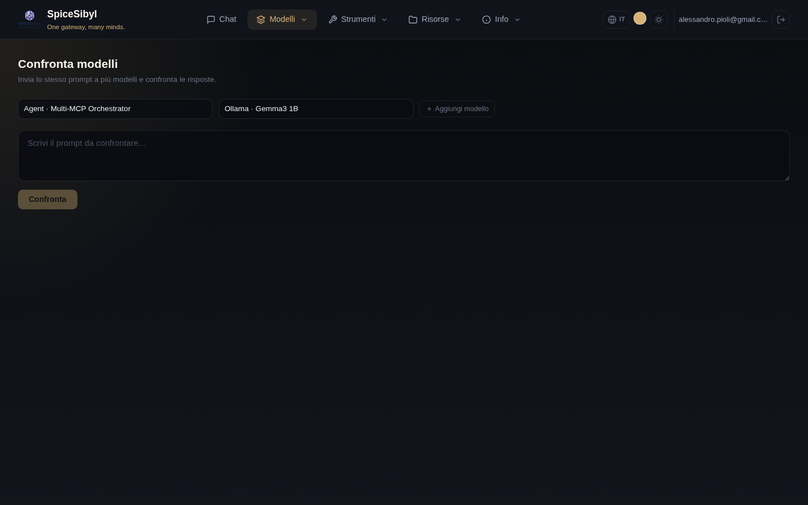

# Confronto modelli

**Cosa fa.** Invia lo stesso prompt a 2–4 modelli contemporaneamente e mostra le risposte in streaming in colonne affiancate, ciascuna con la propria telemetria (latenza, token, costo). Utile per scegliere il modello giusto per un caso d'uso o per confrontare qualità/velocità/costo.

**Come si usa.**
1. Vai alla pagina **Compare**.
2. Seleziona i modelli nelle tendine (con **+ Aggiungi modello** fino a 4).
3. Scrivi il prompt nell'area di testo e premi **Confronta**.
4. Le risposte arrivano in parallelo, ognuna nella sua colonna; in fondo a ciascuna compaiono latenza, conteggio token e costo stimato.

**Note.**
- Le richieste partono davvero in parallelo: i tempi mostrati sono confrontabili tra loro.
- Ogni colonna usa lo stesso identico prompt, senza system prompt della chat: il confronto è "a freddo".
