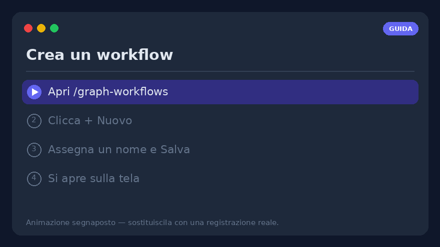
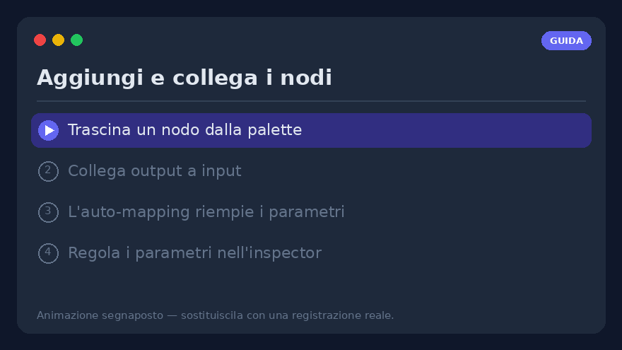
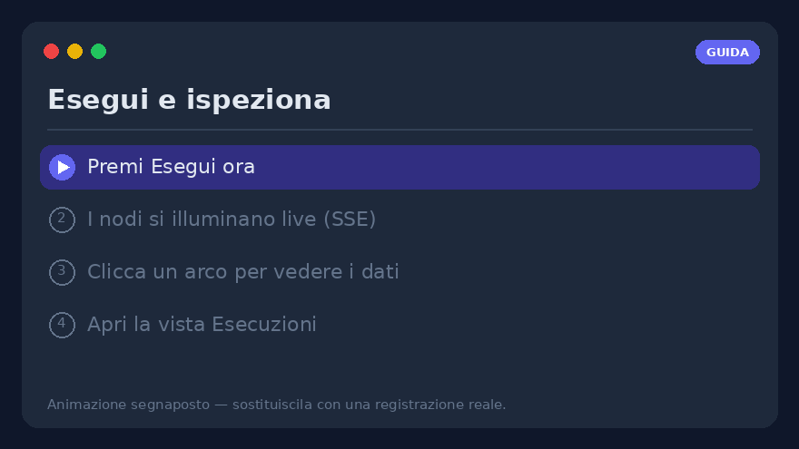
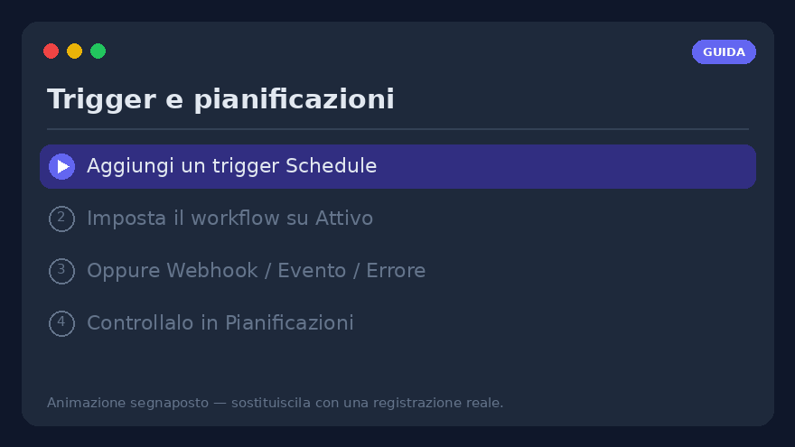
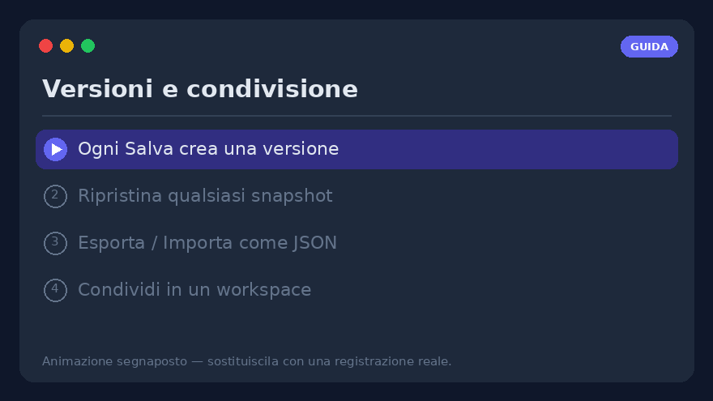

# Guida ai workflow — costruisci, esegui e gestisci i workflow visuali

Una guida pratica, passo per passo, all'**editor visuale dei workflow**
(`/graph-workflows`). Dove [Workflow visuali](visual-workflows.md) è il *riferimento*
completo (ogni nodo, ogni parametro), questa pagina è il *come si fa*: seguila dall'inizio
alla fine e costruirai, eseguirai, pianificherai e condividerai un workflow reale.

> **Prerequisito** — i workflow visuali sono dietro il feature flag `graph_workflows`. Se
> non vedi **Workflow → Graph** nella barra di navigazione, chiedi a un admin di abilitarlo
> (Impostazioni → Funzionalità). Tutto ciò che segue avviene nel tuo profilo.


---

## 1. Crea il tuo primo workflow



1. Apri **`/graph-workflows`** dalla barra di navigazione (**Workflow → Graph**).
2. Clicca **➕ Nuovo** sopra l'elenco dei workflow.
3. Assegna un **nome** (es. *Digest del mattino*) e premi **Salva**. Il grafo vuoto si apre
   sulla tela con un nodo **trigger `manual`** già presente.
4. Fatto: il workflow esiste ed è elencato a sinistra. È **Inattivo** di default (i trigger
   non scattano ancora); lo attiveremo al [passo 9](#9-trigger--fallo-partire-da-solo).

> **Di fretta?** Clicca **✨** (galleria dei template) e **Importa** uno dei
> [grafi di esempio](../examples/graph-workflows.md) già pronti — uno per funzionalità — e
> poi modificalo. È il modo più rapido per vedere un grafo funzionante.

---

## 2. Leggere la tela

L'editor ha **tre pannelli**:

| Pannello | Cosa contiene |
|----------|---------------|
| **Sinistra** | L'elenco dei workflow (comprimibile con ▾/▸) e la **palette dei nodi**, raggruppata *Trigger · Azioni · Logica · Dati · AI*. Una casella di ricerca la filtra per etichetta o tipo. |
| **Centro** | La **tela SVG**. Trascina i nodi per disporli; trascina lo sfondo vuoto per fare **pan**; la rotellina del mouse fa **zoom**. Una **minimappa** (in basso a destra) naviga i grafi grandi. |
| **Destra** | L'**inspector** del nodo selezionato oppure — quando nulla è selezionato — il **pannello di esecuzione e trigger**. |

Ogni tool integrato, ogni tool di un server MCP scoperto e ogni tool HTTP personalizzato
compare automaticamente come nodo `tool.<nome>` — non scrivi mai codice per aggiungerne uno.

La barra strumenti sopra la tela offre **Annulla/Ripeti** (`Ctrl+Z` / `Ctrl+Shift+Z`),
**Copia/Incolla** (`Ctrl+C` / `Ctrl+V`), **Disponi** (auto-layout), **⛶ adatta vista** e le
annotazioni **📝 Nota** / **▢ Frame**.

---

## 3. Aggiungere e collegare i nodi



1. **Trascina** un nodo dalla palette a sinistra sulla tela — ad esempio `tool.rss_read`
   (Azioni), poi un `llm.completion` (AI), poi `notify.telegram` (Notifiche).
2. **Collegali**: tieni premuto l'**handle di output** di un nodo (bordo destro) e trascina
   fino all'**handle di input** del nodo successivo (bordo sinistro). Compare una
   connessione (arco).
3. Quando disegni una connessione, l'**auto-mapping** precompila il primo campo espressione
   vuoto della destinazione con l'output della sorgente — un toast lo conferma, oppure si
   apre una finestra di scelta quando ci sono più candidati. Puoi sempre sovrascriverlo.
4. **Clicca un arco** per ispezionarlo: il pannello di destra mostra *sorgente → destinazione*,
   i **dati che vi sono passati nell'ultima esecuzione** e l'elenco dei **percorsi
   espressione pronti** (es. `$node.rss.output.result`). Clicca un campo per copiarlo come
   espressione `{{ … }}`.

> **Solo i nodi collegati vengono eseguiti.** I nodi trigger sono i punti d'ingresso. Un
> nodo lasciato scollegato viene registrato come `skipped` — non parte da solo.

---

## 4. Configurare un nodo — l'inspector

Seleziona un nodo; i suoi parametri compaiono a **destra**, generati dallo schema del tipo
di nodo.

- **Letterale o espressione** — ogni campo accetta un valore semplice **oppure**
  un'espressione (vedi [passo 5](#5-passare-i-dati-con-le-espressioni)).
- **Nodi AI** (`llm.completion`, `llm.agent`, …) espongono un **selettore modello** — lo
  stesso catalogo e filtri della pagina chat — e una **catena di failover** opzionale.
- **Sezione Avanzate** — ogni nodo ha **Tentativi + backoff**, un **Timeout** e una policy
  **In caso di errore** (vedi [passo 10](#10-gestire-gli-errori)).
- **Testa nodo** (⚡) esegue *solo questo nodo* con i suoi parametri attuali, anche non
  salvati, e mostra l'output inline — nulla viene registrato. Ottimo per regolare un nodo
  in isolamento.

---

## 5. Passare i dati con le espressioni

Sposta i dati tra i nodi con le espressioni. Due forme, distinte dal prefisso:

```text
={{ $node.rss.output.result }}     # l'output di un altro nodo
={{ $trigger.count }}              # il payload del trigger
={{ upper($json.title) }}          # una funzione whitelisted sull'input di questo nodo
={{ default($trigger.name, 'world') }}
Ciao ={{ $trigger.name }}!         # interpolazione in stringa
=py: [x*2 for x in input]          # via di fuga nel sandbox Python
```

- `={{ … }}` è una **mini-espressione sicura** (niente `eval`) percorsa sul contesto di
  esecuzione: `$node.<id>.output.<path>`, `$json` (l'input di questo nodo), `$trigger`,
  `$vars`, `$secrets`, `$env`, `$now`, più funzioni pure (`default`, `upper`, `len`, `join`,
  `first`, `get`, `round`, …).
- Anche un `{{ … }}` nudo (senza `=` iniziale) funziona — è una svista comune e tollerata.
- Un'espressione **da sola** mantiene il suo tipo nativo (lista/numero/oggetto); avvolgila
  nel testo per convertirla in stringa. Conta per il campo `items` di `for`/`filter`, che
  richiede una lista reale.

> **Suggerimento** — il pannello **Testa espressione** dell'inspector valuta qualsiasi
> espressione in sola lettura sui dati dell'ultima esecuzione, così puoi debuggare un
> percorso *prima* di collegarlo a un parametro.

---

## 6. Tenere i segreti fuori dal grafo — `$vars` / `$secrets`

Apri il **pannello di esecuzione** (clicca sulla tela vuota) → **Variabili** / **Segreti**:

- **Variabili (`$vars`)** — coppie chiave/valore per workflow, leggibili ovunque come
  `{{ $vars.nome }}`. Viaggiano con export/import; un valore JSON mantiene il tipo nativo.
- **Segreti (`$secrets`)** — credenziali a livello di profilo (token API, stringhe di
  connessione), **cifrate a riposo** e **mai restituite dall'API** né incluse in un export.
  Usa `{{ $secrets.NOME }}`, ad esempio in un header `http.request`. Ricreale in ogni
  ambiente.

Non incollare mai un token direttamente in un parametro di nodo — mettilo in `$secrets`.

---

## 7. Eseguire e leggere i risultati



1. Premi **Salva**, poi **Esegui ora** nel pannello di esecuzione.
2. I nodi **si illuminano live** via SSE: **verde** = ok, **blu** = in esecuzione,
   **rosso** = errore, **grigio** = saltato. Un nodo che fallisce mostra l'errore in rosso
   sotto di sé.
3. Serve un input? Incolla un oggetto JSON nella casella **Run payload** — diventa
   `$trigger` per quella esecuzione, così i grafi che leggono `={{ $trigger.campo }}` si
   provano a mano senza un webhook.
4. Il registro durevole vive nella **vista Esecuzioni** (`/graph-workflows/runs`, o
   *Esecuzioni →* nell'header dell'editor): ogni run con stato, trigger, durata e
   **risultati per nodo**. Seleziona un run in corso per seguirlo live; **↻ Ripeti** lo
   riesegue con lo stesso payload.

---

## 8. Debug senza esecuzioni complete

- **Testa nodo** (⚡) — esegui un nodo in isolamento (passo 4).
- **Output bloccato** (📌) — congela l'output di un nodo (l'ultimo, o un JSON modificato a
  mano). Test a valle, anteprime di espressione ed **esecuzioni parziali** risolvono allora
  `$node.<id>.output` dal blocco invece di richiamare il tool reale — ideale per iterare a
  valle di un webhook o di una chiamata LLM costosi. I blocchi non influenzano le esecuzioni
  di produzione.
- **Esegui da questo nodo** (▶) — esegue solo il nodo selezionato e il suo sottografo a
  valle; i nodi a monte sono seminati dal loro ultimo output persistito.
- **Debug passo-passo** (🐞) — imposta breakpoint (il puntino su ogni nodo), **Avvia run di
  debug** (creato *in pausa*), poi **⏭ Passo** / **▶ Continua** / **⏹ Stop**. La barra di
  debug mostra l'input risolto di ogni nodo prima che venga eseguito.

---

## 9. Trigger — fallo partire da solo



Aggiungi i trigger dal **pannello di esecuzione**, poi **porta il workflow su Attivo** — è
il passo che tutti dimenticano:

> ⚠️ **Un trigger scatta solo mentre il suo *workflow* è Attivo.** Abilitare un trigger è
> distinto dal flag Attivo del workflow. Una pianificazione perfetta e abilitata su un
> workflow **Inattivo** non partirà mai.

Tipi di trigger:

- **Schedule** — Giornaliero / Settimanale / Cron / Una volta tramite un selettore
  strutturato (o un'espressione cron, validata). Un loop in background fa scattare le
  pianificazioni dovute.
- **Webhook** — un URL a token (`POST /api/v1/wf/hooks/{token}`); il body JSON diventa
  `$trigger`. Proteggibile con un segreto di firma HMAC.
- **Evento** — eventi interni (`document.ingested`, `chat.message.created`).
- **Errore / Successo** — scattano quando il run di *un altro* workflow fallisce / completa.
- **File watch / Email in arrivo** — interrogano una cartella del workspace o una casella
  IMAP.

La **vista Pianificazioni** trasversale (`/graph-workflows/schedules`) elenca una riga per
trigger — prossima esecuzione, ultimo stato, serie di fallimenti e abilita/disabilita/Esegui/
Elimina — così vedi a colpo d'occhio tutto ciò che è dovuto o rotto.

---

## 10. Gestire gli errori

La sezione **Avanzate** di ogni nodo ha tre controlli di fallimento:

1. **Tentativi + backoff** — riesegue fino a N volte; backoff **Fisso** o **Esponenziale**
   (limitato a 60 s). I nuovi nodi `http.request` / `llm.*` arrivano con preset sensati.
2. **Timeout (ms)** — un tetto rigido per tentativo; un tentativo scaduto fallisce come
   qualsiasi errore (e viene comunque ritentato). La guardia per una chiamata HTTP/LLM/MCP
   bloccata.
3. **In caso di errore** — esauriti i tentativi:
   - **Ferma il run** (default),
   - **Continua su main** — emette `{ error }` e prosegue,
   - **Instrada al ramo errore** — il nodo cresce un handle **`error`**; collega il percorso
     felice a `main` e una catena di alert/fallback a `error` (try/catch sulla tela).

Per l'alerting centralizzato, aggiungi un workflow con **trigger errore** che scatta su
*qualsiasi* fallimento e termina in un nodo `notify.*`.

---

## 11. Versioni, export/import e condivisione



- **Versioni** — ogni **Salva** crea uno snapshot immutabile. La sezione *Versioni* del
  pannello di esecuzione le elenca con un **Ripristina** in un clic (che prima fa lo
  snapshot del grafo attuale, così un rollback è sempre reversibile). *Confronta* due
  versioni per vedere nodi aggiunti/modificati/rimossi.
- **Export** — il pulsante **Esporta** scarica un `.workflow.json` portabile (grafo,
  variabili, ambienti e i *nomi* dei segreti referenziati — i valori non viaggiano).
- **Import** — il pulsante **📥** accanto a *Nuovo* carica un tale file in un nuovo
  workflow, validato (nodi sconosciuti / archi rotti / segreti mancanti emergono come
  avvisi).
- **Condivisione** — condividi un workflow in un **workspace** con un ruolo: `viewer`
  (ispeziona + copia), `editor` (…+ lancia run) o `approver` (…+ decide le sue richieste
  `human.approval`).

---

## 12. Esempio completo — digest RSS su Telegram

Una costruzione concreta end-to-end:

1. **Trigger** — per ora tieni il nodo `manual` (aggiungerai uno **Schedule** *Giornaliero
   08:00* più tardi).
2. `tool.rss_read` — imposta l'URL del feed nel suo parametro.
3. `llm.completion` — prompt `Riassumi questi titoli in 5 punti:\n={{ $node.rss.output.result }}`, scegli un modello.
4. `notify.telegram` — `text: ={{ $node.llm.output.text }}`, `parse_mode: Markdown`. (Prima
   collega una chat in Impostazioni → Telegram.)
5. Collega `manual → rss → llm → telegram`, **Salva**, **Esegui ora**, controlla il
   messaggio Telegram.
6. Soddisfatto? Aggiungi il trigger **Schedule** e **porta su Attivo** — un digest
   quotidiano senza altri clic.

---

## 13. Checklist per la risoluzione dei problemi

- **La mia pianificazione non scatta mai** → il **workflow è Attivo** (non solo il trigger
  abilitato)? Vedi [passo 9](#9-trigger--fallo-partire-da-solo).
- **Un nodo è `skipped`** → non è collegato al flusso a partire da un trigger.
- **Un'espressione è vuota** → provala in **Testa espressione**; controlla il percorso esatto
  nell'elenco campi dell'edge inspector.
- **Dentro un loop, `$node.<loopId>.output` è vuoto** → usa `$item` / `$index` nel **corpo**
  del loop; `…output.items` è disponibile solo sull'output `done` del loop.
- **Un segreto si risolve in `***`** → è atteso nell'anteprima dell'editor; si decifra solo
  durante un run reale.
- **Un webhook restituisce 401** → alla richiesta manca l'header HMAC `X-Signature` dopo che
  hai ruotato il segreto.

---

## Dove andare adesso

- **[Workflow visuali](visual-workflows.md)** — il riferimento completo: ogni tipo di nodo,
  funzione di espressione, trigger, ambiente, contratto ed endpoint API.
- **[Grafi di esempio](../examples/graph-workflows.md)** — workflow pronti da importare, uno
  per funzionalità.
