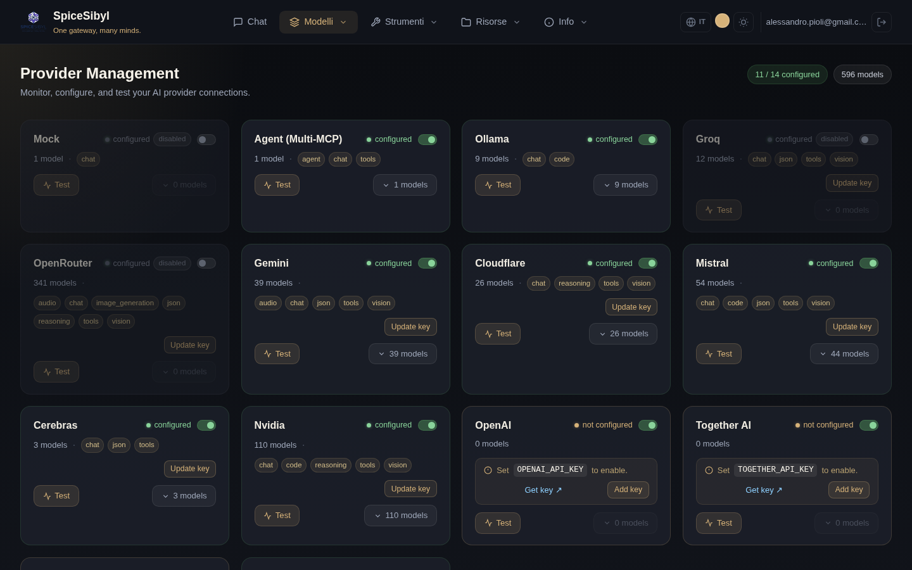
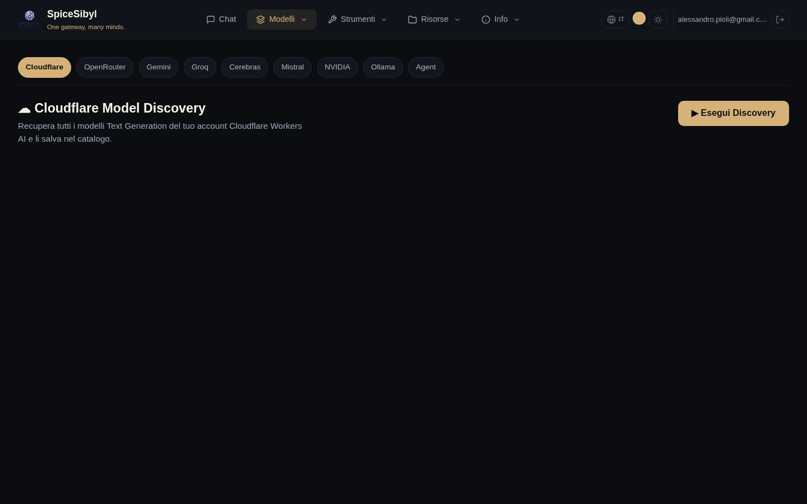

# Provider e modelli

## Pagina Providers

**Cosa fa.** Cruscotto di tutti i provider supportati: stato di configurazione, numero di modelli a catalogo, capacità aggregate (chat, vision, tools, json…), abilitazione on/off, test di connettività e gestione della chiave API.



**Come si usa.**
- **Add key / Update key**: inserisce o aggiorna la chiave API del provider. La chiave finisce nel **vault cifrato** (vedi sotto), non in un file di configurazione.
- **Test**: `POST /providers/{id}/test` esegue una vera richiesta di completamento minimale verso il provider cloud (non un semplice controllo di presenza chiave) e riporta esito/latenza.
- **Toggle**: abilita/disabilita il provider **a livello globale**, senza rimuovere la chiave.
- **N models**: espande l'elenco dei modelli a catalogo per il provider, con i controlli di visibilità (vedi sotto).

Il riquadro in alto a destra riassume quanti provider sono configurati e il totale dei modelli disponibili.

## Visibilità dei modelli nella scelta del modello

**Cosa fa.** Alcuni provider espongono decine o centinaia di modelli, rendendo interminabile il menu di scelta in chat. Da qui puoi **curare quali modelli** compaiono nel selettore del modello, per provider.

**Come si usa.** Espandi un provider (**N models**): ogni modello ha un'icona **occhio**:
- 👁 **visibile** → compare nel menu della chat; click per nasconderlo.
- 👁‍🗨 **barrato** → nascosto (riga in grigio); click per rimostrarlo.

In cima alla lista: un contatore **«N visibili · M nascosti»** e i pulsanti **Mostra tutti / Nascondi tutti** per agire in blocco sul provider. Quando un provider ha modelli nascosti, sulla card compare un **badge «N nascosti»** sempre visibile (anche a lista chiusa). La scelta è **persistente** (preferenza `hiddenModels`) e i modelli nascosti vengono esclusi in tempo reale dal menu della chat.

> **Due filtri distinti.** Questo è un filtro **per singolo modello**. Nella sidebar della chat, sotto **Modello**, c'è invece il filtro **Provider visibili** che agisce sull'intero provider. I due si combinano: prima escludi interi provider, poi rifinisci i singoli modelli. Entrambi sono personali e non toccano l'abilitazione globale del provider.

## Vault delle chiavi API

**Cosa fa.** Le chiavi sono cifrate con Fernet (AES-128-CBC + HMAC-SHA256) e salvate in SQLite, con cache in memoria. Tutti i provider fanno fallback vault → variabile d'ambiente: se la chiave non è nel vault viene usata quella in `.env`.

**Configurazione.** Imposta una `VAULT_SECRET_KEY` robusta in produzione: all'avvio viene loggato un warning di sicurezza se è ancora il placeholder di default. API: `PUT /providers/{id}/key`, `DELETE /providers/{id}/key`.

## Discovery dei modelli

**Cosa fa.** Recupera in tempo reale il catalogo modelli direttamente dall'API di ciascun provider (Cloudflare, OpenRouter, Gemini, Groq, Cerebras, Mistral, NVIDIA, Ollama, Agent) e lo salva nel catalogo interno — così l'elenco dei modelli selezionabili in chat resta aggiornato senza modifiche manuali.



**Come si usa.** Pagina **Discovery** → scegli il provider dalla barra dei tab → **Esegui Discovery**. I modelli trovati vengono elencati e salvati nel catalogo.

## Routing per prefisso

Il gateway instrada ogni richiesta in base al prefisso del nome modello:

| Prefisso | Provider |
|----------|----------|
| `ollama/…`, `groq/…`, `mistral/…`, `together_ai/…`, `fireworks_ai/…`, `huggingface/…` | LiteLLM |
| `gemini/…` | adapter dedicato Google Generative AI |
| `openrouter/…` | OpenRouter |
| `cloudflare/…` | Cloudflare Workers AI |
| `cerebras/…` | Cerebras (HTTP diretto) |
| `agent/…` | Orchestratore Multi-MCP (vedi [MCP e agenti](mcp-e-agenti.md)) |

## Fallback automatico tra provider

**Cosa fa.** Se un provider fallisce o va in timeout **prima** di aver emesso il primo token, il gateway riprova in modo trasparente col provider successivo della catena `CHAT_FALLBACK_CHAIN` (formato `provider:model,provider:model,...`). Il passaggio è segnalato con un frame SSE `provider_switch`, mostrato come avviso nella UI. Se i token sono già in streaming l'errore viene propagato (nessun output duplicato).

**Configurazione.** In `backend/.env`:

```env
CHAT_FALLBACK_CHAIN=groq:llama-3.3-70b-versatile,ollama:qwen2.5:7b-instruct
```

Catene analoghe esistono per le immagini (`IMAGE_GENERATION_CHAIN`) e per gli embedding (`EMBEDDING_CHAIN`).
