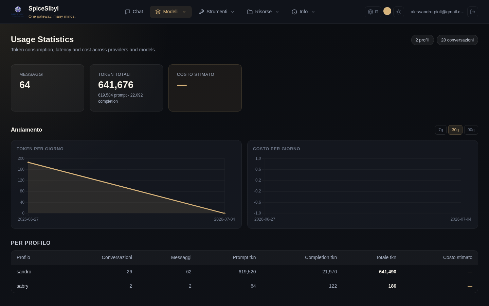

# Statistiche d'uso

**Cosa fa.** Ogni messaggio salvato porta con sé la telemetria (token prompt/completion, latenza, costo stimato riportato dal provider). La pagina **Stats** aggrega questi dati per profilo o globalmente.

## Contenuto della pagina

- **Card riassuntive**: messaggi totali, token totali (con ripartizione prompt/completion), costo stimato.
- **Andamento** — grafici time-series giornalieri: area chart dei token e bar chart dei costi, con intervallo commutabile **7g / 30g / 90g** (`GET /v1/stats/daily`, aggregazione per data in SQLite).
- **Per profilo**: tabella conversazioni/messaggi/token/costo per ciascun profilo.
- **Per provider e per modello**: tabelle che ripartiscono l'uso per provider e per singolo modello — utili per capire dove finiscono i token e cosa costa davvero.

## Come si usa

Naviga su **Stats** dalla navbar. I dati si riferiscono all'utente autenticato (tutti i suoi profili); i contatori in alto a destra mostrano numero di profili e conversazioni conteggiate.

**API.** `GET /v1/stats` (per profilo o globale), `GET /v1/stats/daily` per le serie giornaliere.

**Nota sui costi.** Il costo è una stima fornita dai provider: per i modelli locali (Ollama) o i piani gratuiti resta a zero/—.
